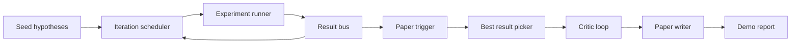
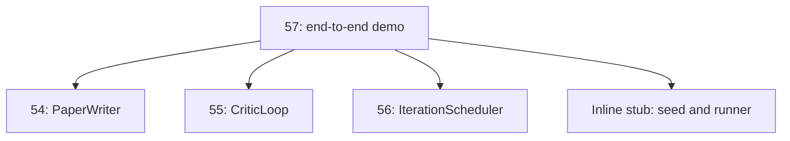
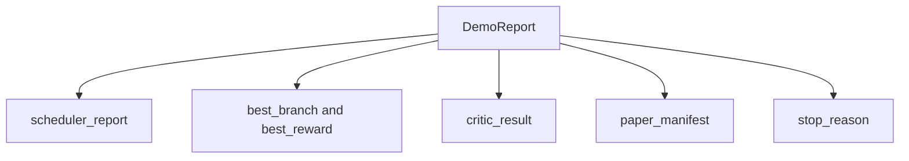

# Démo de recherche de bout en bout

> Une démo est l'endroit où chaque contrat que vous avez écrit auparavant doit être composé. Si l'un d'entre eux fuit, la démo est la leçon qui le retient.

**Type:** Build
**Languages:** Python
**Prerequisites:** Phase 19 lessons 50-53
**Time:** ~90 minutes

## Objectifs d'apprentissage

- Faites le cycle de recherche automatique de bout en bout: semence d'hypothèse, coureur d'expérience, planificateur, cycle critique, rédacteur en papier.
- Composer les primitives des quatre précédentes leçons de Track D à travers des importations simples de Python, pas un cadre.
- Exécutez la boucle jusqu'à une fin auto-terminante et émettez un seul rapport de démonstration qui énumère la sortie de chaque étape.
- Gardez la démo déterministe afin que la suite de test puisse affirmer la forme finale.
- Surface un mode de défaillance clair lorsque le contrat de n'importe quelle étape est rompu, de sorte que la phase suivante ne fonctionne pas avec une entrée cassée.

```figure
ch-research-pipeline
```

## Ce qui compose ici



Le programmeur effectue six expériences à travers ces trois espaces parallèles. Le bus rapporte un ou plusieurs déclencheurs de papier. Le sélecteur sélectionne le meilleur résultat. La boucle critique itérée sur un projet construit à partir de ce résultat. L'écrivain du papier émet la fin LaTeX, BibTeX et manifeste.

## Pourquoi importer, pas copier

Chaque première leçon envoie un `main.py`Les données sont utilisées pour les classes et les fonctions publiques.`sys.path`Il s'agit d'un programme de formation qui est en cours de réalisation et qui est en cours de réalisation dans le cadre de la formation.



Le bâton en ligne représente les leçons cinquante à cinquante-trois: un petit générateur d'hypothèses de semence et une fonction de récompense synchrone. L'utilisateur peut échanger le bâton en ligne pour les primitives réelles de ces leçons en ajustant deux importations.

## Garanties de déterminisme

La démo est déterministe par construction. Le coureur de l'expérience est semé numpy. Le réviseur de la boucle critique marche des dimensions fixes dans un ordre fixe. Le générateur de prose de l'écrivain de papier est celui ridiculisé de la leçon cinquante-quatre. Le sélecteur UCB du planificateur rompt les liens sur l'ordre d'itération, pas le choix aléatoire.

Le test affirme cette propriété en exécutant la démo deux fois et en comparant le manifeste.

## La forme du rapport démo



Chaque champ vient littéralement de l'étape en amont. La démo ne transforme aucune sortie; elle les compose. C'est le test de la démo.

## Traitement en mode défaillance

Chaque étape réussit ou provoque une erreur de typage.

```text
Scheduler ........ returns SchedulerReport with stop_reason
                   in {queue_empty, max_experiments, deadline}
Best-result pick . raises NoTriggerError if no paper trigger fired
Critic loop ...... returns LoopResult with status converged or stopped
Paper writer ..... raises PaperValidationError on contract break
```

Une défaillance à n'importe quelle étape court-circuite la démo avec une exception typée.`test_no_triggers_raises_typed_error`et `test_best_picker_raises_when_no_triggers`affirmer que le picker augmente `NoTriggerError`- Je suis là .`BestResultError`quand aucune branche n'a tiré une gâchette, et l'écrivain n'est jamais invoqué.

## Le meilleur choix

Le planificateur émet des déclencheurs papier par branche. Le choixur sélectionne la branche avec la plus haute récompense moyenne sur tous les déclencheurs. Les liens se brisent alphabétiquement par branche id donc la démo est déterministe. Le choixur est une petite fonction pure; les pines de test sur un rapport de planificateur fixe.

## Le câblage de la boucle critique

La boucle critique de la leçon 55 fonctionne sur une`MiniPaper`La démo construit une`MiniPaper`de la branche choisie en remplissant l'abstrait avec l'id de branche, en semant deux sections (Introduction et résultats), et en établissant `originality_tag`de la récompense moyenne de la branche (haute si `>= 0.8`, moyen si `>= 0.6`- à faible altitude .

Le réviseur fait ensuite une répétition de la version de projet en convergence.

## Le câblage de l'écrivain de papier

Le rédacteur en chef de l' article de la leçon 54 travaille à plein temps`Paper`La démo améliore les convergentes `MiniPaper`par le biais `mini_to_full_paper`, qui attache une figure pour la branche sélectionnée et une petite bibliographie synthétique construite à partir de l'union des clés de citation suggérée par le critique.

## Comment lire le code

`code/main.py`définit `BestResultError`- Je suis là .`NoTriggerError`- Je suis là .`DemoReport`- Je suis là .`pick_best_branch`- Je suis là .`build_mini_paper`- Je suis là .`mini_to_full_paper`, et `run_demo`- Les importations au sommet ajustées`sys.path`une fois et tirez`PaperWriter`- Je suis là .`CriticLoop`, et `IterationScheduler`de leurs leçons.

`code/tests/test_e2e.py`couvertures: démo se déroule de bout en bout et émet un rapport avec les cinq champs remplis, déterminisme sur deux courbes, NoTriggerError quand aucune branche ne franchit le seuil, PaperValidationError lorsque le contrat de l'écrivain est rompu, le manifeste papier contient le chiffre de la branche choisie, et la raison de l'arrêt du planificateur est l'une des valeurs attendues.

## On va plus loin

Trois extensions qui valent la peine d'être câblées une fois que la démo est verte. Premièrement, état persistant: le résultat de chaque étape est écrit dans un petit magasin JSON afin qu'un redémarrage puisse se poursuivre sans réinitialiser les étapes bon marché. Deuxièmement, un tableau de bord: les événements de suivi du programmeur et de la boucle critique se rendent en une seule chronologie. Troisièmement, les appels de modèle réels: échangez le générateur de prose ridicule et le critique déterministe pour ceux basés sur des modèles; le câblage ne change pas.

La démo est de prouver que la composition est l'architecture. 5 leçons, 4 importations, un rapport. La prochaine fois que vous ajoutez une étape, le câblage augmente exactement d'une ligne.
