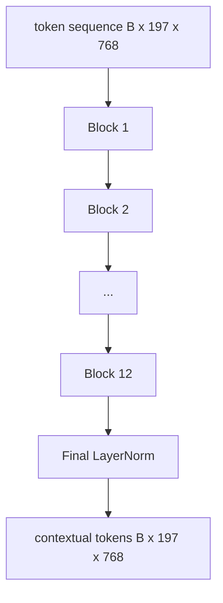
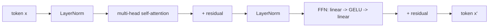

# Enchanteur de transformateur de vision

> Les patches seules ne voient pas. Un transformateur pré-LN de 12 couches avec 12 têtes d'attention transforme la séquence de jetons de patch en une séquence de jetons contextuels, le jeton CLS regroupant les caractéristiques de l'image entière dans son état caché final. Cette leçon est la salle de moteur de chaque modèle moderne de langage de vision.

**Type:** Build
**Languages:** Python
**Prerequisites:** Phase 19 lessons 30-37 (Track B foundations)
**Time:** ~90 minutes

## Objectifs d'apprentissage

- Mettre en œuvre un bloc de transformateur pré-LN avec une attention à soi à plusieurs têtes et une sous-couche de transfert.
- Amassons 12 blocs avec 12 têtes pour former un encodeur de base ViT.
- Téléchargez le patch avant de la leçon 58 dans l'encodeur et passez vers l'avant.
- Vérifiez que le jeton CLS regroupe les informations de chaque correctif.

## Le problème

L'intégration du patch produit une séquence de 197 jetons, chacun un vecteur sans connaissance d'aucun autre patch. Une photo de chat a besoin de chaque patch pour savoir quelles patches contiennent des moustaches, quelles contiennent des arrière-plans et quelles contiennent l'œil. Le transformateur est le mécanisme qui construit cette conscience, une couche d'attention à la fois. Sans elle, le front de patch est un symbole intelligent sans compréhension.

La recette standard est de douze blocs de profondeur, douze têtes de largeur, avec placement pré-LayerNorm, activation GELU, et une expansion de fournisseur de 4x. Cette recette est la colonne vertébrale de CLIP ViT-L, SigLIP, DINOv2, la famille Qwen-VL, InternVL, et tous les autres encodateurs de vision à poids ouvert de 2025-2026. La recette est assez stable pour que vous puissiez lire n'importe lequel de ces documents et prendre cette forme de bloc à moins qu'ils ne disent explicitement le contraire.

## Le concept





### Pré-LN contre post-LN

Le Transformer original a placé LayerNorm après le résidu. La pré-LN (LayerNorm avant chaque sous-couche) est la version utilisée par tous les modèles de langage de vision modernes, car elle s'entraîne de manière stable sans astuces de réchauffement au rythme de l'apprentissage. La différence est d'une ligne dans le passage avant, et le débit de gradient à la profondeur 12+ est jour et nuit.

### Autotentive à plusieurs têtes

Chaque tête projette le vecteur symbolique vers le sien `(query, key, value)`triple avec dimension `head_dim = hidden / num_heads`Avec `hidden = 768`et `heads = 12`, chaque tête a`dim = 64`. Les 12 têtes assistent en parallèle, puis leurs sorties se concattent à la dimension 768 et passent par une projection de sortie.

### Pourquoi l'expansion fournière

Le FFN va`hidden -> 4 * hidden -> hidden`Le facteur 4 est empirique et s'applique aux transformateurs de langage et de vision depuis 2017. Les petits (2x) sont en manque; les plus grands (8x) sont en surpoids au budget de données fixe.

| Component | Parameters at ViT-Base scale |
|-----------|------------------------------|
| qkv projection per block | `3 * 768 * 768 = 1.77M` |
| output projection per block | `768 * 768 = 590K` |
| FFN per block (4x expansion) | `2 * 768 * 4 * 768 = 4.72M` |
| LayerNorm per block | `4 * 768 = 3K` |
| Total per block | about 7.1M |
| 12 blocks | about 85M |
| Plus front end | about 86M total |

ViT-Base est un encodeur de 86M. Ce qui est petit par rapport aux normes 2026 (SigLIP-So400M est 400M, le Qwen-VL ViT est 675M), mais l'architecture est identique en largeur et en profondeur.

### Masque de cause ou pas ?

Les transformateurs de vision sont uniquement encodés et bidirectionnels: token `i`peut assister à la démonstration `j`L'attention croisée côté décodeur dans la leçon 61 utilisera un masque de causalité, mais à l'intérieur du codeur de vision, l'attention est entièrement connectée.

### Ce que le jeton CLS apprend

Le jeton CLS commence comme un paramètre appris, n'a pas de contenu de patch propre et accumule des informations à travers l'attention à travers chaque bloc.

```figure
ch-cls-funnel
```

## Faites-le

`code/main.py`les implémentations:

- `MultiHeadSelfAttention`, avec `qkv`et les projections de sortie, les mathématiques d'attention des produits à l'échelle des points, et les affirmations de forme.
- `FeedForward`, le GELU MLP à 4 fois d'expansion.
- `Block`, un bloc pré-LN composant des sous-couches d'attention et de transfert avec résidus.
- `ViT`, une pile de 12 blocs avec une dernière LayerNorm.
- `VisionEncoder`, quelles sont les lignes `VisionFrontEnd`de la leçon 58 à la leçon `ViT`l' accumulation et l' exposition d' un `forward()`retourner la séquence contextuelle et le vecteur CLS combiné.
- Une démo qui exécute une image de fichier 224x224 synthétisée à travers le codeur complet et imprime la forme d'entrée, la forme de sortie, le nombre de paramètres et la norme CLS à chaque autre couche.

- Je vais le faire.

```bash
python3 code/main.py
```

Sortie: le dispositif est codé en `(1, 197, 768)`La norme CLS dérive vers le haut à mesure que les couches se composent, puis se stabilise à la dernière LayerNorm.

## Utilisez-le

Le codeur défini ici est, jusqu'à la largeur et la profondeur, la même pile de blocs qui se déplace à l'intérieur de chaque VLM à poids ouvert en 2025-2026.

- **Width and depth.**ViT-Large est `hidden=1024, depth=24, heads=16`; SigLIP So400M est `hidden=1152, depth=27, heads=16`- Dans le même bloc.
- **Pooling head.**Le regroupement des CLS (cette leçon) par rapport au regroupement moyen (SigLIP) par rapport au regroupement des attentions (plus tard VLM).
- **Position handling.**Le calcul des blocs est inchangé.
- **Register tokens.**DINOv2 prépente 4 jetons supplémentaires apprises.

Cette pile de blocs est le substrat.

## Tests

`code/test_main.py`couvertures:

- un seul bloc préserve sa forme et est invariant à la taille du lot d'entrée
- les scores d'attention s'ajoutent à un le long de l'axe clé (souciété maximale)
- les chemins résiduels sont câblés (l'entrée zéro produit toujours une sortie non zéro via le jeton CLS)
- une passerelle à quatre couches empilée vers l'avant produit la bonne forme
- les débits de gradients vers la projection du patch à partir de la sortie du CLS

- Je vais les faire.

```bash
python3 -m unittest code/test_main.py
```

## Exercices

1. Ajouter des jetons de registre (4 vecteurs appris prépendus après CLS) et réinitialiser.

2. Échangez la pré-LN contre la post-LN et traînez pendant une époque sur un classificateur de forme synthétique.

3. Implémenter le masquage causal comme une`attn_mask`l'argument de sorte que le même bloc peut être réutilisé comme un bloc décodeur.`(seq, seq)`, triangulaire inférieur.

4. Profiler un passe avant aux lots de taille 1, 8, 64 avec `torch.profiler`La couche MLP domine le temps des murs, pas l'attention.

5. Remplacez les projections Q-K-V d'une tête d'attention par un adaptateur LoRA de basse qualité, congélez le reste et vérifiez que le gradient ne circule que là où vous l'espérez.

## Les termes clés

| Term | What it means |
|------|---------------|
| Pre-LN | LayerNorm applied before each sub-layer instead of after |
| Self-attention | Each token attends to every other token in the same sequence |
| Multi-head | The hidden dim is split across `H` independent attention heads |
| FFN expansion | The feed-forward layer widens to `4 * hidden` before contracting |
| CLS pooling | Use the first token's final hidden state as the image summary |

## Pour en savoir plus

- Une image vaut 16x16 mots (ViT, 2021) pour la recette d'encodeur.
- DINOv2 (2023) pour les jetons de registre et l'objectif de pré-entraînement auto-supervisé.
- SigLIP (2023) pour la variante de pooling moyen et la perte de contraste sigmoïde utilisée dans la leçon 62.
