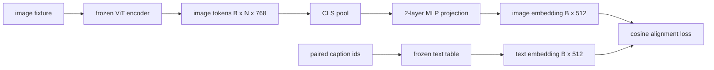

# Couche de projection pour l'alignement de la modalité

> Un encodeur de vision produit des jetons d'image. Un décodeur de texte consomme des jetons de texte. Les deux vivent dans des espaces vectoriels différents. Un petit MLP à deux couches projette des jetons d'image dans l'espace intégrant le texte, et une perte d'alignement cosine contre une légende couplée attire les deux espaces en accord. Cette projection est la plus petite pièce d'un modèle de langage de vision et celle qui compte le plus pour le transfert.

**Type:** Build
**Languages:** Python
**Prerequisites:** Phase 19 lessons 30-37 (Track B foundations)
**Time:** ~90 minutes

## Objectifs d'apprentissage

- Construisez une projection MLP à deux couches qui cartographiera les caractéristiques de l'image dans l'espace intégré au texte.
- Construire une table de mise en place de texte simulé (pas de jetonnisateur prétrainé, pas de corpus réel).
- Calculer une perte d'alignement cosine entre les jetons d'image projetés et une intégration de sous-titres couplé.
- Exercez la projection seule avec un encodeur de vision gelé et une table de texte gelée.

## Le problème

Vous avez un codeur de vision (leçons 58-59) produisant des jetons de dimension .`vision_hidden = 768`Vous avez un décodeur de texte que vous voulez boulonner en haut avec dimension intégrée`text_hidden = 512`Les symboles d'image ne sont pas en forme de texte: ils vivent dans une base que l'encodeur a apprise lors de la pré-entraînement visuel uniquement, sans relation avec les vecteurs de mots du décodeur.

La projection en MLP à deux couches (linéaire, GELU, linéaire) combine l'écart.`768 * 1024 + 1024 * 512 = 1.3M`Le codeur de vision reste gelé. La table d'intégration de texte reste gelée. Seule la projection se déplace. C'est la recette LLaVA expédiée en 2023, que BLIP-2 a reframeé en tant que Q-Former, et que chaque VLM à poids ouvert a depuis adopté sous une forme ou une autre.

## Le concept



### Rassemblement avant la projection

Le codeur de vision émet 197 jetons. Le côté texte a une seule intégration de niveau de sous-titre. Pour les aligner, vous avez besoin d'un vecteur de niveau d'image par échantillon. Le pooling CLS est le plus simple: prenez le premier jeton du codeur et le projeter. Le pooling moyen sur tous les 197 jetons est une autre option et c'est ce que SigLIP utilise.

### Pourquoi deux couches et pas une ?

Une seule projection linéaire peut tourner et réécheloner mais ne peut pas fixer la base si les deux espaces ont des désaccords de courbure. GELU entre deux couches linéaires donne à la projection une courbure non linéaire, ce qui est assez empirique pour aligner les caractéristiques de style CLIP sur les emblèmes de modèle de langage. Les projections plus profondes (LLaVA-NeXT utilise GLU; Qwen-VL utilise une pile de couches d'attention) sont des extensions; la MLP à deux couches est la ligne de base canonique et est ce que les navires de projection Q-Former de BLIP-2 ont sous le capot.

| Layer | Shape | Parameters |
|-------|-------|------------|
| fc1 | `(vision_hidden, projection_hidden)` | `768 * 1024 + 1024` |
| activation | GELU | 0 |
| fc2 | `(projection_hidden, text_hidden)` | `1024 * 512 + 512` |

Environ 1,3 M de paramètres pour un`768 -> 1024 -> 512`La tête.

### Perte d'alignement des cosines

L' alignement ne signifie pas `image_emb == text_emb`- Aligner signifie`image_emb`points dans la même direction que `text_emb`La perte cosine est`1 - cos_sim(image, text)`La leçon 62 généralise un lot contrasté (InfoNCE) où chaque image doit être plus proche de sa propre légende que de toute autre légende du lot; cette leçon utilise la version par paire afin que la dynamique soit visible.

### Le codeur congelé est le truc.

Le codeur de vision a des paramètres de 86M. La table de texte contient quelques millions de pièces. Les entraîner tous à partir d'un faux corps est un non-starter. Le gel des deux signifie que les paramètres de 1,3M de la projection sont la seule chose qui change, et quelques centaines d'étapes sur des paires synthétiques suffisent pour réduire la perte. C'est exactement la forme opérationnelle de chaque VLM basé sur un adaptateur: les pièces lourdes restent gelées, les trains de pont léger.

```figure
ch-projection-bridge
```

## Faites-le

`code/main.py`les implémentations:

- `MLPProjector(in_dim, hidden_dim, out_dim)`, deux couches de MLP linéaire avec activation GELU.
- `MockTextEmbedding(vocab_size, dim)`, une table de mise en place gelée avec un init déterministe d'une graine.
- `make_pair(seed, vocab_size)`, qui synthétise un échantillon d'image (image, sous-titre).
- `cosine_alignment_loss(image_emb, text_emb)`, le par-par`1 - cos_sim`Objectif.
- Une boucle d'entraînement qui exécute la projection pendant 200 étapes sur 32 paires synthétiques (cyclées), avec le codeur de vision et la table de texte gelés, et imprime la perte toutes les 25 étapes.

- Je vais le faire.

```bash
python3 code/main.py
```

Résultats: les rapports de formation baissent de la perte initiale d'environ 1,07 à environ 0,80 dans les 200 étapes, démontrant que la projection seule peut tirer les jetons d'image vers l'espace texte.

## Utilisez-le

Le même schéma apparaît dans tous les VLM à poids ouvert:

- **LLaVA 1.5.**La projection GELU MLP à deux couches de CLIP-ViT-L cachée à LLaMA incrustant la lumière.
- **BLIP-2.**Q-Former prend 32 jetons de requête apprises par l'attention croisée contre les jetons d'image, puis les projecteurs vers le LLM embedding dim.
- **MiniGPT-4.**Projection linéaire unique de la sortie BLIP-2 Q-Former à la mise en place de Vicuna.
- **Qwen-VL.**Adapteur d'attention croisée avec plusieurs couches, mais la pièce finale est à nouveau une projection vers l'embedding LM.

La forme varie mais le rôle est identique: jetons d'image de pool, projet à texte incrusté, train seul.

## Tests

`code/test_main.py`couvertures:

- la forme de sortie du projecteur correspond à la configuration `out_dim`
- Tableau d' intégration de texte gelé a zéro `requires_grad`Paramètres
- La perte de cosine est nulle sur les vecteurs identiques et est 2 sur les vecteurs antiparallèles
- les flux de gradient du projecteur après un passage en arrière
- la boucle d'entraînement réduit les pertes entre l'étape 0 et l'étape 200

- Je vais les faire.

```bash
python3 -m unittest code/test_main.py
```

## Exercices

1. Remplacez le pooling CLS par le pooling moyen sur les 196 tokens de patch et comparez la perte finale après 200 étapes.

2. Ajouter une température escalare apprise à la perte de cosine (`cos / tau`) et observez ce qui se passe lorsque `tau`est trop faible (bruit gradient) ou trop grand (plateaux de perte élevés).

3. La non-linéarité est plus importante sur les caractéristiques naturelles de l'image et moins sur celles synthétiques.

4. Ajoutez une petite pénalité L2 sur les poids du projecteur et observez comment il interagit avec l'alignement cosine (cosine est invariable dans l'échelle, de sorte que la pénalité réduit principalement les directions non utilisées).

5. Persistant peses de projecteur, puis recharger et exécuter l'inférence sans le codeur de vision passer en arrière pour vérifier que seul le projecteur est nécessaire au moment du déploiement.

## Les termes clés

| Term | What it means |
|------|---------------|
| Modality alignment | The act of making image and text embeddings comparable in one shared space |
| Projection head | The small module that maps one space to another, usually a 2-layer MLP |
| Cosine similarity | Dot product divided by the product of L2 norms |
| Frozen encoder | The vision (or text) model has all parameters with `requires_grad=False` |
| Mock corpus | Synthetic pairs used so training has no dataset download dependency |

## Pour en savoir plus

- Le papier LLaVA pour le train en deux étapes (projet, défricher ensuite le LM).
- Le papier BLIP-2 pour Q-Former comme alternative à la projection appréciable.
- Rapport technique Qwen-VL pour les adaptateurs de mise en lumière croisée en tant que têtes de projection plus profondes.
