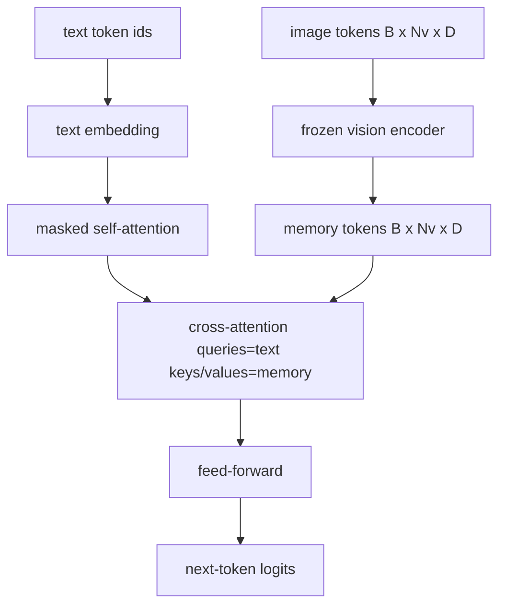
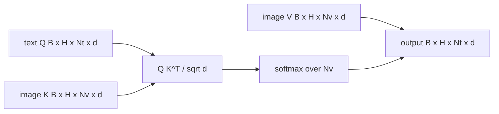

# Fusion de l'attention croisée

> La couche de projection aligne un vecteur d'image avec un vecteur de sous-titres. Un vrai décodeur de langage visuel a besoin de chaque jeton de texte pour prendre en charge chaque jeton de patch, de sorte que le modèle peut poser chaque mot dans une région. La croisée de l'attention est la façon dont se produit cette mise à terre. Les questions du texte; les clés de vision et les valeurs répondent. Cette leçon construit le bloc de l'attention croisée, l'attention de soi-même du texte causale, et les formes du masque qui gardent les deux légaux.

**Type:** Build
**Languages:** Python
**Prerequisites:** Phase 19 lessons 30-37 (Track B foundations)
**Time:** ~90 minutes

## Objectifs d'apprentissage

- Implémenter l'attention croisée multi-têtes où le flux de requête est texte et le flux de clé/valeur est vision.
- Composer un bloc de décodeur: auto-attention causale + attention croisée + flux vers l'avant.
- Faites bien les formes du masque: masque causale pour l'auto-attention, pas de masque pour l'attention croisée.
- Exécutez un passe avant avec des jetons de texte en lots et un pool fixe de jetons d'image.

## Le problème

La concatéation des jetons d'image et des jetons de texte dans une séquence est une option de fusion (fusion précoce, le chemin Chameleon et Emu3 prennent). L'attention croisée est l'autre (fusion tardive, le chemin Flamingo introduit et que chaque décodeur en forme de Flamingo a depuis copié).

La fusion tardive présente deux avantages: d'abord, le flux de texte reste propre et le modèle préserve des capacités uniquement textuelles. Deuxièmement, le flux d'image est calculé une fois par image et réutilisé pour chaque étape de décode, de sorte que la génération est bon marché même pour les longues légendes. Le coût est un sous-couche d'attention supplémentaire par bloc.

## Le concept





### Les formes du masque

Les deux attentions à l'intérieur d'un bloc de décodeur ont besoin de masques différents:

| Attention | Query length | Key length | Mask | Why |
|-----------|--------------|------------|------|-----|
| Self-attention | `Nt` (text) | `Nt` (text) | Causal: lower-triangular `(Nt, Nt)` | Text tokens may not look ahead during autoregression |
| Cross-attention | `Nt` (text) | `Nv` (vision) | No mask | The whole image is visible to every text position |

La leçon comprend une fonction de validation de forme de sorte que l'erreur de les mélanger sur les surfaces comme une `ValueError`au lieu d'une courbe de perte cassée silencieusement.

### Pourquoi pas un masque sur l'attention croisée

L'image est entièrement observée avant la génération de texte.`t`Les images sont en train de se dérouler dans un autre type de champ, mais pour une seule image plus une légende, l'attention croisée voit tout.

### Mise en cache de la clé/valeur

Les clés d'image et les valeurs sont calculées une fois au début du décode et conservées dans un cache. Chaque nouveau jeton texte utilise le cache sans recompte. C'est ce qui rend le sous-titre rapide à l'inférence: le viT lourd se déroule une fois; l'attention croisée réutilise ses clés et valeurs pour chaque étape. La leçon expose le cache et teste le chemin de cache-hit.

### Composition des blocs

Un bloc de décodeur fonctionne: pré-LN -> auto-attention -> résiduel -> pré-LN -> attention croisée -> résiduel -> pré-LN -> flux-avant -> résiduel. Trois sous-couches, chacune avec sa propre LayerNorm. Le papier Flamingo a ajouté une passerelle apprise sur l'attention croisée afin que le modèle puisse se retirer du chemin de l'image au coût de la stabilité du temps de formation; la ligne de base canonique (utilisée ici) n'a pas de passerelle.

```python
class DecoderBlock:
  def forward(self, text_tokens, image_tokens, text_mask, cross_mask):
      text_tokens = text_tokens + self.self_attn(self.ln1(text_tokens),
                                                 mask=text_mask)
      text_tokens = text_tokens + self.cross_attn(self.ln2(text_tokens),
                                                  image_tokens,
                                                  mask=cross_mask)
      text_tokens = text_tokens + self.ffn(self.ln3(text_tokens))
      return text_tokens
```

```figure
ch-crossattn-fan
```

## Faites-le

`code/main.py`les implémentations:

- `CrossAttention(hidden, heads)`, une attention croisée à plusieurs têtes avec une attention séparée`q`et `kv`Les projections.
- `CausalSelfAttention(hidden, heads)`, l'auto-attention masquée d'un décodeur standard.
- `DecoderBlock`, composant les trois sous-couches avec des résidus pré-LN.
- `VisionLanguageDecoder`, décodeur à quatre couches alimenté par une sortie d'encodeur de vision simulée et une petite table d'intégration de texte.
- `causal_mask(length)`retourner une `(length, length)`Ténseur booléen triangulaire inférieur.
- Une démo qui alimente un lot de deux séquences de texte de longueur 10 avec mémoire d'image de longueur 197 et imprime la forme de sortie, la forme du masque d'auto-attention et la norme de sortie de l'attention croisée par position.

- Je vais le faire.

```bash
python3 code/main.py
```

Sortie: décodeur produit un `(2, 10, text_vocab)`La forme du masque est `(10, 10)`La vérification de réutilisation de KV-cache confirme les logits identiques entre les chemins cachés et non cachés.

## Utilisez-le

L'attention croisée apparaît dans deux familles de production:

- **Flamingo and IDEFICS.**Insérer une sous-couche de l'attention croisée à chaque bloc de modèle de langage K, avec un LM gelé. L'adaptateur de langage de vision est le bloc d'attention croisée plus sa porte.
- **BLIP-2.**Le Q-Former utilise l'attention croisée à partir d'un ensemble fixe de 32 jetons de requête dans les fonctionnalités d'image, puis projette les requêtes dans l'espace d'intégration LM.

La forme du bloc dans cette leçon correspond directement aux deux.

## Tests

`code/test_main.py`couvertures:

- le masque causal est triangulaire inférieur et correspond à la forme booléenne attendue
- la forme de sortie de l'attention croisée est `(B, Nt, hidden)`indépendamment de la longueur de la clé
- Le chemin de cache KV correspond au chemin non caché de la tolérance à la flotte
- Le manque de forme entre les flux de texte et d' images donne lieu à une clarté `ValueError`
- un décodage complet à l'avant produit la bonne forme de lot et de séquence

- Je vais les faire.

```bash
python3 -m unittest code/test_main.py
```

## Exercices

1. Ajouter une passerelle tanh apprise au résiduel d'attention croisée (truc Flamingo) et vérifier les convergences d'entraînement à partir d'une passerelle initiale proche de zéro. La passerelle commence à 0; le modèle récupère le comportement uniquement texte avant de mélanger le flux d'image.

2. Implémenter l'attention interlevé lorsque le même décodeur consomme plusieurs images plus plusieurs segments de texte. Construire le masque d'attention croisée par échantillon qui empêche le segment de texte 2 de participer à l'image 1.

3. Profiliser la couche de l'attention croisée vers l' auto-attention à `Nt=64, Nv=576`Le coût de l'attention croisée est `Nt * Nv`et domine à haute résolution d'image.

4. Ajoutez un dérapagement côté requête sur la carte de l'attention croisée et mesurez la diversité des sous-titres sur la démo (la variance de l'échantillon de sous-titres augmente avec le dérapagement sur la carte croisée).

5. Changer la couche d'attention croisée pour un bloc d'attention de style Q-Former où un pool de requêtes fixe de 32 jetons assiste aux fonctionnalités d'image une fois par couche.

## Les termes clés

| Term | What it means |
|------|---------------|
| Late fusion | Text and vision stay in separate streams; cross-attention bridges them at every block |
| Cross-attention | Q comes from one stream, K and V from another |
| Causal mask | Lower-triangular boolean mask that prevents looking ahead during autoregression |
| KV cache | Image keys and values stored once and reused for every decode step |
| Memory tokens | The frozen image tokens that the decoder reaches into |

## Pour en savoir plus

- Flamingo (2022) pour la conception canonique de fusion tardive avec une attention croisée fermée.
- BLIP-2 (2023) pour le Q-Former, qui est un bloc d'attention croisée habillé comme un bassin de requêtes appris.
- IDEFICS (2023) pour une reproduction en poids ouvert de la recette Flamingo.
