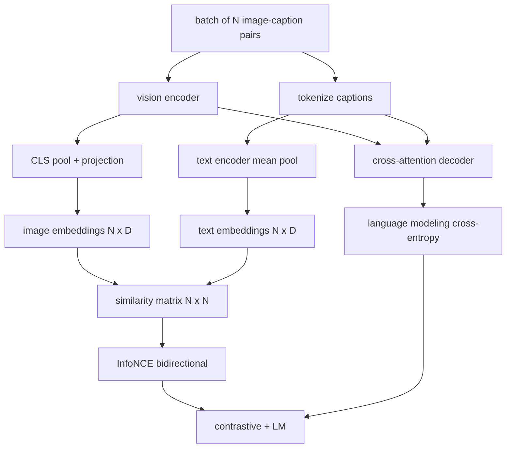

# Pré-entraînement en langage visuel

> Le codeur, la projection et le décodeur sont câblés. Maintenant, entraînez-les ensemble. Deux objectifs stimulent l'apprentissage: une perte de texte-image contrastée (InfoNCE) qui réunit les paires correspondantes dans l'espace d'embedding commun, et une perte de modélisation de langage qui demande au décodeur de souscrire chaque image. Combiné, ils enseignent au réseau à la fois à trouver la bonne image pour une légende et à écrire une légende pour l'image.

**Type:** Build
**Languages:** Python
**Prerequisites:** Phase 19 lessons 30-37 (Track B foundations)
**Time:** ~90 minutes

## Objectifs d'apprentissage

- Implémenter la perte de contraste InfoNCE sur un lot de paires d'images en sous-titres.
- Composez une perte de contraste avec une perte de modélisation de langage autorégressive.
- Synthétisez un corpus de 200 paires de faux images sans téléchargement de série de données réelle.
- Exécutez une boucle d'entraînement en 50 étapes et observez que les pertes diminuent.

## Le problème

Un modèle de langage de vision a besoin de deux compétences. Il doit classer: donné une légende, trouver la bonne image parmi beaucoup. Il doit générer: donné une image, écrire une légende. Préentrainer le modèle sur une compétence seule vous donne la moitié d'un système. CLIP classement clés mais ne peut pas légende. GPT-4V peut légende mais utilise une tête de récupération séparée pour le classement. Préentraînement multi-objectif obtient les deux en un seul passage.

Pour un lot de paires N, le modèle traite les paires correspondantes N comme positives et les paires correspondantes `N^2 - N`Les paires de défauts sont négatifs, puis une perte d'entropie croisée sur le résultat `(N, N)`La perte LM gère la moitié de la génération: prédiction standard de jeton suivant conditionnée sur l'image.

## Le concept



### InfoNCE en un seul paragraphe

L2 normaliser les deux. Calculer le `N x N`matrice `S = I T^T / tau`où `tau`Les entrées diagonales sont les paires correspondantes; les entrées hors diagonale sont négatives.`argmax`en descendant la diagonale: rangée `i`devrait avoir sa plus haute entrée dans la colonne `i`Le total est la moyenne des deux. Ceci est la perte de CLIP en huit lignes.

### La température est importante

La température`tau`La quantité de la masse de la masse de la masse de la masse de la masse de la masse de la masse de la masse de la masse de la masse de la masse de la masse de la masse de la masse de la masse de la masse de la masse de la masse de la masse de la masse de la masse de la masse de la masse de la masse de la masse de la masse de la masse de la masse de la masse de la masse de la masse de la masse de la masse de la masse de la masse de la masse de la masse de la masse de la masse de la masse de la masse de la masse de la masse de la masse de la masse de la masse de la masse de la masse de la masse de la masse de la masse de la masse de la masse de la masse de la masse de la masse de la masse de la masse de la masse de la masse de la masse de la masse de la masse de la masse de la masse de la masse de la masse de la masse de la masse de la masse de la masse de la masse de la masse de la masse de la masse de la masse de la masse de la masse de la masse de la masse de la masse de la masse de la masse de la masse de la masse de la masse de la masse de la masse de la masse de la masse de la masse de la masse de la masse de la masse de la masse de la masse de la masse de la masse de la masse de la masse de la masse de la masse de la masse de la masse de la masse de la masse de la masse de la masse de la masse de la masse de la masse de la masse de la masse de la masse de la masse de la masse de la masse de la masse de la masse de la masse de la masse de la masse de la masse de la masse de la masse de la masse de la masse de la masse de la masse de la masse de la masse de la masse de la masse de la masse de la masse de la masse de la masse de la masse de la masse de la masse de la masse de la masse de la masse de la masse de la masse de la masse de la masse de la masse de la masse de la masse de la masse de la masse de la masse de la masse de la masse de la masse de la masse de la masse de la masse de la masse de la masse de la masse de la masse de la masse de la masse de la masse de la masse de la masse de la masse`tau = 0.01`Le niveau de la formation est trop élevé et le niveau de la douceur se flatte et le niveau de la formation disparaît.`tau`comme paramètre; la démo ici fait la même chose.

### Perte de modélisation de langage

Le décodeur consomme des jetons de mémoire d'image via l'attention croisée et prédit le prochain jeton de texte à chaque position. La perte est une entropie croisée standard avec la cible de la position suivante.

### Combiner les pertes

`total = contrastive + lm_weight * lm`où `lm_weight`Le décodeur de l'écodeur est un gradient de perte de LM. C'est la recette multi-tasks que les modèles de style CoCa, BLIP et SigLIP utilisent tous, avec des pondérations différentes.

| Component | Loss surface | Affects |
|-----------|--------------|---------|
| InfoNCE | Pair ranking in the joint space | Encoder + projection + text head |
| LM | Token prediction conditioned on image | Encoder + projection + decoder |
| Combined | Multi-task | Whole stack |

### Pourquoi 50 étapes suffisent pour une démonstration

Le faux corpus est un ensemble de 200 paires synthétiques avec des images aléatoires et des identifiants de sous-titres aléatoires. Après 50 étapes SGD avec la taille du lot 16, les deux pertes diminuent de manière visible même si les valeurs absolues restent au-dessus de ce qu'un modèle de données réelles atteindrait. Le but de la démonstration est de confirmer que les travaux de plomberie de gradient se terminent et que l'ajout de la perte de LM ne déstabilise pas l'objectif de contraste.

```figure
ch-infonce-diagonal
```

## Faites-le

`code/main.py`les implémentations:

- `MultimodalModel`, combinant un petit encodeur ViT, le projecteur MLP, un encodeur de côté texte minuscule (pools moyens sur les identifiants intégrés) et le décodeur d'attention croisée de la leçon 61.
- `info_nce_loss(image_emb, text_emb, temperature)`, la perte de contraste bidirectionnelle de type CLIP.
- `lm_loss(logits, target_ids, padding_id)`, masqué par la prochaine entropie croisée.
- `make_mock_corpus(seed, n_pairs)`, qui renvoie 200 paires déterministes (image, caption_ids).
- Une boucle d'entraînement à 50 étapes avec la taille du lot 16, l'optimisateur Adam et un paramètre de température de jour apprise.

- Je vais le faire.

```bash
python3 code/main.py
```

Résultats: des pertes de contraste diminuent d'environ `ln(16) = 2.77`En ce qui concerne la perte de LM, la valeur de l' LM est réduite par rapport à une base aléatoire uniforme de `ln(512) ≈ 6.24`Les modèles réels s'entraînent sur des millions d'étapes; la dynamique est la même.

## Utilisez-le

C'est la même recette de perte envoyée:

- **CLIP (2021).**Seul texte-image contraste, avec une sonde de sous-titres gelée séparée.
- **CoCa (2022).**Contraste image-texte plus perte de LM en sous-titres d'image dans un modèle.
- **BLIP (2022) and BLIP-2.**Contraste plus LM plus tête de correspondance image-texte.
- **SigLIP (2023).**Il commute l'InfoNCE pour une perte de paire sigmoïde; même rôle contrasté, forme fonctionnelle différente.
- **LLaVA family.**L'entraînement en deux étapes où la première étape est l'alignement (cosine sur un LM gelé) et la deuxième étape ajoute la perte de LM avec un LM non gelé.

## Tests

`code/test_main.py`couvertures:

- La perte d'infoNCE est symétrique entre les lignes d'image/texte
- La perte d'infoNCE renvoie 0 lorsque la matrice de similitude est une diagonale parfaite de grands nombres positifs
- La perte de LM masque correctement les positions de rembourrage
- le modèle de passe à terme produit les deux pertes sans erreur
- La boucle d'entraînement en 5 étapes réduit la perte combinée

- Je vais les faire.

```bash
python3 -m unittest code/test_main.py
```

## Exercices

1. Remplacez InfoNCE par une perte de paire sigmoïde de style SigLIP et comparez la convergence sur le corpus de simulation.

2. Ajoutez une étape d'exploitation à l'extérieur négative: chaque deuxième lot, sélectionnez la paire extra-diagonale la plus dure du lot précédent et ajoutez-la.

3. Ajouter une tête binaire image-texte correspondant au sommet de l'intégration commune (true/fausse: ces correspondent-ils?) pour une troisième perte, reproduisant la configuration en trois têtes de BLIP.

4. Remplacez le faux corpus par des séquences d'id de sous-titre tirées d'une chaîne de Markov dont la matrice de transition est conditionnée par le hash d'image.

5. Traînez le même modèle avec `lm_weight = 0`et encore une fois avec `lm_weight = 1`- Comparer les pertes contrastées; la perte de LM ne devrait pas régresser dans l'objectif de classement.

## Les termes clés

| Term | What it means |
|------|---------------|
| InfoNCE | Noise contrastive estimation: cross-entropy on a similarity matrix |
| Temperature | Scalar that controls how peaked the contrastive softmax is |
| Hard negative | An off-diagonal pair the model finds confusing, useful for sampling |
| LM loss | Standard next-token cross-entropy on the captioning side |
| Joint embedding space | The shared space where image and text vectors live after projection |

## Pour en savoir plus

- Le papier de clôture pour la recette originale.
- Papel CoCa pour contraste plus sous-titres dans un modèle.
- Le papier SigLIP pour la variante de perte de paire sigmoïde et pourquoi il s'échauffe mieux.
