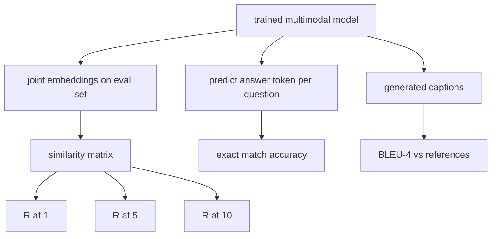

# Évaluation multimodale

> La formation est la moitié de la boucle. L'autre moitié est la mesure. Cette leçon construit trois surfaces d'évaluation à partir de primitives: récupération de titre d'image rapportée comme R@1, R@5, R@10; réponse à la question visuelle rapportée comme exactitude de correspondance; et sous-titres d'image rapporté comme BLEU-4.

**Type:** Build
**Languages:** Python
**Prerequisites:** Phase 19 lessons 58-62 (Track E foundations: encoder, transformer, projection, cross-attention fusion, pretraining)
**Time:** ~90 minutes

## Objectifs d'apprentissage

- Compute Recall@K à partir d'une matrice de similitude entre les emblèmes d'image et de sous-titre.
- Compute la précision de la VQA de correspondance exacte à partir d'un modèle qui carte (image, question) des paires à un vocabulaire de réponses fixe.
- Compute BLEU-4 à partir de séquences de jetons générées et de référence sans bibliothèque externe.
- Exécutez les trois évaluations contre une suite synthétique construite sur le modèle formé de la leçon 62.

## Le problème

La tentation est de déclarer un modèle multimodal terminé lorsque les plateaux de perte d'entraînement.

- **Retrieval (R@1, R@5, R@10).**Construisez l'intégration commune pour une légende de requête; classez chaque image dans le pool d'évaluation par cosine; indiquez si l'image correspondante se trouve au premier 1, au premier 5, au premier 10.
- **Visual question answering (exact match).**Le modèle donne un jeton de réponse. Le correspondement exact est un bit par échantillon: la réponse prévue équivaut-elle à la réponse de référence?
- **Captioning (BLEU-4).**Générer une légende. Compute la moyenne géométrique de 1 gramme à 4 grammes de précision par rapport aux légendes de référence, avec une peine de brèveur.

Chaque métrique est une fonction mince. La leçon les construit tous en code afin que les mathématiques soient concrètes et que la surface reste sous votre contrôle.

## Le concept



### Rappel@K à partir d'une matrice de similitude

Construisez le `(N, N)`matrice de similitude cosine entre les emblèmes d'image et de sous-titre. Pour chaque rangée, trier les colonnes en suivant la similitude descendante. Remall@K est la fraction de rangées où l'indice de colonne diagonale se trouve dans les positions K supérieures. Le symétrique Recall@K (caption-to-image) est calculé sur la matrice transposée. Les deux chiffres sont rapportés. Pour une évaluation N=100, R@1 = 0,6 signifie que 60 des 100 légendes ont récupéré leur image correcte comme correspondance supérieure.

### VQA correspondant exactement

Pour chaque image (image, question, réponse), encodez l'image, embladez la question, fusionnez via le décodeur et lisez le symbole suivant. L'identifiant de jeton prévu est comparé à l'identifiant de référence; correct si égal. La moyenne sur l'ensemble d'évaluation. Les vrais ensembles de données VQA contiennent plusieurs réponses d'une personne à chaque question et utilisent une formule de précision douce (1.0 si au moins 3 des 10 annotateurs sont d'accord, étalonné ci-dessous); la leçon utilise une correspondance exacte d'une seule réponse pour la clarté.

### Le projet de loi

```text
BLEU-4 = BP * exp(mean(log p1, log p2, log p3, log p4))
```

Où ?`p_n`est la précision n-gramme modifiée (compte réduit des n-grammes générés qui apparaissent dans toute référence, divisé par le total des n-grammes générés), et `BP`est la peine de breveté:

```text
BP = 1                if generated length > reference length
   = exp(1 - r/g)     otherwise, where r is reference length and g is generated
```

Le raffinage est nécessaire pour les petits échantillons où certains `p_n`La mise en œuvre utilise la méthode " Chen et Cherry " 1 (ajouter 1 au numérateur et au dénominateur pour tout compte zéro), qui est la méthode par défaut la plus sûre pour les régimes à faible nombre.

### Suite d'évaluation synthétique

Une suite d'évaluation de 50 échantillons est construite en mémoire à partir du même modèle de corpus de simulation utilisé dans la leçon 62, avec une semence retenue.

- `pairs`: 50 paires (image, caption_ids) à récupérer.
- `vqa`: 50 (image, question, réponse) triple.
- `caps`: 50 (image, [reference_caption_ids, ...]) entrées avec jusqu'à 3 références par image.

La suite est déterministe à partir de la semence et est maintenue à partir du corpus de formation, de sorte que les métriques sont calculées sur des données que le modèle n'a jamais vues.

| Metric | Range | Random baseline (N=50) |
|--------|-------|------------------------|
| R@1 | 0 to 1 | 0.02 (1 / N) |
| R@5 | 0 to 1 | 0.10 |
| R@10 | 0 to 1 | 0.20 |
| VQA EM | 0 to 1 | 1 / vocab |
| BLEU-4 | 0 to 1 | small but nonzero |

Pour une formation de 50 étapes sur des données synthétiques, les mesures ne devraient pas être élevées; elles devraient être au-dessus de la ligne de base aléatoire, ce qui est ce que vérifie la démonstration.

```figure
ch-recall-window
```

## Faites-le

`code/main.py`les implémentations:

- `recall_at_k(sim_matrix, k)`, en retournant une flotte dans `[0, 1]`dans les deux sens.
- `vqa_exact_match(predictions, references)`, rendant la moyenne sur `int`l'égalité.
- `bleu4(generated, references, smoothing=True)`, avec un support multi-référentiel.
- `build_eval_suite(seed, n_samples, vocab_size, max_len)`, en retournant trois listes d'évaluation déterministique.
- `evaluate(model, suite)`, qui exécute les trois indicateurs et renvoie un `dict`Les chiffres.
- Une démo qui charge un modèle multimodal nouvellement initialement créé à partir de la leçon 62, l'évalue, puis le forme pendant 50 étapes et l'évalue à nouveau, en imprimant les métriques avant/après.

- Je vais le faire.

```bash
python3 code/main.py
```

Résultats: le tableau métrique avant/après montre une amélioration de la récupération de près-random vers le signal appris du modèle, une amélioration de la VQA au-dessus du randomisé et une amélioration de la BLEU-4 (la structure synthétique suffit pour un ascenseur de précision de 4 grammes).

## Utilisez-le

Chaque métrique est directement cartographiée sur un indice de référence de production:

- **Retrieval.**MS-COCO 5K val, Flickr30K, ImageNet zero-shot sont tous des problèmes R@K sur la même matrice de similitude.
- **VQA.**VQA v2, GQA, OK-VQA utilisent la même forme de correspondance exacte (avec l'accélération douce au lieu de l'EM à réponse unique pour VQA v2).
- **BLEU-4.**Les sous-titres MS-COCO, NoCaps, Flickr30K utilisent tous BLEU-4 plus CIDER et METEOR.

Pour les réels benchmarks, swap `build_eval_suite`Les mathématiques sont analogiques.

## Tests

`code/test_main.py`couvertures:

- recall@k renvoie 1,0 sur une matrice de similitude d'identité parfaite et 0,0 sur une matrice inversée pour k < N
- rappel@k vous respecte `k <= N`la limite supérieure
- bleu4 retourne 1,0 lorsque généré égal à l'une des références exactement
- bleu4 renvoie 0,0 sur le vocabulaire disjoint
- vqa correspondance exacte est égale à la fraction des paires égales
- build_eval_suite renvoie le nombre attendu de paires, d'éléments vqa et d'entrées de sous-titres

- Je vais les faire.

```bash
python3 -m unittest code/test_main.py
```

## Exercices

1. Ajouter CIDEr aux métriques de sous-titres. CIDEr utilise la pondération TF-IDF sur n-grammes, qui récompense les jetons informatifs.

2. Implémentation de VQA à précision douce: réponses humaines multiples par question, précision est `min(human_count / 3, 1)`Si elle correspond, elle réplique VQA v2.

3. Ajouter une variante sûre contre la NaN de `bleu4`qui gère des séquences générées vides sans s'écraser.

4. Compute la moyenne de rang réciproque (MRR) à côté de R@K. MRR est sensible à l'endroit où l'élément correct dépasse le K supérieur; R@K est sensible à la question de savoir s'il dépasse le K supérieur.

5. Exécutez l'évaluation sur le modèle à cinq points de contrôle pendant la formation (étape 0, 10, 20, 30, 40, 50) et tracez la courbe d'apprentissage.

## Les termes clés

| Term | What it means |
|------|---------------|
| R@K | Fraction of queries where the correct match lands in the top K results |
| Exact match | The simplest VQA scoring: predicted answer equals reference |
| BLEU-4 | Geometric mean of 1- to 4-gram precisions, with brevity penalty |
| Multi-reference | A captioning metric accepts several reference captions per image |
| Held-out | The eval set is sampled from a seed disjoint from the training corpus |

## Pour en savoir plus

- Papert VQA v2 pour la formule de précision douce et les statistiques des ensembles de données.
- Papel CIDER pour sous-titres en n-grammes pondérés TF-IDF.
- BLEU original (Papineni et coll., 2002) pour les variantes de lissage.
- Les scripts d'évaluation sous-titrés MS-COCO pour la mise en œuvre de référence canonique.
