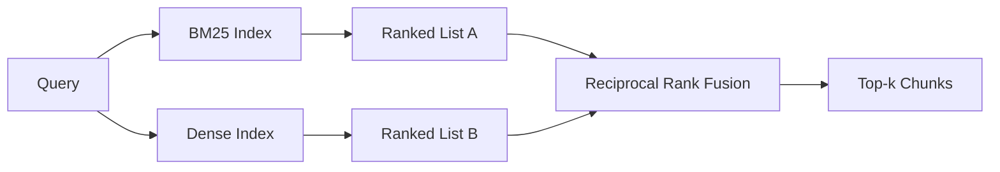

# Réservation hybride avec BM25 et intégrations denses

> La récupération léxicale et sémantique échouent sur les distributions de requêtes opposées. La récupération hybride avec fusion de rang réciproque n'interpelle pas, elle vote - et le vote gagne sur chaque classe de requête.

**Type:** Build
**Languages:** Python
**Prerequisites:** Phase 11 lessons 04 (embeddings), 06 (RAG); Phase 19 Track B foundations (lessons 20-29); Phase 19 lesson 64 (chunking strategies)
**Time:** ~90 minutes

## Objectifs d'apprentissage
- Implémenter BM25 à partir de zéro à partir de la formule Robertson et Sparck Jones, avec pondération de champ, normalisation de la longueur du document et réglageable k1 et b.
- Construisez un récupérateur dense sur une simulation déterministe afin que la boucle se déconnecte.
- Implémenter la fusion de rang réciproque exactement comme Cormack, Clarke et Buettcher l'ont publié en 2009, et expliquer pourquoi il domine l'interpolation pondérée par le score.
- Tonez la constante RRF k et les poids par modalité et lisez les compromis sur un petit corpus de fixation.

## Le problème

La recherche léxicale gagne lorsque la requête contient un identifiant littéral.`AbortMultipartOnFail`La même requête, intégrée, se trouve à la limite de trois grappes de similitude et un récupérateur dense classe le mauvais fichier en premier.

Une recherche dense gagne lorsque la requête est paraphrasée loin des jetons littéraux du corpus. Un utilisateur qui demande " comment gérer les téléchargements annulés " n'a jamais tapé le mot abort ou multipart. BM25 renvoie la pièce de documentation sur " télécharger de grands fichiers " parce que cette page contient le mot téléchargements.

Le choix entre les deux n'est pas statique. La distribution de requête est la variable. Un système RAG de production gère les deux classes du même point de fin, donc la récupération doit gérer les deux à la fois. C'est la récupération hybride.

## Le concept



### BM25 en un seul paragraphe

BM25 marque une paire requête-document en sumant, sur les termes de requête, un facteur de fréquence document inverse multiplié par un facteur de fréquence terme saturant qui comprend une correction de normalisation de longueur.`k1`Il est recommandé de ne pas déplacer la fréquence de saturation par terme sans référence. `b`La longueur du document est contrôlée par la norme par défaut 0,75 et les documents plus longs sont pénalisés, mais pas linéairement.

La formule des FDI utilise la définition de Robertson et Sparck Jones, qui est `log((N - df + 0.5) / (df + 0.5) + 1)`Le plus-un dans le journal maintient les IDF positifs quand un terme apparaît dans plus de la moitié du corpus.

La pondération des champs permet de dire à BM25 qu'un match sur le nom du symbole compte plus qu'un match dans le corps. L'implémentation est un multiplicateur sur le nombre de termes pendant l'indexation, et non au moment du score. Cela maintient les mathématiques identiques et évite un score séparé par champ.

### Réservation dense en un paragraphe

Embed chaque pièce dans un vecteur de dimension fixe avec un modèle d'embedding. Au moment de la requête, embed la requête, cousin-ranger chaque pièce par similitude, et retourner le top-k. Le modèle est la variable qui décide de la qualité. L'algorithme de récupération lui-même est deux lignes: produit de point et tri.

Cette leçon utilise une intégration déterministe basée sur le hash afin que vous puissiez lire les mathématiques de fusion sans appel réseau. Le hash additionne les compensations à clé de jeton dans un vecteur 96-dimensionnel et normalise. Les rangs cosines sont déterministes à travers les tours, ce qui est ce que la suite de test exige.

### Fusion de rang réciproque, formule publiée

Deux listes classées. Pour chaque candidat figurant dans l'une ou l'autre des listes, résumez ses contributions réciproques.`1 / (k + rank)`avec k égal à 60 par défaut. tri par score total. C'est l'ensemble de l'algorithme.

La constante publiée k = 60 n'est pas arbitraire. Avec k = 60, la contribution de rang 1 est de 1 / 61 et la contribution de rang 10 est de 1 / 70. La contribution se décompose lentement de sorte que les candidats profonds votent encore.

Deux boutons réglables dans notre mise en œuvre.`k`La valeur de la valeur de la valeur de la valeur de la valeur de la valeur de la valeur de la valeur de la valeur de la valeur de la valeur de la valeur de la valeur de la valeur de la valeur de la valeur de la valeur de la valeur de la valeur de la valeur de la valeur de la valeur de la valeur de la valeur de la valeur de la valeur de la valeur de la valeur de la valeur de la valeur de la valeur de la valeur de la valeur de la valeur de la valeur de la valeur de la valeur de la valeur de la valeur de la valeur de la valeur de la valeur de la valeur de la valeur de la valeur de la valeur de la valeur de la valeur de la valeur de la valeur de la valeur de la valeur de la valeur de la valeur de la valeur de la valeur de la valeur de la valeur de la valeur de la valeur de la valeur de la valeur de la valeur de la valeur de la valeur de la valeur de la valeur de la valeur de la valeur de la valeur de la valeur de la valeur de la valeur de la valeur de la valeur de la valeur de la valeur de la valeur de la valeur de la valeur de la valeur de la valeur de la valeur de la valeur de la valeur de la valeur de la valeur de la valeur de la valeur de la valeur de la valeur de la valeur de la valeur de la valeur de la valeur de la valeur de la valeur de la valeur de la valeur de la valeur de la valeur de la valeur de la valeur de la valeur de la valeur de la valeur de la valeur de la valeur de la valeur de la valeur de la valeur de la valeur de la valeur de la valeur de la valeur de la valeur de la valeur de la valeur de la valeur de la valeur de la valeur de la valeur de la valeur de la valeur de la valeur de la valeur de la valeur de la valeur de la valeur de la valeur de la valeur de la valeur de la valeur de la valeur de la valeur de la valeur de la valeur de la valeur de la valeur de la valeur de la valeur de la valeur de la valeur de la valeur de la valeur de la valeur de la valeur de la valeur de la valeur de la valeur de la valeur de la valeur de la valeur de la valeur de la valeur de la valeur de la valeur de la valeur de la valeur de la valeur de la valeur de la valeur de la valeur de la valeur de la valeur de la valeur de la valeur de la valeur de la valeur de la valeur de

### Pourquoi la fusion est-elle meilleure que l'interpolation pondérée par le score ?

Les scores BM25 sont illimités et dépendants du corpus.`alpha * bm25 + (1 - alpha) * cosine`La fusion basée sur le classement ne le fait pas. Deux rangs sont comparables dans toutes les modalités. La ligne de base RRF publiée dépasse l'interpolation de scores dans chaque piste publique TREC depuis 2010.

C'est le même argument que vous entendez sur RankFusion vs RRF dans la documentation Vespa et Weaviate. Ils sont arrivés à la même conclusion: restez basé sur le classement à moins que vous n'ayez des preuves très solides pour interpoler les scores.

```figure
rrf-fusion
```

## Faites-le

`code/main.py`les implémentations:

- `tokenize(text)`- un jeton regex rapide.
- `BM25Index`- pondérée par champ, avec `add`et `search`et réglables k1, b.
- `mock_embed`- Je suis là .`DenseIndex`- la même intégration déterministe que la leçon 64, donc les morceaux sont comparables.
- `rrf(rankings, k, weights)`- la fusion publiée avec des poids multi-modalités.
- `HybridRetriever`- combine BM25 et dense.
- Une démo .`main()`qui charge un petit corpus de fichiers, exécute trois requêtes ciblant les forces et les faiblesses de chaque récupérateur, et imprime les classements de chaque modalité produite plus la liste fusionnée.

- Je vais le faire.

```bash
python3 code/main.py
```

Lisez la sortie de démo côte à côte. La requête d'identifiant littérale se trouve au rang BM25 1, rang dense 4, rang RRF 1. La requête paraphrase se trouve au rang BM25 6, rang dense 1, rang RRF 1. La requête ambiguë se trouve au rang BM25 3, rang dense 3, rang RRF 1. La fusion n'est pas un tie-breaker; c'est le système qui gagne sur chaque classe de requête.

## - Je suis en train de régler les boutons.

| Knob | Default | Move it up when | Move it down when |
|------|---------|----------------|------------------|
| BM25 k1 | 1.5 | Terms repeat in documents and you want frequency to matter more | Documents are short and term repetition is noise |
| BM25 b | 0.75 | Long documents really do say less per word | Document length is uncorrelated with topic |
| RRF k | 60 | Deep candidates should keep voting | The top-1 should dominate |
| BM25 weight | 1.0 | Your corpus contains literal identifiers and queries match them | Your queries are user-paraphrased |
| Dense weight | 1.0 | Queries are paraphrased | Queries are literal |

Tonez en réécutant le harnais d'évaluation de la leçon 68 sur votre ensemble de requêtes, pas par intuition.

## Les modes d'échec la démo se cachera

**Out-of-vocabulary tokens.**La détection de la détection de la détection de BM25 est calculée à partir du corpus, de sorte que seuls les termes de la requête contribuent à zéro. Les embrasements denses hallucinent un vecteur pour le même terme. Sur les identifiants hors corpus, la modalité dense renvoie des voisins plausibles mais fausses. La fusion absorbe cela parce que BM25 ne renvoie rien et que la contribution de rang diminue, mais seulement si vous dédupliez par document, pas par morceau.

**Stop-token domination.**BM25 contre le mot "le" produit un classement uniforme sur le corpus.

**Identical content across modalities.**Si votre corpus est assez petit pour que le top-1 de BM25 soit aussi le top-1 de dense, RRF vous donne le même top-1 avec les mêmes voisins. C'est un comportement correct, pas un échec, mais il rend la fusion invisible. Ajoutez une paire de requêtes adversitaires dans votre évaluation pour vérifier que la fusion fonctionne réellement.

## Utilisez-le

Modèles de production:

- Index BM25 en cours; le goulot d'étranglement est le dictionnaire de fréquences de termes, pas les vecteurs.
- Indiquez des vecteurs denses dans un magasin séparé (dans cette leçon, nous utilisons une liste plane; dans la production, vous utiliserez HNSW).
- Exécutez les deux requêtes en parallèle; la fusion est une fusion constante sur l'union.
- Persistez la modalité de chaque coup récupéré afin qu'un ré-ranger en aval puisse voir quelle modalité a voté pour elle.

## La faire partir

La leçon 66 prend le top-k fusionné de cette leçon et le replace par un encodeur croisé. La leçon 68 évalue l'ensemble du pipeline avec précision, rappel, MRR et nDCG. Le retriever hybride de cette leçon est la première étape du système de bout en bout dans la leçon 69.

## Exercices

1. Remplacez`mock_embed`Refaire la démonstration et signaler comment le classement densément seulement change sur la requête paraphrasée.
2. Ajouter une troisième modalité: résumés par morceaux indexés séparément et fusionnés en troisième liste classée. Mesurer le gain.
3. Proposez la valeur de k où la courbe atteint son sommet sur votre corpus.
4. Mettez correctement en œuvre le BM25F (normalité de longueur par champ plutôt que le truc du multiplicateur) et comparez sur un corpus où les correspondances de symboles comptent le plus.

## Les termes clés

| Term | What people say | What it actually means |
|------|-----------------|------------------------|
| BM25 | "Lexical search" | Probabilistic ranking with idf x saturating tf x length normalization |
| RRF | "Rank fusion" | Sum of 1 / (k + rank) across ranked lists; k = 60 default |
| k1 | "TF saturation" | Controls how fast a repeated term stops adding more score |
| b | "Length penalty" | 0 means ignore document length, 1 means full normalization |
| Field weighting | "Symbol boost" | Repeat tokens during indexing to boost matches in that field |
| Rank-based vs score-based fusion | "Why RRF beats linear" | Ranks are comparable across modalities; scores are not |

## Pour en savoir plus

- Cormack, Clarke, Buettcher, "La fusion réciproque de rangs dépasse les méthodes d'apprentissage du Condorcet et des rangs individuels", SIGIR 2009
- Robertson, Walker, Beaulieu, Gatford, Payne, "Okapi à TREC-3" (le papier original de la BM25)
- [Vespa: Hybrid Retrieval with BM25 and Embeddings](https://docs.vespa.ai/en/tutorials/hybrid-search.html)
- [Weaviate: Hybrid Search](https://weaviate.io/developers/weaviate/search/hybrid)
- L'étape 11 leçon 06 - Fondements du RAG
- Leçon 64 de la phase 19 - les chunkers dont la production est indexée ici
- Leçon 66 de la phase 19 - Rencoder cross qui consomme le top-k fusionné
