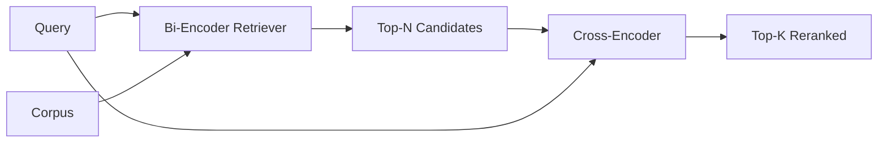

# Rencodeur croisé

> Un bi-encodeur intègre la requête et le document de manière indépendante. Un cross-encodeur les concatenera et les lisera tous les deux à la fois. Le cross-encodeur est le lecteur le plus intelligent et le plus lent. Utilisé comme deuxième étape sur le top-k du bi-encodeur, il se paie lui-même.

**Type:** Build
**Languages:** Python
**Prerequisites:** Phase 11 lesson 06 (RAG), Phase 11 lesson 07 (advanced RAG); Phase 19 Track B foundations (lessons 20-29); Phase 19 lesson 65 (hybrid retrieval feeding this stage)
**Time:** ~90 minutes

## Objectifs d'apprentissage
- Distinguer un retriever bi-encodant d'un réencodeur croisé par leur forme d'entrée, leur nombre de paramètres et leur coût par requête.
- Implementer un petit encodeur croisé à partir de zéro en tant que bloc transformateur qui consomme une séquence emballée (requête, document) et émet un seul échelonneur de pertinence.
- Régler un pipeline de récupération puis de réévaluation en deux étapes: récupérer le haut N avec un retriever bon marché, réévaluer le haut N vers le haut K avec le cross-encoder, retourner K.
- Mesurez le compromis latence-contre-qualité sur un petit corpus de fixation et choisissez le bon N pour un budget de latence donné.

## Le problème

Un bi-encodeur cartographient la requête et le document dans le même espace vectoriel et se classe par cosine. Les deux encodements ne se voient jamais. Le modèle doit compresser tout ce qui est utile à propos d'un document dans un seul vecteur, aveugle à la requête. C'est rapide - un intégration par document au moment de l'index et une requête par requête au moment de la requête - et c'est le seul moyen de classer à l'échelle corpus.

Le coût est la précision. Deux documents ayant le même sujet général peuvent avoir des emblèmes presque identiques même si l'un d'eux répond à la requête et l'autre non. Le bi-encodeur ne peut pas les distinguer.

Un encodeur croisé résout cette question en lisant la requête et le document ensemble.`[query] [SEP] [document]`En tant que séquence unique, il déploie toute l'attention sur la jointure et produit un échelle de pertinence. chaque jeton du document peut assister à chaque jeton de la requête.

Le coût est le débit. Lorsque le bi-encodeur intègre une fois et pose des requêtes pour toujours, le cross-encodeur fonctionne une fois par paire (query, document). Pour un corpus de documents de 10 millions qui est de 10 millions de passes avancées par requête.

La solution est la mise en scène. Utilisez le bi-encodeur pour récupérer le haut-N. Utilisez le cross-encodeur pour réafficher le N à un top-K. N est petit (50 à 200) et le lever de qualité du cross-encodeur est concentré là où cela compte. La latence totale reste dans le budget de la demande. La qualité totale est la qualité du cross-encodeur, limitée par le rappel du bi-encodeur à N.

## Le concept



### La forme d'entrée du codeur croisé

L' emballage standard est `[CLS] query_tokens [SEP] document_tokens [SEP]`. La sortie de position CLS est alimentée dans une seule tête linéaire qui produit le scalaire de pertinence. Certaines implémentations utilisent le pooling moyen au lieu de CLS; la différence est petite.

Un encodeur croisé de 22M (le code de code de 22M)`ms-marco-MiniLM-L-6-v2`Les modèles plus petits perdent leur qualité plus rapidement qu'ils économisent leur latence.`bge-reranker-v2-m3`Les paramètres de la valeur de K sont les mêmes que ceux de la valeur de K.

### Pourquoi cette leçon entraîne-t-elle un minuscule

Un véritable cross-encoder est un transformateur d'encodeur finement ajusté. En production, vous chargez un point de contrôle et le lancez. Dans cette leçon, l'objectif est de vous montrer la forme du modèle et la forme de la courbe de qualité de latence, pas de former un classeur de pointe.`nn.Module`Il est initialement déterminé à partir d'une graine de sorte que la démo est reproduisable sans peses sur le disque.

Le modèle de jouet apprend la bonne forme à partir du corpus de fichiers: les paires de requêtes-documents pertinentes ont des scores prédits plus élevés que les paires irrélevantes.

### La latence par rapport à la qualité

Le pipeline en deux étapes a un réglable: N. balayer N de 5 à 100 sur un ensemble de requêtes prolongées et vous obtenez la courbe.

| N | Recall@1 of stage 2 | Cross-encoder forward passes per query | Latency |
|---|--------------------|---------------------------------------|---------|
| 5 | 0.62 | 5 | low |
| 20 | 0.81 | 20 | medium |
| 50 | 0.86 | 50 | high |
| 100 | 0.86 | 100 | very high |

Les chiffres ci-dessus illustrent la forme, pas les mesures de ce dispositif. La forme est réelle. Il y a toujours un genou autour de 20 à 50 candidats où le relevé de renom saturera.

Choisissez N de la courbe d'évaluation plus le budget de latence. Le cross-encoder ne peut pas augmenter le rappel au-dessus du rappel du bi-encodeur à N, donc un N faible limite la qualité, pas seulement la latence.

```figure
rerank-funnel
```

## Faites-le

`code/main.py`les implémentations:

- `CrossEncoder`- une petite .`torch.nn.Module`: intégration de jetons, un bloc transformateur avec attention multi-tête et tête de mise en avant, moyenne-poled produisant un scalaire.
- `tokenize_pair(query, document)`- les deux chaînes sont regroupées dans une seule séquence d'id avec des id de type qui marquent la limite, déterministe et stdlib.
- `train_tiny(pairs)`- une réussite de formation supervisée sur une liste triple étiquetée manuellement (demand, document, pertinence), de sorte que le modèle produit des notes raisonnables sur le dispositif.
- `rerank(query, candidates, top_k)`- l'interface de production.
- `pipeline(query, retriever, top_n, top_k)`- le flux en deux étapes.
- Une démo .`main()`qui charge le corpus du modèle de la leçon 65, récupère le haut-N, rranks au haut-K, imprime les deux listes côte à côte, et rapporte la latence de chaque étape.

- Je vais le faire.

```bash
python3 code/main.py
```

La sortie montre le haut N du bi-encodeur, le haut K du cross-encodeur et un résumé du temps. Le cross-encodeur prend plus de temps par appel mais ne fonctionne pas sur le corpus complet. Le total des deux étapes reste dans le budget de la demande tout en choisissant la réponse que le bi-encodeur a classé deuxième ou troisième.

## Les modes d'échec la démo se cachera

**Cross-encoder is not symmetric.** `rerank(q, d)`et `rerank(d, q)`Si vous changez accidentellement, le rappel s'effondre.

**N is too low to expose the bug.**Si vous définissez N = K, le cross-encoder ne peut pas réorganiser; il ne peut que ré pondérer. L'ascenseur semble zéro. Choisissez N au moins trois fois K.

**Training data leaks into the eval.**Si les paires d'entraînement étiquetées à la main incluent les requêtes d'évaluation, le renouvellement de rang semble magique.

**Production weights are dense.**Un cross-encoder de paramètre 22M est de 88 Mo à float32. Planifiez la mémoire du serveur modèle avant de promettre sub-100ms p95.

**Batching matters.**Un véritable cross-encoder exécute les N candidats en un seul lot.`_batch_encode`, qui construit les tensors de type et de type avec `torch.tensor(...)`et passe une fois plus loin.

## Utilisez-le

Modèles de production:

- Enfoncer le bi-encodeur, le cross-encodeur et N ensemble.
- La même requête contre un corpus stable se classe dans le même ordre; les hits de cache vous permettent de réduire la latence gratuitement.
- Une requête dont le score de premier rang est inférieur à un seuil spécifique au corpus est un succès hors domaine; laissez-le au LLM comme "Je ne suis pas sûr".

## La faire partir

La leçon 68 évalue ce pipeline en deux étapes de bout en bout. La leçon 69 fixe ce ré-ranger derrière le retriever hybride de la leçon 65 et devant le générateur de réponses.

## Exercices

1. Faites un balayage N de 5 à 50 et tracez recall@1 de la sortie réévaluée.
2. Exercez le cross-encoder pendant dix époques au lieu d'une. Mesurez la marge de pointage entre les paires positives et négatives à chaque époque.
3. Remplacez le partage moyen par un point de référence CLS. Comparer la convergence sur ce dispositif.
4. Ajoutez une deuxième tête de codeur croisé qui prédit une étiquette binaire " est-ce que cette réponse dans le document " Utilisez les deux têtes à l'inférence; une pour classer, une pour le seuil.
5. Remplacez le moqueur de bi-encodeur déterministe par celui de la leçon 65 et enchaînez les deux étapes. Mesurez le changement dans le top-K par rapport au bi-encodeur seul.

## Les termes clés

| Term | What people say | What it actually means |
|------|-----------------|------------------------|
| Bi-encoder | "Vector retriever" | Encodes query and doc independently; cosine ranks them |
| Cross-encoder | "Reranker" | Encodes (query, doc) jointly; outputs one relevance scalar |
| Two-stage pipeline | "Retrieve and rerank" | Cheap retriever returns N, expensive reranker keeps K |
| N (candidate budget) | "Rerank pool" | The number of candidates the cross-encoder scores per query |
| Mean-pooling head | "Mean of last hidden" | Average the encoder's last-layer outputs into one vector |

## Pour en savoir plus

- Nogueira, Cho, "Re-rangement du passage avec BERT", 2019 - le papier de classement canonique des encoders croisés
- Reimers, Gurevych, "Sentence-BERT: Embedding of sentences using Siamese BERT-Networks", 2019 - sur les bi-encoders par rapport aux cross-encoders
- [SentenceTransformers Cross-Encoders documentation](https://www.sbert.net/examples/applications/cross-encoder/README.html)
- [BGE Reranker v2 model card](https://huggingface.co/BAAI/bge-reranker-v2-m3)
- Leçon 65 de la phase 19 - le retriever hybride qui alimente cette étape de réévaluation
- L'évaluation qui mesure l'élévation que ce renouvellement de rang offre
