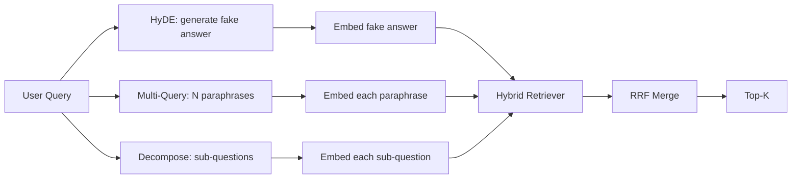

# Réécriture de requête: HyDE, Multi-Query et Décomposition

> La requête que l'utilisateur type n'est pas la requête que votre récupérateur veut. La réécriture combine l'écart avant la récupération, de sorte que l'index voit quelque chose de plus proche de ce à quoi ressemble la réponse.

**Type:** Build
**Languages:** Python
**Prerequisites:** Phase 11 lessons 04 (embeddings), 06 (RAG); Phase 19 Track B foundations (lessons 20-29); Phase 19 lessons 64 and 65
**Time:** ~90 minutes

## Objectifs d'apprentissage
- Implémentation d'intégrations hypothétiques de documents (HyDE): générer une fausse réponse, l'intégrer, récupérer contre ce vecteur au lieu du vecteur de requête.
- Implémenter une expansion multi-queries: réécrire une requête en N paraphrases, récupérer avec chacune, fusionner l'union par fusion de rang réciproque.
- Implémenter la décomposition de requête: diviser une question complexe en sous-questions, récupérer par sous-question, fusionner.
- Comparez les trois réécrivains face à face sur un appareil et expliquez quand chaque stratégie gagne.
- Faites un faux LLM qui produit des sorties déterministes en fonction de la fixation afin que la boucle de réécriture se déroule hors ligne.

## Le problème

Un utilisateur tape "Que fait notre équipe lorsque les téléchargements échouent et le budget est parti?". Le corpus contient un document qui dit " AbortMultipartOnFail aborte un téléchargement multipart S3 en vol et diminue le budget de réessayer par bouquet lorsque le téléchargement échoue ". La requête et le document ne partagent pas de phrase de nom. BM25 est tombé. Le bi-encodeur classe le document troisième ou quatrième parce que le vecteur de requête se trouve dans une région de l'espace d'intégration qui préfère le document aux tâches annulées, et non le document aux téléchargements annulés. Le ré-rangement en deux étapes de la leçon 66 peut sauver la réponse si elle se trouve en haut de la N, mais si elle n'atteint même pas le haut de la N, le ré-ranger ne la voit jamais.

La solution est de réécrire la requête avant qu'elle touche le retriever. Le document de 2023 "Précise Zero-Shot Dense Retrieval sans étiquettes de pertinence" (Gao et coll.) a introduit HyDE: demander à un LLM d'écrire le document qui répondrait à la requête, d'intégrer ce document hypothétique et d'utiliser son intégration comme vecteur de récupération. Le document hypothétique se trouve dans la région droite de l'espace d'embedding parce qu'il est écrit dans la voix du corpus. Le vecteur de requête ne l'a pas fait.

Deux techniques de cousine associées à HyDE. L'expansion multi-queries (le terme utilisé par Microsoft GraphRAG) génère N parafraases de la requête et récupère avec chacune, puis se fusionne. La décomposition (popularisée sous le nom de " décomposition des requêtes " dans le travail de 2024 de Stanford DSPy) divise " ce que notre équipe fait lorsque les téléchargements échouent et le budget est parti " en deux questions: " que se passe-t-il lorsqu'un téléchargement échoue " et " que se passe-t-il lorsque le budget de réessayer est parti ". Deux recherches, un résultat fusionné, les deux parties de la réponse sont accessibles.

Cette leçon met en œuvre les trois et les dirige contre le même corpus de fixation.

## Le concept



### HyDE en détail

HyDE remplace le vecteur de requête de l'utilisateur par un vecteur de document hypothétique écrit par LLM.

```
You are a domain expert. Write a one-paragraph passage that answers the question
below. Use the same vocabulary and phrasing the documentation in this domain would
use. Do not refuse. Do not say you do not know.

Question: {user_query}

Passage:
```

La réponse du LLM est fausse comme réponse factuelle parce que le LLM ne connaît pas votre corpus. Ça va. Le retriever ne se soucie pas de la précision factuelle, seulement de la distribution symbolique. Le passage hypothétique contient les mots "avortement", "multipart", "bucket", "budget", car c'est ce qu'un passage de documentation sur ce sujet dirait. Embed ce passage. Le vecteur atterrit près du passage réel.

En production, vous limiterez le document hypothétique à deux ou trois phrases. Les plus longs hypothétiques recueillent plus de bruit.

### Expansion détaillée des demandes multiples

Générer N paraphrases de la requête de l'utilisateur.

```
Rewrite the following question in {N} different ways. Each rewrite must preserve
the original intent. Number them 1 to {N}. Do not add explanations.
```

Retrouvez le top-k pour chaque paraphrase. Fusez les listes classées N avec RRF (le même algorithme de la leçon 65).

La requête multi-requête gagne lorsque la phrase de l'utilisateur est l'une des nombreuses façons tout aussi valides de poser la question, et n'importe laquelle des réécrits aurait mieux posé la question. Perde lorsque toutes les réécrits sont également mauvais parce que l'original était mauvais de la même manière.

### Décomposition détaillée

Une seule récupération ne peut pas satisfaire une question à plusieurs facettes. La décomposition demande au LLM de diviser la question en sous-questions et le système récupère par sous-question.

```
The following question may require information from multiple distinct topics.
Decompose it into a list of sub-questions. Each sub-question must be answerable
independently. If the question is already atomic, return it unchanged.

Question: {user_query}
```

Récupérer par sous-question. Fusion. Décomposition est l'outil idéal pour les questions contenant des conjonctions, des comparaisons multi-clauses ou deux sujets non liés.

### Pourquoi les trois existent-ils ?

Les trois sont complémentaires. HyDE comble le fossé entre requête et corpus de jetons. Multi-query couvre la variance de paraphrase. Décomposition couvre les requêtes multi-thématiques. Un système de production exécute les trois et choisit la stratégie par requête (le système de bout en bout de la leçon 69 montre le sélecteur).

## Le faux LLM

La leçon se déroule hors ligne. La moqueur LLM est une petite table de recherche sur la requête de l'utilisateur, plus un back-up pour les requêtes qu'il n'a pas vues.

- Pour chaque requête de fixation: un passage hypothétique écrit, trois paraphrases et une décomposition.
- Pour une requête inconnue: une transformation déterministe: prenez les mots de contenu de la requête, élargissez-les à travers une carte synonyme et retournez le résultat.

La forme de la moqueur est importante, pas les données.

```figure
cd-hyde-vector
```

## Faites-le

`code/main.py`les implémentations:

- `MockLLM`- le substituteur déterministe décrit ci-dessus.
- `HyDERewriter`- appelle le LLM à rédiger le document hypothétique, renvoie la sortie du réécrivain comme `RewriteResult`avec le texte hypothétique et la requête que le récupérateur devrait utiliser.
- `MultiQueryRewriter`- appelle le Master pour N parafrases, renvoie une liste de questions.
- `DecomposeRewriter`- appelle le LLM à se décomposer, renvoie des sous-questions.
- `retrieve_with_rewriter`- prend un réécrivain et un retriever, fait les réécrits, fusionne les résultats.
- Une démo qui exécute les trois réécrivains sur un appareil et imprime la stratégie qui a renvoyé le document de réponse en or en premier.

La forme du retriever est réutilisée à partir de la leçon 65 (hybride BM25 + dense). La fusion est la même RRF. La seule nouvelle forme est l'interface du réécrivain, qui est petite.

- Je vais le faire.

```bash
python3 code/main.py
```

La sortie est un classement par stratégie et un résumé final. HyDE gagne sur la requête de frazage-diséquation. Multi-query gagne sur la requête de variance de paraphrase. Décomposition gagne sur la requête multi-thématique. Le retrait (pas de réécrivain) perd au moins un des trois.

## Les modes d'échec la démo se cachera

**HyDE hallucinates corpus-specific identifiers wrong.**Le modèle invente un nom de fonction. Le score BM25 de l'hypothétique sur le document droit s'effondre parce que le nom inventé est maintenant un jeton de poids élevé qui n'apparaît pas dans l'indice.

**Multi-query rewrites all converge.**Un modèle faible produit trois paraphrases presque identiques. Les récupérations N retournent le même top-k. La fusion RRF n'est pas meilleure qu'une seule récupération. Ajoutez une instruction de diversité explicite à la demande de réécriture et détectez des duplicates par Jaccard.

**Decomposition over-splits.**Le décomposateur transforme une question atomique en une liste. Les récupérations renvoient tous le même document mais avec un rang réduit. La fusion est pire que l'original. Détectez ceci avec un " ces sous-questions sont suffisamment distinctes " passe avant de fan-out.

**Latency multiplies.**HyDE coûte un appel LLM. La requête multi-classe coûte un appel LLM pour générer N réécrits, puis N récupérations. La décomposition coûte un appel LLM pour décomposer, puis M récupérations. Les récupérations se déroulent en parallèle; l'appel LLM est le sol.

## Utilisez-le

Modèles de production:

- Sélection de stratégie par requête par longueur de requête: les requêtes courtes atomiques obtiennent des requêtes multiples, les requêtes complexes multi-clauses obtiennent décomposition, les requêtes jargon-heavy obtiennent HyDE.
- Cache la sortie du réécrivain par hash de requête. De nombreuses requêtes se répètent.
- Les trois résultats sont combinés en un seul avec RRF. Le coût est trois appels LLM et une fusion; la qualité est l'union de la couverture des trois stratégies.

## La faire partir

La leçon 69 fixe cette étape de réécriture avant le retriever de la leçon 65 et le ré-ranker de la leçon 66. La leçon 68 évalue le relevé que le réécrivain ajoute au rappel de récupération.

## Exercices

1. Implémenter RAG-Fusion (une variante 2024 de la requête multi-query) où les paraphrases du réécrivain sont intentionnellement diverses, puis la étape de réaffichage (leçon 66) choisit la liste finale.
2. Ajouter une quatrième stratégie: la mise en place d'un rappel (demandez à la MLL la question la plus générale, puis reprenez-la, puis étroit).
3. Apprenez au décomposant à reconnaître les requêtes atomiques en ajoutant une tête "est-ce que la question est atomique". Mesurez le taux de surdivision avant et après.
4. Remplacez le faux LLM par un vrai modèle d'appel.
5. Ajoutez un score de confiance par réécriture.

## Les termes clés

| Term | What people say | What it actually means |
|------|-----------------|------------------------|
| HyDE | "Fake-document retrieval" | LLM writes the answer; embed and retrieve on that instead of the query |
| Multi-query | "Paraphrase expansion" | N rewrites of the query; retrieve N times, merge by RRF |
| Decomposition | "Subquery split" | Multi-topic queries split into sub-questions, retrieved separately |
| Atomic query | "Single-topic" | Cannot be decomposed without inventing fake sub-questions |
| Step-back | "Abstract the query" | Ask the more general question, retrieve, then narrow |

## Pour en savoir plus

- Gao, Ma, Lin, Callan, "Récupération précise de la densité de tir zéro sans étiquettes de pertinence" (HyDE), 2023
- Microsoft Research, "Extension multi-questions pour le récupération"
- Stanford DSPy, "Décomposition des requêtes pour l'AQ multi-Hop"
- [LlamaIndex query transformations documentation](https://docs.llamaindex.ai/en/stable/optimizing/advanced_retrieval/query_transformations/)
- Leçon 07 de la phase 11 - modèles RAG avancés
- Leçon 65 de la phase 19 - le retriever que ce réécrivain alimente
- L'évaluation de la phase 19 - le niveau de réécriture
