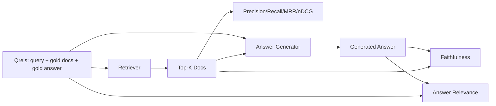

# Évaluation des RAG: précision, rappel, MRR, nDCG, fidélité, pertinence de la réponse

> Si vous ne pouvez pas classer votre récupération et votre réponse en même temps, vous ne pouvez pas expédier le système. Les deux ne sont pas la même métrique et la même requête échoue sur différents axes.

**Type:** Build
**Languages:** Python
**Prerequisites:** Phase 11 lessons 06 (RAG), 10 (evaluation); Phase 19 Track B foundations (lessons 20-29); Phase 19 lessons 64, 65, 66, 67
**Time:** ~90 minutes

## Objectifs d'apprentissage
- Comptez quatre mesures de récupération à partir de qrels d'or: precision@k, recall@k, MRR (rang médian réciproque) et nDCG@k.
- Comptez deux mesures de qualité de réponse: fidélité (toute affirmation fondée sur le contexte retenu) et pertinence de réponse (la réponse répond à la question).
- Construisez un fichier Qrels fixier (queries, IDs de doc doré, texte de réponse doré) que l'évaluation lit de bout en bout.
- Lisez les valeurs métriques pour diagnostiquer où un pipeline échoue: récupération, classement, génération ou mise à terre.

## Le problème

Un système RAG a au moins quatre parties mobiles: chunker, retriever, reranker, générateur. N'importe laquelle d'entre elles peut être la cause d'une mauvaise réponse. Sans métriques par étape, vous êtes en vol aveugle.

Un utilisateur rapporte une mauvaise réponse. Est-ce parce que le chunker a coupé la durée de réponse? Est-ce parce que le retriever n'a pas inclus la pièce dans le top-k? Est-ce parce que le ré-ranker a poussé la pièce droite au-delà de la position un? Est-ce parce que le générateur a ignoré la pièce et inventé quelque chose? Vous ne pouvez pas dire à partir de la réponse seule. Vous avez besoin:

- Mesures de récupération pour évaluer ce qui est sorti du retriever.
- Rencontre des mesures pour classer où la partie droite était dans l'ordre.
- Fidèle à la notation de la capacité du générateur à rester dans le contexte récupéré.
- Réponse de la pertinence à la note si la réponse répond à la question du tout.

Cette leçon construit les six sur un fichier Qrels fixe. L'évaluation est hors ligne et déterministe; dans la production, vous échangez le faux LLM-as-judge pour un vrai.

## Le concept



### Précision@k

Si l'or a trois documents et que le top-3 en renvoie deux et un faux, la précision@3 est 2 / 3. Utilisez la précision lorsque le coût d'une pièce récupérée irrélevante est élevé (le générateur y gaspille des jetons ou la pièce empoisonne la réponse).

### Rappel@k

Si l'or a trois documents et que le top-5 contient les trois, recall@5 est 1.0. Utilisez le recall lorsque le coût d'une réponse manquée est élevé (vous préférez voir une partie incorrecte supplémentaire que de manquer complètement la partie de la réponse).

Dans la production RAG, la métrique que les gens citent habituellement est recall@k. La génération peut facilement laisser tomber des morceaux irrélevants; elle ne peut pas inventer une réponse à partir d'un morceau qu'elle n'a jamais vu.

### REM (rangement réciproque moyen)

Pour chaque requête, trouvez la position du premier document pertinent dans la liste classée. Le rang réciproque est 1 / position. Moyenne sur l'ensemble de requêtes. MRR est un résumé à un seul chiffre de la façon dont le récupérateur met la meilleure réponse en haut.

MRR pèse fortement la position-1. Une requête où le document d'or est au rang 1 contribue à 1.0.

### nDCG@k

Le gain cumulatif normalisé avec réduction. La formule complète attribue un gain à chaque document récupéré (souvent 1 pour pertinent, 0 pour non), des rabais par le journal de la position, des sommes et divises par le DCG idéal (le DCG que vous auriez si vous étiez classé parfaitement).

Le nDCG accueille une pertinence notée: l'or peut dire "doc A est 3, doc B est 2, doc C est 1". MRR et recall@k aplatissent tout en binaire. Utilisez nDCG lorsque le corpus contient plusieurs documents partiellement pertinents par requête.

### La fidélité

Pour chaque réclamation dans la réponse générée, vérifiez si la réclamation est soutenue par le contexte récupéré. La mise en œuvre standard utilise un prompt LLM-as-judge qui prend (reclame, contexte) et renvoie oui ou non. La métrique est la fraction de réclamations qui passent.

La fidélité prend le mode défaillance du générateur où le modèle invente le contenu. Même si le récupérateur retourne les bons morceaux, un générateur qui hallucine est cassé.

Cette leçon implique la fidélité avec un juge de simulation déterministe qui vérifie si les jetons de chaque réclamation se chevauchent sur le contexte récupéré par un seuil.

### Réponse pertinente

La réponse fidèle répond réellement à la question? La fidélité demande " la réponse est-elle fondée sur le contexte ? " La pertinence de la réponse demande " la réponse est-elle fondée sur la question ? " Une réponse fidèle mais hors sujet donne un score élevé sur la fidélité et un faible sur la pertinence. Une réponse courte et sur le sujet qui ignore le contexte donne un score élevé sur la pertinence et un faible sur la fidélité.

La mise en œuvre standard utilise également le LLM-as-judge: take (question, réponse) et demande si la réponse répond à la question.

## Le dispositif de fixation

```python
{
  "qid": "q1",
  "query": "what is the abort threshold for multipart uploads",
  "gold_doc_ids": ["d1", "d3"],
  "gold_answer_substring": "three failed parts",
  "graded_relevance": {"d1": 3, "d3": 2},
}
```

Chaque requête contient:
- la chaîne de requête,
- un ensemble d'identifiants de documents en or (pour la précision / le rappel / MRR),
- un dicton de pertinence classé (pour nDCG),
- la chaîne de réponse en or (tenue comme métadonnées de référence sur chaque qurel; la fidélité dans cette leçon est calculée en jugant les revendications extraites sur le contexte récupéré, et non sur cette chaîne de référence).

Dans la production, vous étiquettez ces choses.

```figure
ci-rag-metric-ladder
```

## Faites-le

`code/main.py`les implémentations:

- `precision_at_k(retrieved, gold, k)`- la définition littérale.
- `recall_at_k(retrieved, gold, k)`- la définition littérale.
- `mean_reciprocal_rank(retrieved_list_of_lists, gold_list)`- le méchant sur les questions.
- `ndcg_at_k(retrieved, graded_relevance, k)`- DCG/IDCG avec gains binaires ou gradés.
- `extract_claims(answer)`- divise une réponse en réclamations en forme de phrase.
- `faithfulness(claims, context_texts, judge)`- la fraction des demandes jugées fondées.
- `answer_relevance(question, answer, judge)`- juger si la réponse répond à la question.
- `MockJudge`- le juge déterministe de la superposition des jetons afin que l'évaluation se déroule hors ligne.
- `evaluate_pipeline(pipeline_fn, qrels, ks)`- l'orchestre qui contrôle chaque métrique.
- Une démo qui exécute trois variantes de pipeline (baseline de chunker, récupération hybride, hybride + ré-rangement) contre les qrels et imprime une table de métriques.

- Je vais le faire.

```bash
python3 code/main.py
```

La sortie montre la précision@k, recall@k, MRR, nDCG@k, la fidélité et la pertinence de la réponse pour chaque variante dans une seule table de métriques.

## Lire les métriques pour diagnostiquer les défaillances

| Symptom | Likely cause | What to fix |
|---------|-------------|-------------|
| Low recall@k, low precision@k | Chunker cut the answer or retriever cannot find it | Chunker boundaries (lesson 64) or retriever modality (lesson 65) |
| Decent recall@k, low MRR | Right chunk is in top-k but not at position 1 | Reranker (lesson 66) |
| High MRR, low faithfulness | Generator invents content despite right context | Generation prompt; force-cite-or-refuse |
| High faithfulness, low relevance | Answer is grounded but off-topic | Query rewriter (lesson 67) or generation prompt |
| All four high, users still complain | Eval set is unrepresentative | Expand qrels with real user queries |

## Les modes d'échec la démo se cachera

**LLM-as-judge bias.**Un modèle juge ses propres résultats comme plus fidèles qu'ils ne le sont.

**Qrels rot.**Un document qui était or pour Q1 en janvier 2024 n'est plus la bonne réponse en octobre 2024 parce que l'équipe a renommé la fonction.

**Faithfulness micro-checks miss macro-claims.**La fidélité par phrase peut passer alors que la structure globale de la réponse trompe.

**Recall@k masks per-query failures.**Un rappel moyen de 90% peut cacher qu'une classe de requête manque toujours.

## Utilisez-le

Modèles de production:

- Exécutez l'évaluation sur chaque changement de récupérateur ou de générateur.
- Persistez à suivre les données métriques par requête. Lorsque l'utilisateur se plaint, recherchez l'entrée de Qrels qui correspond et voyez si elle aurait été capturée.
- Les critères de classement sont: un ensemble de fumée de 20 requêtes qui se déroule en IC; un ensemble de régression de 200 qui se déroule chaque nuit; un ensemble profond de 2000 qui se déroule chaque semaine.

## La faire partir

Leçon 69 câble l'ensemble du pipeline (chunker, retriever, reranker, générateur) et exécute cette évaluation contre le système de bout en bout.

## Exercices

1. Ajoutez une cinquième mesure de récupération: hit-rate@k. Comparer avec recall@k. Expliquer quand elles diffèrent.
2. Mettre en œuvre une fidélité notée: 0 (non supporté), 1 (partiellement supporté), 2 (entièrement supporté).
3. Remplacez le faux juge par un vrai appel modèle. Mesurez le désaccord entre le faux et le vrai juge sur le jeu.
4. Ajouter une tranche de classe de requête (" littérale ", " paraphrasée ", " multi-thème ").
5. Ajoutez une mesure de "longueur de réponse" et corrélatez-la avec la fidélité.

## Les termes clés

| Term | What people say | What it actually means |
|------|-----------------|------------------------|
| Precision@k | "Hit rate over retrieved" | Fraction of top-k that are gold |
| Recall@k | "Hit rate over gold" | Fraction of gold in top-k |
| MRR | "First-hit position" | Mean of 1 / rank of first relevant document |
| nDCG@k | "Graded ranking quality" | DCG over the top-k divided by ideal DCG |
| Faithfulness | "Groundedness" | Fraction of answer claims supported by retrieved context |
| Answer relevance | "Did it address the question?" | Whether the answer matches the question's intent |
| Qrels | "Gold labels" | The labeled set of queries and their gold documents and answers |

## Pour en savoir plus

- Buckley, Voorhees, "Evaluation de la stabilité des mesures d'évaluation", SIGIR 2000 - le document canonique sur les mesures de classement
- Jarvelin, Kekalainen, "Évaluation cumulée des techniques IR basée sur les gains" - le document nDCG
- [Ragas: Automated Evaluation of RAG Pipelines](https://docs.ragas.io)
- [Anthropic, Evaluating RAG](https://www.anthropic.com/news/evaluating-rag)
- L'étape 11 leçon 10 - Fondations du cadre d'évaluation
- Les leçons de phase 19 64-67 - composants évalués ici
- L'étude de phase 19 - le pipeline de bout en bout de ces notes d'évaluation
