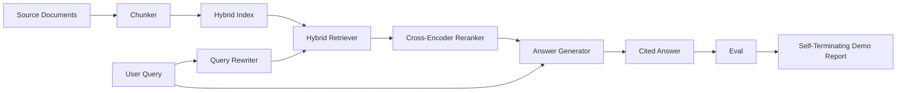

# Système RAG de bout en bout

> Six leçons de composants, un pipeline, une boucle d'évaluation, une démo auto-terminante.

**Type:** Build
**Languages:** Python
**Prerequisites:** Phase 11 lessons 06 (RAG), 10 (evaluation); Phase 19 Track B foundations (lessons 20-29); Phase 19 lessons 64, 65, 66, 67, 68
**Time:** ~90 minutes

## Objectifs d'apprentissage
- Composer le chunker, le retriever hybride, le réécrivain de requête, le réencodeur croisé et le générateur de réponses dans un seul pipeline de bout en bout.
- Implémenter un générateur de réponses qui cite ses revendications par pièces d'ancre, avec un rejet-on-faible confiance.
- Exécutez l'évaluation de la leçon 68 contre le pipeline assemblé et prouvez que la construction en étapes gagne sur chaque métrique sur les mêmes composants en isolement.
- Construire une démo CLI auto-terminant qui ingère un corpus de fichiers, exécute un ensemble de requêtes fixes, et sort de zéro avec un rapport de résumé.

## Le problème

Six composants isolés ne prouvent rien. Le chunker peut gagner sur le recall@5 contre le corpus et perdre sur le recall@5 du système parce que le retriever ne peut pas classer ce que le chunker émet. Le réencodeur peut lever le MRR sur un pool de candidats synthétiques et échouer sur de vrais candidats bi-encodés parce que le rappel du bi-encodeur au budget de réencodeur est trop faible. Le réécrivain de requête peut promouvoir le document doré sur une seule requête et rompre sur la suivante parce que la moqueur de LLM renvoie une hypothétique dégénérée.

Le test d'intégration est le processus de l'ensemble du pipeline de bout en bout contre les mêmes fichiers, avec la même métrique, avec un fichier orchestrateur qui câble tout ensemble. C'est ce que construit cette leçon. Si les métriques du pipeline intégré battent les métriques de la démo isolée de chaque étape, vous avez prouvé le système.

## Le concept



### Choix de câblage

Le pipeline est un petit graphique. Chaque étape est une fonction avec une signature claire.

| Stage | Input | Output |
|-------|-------|--------|
| Chunker | Document text | List of Chunk records |
| Retriever | Query string | Top-N Chunk records |
| Rewriter (optional) | Query string | List of rewrites + hypothetical |
| Reranker | Query, candidates | Top-K Chunk records with cross scores |
| Generator | Query, top-K Chunk records | Answer string with citations |

La composition est simple quand chaque signature est stable.`Pipeline`La classe a les cinq étapes et une`query`Chaque étape est interchangeable: passez un chunker, un retriever, un réécrivain, un réencadrement ou un générateur différent et le pipeline continue de fonctionner.

### Générateur de réponses avec citations

Le générateur est la dernière étape et la plus facile à briser.

1. Il prend les morceaux de K.
2. Sélectionne jusqu'à deux morceaux dont le texte contient le plus haut contenu-token chevauchant avec la requête.
3. Émet une réponse qui est une concatenation d'une phrase-de-chacune-se-sélectionné-partie, avec chaque phrase suivie d'une `[doc_id:chunk_index]`l'ancre.
4. Si aucune pièce ne se chevauchent au-dessus d'un seuil de déchets, elle émet "Je ne sais pas" sans cité.

En production, vous changez la simulation pour un vrai appel LLM avec le modèle prompt:

```
You are answering a question using only the snippets below.
Cite every claim with the anchor in parentheses.
If the snippets do not answer the question, say "I do not know".

Question: {query}

Snippets:
{enumerated chunks with anchors}

Answer:
```

Le chemin de rejet sur faible confiance est la raison pour laquelle le score de rang 1 du codeur croisé est enregistré. Si il est situé en dessous du seuil du corpus, le générateur refuse. C'est la vanne de sécurité contre les réponses hallucinées.

### La démo auto-terminante

La démo fonctionne de bout en bout. Elle imprime une ventilation par étape d'une requête, exécute l'évaluation sur les quatre éléments fixes, imprime une table de métriques et sort avec un statut zéro si toutes les métriques de leçon 68 répondent aux seuils fixés dans la démo. Si une métrique est inférieure au seuil, la démo sort avec un statut non zéro et un message nommant la métrique défaillante.

C'est la forme qu'un test de fumée CI prend. Le pipeline fonctionne hors ligne, rapide, déterministe. Les seuils sont délibérément serrés sur le dispositif de sorte qu'une régression dans l'une des six leçons échoue la démonstration.

```figure
rag-pipeline-flow
```

## Faites-le

`code/main.py`les implémentations:

- `Chunk`- l'enregistrement effectué à toutes les étapes (étend la forme de la leçon 64 avec un index de partie et un document source).
- `Chunker`- sélectionne une stratégie à partir de la leçon 64 (division récursive par défaut).
- `HybridIndex`- BM25 + dense + RRF de la leçon 65.
- `Rewriter`(facultatif) - choisit une HyDE, multi-queries, décomposition de la leçon 67 par longueur de requête et présence de conjonctions.
- `Reranker`- le cross-encoder formé de la leçon 66, avec un ensemble d'entraînement plus petit afin de converger en quelques secondes.
- `Generator`- le générateur de faux déterministe avec citations et rejet sur faible confiance.
- `Pipeline`- compose les cinq étapes avec un`query(question)`méthode qui renvoie `Result(answer, top_k, latency_ms_per_stage)`- Je suis désolé .
- `run_demo()`- ingère le corpus, effectue trois requêtes de fixation, effectue l'évaluation, imprime les résultats, définit le code de sortie par seuil.

- Je vais le faire.

```bash
python3 code/main.py
```

La sortie est une trace de requête imprimée, la table d'évaluation complète et un dernier état de passage/échec. Retourne le code de sortie 0 sur le fichier.

## Les modes d'échec la démo se cachera

**Chunker boundary drift.**Si vous changez la stratégie de chunker entre le passe d'étiquetage d'évaluation qrels et la démo, les identifiants de document d'or ne sont plus alignés. Fermez la stratégie de chunker dans le fichier qrels. La démo comprend une en-tête qui nomme la chunker.

**Reranker training set leaks into the eval.**Les 14 triplés de formation de la leçon 66 comprennent des requêtes qui ressemblent aux requêtes d'évaluation.

**Mock generator hides hallucination risk.**La moque ne peut pas halluciner car elle ne fait que transmettre du texte des morceaux récupérés.

**No streaming.**Le pipeline renvoie la réponse complète à la fin de chaque étape. Un système de production diffuserait la sortie du générateur.

**Latency is offline.**Les appels de LLM simulés sont constants. Les appels de LLM réels dominent. Planifiez un budget de latence dans la portée de la demande; le timing de la leçon par étape ne mesure que le travail de la CPU.

## Utilisez-le

Modèles de production:

- Envoyez le fichier sous un orchestrateur avec des interfaces de scène explicites.
- Exécutez l'évaluation avant chaque fusion qui touche une étape. Si l'évaluation tombe, la fusion ne débarque pas.
- Persistez à suivre la trace métrique par IC afin que vous puissiez attribuer des régressions à un échange de phase.
- Ajouter un ensemble de fumée de 20 requêtes (sous-ensemble du jeu de régression) qui se déroule en moins de 30 secondes; le jeu de régression complet se déroule chaque nuit.

## La faire partir

Le fichier pipeline de cette leçon est la forme que le reste des leçons Track F de la phase 19 assume. Les leçons suivantes ajouteront l'automatisation de l'ingestion, le réindexation progressive, la télémétrie et une couche de service en haut. Les demi-temps de récupération, de réévaluation, de réécriture et d'évaluation sont complets ici.

## Exercices

1. Ajoutez un sélecteur de stratégie par requête à l'intérieur du réécrivain: heuristiques de la leçon 67 (longueur, conjonctions, rapport de jargon) choisissez HyDE, multi-query ou décomposition.
2. Ajouter un appel de licence pour le générateur derrière un drapeau env.
3. Prolongez la démo pour prendre un `--corpus path`Le drapeau qui charge un vrai corpus, réalisez l'évaluation et le contrôle des seuils.
4. Ajouter un `--strategy`Les mesures de réparation des données sont prises en compte dans les procédures de réparation des données.
5. Ajoutez une interface de générateur de streaming et alimentez-la dans l'évaluation. Confirmez que la fidélité est calculée sur la chaîne finale et non sur le préfixe diffusé.

## Les termes clés

| Term | What people say | What it actually means |
|------|-----------------|------------------------|
| Pipeline | "RAG pipeline" | The composed stages from ingestion to cited answer |
| Citation anchor | "Source link" | The (doc_id, chunk_index) reference attached to each claim |
| Refuse-on-low-confidence | "I do not know" | Generator returns no answer when the reranker top-1 score sits below threshold |
| Smoke set | "CI eval" | The minimal qrels subset that runs in every PR check |
| Stage interface | "Function signature" | The stable input and output type of each pipeline stage |

## Pour en savoir plus

- [Anthropic, Building search and retrieval](https://www.anthropic.com/news/contextual-retrieval)
- [Pinterest, MCP internal search](https://medium.com/pinterest-engineering)- architecture de production de référence
- [Ragas: Automated Evaluation of RAG Pipelines](https://docs.ragas.io)
- L'étape 11 leçon 06 - Fondements du RAG
- Les leçons de phase 19 64-68 - les composants composés ici
