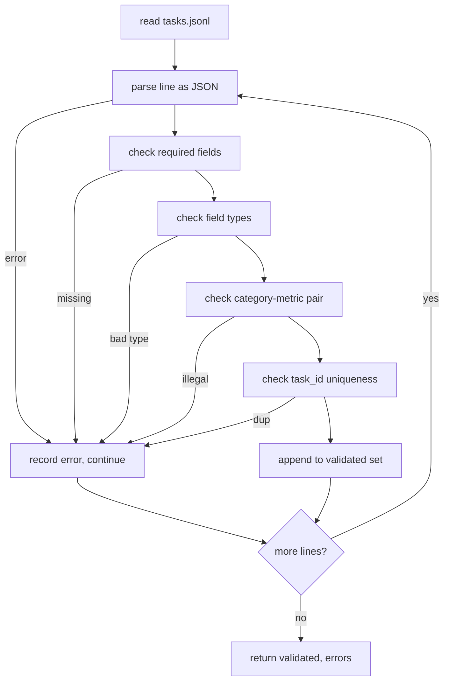

# Format de spécification de tâche

> Un harnais d'évaluation n'est aussi bon que le contrat honore ses tâches.

**Type:** Build
**Languages:** Python
**Prerequisites:** Phase 19 Track B foundations
**Time:** ~90 min

## Objectifs d'apprentissage

- Définir un schéma d'enregistrement de tâches JSONL qui couvre l'arithmétique, le choix multiple, l'exécution du code, la classification et la synthèse du texte libre dans une forme.
- Fixez un vocabulaire fermé de noms métriques afin que les leçons en aval (71-73) puissent être envoyées sur un seul champ.
- Indiquez quelques exemples de tir et des règles de post-traitement dans le cadre de la tâche, et non le coureur, de sorte que le même prompt produit la même cible sur tous les modèles.
- Implémenter un validateur strict qui rejette les enregistrements malformés avant qu'ils n'atteignent le coureur.
- Envoyez un ensemble de 10 tâches qui exerce chaque branche de la spécification afin que le validateur ait quelque chose de réel à mâcher.

```figure
ci-task-spec-gate
```

## Pourquoi une spécificité gelée

Une base de code de recherche accumulera des scripts d'évaluation plus rapidement qu'elle n'accumule des tests. En six mois, chaque bloc-notes a sa propre forme JSON, chaque métrique est réimplémentée deux fois, et rien ne peut être comparé entre les séries. La correction est ennuyeuse. Choisissez un schéma. Écrivez un validateur. Rejetez tout le reste. C'est ce que fait cette leçon.

La forme emprunte des idées de la grande banque, du HELM et des harnais de style Im-eval, mais les noms de champs sont les nôtres. Chaque champ a un seul propriétaire. Le coureur lit la tâche. La métrique lit les cibles. L'étape post-processus normalise la génération. Aucun champ n'est mutable au milieu de la pipeline.

## La forme du disque

Une tâche est un objet JSON sur une seule ligne.`tasks.jsonl`Une mauvaise ligne aborte ce record, pas la course.

```json
{
  "task_id": "arith_001",
  "category": "arithmetic",
  "prompt": "Compute the result. Question: 17 + 24\nAnswer:",
  "targets": ["41"],
  "metric_name": "exact_match",
  "few_shot_examples": [
    {"prompt": "Question: 2 + 2\nAnswer:", "completion": "4"}
  ],
  "post_process": "strip_whitespace",
  "metadata": {"difficulty": "easy"}
}
```

Les champs requis sont `task_id`- Je suis là .`category`- Je suis là .`prompt`- Je suis là .`targets`- Je suis là .`metric_name`- Je suis là .`post_process`- Je suis là .`few_shot_examples`et `metadata`Les champs de niveau supérieur inconnus ne sont pas validés.

## Règles de champ

`task_id`Le validateur impose l'uniformité à travers le fichier.

`category`est l' un des `arithmetic`- Je suis là .`mcq`- Je suis là .`code_exec`- Je suis là .`classification`- Je suis là .`summary`. La catégorie limite la paire métrique et post-processus légale.`code_exec`la tâche doit utiliser `metric_name = code_exec`et une `mcq`la tâche doit utiliser `metric_name = exact_match`contre une cible à une seule lettre.

`prompt`Le validateur interdit de suivre l'espace blanc et rejette les enregistrements qui contiennent déjà quelques blocs dans le corps prompt.

`targets`est une liste non vide de chaînes.`exact_match`, tout élément correspondant compte.`f1`et `rouge_l`Le but le plus marqué gagne.`mcq`, la liste contient exactement un élément.

`metric_name`est l' un des `exact_match`- Je suis là .`f1`- Je suis là .`bleu_4`- Je suis là .`rouge_l`- Je suis là .`accuracy`- Je suis là .`code_exec`Le vocabulaire est fermé, une nouvelle métrique nécessite une nouvelle leçon et une nouvelle entrée.

`few_shot_examples`est une liste de `{prompt, completion}`Le validateur limite la liste à huit entrées pour garder les instructions limitées.

`post_process`est l' un des `none`- Je suis là .`strip_whitespace`- Je suis là .`lower`- Je suis là .`extract_letter`- Je suis là .`extract_code_block`- Je suis là .`extract_first_line`- Chaque règle a un comportement déterministe unique.

## Comportement du validateur



Le validateur renvoie deux listes: les enregistrements validés et les enregistrements d'erreur avec la ligne en infraction, la règle violée et le champ en faute. Le coureur refuse de démarrer si la liste d'erreur n'est pas vide à moins qu'une explicite `--allow-bad-tasks`Le drapeau est placé.

## Rendering à quelques coups

Le coureur concatenera quelques exemples de tirages devant le prompt avec un séparateur de ligne vide. Le même chemin de code fonctionne pour chaque modèle, de sorte que la seule source de variance est le modèle lui-même. Les auteurs écrivent des exemples une fois, pas une fois par fournisseur.

```python
def render(task):
    parts = []
    for ex in task.get("few_shot_examples", []):
        parts.append(ex["prompt"] + " " + ex["completion"])
    parts.append(task["prompt"])
    return "\n\n".join(parts)
```

## Règles de post-processus

La phase post-processus se déroule après la génération, avant la métrique.

- `none`renvoie la chaîne inchangée.
- `strip_whitespace`des bandes qui conduisent et suivent l'espace blanc.
- `lower`- Il fait une descente.
- `extract_letter`renvoie le premier caractère qui correspond `[A-E]`, utilisé pour le MCQ.
- `extract_code_block`renvoie le corps du premier bloc clôturé à trois branches, utilisé pour l'exécution du code.
- `extract_first_line`renvoie la première ligne non vide, utilisée pour la classification sommaire.

Une tâche qui a besoin d'une règle en dehors de cette liste appartient à une nouvelle leçon.

## Ce que cette leçon ne fait pas

Il ne marque pas, il ne fait pas appel à un modèle, il ne code pas, ceux-ci viennent dans les leçons 71, 72 et 75.

Le fichier à 10 tâches couvre deux éléments arithmétiques, deux éléments MCQ, deux éléments code-exéc, deux éléments de classification et deux éléments de résumé.`tasks_bad.jsonl`) démarre chaque règle et le validateur renvoie exactement autant d'erreurs.

## Comment lire le code

`main.py`définit `TaskSpec`- Je suis là .`validate_task`- Je suis là .`validate_file`, et un point d'entrée CLI.`load_fixtures`Les aides de rendu et de post-processus vivent à côté de la validation, donc le coureur de la leçon 75 importe un seul module.

Lire `main.py`Puis lisez.`code/tests/test_spec.py`Les tests décrivent chaque règle de validation et chaque comportement post-processus.`main.py`valide le dispositif en paquets et imprime un résumé.

## On va plus loin

Les suites d'évaluation réelles augmentent les catégories de la façon dont les schémas augmentent les colonnes. La décision sobre est de refuser d'ajouter une catégorie sans ajouter une métrique, une règle post-processus et au moins une tâche fixe. Traitez la spécification comme une migration de base de données. Chaque changement est examiné, versionné et accompagné de tests. Le validateur dans cette leçon est la passerelle.
