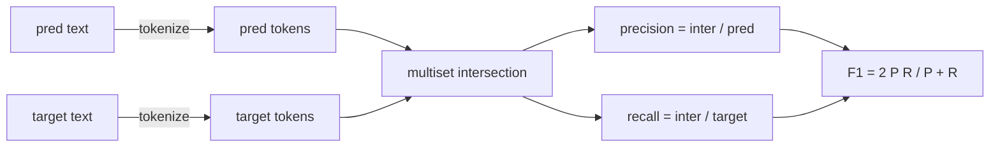
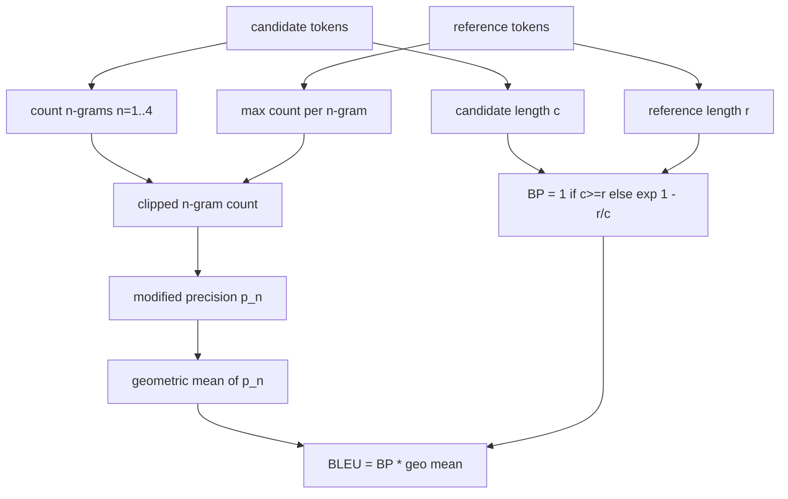

# Les métriques classiques

> BLEU, ROUGE-L, F1, correspondance exacte, précision. Cinq indicateurs qui représentent toujours la plupart des numéros d'évaluation du LLM publiés.

**Type:** Build
**Languages:** Python
**Prerequisites:** Phase 19 Track B foundations, lesson 70
**Time:** ~90 min

## Objectifs d'apprentissage

- Implémenter la correspondance exacte au niveau des jetons, F1, et la précision avec des règles explicites de jetonisation.
- Implémentation BLEU-4 à partir de zéro: précision n-gramme modifiée, moyenne géométrique sur n égale 1 à 4, pénalty de breveté.
- Implémenter ROUGE-L en utilisant la plus longue sous-sequence commune, avec combinaison F-beta de précision et de rappel.
- Envoyez le champ metric_name de la leçon 70 pour que le coureur reste métrique-agnostique.
- Fixer le comportement avec des vecteurs de référence tirés d'exemples travaillés, et non d'une bibliothèque tierce.

```figure
cd-bleu-overlap
```

## Pourquoi la réimplémentation

Vous allez lire des articles qui rapportent BLEU 28.3 et un autre qui rapporte BLEU 0.283. Vous trouverez des scores ROUGE-L qui diffèrent de dix points dans deux bibliothèques parce qu'une court à minuscules et l'autre ne le fait pas. Le moyen le plus rapide d'arrêter de se confondre est d'écrire vous-même les métriques, puis de pointer vers la ligne où le tokenizer est décidé et la ligne où le lissage est appliqué. Après cela, comparer les chiffres entre les documents devient une question de lecture de la configuration métrique, pas de débat sur les bibliothèques.

Le code est un code de code de code de code de code de code de code de code de code de code de code de code de code de code de code de code de code de code de code de code de code de code de code de code de code de code de code de code de code de code de code de code de code de code de code de code de code de code de code de code de code de code de code de code de code de code de code de code de code de code de code de code de code de code de code de code de code de code de code de code de code de code de code de code de code de code de code de code de code de code de code de code de code de code de code de code de code de code de code de code de code de code de code de code de code de code de code de code de code de code de code de code de code de code de code de code de code de code de code de code de code de code de code de code de code de code de code de code de code de code de code de code de code de code de code de code de code de code de code de code de code de code de code de code de code de code de code de code de code de code de code de code de code de code de code de code de code de code de code de code de code de code de code de code de code de code de code de code de code de code de code de code de code de code de code de code de code de code de code de code de code de code de code de code de code de code de code de code de code de code de code de code de code de code de code de code de code de code de code de code de code de code de code de code de code de code de code de code de code de code de code de code de code de code de code de code de code de code de code de code de code de code de code de code de code de code de code de code de code de code de code de code de code de code de code de code de code de code de code de code de code de code de code de code de code de code de code de code de code de code de code de code de code de code de code de code de code de code de code de code de code de code de code de code de code de code de code de code de code de code de code de code de code de

## Les démarches

Le jeton est `re.findall(r"\w+", text.lower())`- les courriers minuscules, alphanumériques, la ponctuation de la chute. chaque métrique dans cette leçon utilise exactement ce jeton. le coureur ne peut pas choisir. si vous échangez des jetons, vous exécutez un autre point de référence.

```python
TOKEN_RE = re.compile(r"\w+", re.UNICODE)
def tokenize(text):
    return TOKEN_RE.findall(text.lower())
```

C'est une simplification délibérée. Les configurations de production se soucieront de CJK, de contractions et d'identifiants de code.

## - C' est exact.

```python
def exact_match(pred, targets):
    return float(any(pred.strip() == t.strip() for t in targets))
```

Il renvoie 1,0 ou 0,0 par tâche. L'agrégat sur un ensemble de données est la moyenne.

## Le niveau de jeton F1

Configurez le multisette de jeton pour la prédiction et la cible. La précision est l'intersection du multisette divisée par le multisette de la prédiction. Le rappel est la même intersection divisée par le multisette de la cible. F1 est la moyenne harmonieuse. La mise en œuvre traite les cas de prédiction vide et de bord de cible vide.



Pour les tâches multi-objectifs, nous prenons la meilleure F1 au-dessus de la liste cible. Cela correspond au comportement de style SQuAD largement rapporté dans la littérature.

## Le projet de loi

La formule que nous utilisons est BLEU-4 au niveau du corpus avec la pénalité de breveté standard et le doucement additif-un sur les n-grammes modifiés, de sorte qu'un seul 4 grammes manquants ne pousse pas le score à zéro.

Pour chaque paire de référence de candidat, nous comptons la précision n-gramme modifiée pour n égale 1, 2, 3, 4. La précision modifiée clipe le nombre n-gramme du candidat par le nombre maximum de n-gramme dans n-une référence, de sorte qu'un candidat ne peut pas gonfler en répétant une phrase. La moyenne géométrique sur les quatre précisions est enveloppée par la peine de breveté.



La règle de l'allégement est celle que Lin et Och appellent la méthode 1: ajouter un au numérateur et au dénominateur de chaque n-gramme de précision avant de prendre le journal.`log 0`lorsqu'une référence n'a pas de correspondance de 4 grammes et reste proche de la valeur non nettoyée sur les candidats longs.

## ROSS-L

ROUGE-L compare la plus longue sous-sequence commune des séquences de jetons de référence et de candidat. Le LCS capture l'ordre des mots sans forcer la contiguibilité, c'est pourquoi il s'agit de la métrique de résumé par défaut.`lcs / reference length`, précision comme `lcs / candidate length`, et combiner avec F-beta où la bêta est égale à une pour la forme symétrique F1.

```python
def lcs_length(a, b):
    n, m = len(a), len(b)
    dp = numpy.zeros((n + 1, m + 1), dtype=int)
    for i in range(n):
        for j in range(m):
            if a[i] == b[j]:
                dp[i+1, j+1] = dp[i, j] + 1
            else:
                dp[i+1, j+1] = max(dp[i+1, j], dp[i, j+1])
    return int(dp[n, m])
```

La table numpy rend l'implémentation lisible; les listes Python pures fonctionneraient aussi. Les tâches qui optent pour ROUGE-L paient le coût O(n) par tâche. Pour les longueurs de résumé typiques qui restent inférieures à une milliseconde.

## La précision

Pour les tâches de classification multi-objectifs, la précision est réduite à une correspondance exacte avec une seule cible normalisée.`metric_name`sans passer par des comparaisons de chaîne à l'intérieur du coureur.

## Contrat d'expédition

Le point d'entrée unique est `score(metric_name, prediction, targets)`Il renvoie un flot dans`[0, 1]`Le coureur ne se branche pas sur le nom métrique. Il dépose l'appel et écrit le résultat. C'est la surface que la leçon 75 coller à la spécification de la tâche de la leçon 70.

```python
def score(metric_name, pred, targets):
    if metric_name == "exact_match":
        return exact_match(pred, targets)
    if metric_name == "f1":
        return max(f1_score(pred, t) for t in targets)
    if metric_name == "bleu_4":
        return max(bleu4(pred, t) for t in targets)
    if metric_name == "rouge_l":
        return max(rouge_l(pred, t) for t in targets)
    if metric_name == "accuracy":
        return accuracy(pred, targets)
    raise ValueError(f"unknown metric_name: {metric_name}")
```

`code_exec`est traité dans la leçon 72 et inséré dans le dispatcher là-bas.

## Ce que cette leçon ne fait pas

Il n'appelle pas un modèle. Il ne normalise pas les générations au-delà de ce que les règles post-processus de la leçon 70 ont déjà fait. Il ne calcule pas les intervalles de confiance. Il ne fait pas BLEURT ou BERTScore (ils ont besoin d'un modèle et vivent dans une leçon différente).

## Comment lire le code

`main.py`Les vecteurs de référence sont situés dans la`_reference_examples`La démo fait le dépêcheur avec huit exemples et imprime des scores par métrique.`code/tests/test_metrics.py`Enfoncer les vecteurs de référence et souligner chaque cas de bord (prédiction vide, référence vide, aucun jeton partagé, correspondance exacte, coupure répétée de phrase).

Lire `main.py`Les fonctions sont ordonnées par complexité. exact_match et précision sont une ligne chacune. F1 est six lignes. BLEU et ROUGE-L sont les parties lourdes et elles incluent des commentaires détaillés sur la règle de lissage et la récurrence de LCS.

## On va plus loin

Les métriques classiques sont nécessaires, pas suffisantes. Elles récompensent la superposition de surface et manquent de sens. La solution est de mettre des métriques basées sur le modèle en haut (BLEURT, BERTScore, GEval) une fois que vous avez confiance dans le sol classique. C'est une leçon ultérieure. Pour l'instant: faire fonctionner ces cinq, les pincer avec des tests, et vous avez une pile de métriques qui est auditable, rapide et reproduisable.
