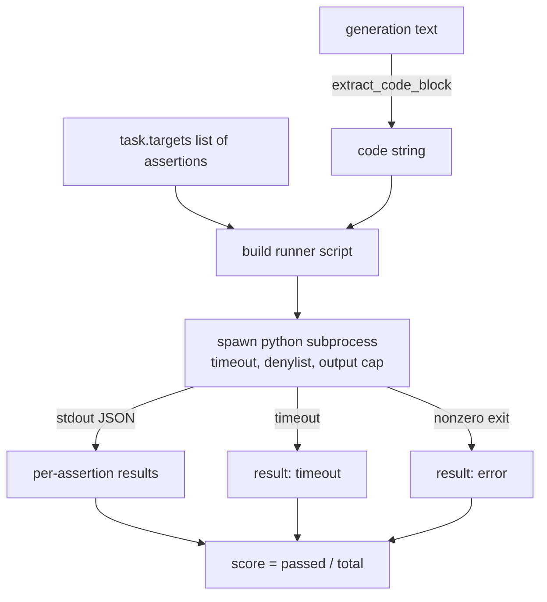
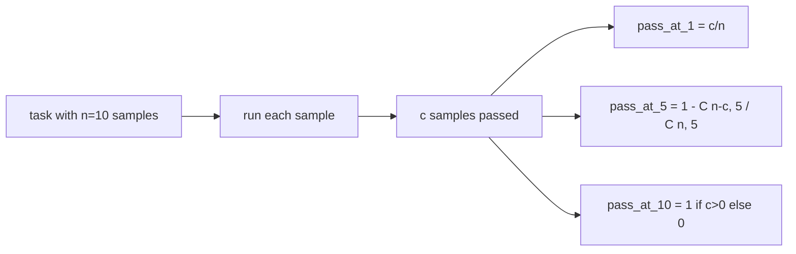

# Codes de métrique exécutive

> Le code généré est correct quand il passe les tests. L'harnais d'évaluation doit extraire le code, l'exécuter sans écraser l'hôte, et compter les taux de réussite honnêtement. Cette leçon construit cette surface.

**Type:** Build
**Languages:** Python
**Prerequisites:** Phase 19 Track B foundations, lessons 70 and 71
**Time:** ~90 min

## Objectifs d'apprentissage

- Extraire un bloc de code d'une génération de forme libre d'une manière qui correspond à la règle post-processus de la leçon 70.
- Exécuter le code candidat dans un sous-processus isolé avec un délai de temps de l'horloge de mur, un plafond de sortie et une liste de dényl import.
- Marquer une tâche en tant que fraction des chaînes d'affirmations fournies qui passent contre le candidat.
- Compute le pass-at-k pour les tâches qui prennent plusieurs générations d'un modèle.
- Traiter les pannes de la boîte à sable, les erreurs de syntaxe et les délais comme des modes d'échec de première classe avec des codes de sortie distincts que le coureur peut enregistrer.

```figure
sandbox-runner
```

## Pourquoi un sous-processus isolé

En ligne`exec`La mise en œuvre de la politique de sécurité et de la stabilité est un danger pour la sécurité et la stabilité.`while True: pass`Il bloque l'évaluation pour toujours.`import shutil; shutil.rmtree('/')`Le problème est de générer un nouvel interprète Python par candidat, de passer le code sur stdin, d'écrire les résultats de l'affirmation à stdout, et de tuer le processus si il dépasse.

Les évaluations réelles comme HumanEval, MBPP, BigCodeBench et LiveCodeBench utilisent toutes une sous-boîte de sandbox de sous-processus. Certaines couches Docker en haut. Nous nous arrêtons au sous-processus pour une raison: il est portable, il est stdlib, et il capture les modes d'échec qui comptent pour l'évaluation éducative. Les déploiements de production ajoutent seccomp, l'isolement du réseau et un système de fichiers uniquement lu.

## La forme d'une tâche d'exécution de code

Une .`code_exec`tâche porte des chaînes d' affirmation dans `targets`Le coureur extrait un bloc de code clôturé de la génération, construit un harnais d'essai autour de lui, et exécute le résultat.



Le score est une fraction de `[0, 1]`. Une tâche avec trois affirmations où deux passes marquent 0,667. Le coureur retourne la même forme, peu importe ce qui échoue: les chocs du sous-processus sont mappés à un code d'erreur normalisé, pas un traceback Python qui se déploie jusqu'au harnais.

## Le dényliste

Avant d'exécuter le code candidat, le script de course réécrit les importations de modules dangereux à un bloc qui soulève `ImportError("denied")`La liste est délibérément conservatrice:`os.system`- Je suis là .`subprocess`- Je suis là .`socket`- Je suis là .`requests`- Je suis là .`urllib`- Je suis là .`urllib.request`- Je suis là .`urllib.error`- Je suis là .`urllib.parse`- Je suis là .`ctypes`- Je suis là .`shutil`- Je suis là .`http.client`- Je suis là .`asyncio.subprocess`- Je suis désolé .

Nous ne prétendons pas que c'est étanche. Un code adversaire déterminé peut échapper à toute boîte à sable en cours de processus en Python. Le denylist est un backstop. Le temps de décalage du mur et le plafond de sortie sont les commandes de charge.

```python
DENIED = {
    "os.system": True,
    "subprocess": True,
    "socket": True,
    "shutil": True,
    "requests": True,
    "urllib": True,
    "ctypes": True,
}
```

Nous envelopper le candidat en prépendant `import sys`et un gardien qui patche les singes`os.system`Le modèle complet est en`main.py`- Je suis désolé .

## Temps de réparation

Chaque sous-processus a un budget par défaut de trois secondes.`subprocess.run(..., timeout=t)`Si le temps d'arrêt est en train de décoller, le coureur prend.`TimeoutExpired`, tue le processus, et enregistre un`timeout`Le coureur passe à zéro, le coureur passe à zéro.

Le temps de retrait est configurable par tâche à travers `task.metadata.timeout_s`Les tests d'unité à long terme peuvent demander plus; le validateur de la leçon 70 limite la valeur à trente secondes pour garder la suite limitée.

## Caps de sortie

Le sous-processus peut inonder le stdout, épuisant la mémoire de l'hôte. Le coureur transmet le stdout dans un tampon et tue l'enfant dès que le total en cours de fonctionnement atteint 256 KB. Le résultat est enregistré comme `exit_code = error`avec la chaîne de détails `"output overflow"`Cela apparaît dans la pratique quand une génération écrit accidentellement une boucle infinie qui imprime.

## Passer à K

Pass-at-k est l'estimation impartiale utilisée par HumanEval et ses amis.`n`échantillons indépendants par tâche et `c`de leur passage, la probabilité que l'échantillon de taille `k`de la `n`contient au moins une solution de passage:

```
pass_at_k(n, c, k) = 1 - C(n - c, k) / C(n, k)
```

Quand ?`n - c < k`le numérateur est indéfini et la valeur est `1`La mise en œuvre traite directement le cas de bord.`pass_at_k(n, c, k)`pour une utilisation par la couche de classement dans la leçon 74.



## Codes de sortie

Le coureur retourne un des cinq résultats par tâche:

- `pass`quand chaque affirmation aura été dépassée.
- `assertion_fail`quand le code a été mis en marche mais au moins une affirmation a échoué.
- `syntax_error`lorsque le code n'a pas été importé ou a eu une erreur de syntaxe.
- `timeout`quand l'horloge du mur a expiré.
- `error`pour tout autre accident, y compris les coups de denyliste et le débordement de sortie (surfaces de débordement avec précision `"output overflow"`)

Le code de sortie est des métadonnées. Les leçons en aval peuvent décider si un temps d'arrêt est compté comme zéro ou comme des données manquantes.

## Ce que cette leçon ne fait pas

Il ne vous donne pas une vraie boîte à sable. Il ne gère pas de code non fiable depuis le web ouvert. Il ne gère pas de tâches étatiques comme le fichier I/O ou les appels réseau. Ceux-ci ont besoin d'un conteneur ou d'une microVM. Le but de cette leçon est le contrat: un sous-processus isolé, un denyliste, un délai, une plaque de sortie, un vocabulaire de code de sortie propre et mathématiques de pass-at-k.

## Comment lire le code

`main.py`définit `extract_code`- Je suis là .`run_candidate`- Je suis là .`score_code_exec`, et `pass_at_k`Le script de sous-processus est construit en tant que chaîne et passé en tant que `-c`Les tests en sont en cours.`code/tests/test_exec.py`Exercer les quatre codes de sortie plus le pass-at-k contre les exemples travaillés tirés du style HumanEval.

Lire `main.py`Le modèle de coureur est la pièce porteuse. Regardez la boucle d'affirmation jusqu'à ce que vous puissiez prédire l'enveloppe JSON qu'elle écrit vers le processus parent.

## On va plus loin

Une fois que la forme du sous-processus fonctionne, la prochaine préoccupation est la portabilité. Les différentes versions de Python gèrent SIGKILL différemment sur Windows. Le meilleur moyen est de mettre le coureur dans une image de Docker. La prochaine chose après cela est de remplacer les chaînes d'affirmation par des fichiers de test d'unité réels afin que l'évaluation correspond à ce que fait le CI de production. Arrêtez d'appeler les tests de chaînes d'affirmation à ce stade; ce sont des tests de jouets et ils ont des modes de défaillance de jouets.
