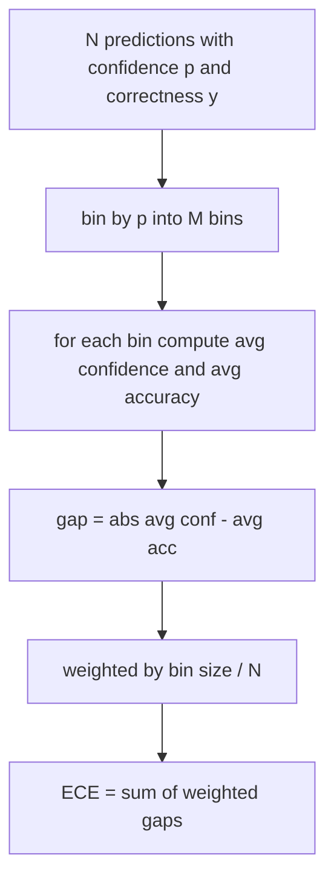
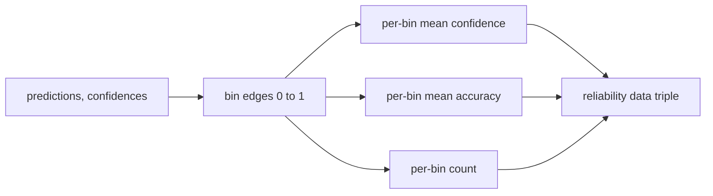

# Perplexité et calibration

> Si votre modèle dit qu'il a 90% confiance dans mille réponses et qu'il a 600 bonnes, il n'est pas bien calibré. La calibration est la moitié de l'évaluation fiable. L'autre moitié est la perplexité, ce qui vous indique si le modèle pense que le texte retenu est plausible.

**Type:** Build
**Languages:** Python
**Prerequisites:** Phase 19 Track B foundations, lessons 70 and 71
**Time:** ~90 min

## Objectifs d'apprentissage

- Compute la perplexité au niveau des jetons sur un corpus détenu à partir des probabilités de logs négatifs des jetons fournies par l'adaptateur de modèle.
- Comptez l'erreur d'étalonnage attendue (ECE) d'un classifiateur ou d'une évaluation à choix multiples à partir de probabilités prévues.
- Comptez le score Brier (erreur moyenne carré par rapport à l'indicateur de précision) et expliquez quand il fait ce que l'ECE ne fait pas.
- Construire les données du diagramme de fiabilité nécessaires pour tracer une courbe de confiance contre précision.
- Mettez les trois dans le harnais d' évaluation pour que le coureur puisse attacher .`perplexity`- Je suis là .`ece`, et `brier`les numéros d'un rapport modèle.

```figure
cd-reliability-diagram
```

## Que vous dit la perplexité ?

La perplexité est la probabilité de log négatif moyenne exponentiée par jeton. Plus bas, c'est mieux. Une perplexité de un signifie que le modèle attribue une probabilité à chaque jeton réel. Une perplexité de la taille du vocabulaire signifie que le modèle est uniforme et n'a rien appris. Les chiffres réels se situent entre les deux: un modèle de base fort de 2026 sur WikiText-103 se situe entre huit et douze. Une mauvaise sur le même texte est à cinquante plus.

Le harnais ne compte pas les probabilités de log lui-même. Ceux-ci proviennent de l'adaptateur de modèle. Les agrégats du harnais: il prend une liste de probabilités de log par jeton, une liste de comptes de jetons par séquence, et renvoie la perplexité du corpus.

```python
def perplexity(neg_log_probs, token_counts):
    total_nll = sum(neg_log_probs)
    total_tokens = sum(token_counts)
    return math.exp(total_nll / total_tokens)
```

La mise en œuvre traite des cas de bord de jeton zéro et affirme que les probabilités de log négatives ne sont pas négatives.`log p`Au lieu de `-log p`La fonction le prend comme une violation de contrat.

## Quelles mesures la CEE prend

Les erreurs d'étalonnage attendues regroupent les prédictions par leur confiance dans un nombre fixe de poubelles, puis mesurent l'écart moyen entre la confiance et la précision entre les poubelles, pondéré par la taille de la poubelle.



La formule standard utilise dix poubelles de largeur égale sur `[0, 1]`La mise en œuvre prend en charge tout nombre entier positif.`bins`Paramètre permettant au coureur de choisir entre la convention de publication (10) et la convention de comparaison (15).

L'ECE est biaisée par le nombre de poubelles et la taille de l'échantillon. Avec dix poubelles et une centaine de prédictions, vous ne pouvez pas distinguer 0,02 ECE du bruit aléatoire.

## Quel score Brier donne que l'ECE ne donne pas

L'ECE ne se soucie que des lacunes moyennes. Un modèle qui est trop confiant sur la moitié des poubelles et peu confiant sur l'autre moitié peut avoir une faible ECE tout en étant mal calibré localement.

Pour les résultats binaires, Brier est `mean((p_i - y_i)^2)`Il se décompose en fiabilité, résolution et incertitude. On calcule le score et la décomposition. Le coureur rapporte le scalaire mais enregistre la décomposition pour le tableau de bord.

```python
def brier(p, y):
    return float(np.mean((p - y) ** 2))
```

## Données du diagramme de fiabilité

Un diagramme de fiabilité prédit la confiance contre la précision empirique dans chaque bin. La diagonale est une calibration parfaite. La fonction renvoie trois matrices: confiance moyenne par bin, précision moyenne par bin et nombre par bin. Le code de plotting vit en aval; cette leçon s'arrête à la forme des données.



Le tuple retourné est ce dont une couche d'appel a besoin pour dessiner la trace ou calculer une variante ECE personnalisée (ECE adaptative, ECE balayage, etc.). Nous retournons des matrices numpy afin que le code en aval ne doit pas être converti.

## Sources de confiance

Le harnais ne suppose pas que la confiance provienne de softmax.`[0, 1]`Pour les tâches à choix multiples, la confiance naturelle est `softmax over option log-likelihoods`Pour le texte libre, la confiance naturelle est la probabilité auto-déclarée du modèle ou l'exponentiel de la probabilité moyenne du journal.

## Cas de bord

- Toutes les prédictions sont fausses: ECE est la confiance moyenne, Brier est élevé, la perplexité est ce que le modèle pense du texte.
- Toutes les prédictions sont correctes avec une grande confiance: ECE près de zéro, Brier près de zéro.
- Prédicteur parfaitement incertain à p = 0,5: ECE est de 0,5 moins la précision, Brier est de 0,25 moins un terme de correction.
- Entrée vide: retour de la CEE, de la Brier et de la fiabilité `0.0`(ou des matrices remplies de zéro).`NaN`Pour le cas de jetons zéro, aucun de ces chemins n'émet un avertissement; le coureur inspecte les valeurs et décide de signaler ou de sauter.

Un vrai modèle sur un vrai point de référence ne les touchera pas, mais un adaptateur de buggy ou un échantillon minuscule le fera, et le coureur ne devrait pas s'écraser.

## Envoi

La calibration n'est pas une métrique par tâche comme F1.`(confidence, correct)`Les données de la valeur de la valeur de la valeur de la valeur de la valeur de la valeur de la valeur de la valeur de la valeur de la valeur de la valeur de la valeur de la valeur de la valeur de la valeur de la valeur de la valeur de la valeur de la valeur de la valeur de la valeur de la valeur de la valeur de la valeur de la valeur de la valeur de la valeur de la valeur de la valeur de la valeur de la valeur de la valeur de la valeur de la valeur de la valeur de la valeur de la valeur de la valeur de la valeur de la valeur de la valeur de la valeur de la valeur de la valeur de la valeur de la valeur de la valeur de la valeur de la valeur de la valeur de la valeur de la valeur de la valeur de la valeur de la valeur de la valeur de la valeur de la valeur de la valeur de la valeur de la valeur de la valeur de la valeur de la valeur de la valeur de la valeur de la valeur de la valeur de la valeur de la valeur de la valeur de la valeur de la valeur de la valeur de la valeur de la valeur de la valeur de la valeur de la valeur de la valeur de la valeur de la valeur de la valeur de la valeur de la valeur de la valeur de la valeur de la valeur de la valeur de la valeur de la valeur de la valeur de la valeur de la valeur de la valeur de la valeur de la valeur de la valeur de la valeur de la valeur de la valeur de la valeur de la valeur de la valeur de la valeur de la valeur de la valeur de la valeur de la valeur de la valeur de la valeur de la valeur de la valeur de la valeur de la valeur de la valeur de la valeur de la valeur de la valeur de la valeur de la valeur de la valeur de la valeur de la valeur de la valeur de la valeur de la valeur de la valeur de la valeur de la valeur de la valeur de la valeur de la valeur de la valeur de la valeur de la valeur de la valeur de la valeur de la valeur de la valeur de la valeur de la valeur de la valeur de la valeur de la valeur de la valeur de la valeur de la valeur de la valeur de la valeur de la valeur de la valeur de la valeur de la valeur de la valeur de la valeur de la valeur de la valeur de la valeur de la valeur de la valeur de la valeur de la valeur de la valeur de la valeur de la valeur de la valeur de la valeur de la valeur de

L'interface est:

```python
report = CalibrationReport.from_predictions(confidences, correct)
report.ece          # float
report.brier        # float
report.reliability  # tuple of three numpy arrays
report.populated_bins  # int
```

`PerplexityResult.from_token_nll(neg_log_probs, token_counts)`renvoie la perplexité et la probabilité moyenne négative de log par jeton.

## Ce que cette leçon ne fait pas

Il n'appelle pas un modèle. Il ne met pas en œuvre softmax. Il n'estime pas la confiance des jetons de sortie; c'est le travail de l'adaptateur. Il ne fait pas d'échelle de température ou d'échelle Platt; ce sont des corrections post-hoc qui vivent dans une leçon différente.

## Comment lire le code

`main.py`définit `perplexity`- Je suis là .`expected_calibration_error`- Je suis là .`brier_score`- Je suis là .`reliability_diagram`, et le `CalibrationReport`- Je suis là .`PerplexityResult`Les tests de la première phase de la recherche ont été réalisés en fonction de la qualité des données.`code/tests/test_calibration.py`Enregistrez chaque boîtier de bord plus les valeurs de référence pour les prédicteurs synthétiques.

Lire `main.py`La fonction d'ordre va de scalaire à vecteur pour rendre compte. chaque fonction a une courte chaîne de documents avec les mathématiques et le contrat.

## On va plus loin

L'étalonnage est l'axe le plus ignoré dans l'évaluation publiée. La plupart des classements rapportent un seul numéro de précision et le qualifient de fait. Un modèle qui gagne sur la précision et perd sur Brier est un déploiement de production pire qu'un modèle qui marque quelques points de moins sur la précision mais qui rapporte de manière fiable son incertitude. Une fois que vous avez mis en place le plomberie d'étalonnage, ajoutez une échelle de température sur une tranche de validation prolongée, recomptez l'ECE et observez la réduction de l'écart. C'est une leçon distincte, mais le sol vit ici.
