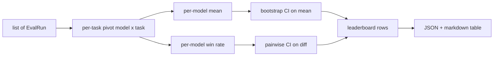
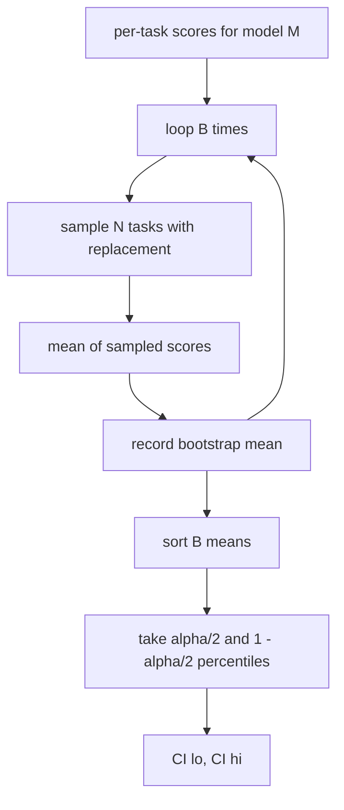

# Aggrégation du tableau de bord

> Les résultats par tâche sont faciles. Les classements par modèle sur des tâches hétérogènes sont plus difficiles. La signification statistique sur le classement des milliers de prédictions est la partie que tout le monde saute. Cette leçon ne la saute pas.

**Type:** Build
**Languages:** Python
**Prerequisites:** Phase 19 Track B foundations, lessons 70, 71, 73
**Time:** ~90 min

## Objectifs d'apprentissage

- Aggreger les scores par tâche sur plusieurs modèles et multiples tâches dans une rangée ordonnée par modèle.
- Normaliser les scores hétérogènes afin que les taux de réussite et les valeurs BLEU ne surinfluent pas l'agrégat.
- Remplissez les modèles par moyenne et par taux de gain, et expliquez quand chacun est le bon résumé.
- Compute les intervalles de confiance de la bande de démarrage sur le score moyen par modèle et sur les différences par paires.
- Sortez le tableau de classement en tant que rapport JSON et en tant que table de repérage, le coureur de la leçon 75 peut coller dans un commentaire CI.

```figure
ci-leaderboard-ci
```

## La forme de l'entrée

L'agrégateur consomme une liste de `EvalRun`les dossiers:

```python
@dataclass
class EvalRun:
    model_id: str
    task_id: str
    metric_name: str
    score: float          # in [0, 1]
    category: str
```

Le coureur de la leçon 75 émet un record par`(model, task)`L'agrégateur ne se soucie pas de la façon dont le score a été produit, il s'attend à ce que la normalisation ait déjà eu lieu: chaque score est en`[0, 1]`- Je suis désolé .

## Les résultats

Trois tables sont mises en place:



La rangée du tableau de classement contient: `model_id`- Je suis là .`mean_score`- Je suis là .`mean_ci_lo`- Je suis là .`mean_ci_hi`- Je suis là .`win_rate`- Je suis là .`tasks_completed`, et une option `categories`carte pour la moyenne par catégorie.

## Normalité

Si une tâche réussit`[0, 1]`et un autre en `[0, 100]`L'agrégateur valide que chaque score d'entrée est en`[0, 1]`La fixation est en amont: la métrique doit déjà retourner une fraction. les leçons 71 à 73 appliquent ce contrat.

## Moyen et taux de gain

Les deux systèmes de classement servent des objectifs différents.

Le score moyen est la moyenne des scores par tâche pour un modèle. Il s'agit du rapport des classements de tête. Il est sensible aux valeurs anormales et aux déséquilibres de tâches.

Le taux de victoire compte la fréquence avec laquelle un modèle bat tous les autres modèles sur la même tâche. Pour chaque tâche, le modèle avec le score le plus élevé gagne (spartie de liens). Le taux de victoire est égal aux gains divisés par le nombre de tâches où le modèle a un score. Il est moins sensible aux valeurs et aux différences d'échelle, mais perd de l'information.

```python
def win_rate(model_id, runs_by_task, all_models):
    wins, total = 0, 0
    for task_id, runs in runs_by_task.items():
        scores = {r.model_id: r.score for r in runs if r.model_id in all_models}
        if model_id not in scores:
            continue
        total += 1
        best = max(scores.values())
        if scores[model_id] >= best:
            wins += 1
    return wins / total if total else 0.0
```

Le harnais rapporte les deux. Le coureur de la leçon 75 se classe par moyenne par défaut; la colonne de repérage pour le taux de gain est juste là si l'utilisateur le préfère.

## Intervalles de confiance de démarrage

Les moyens par modèle sont fournis avec un intervalle de confiance estimé par bootstrap repensant sur les tâches.`B`Les temps de l'intervalle de l'intervalle de l'intervalle de l'intervalle de l'intervalle de l'intervalle de l'intervalle de l'intervalle de l'intervalle de l'intervalle de l'intervalle de l'intervalle de l'intervalle de l'intervalle de l'intervalle de l'intervalle de l'intervalle de l'intervalle de l'intervalle de l'intervalle de l'intervalle de l'intervalle de l'intervalle de l'intervalle de l'intervalle de l'intervalle de l'intervalle de l'intervalle de l'intervalle de l'intervalle de l'intervalle de l'intervalle de l'intervalle de l'intervalle de l'intervalle de l'intervalle de l'intervalle de l'intervalle de l'intervalle de l'intervalle de l'intervalle de l'intervalle de l'intervalle de l'intervalle de l'intervalle de l'intervalle de l'intervalle de l'intervalle de l'intervalle de l'intervalle de l'intervalle de l'intervalle de l'intervalle de l'intervalle de l'intervalle de l'intervalle de l'intervalle de l'intervalle de l'intervalle de l'intervalle de temps`alpha`- Je suis désolé .



Pour les comparaisons par paires, nous démarrons la différence par tâche `score_A - score_B`L'utilisateur lit si l'intervalle exclut le zéro. Si c'est le cas, la différence est significative au niveau alpha. Si ce n'est pas le cas, le tableau de classement traite les modèles comme étant égal.

Les aides de bas niveau (`bootstrap_mean_ci`- Je suis là .`bootstrap_pairwise_diff`) défaut à `B=1000`Les agrégateurs publics (`aggregate`- Je suis là .`pairwise_diffs`) défaut à `b=500`La leçon maintient le bootstrap pur numpy, pas de scipy.

## Catégories

Si vous`EvalRun.category`L'agrégateur rapporte également la moyenne par catégorie.`math`- Je suis là .`reasoning`- Je suis là .`code`- Je suis là .`safety`Il permet au coureur de déterminer si un modèle est globalement bon mais faible en code, ce qui est l'information que le titre signifie.

## Rendering à la démarque

Le tableau de classement est présenté sous forme de tableau de répercussion:

```text
| Rank | Model | Mean | 95% CI | Win rate | Tasks |
|------|-------|------|--------|----------|-------|
| 1    | gpt   | 0.78 | 0.74-0.82 | 0.62 | 50 |
| 2    | claude| 0.75 | 0.71-0.79 | 0.34 | 50 |
| 3    | random| 0.10 | 0.07-0.13 | 0.04 | 50 |
```

La table est triée par score moyen. L'IC est rendu à deux décimales. Les longs modèles d'identification sont tronqués à vingt caractères.

## Ce que cette leçon ne fait pas

Il n'exécute pas de modèles. Il n'appelle pas la couche métrique. Il ne met pas en œuvre ECE adaptatif ou d'autres variantes d'étalonnage; ce sont les leçons 73. Il n'implique pas de pondération de tâches. Chaque tâche compte ici de la même manière.`weight`En plus de la valeur de la valeur de la valeur de la valeur de la valeur de la valeur de la valeur de la valeur de la valeur de la valeur de la valeur de la valeur de la valeur de la valeur de la valeur de la valeur de la valeur de la valeur de la valeur de la valeur de la valeur de la valeur de la valeur de la valeur de la valeur de la valeur de la valeur de la valeur de la valeur de la valeur de la valeur de la valeur de la valeur de la valeur de la valeur de la valeur de la valeur de la valeur de la valeur de la valeur de la valeur de la valeur de la valeur de la valeur de la valeur de la valeur de la valeur de la valeur de la valeur de la valeur de la valeur de la valeur de la valeur de la valeur de la valeur de la valeur de la valeur de la valeur de la valeur de la valeur de la valeur de la valeur de la valeur de la valeur de la valeur de la valeur de la valeur de la valeur de la valeur de la valeur de la valeur de la valeur de la valeur de la valeur de la valeur de la valeur de la valeur de la valeur de la valeur de la valeur de la valeur de la valeur de la valeur de la valeur de la valeur de la valeur de la valeur de la valeur de la valeur de la valeur de la valeur de la valeur de la valeur de la valeur de la valeur de la valeur de la valeur de la valeur de la valeur de la valeur de la valeur de la valeur de la valeur de la valeur de la valeur de la valeur de la valeur de la valeur de la valeur de la valeur de la valeur de la valeur de la valeur de la valeur de la valeur de la valeur de la valeur de la valeur de la valeur de la valeur de la valeur de la valeur de la valeur de la valeur de la valeur de la valeur de la valeur de la valeur de la valeur de la valeur de la valeur de la valeur de la valeur de la valeur de la valeur de la valeur de la valeur de la valeur de la valeur de la valeur de la valeur de la valeur de la valeur de la valeur de la valeur de la valeur de la valeur de la valeur de la valeur de la valeur de la valeur de la valeur de la valeur de la valeur de la valeur de la valeur de la valeur de la valeur de la valeur de la valeur de la valeur de la valeur de la valeur de la valeur de la valeur de la valeur de la valeur de la valeur de la valeur de

## Comment lire le code

`main.py`définit `EvalRun`- Je suis là .`LeaderboardRow`- Je suis là .`aggregate`- Je suis là .`bootstrap_mean_ci`- Je suis là .`bootstrap_pairwise_diff`, et `render_markdown`La démo construit une suite synthétique de trois modèles et douze tâches, les agrégats et imprime le tableau de classement plus la table des différences par paires.`code/tests/test_leaderboard.py`- le boots, le rendu de la mise en marche, les cas de bord de la vitesse de gain et le comportement de l'entrée vide.

Lire `main.py`La forme des données (EvalRun, LeaderboardRow) arrive en premier, l'agrégateur après, le bootsstrap troisième, le rendu dernier.

## On va plus loin

La prochaine étape naturelle est la signification des tâches partagées au lieu de la bande de démarrage non partagée. Si le modèle A et B exécutaient tous les deux les mêmes centaines de tâches, le test approprié est le démarrage par paires sur les différences tâche par tâche, que nous mettons en œuvre. Au-delà de cela, vous voulez un bootstrap hiérarchique qui respecte les familles de tâches (les problèmes mathématiques ne sont pas indépendants les uns des autres; un schéma d'erreur arithmétique affecte dix d'entre eux). C'est une suite. Le but de cette leçon est de bien faire le plancher pour que l'évaluation rapporte un nombre que vous pouvez défendre.
