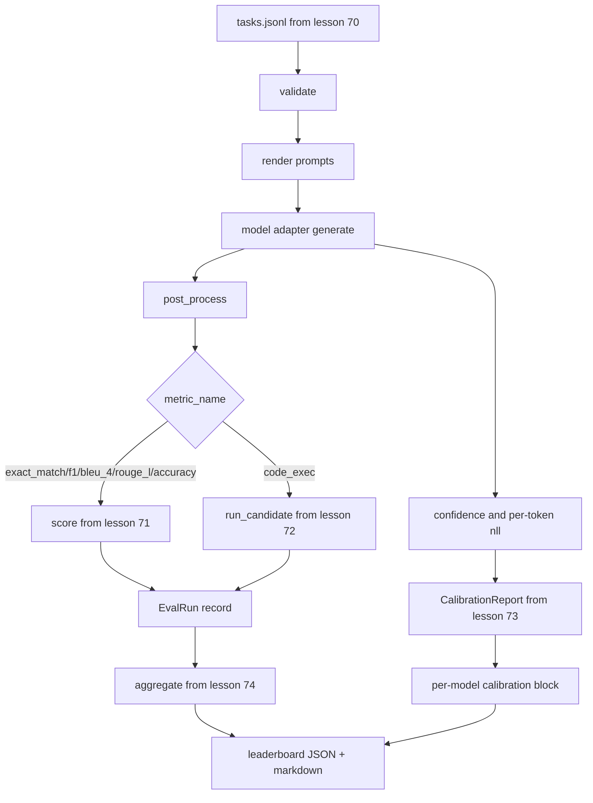

# Coureur de bout en bout

> Le coureur lit le modèle de tâche de la leçon 70, appelle un modèle à travers un adaptateur, marque avec les leçons 71 et 72, attache le rapport d'étalonnage de la leçon 73, et émet le tableau de classement de la leçon 74.

**Type:** Build
**Languages:** Python
**Prerequisites:** Phase 19 Track B foundations, lessons 70 through 74
**Time:** ~90 min

## Objectifs d'apprentissage

- Définir un `ModelAdapter`interface que tout modèle (mock, local, API) peut satisfaire avec une petite surface de méthode.
- Exécutez l'évaluation sur un fichier JSONL fixe avec exécution parallèle de tâches sur un pool de travailleurs.
- Composer la couche métrique (exact_match, F1, BLEU-4, ROUGE-L, code_exec) avec la couche d'étalonnage en un seul passage.
- Émission par modèle `EvalRun`les enregistrer et les faire entrer directement dans l'agrégateur du classement.
- Expédier un rapport JSON et une table de démarrage; se terminer avec une sortie zéro sur une exécution propre, non zéro sur la validation ou l'échec de l'exécution.

```figure
eval-grid
```

## Le pipeline



Le coureur est le point d'intégration. Chaque leçon 70 à 74 possède un module que le coureur compose. Le coureur ne duplique aucune logique de ces modules: il les importe.

## L'interface de l'adaptateur

L'adaptateur est la couture entre le coureur et tout modèle.

```python
class ModelAdapter:
    model_id: str

    def generate(self, prompt: str, task: TaskSpec) -> Generation: ...
```

`Generation`est une classe de données avec:

- `text`: la sortie en forme libre du modèle
- `confidence`: un flot dans`[0, 1]`représentant la probabilité de réponse de l'auto-rapport du modèle
- `token_nll`: somme facultative des probabilités négatives de log sur les jetons générés
- `token_count`: nombre facultatif de jetons générés

Les adaptateurs mobiles du coureur offrent trois saveurs: `RuleBasedAdapter`(déterministe, presque parfaite), `NoisyAdapter`(surconfiant, souvent faux), et `BiasedAdapter`La démo est à tous les trois sur le jeu de la leçon 70.

## Exécution parallèle

Le coureur utilise `concurrent.futures.ThreadPoolExecutor`Les fils sont suffisants car le goulot d'étranglement pour les appels de modèle réels est le réseau I/O. Le chemin code-exécuter génère son propre sous-processus à l'intérieur de la tâche et l'exécuteur ne planifie que l'attente.

Pour les tests déterministes, le coureur expose `run_eval(adapters, tasks, parallel=False)`pour que les tests puissent déterminer l'ordre d'exécution.

## La boucle de marquage à passage unique

Pour chaque tâche:

1. Rendez le prompt (préfixe de quelques coups plus le corps du prompt).
2. Appelle l'adaptateur et fixe le temps de l'appel.
3. Après-processage de la génération selon la règle de la tâche.
4. Envoyez-le à la couche métrique.
5. Construire un`EvalRun`enregistrement avec le score et les métadonnées métriques.
6. Appliquer le `(confidence, correct)`couplage au tampon d'étalonnage.

Le `correct`Le signal est `score >= 1.0`pour les mesures exact_match (`exact_match`- Je suis là .`accuracy`- Je suis là .`code_exec`) et `score >= 0.5`Les données de référence sont les données de référence de l'indice de valeur de l'indice de valeur.`_correct_from_score`et le coureur ne dévoile pas une surestimation publique.

## Aggrégation

Après chaque tâche a un résultat, le coureur appelle`aggregate`et `pairwise_diffs`de la leçon 74 et `CalibrationReport.from_predictions`La sortie est une seule enveloppe JSON:

```json
{
  "leaderboard": [...],
  "pairwise": [...],
  "calibration": {
    "model_id_a": {"ece": 0.04, "brier": 0.10, "populated_bins": 8, ...},
    ...
  },
  "summary": {
    "tasks": 10,
    "models": 3,
    "wall_seconds": 1.2
  }
}
```

Le coureur écrit également une table de repérage pour stdout afin que l'utilisateur puisse coller le résultat dans une revue de relations publiques.

## Démo auto-terminant

La démo exécute trois faux adaptateurs sur les dix tâches fixes de la leçon 70. Le temps de paroi devrait être inférieur à dix secondes.

Les critères de gestion propre sont les suivants:

- Chaque tâche est validée en vertu de la leçon 70.
- Chaque tâche a été marquée en les cours 71 et 72.
- Le rapport d'étalonnage est agrégé en classe 73 sans erreur.
- Le classement a classé l'adaptateur basé sur des règles strictement au-dessus de l'adaptateur aléatoire.

Si l'une de ces ruptures, le coureur sort non zéro avec une erreur structurée dans l'enveloppe JSON.

## Ce que cette leçon ne fait pas

Il n'appelle pas un modèle réel. Il ne met pas en œuvre un flux clé API ou la manipulation de limite de vitesse. Il ne met pas en œuvre de streaming ou de génération partielle; l'adaptateur renvoie une génération par appel. Il ne fait pas de retries ou de mise en cache. Ces problèmes vivent à la couche de l'adaptateur; le coureur est métrique-agnostique et fournisseur-agnostique.

## Comment lire le code

`main.py`Il importe des cinq autres modules de cours par un petit`_load_sibling`Les classes de données sont les classes de données de la classe de données.`Generation`- Je suis là .`EvalReport`, et `ModelAdapter`Les adaptateurs moquants sont au bas du fichier.

Lire `main.py`Il faut passer de l'importation à l'importation.`run_eval`Alors ...`_score_one`La démo à la fin est le point d'entrée.

Les tests en `code/tests/test_runner.py`connectez l'interface de l'adaptateur, la boucle à passage unique, l'équivalence parallèle par rapport à la séquence, le tampon d'étalonnage et la forme de l'enveloppe JSON.

## On va plus loin

Ce coureur est le plancher. Un système d'évaluation de production ajoute: un cache de résultats clés par `(task_id, model_id, model_version)`Un système de gestion de coûts, qui suit les dollars et les jetons par course, une couche de retrait qui se rétracte sur les limites de taux, une politique d'échantillonnage pour les tâches pass-at-k et un format de sortie en continu pour les longues suites.

Ajoutez un adaptateur pour un vrai fournisseur après avoir fait fonctionner les simulacres. Choisissez un avec un niveau gratuit, écrivez trente lignes de colle, regardez l'éclairage du tableau de bord. Ajoutez ensuite le deuxième fournisseur et laissez le harnais faire le travail.
