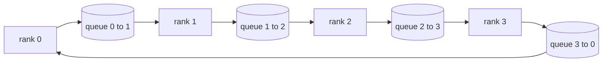

# Opérations collectives à partir de zéro

> Les quatre opérations collectives qui tiennent la formation distribuée ensemble sont allreduce, broadcast, allgather et reduce_scatter.`multiprocessing.Queue`les réseaux, les vérifier contre une mise en œuvre de référence, et le reste de la voie devient plomberie.

**Type:** Build
**Languages:** Python
**Prerequisites:** Phase 19 Track C lessons 42-49
**Time:** ~90 min

## Objectifs d'apprentissage

- Appliquez un anneau allreduce en deux passes (réduire-diffuseur puis allgather) et prouvez que le volume de communication par rang est de 2 ((N-1) / N octets par élément.
- Construire la diffusion, tout rassembler, et réduire_scatter en haut de point à point envoie sur `multiprocessing.Queue`- Je suis désolé .
- Vérifiez chaque primitif contre un`torch.distributed`- la référence de l'entrée de référence.
- Défendre le choix de l'anneau par rapport à l'arbre sur la forme du cluster, le sol de latence et le plafond de bande passante.

## Le problème

Un allréduire naïf sur N rangs envoie N fois le tensor à une racine et transmet N fois de retour. La bande passante s'égale à O ((N) par rang, la racine devient un goulet d'étranglement, et le sol du mur-horloge est le lien le plus lent par N. Ring allreducer les flattens en 2(N-1) morceaux de taille T/N, de sorte que les octets par rang tombent à 2T(N-1)/N indépendamment de la taille du cluster. L'arbre allreduce gagne sur les petits N et les liaisons à grande latence parce que la profondeur est log2(N) saute au lieu de 2(N-1). Choisissez la mauvaise topologie pour la forme du cluster et le GPU le plus lent dicte le temps de l'étape.

Chaque cadre de formation distribué que vous allez lire dans cette piste dépend de ces quatre primitives. PyTorch DDP synchronise les gradients avec un allreduce par bouquet de paramètres. ZeRO réduit l'état de l'optimisateur en réduisant_scatter et diffuse des paramètres actualisés par allgather. FSDP transforme le tout en allgather plus reduce_scatter. Les besoins parallèles de la transmission de pipeline pour les activations entre les groupes de phases. Si vous ne pouvez pas mettre en œuvre les quatre collectifs, vous ne pouvez pas raisonner sur les raisons pour lesquelles les entraînements sont bloqués, pourquoi le déséquilibre des gradients apparaît au troisième rang, ou pourquoi la bulle du pipeline double lorsque vous échangez des topologies.

## Le concept



### Rédoucissement de l'anneau en deux passes

Divisez le tensor en N égales à des morceaux indexés 0..N-1. Chaque rang possède un index de particules égal à son rang. Passe 1, réduire la dispersion, passe les étapes N-1. À l'étape s, le rang r envoie la partie (r - s) mod N à la partie (r + 1) mod N et reçoit la partie (r - s - 1) mod N du rang (r - 1) mod N, accumulant la partie reçue dans sa copie locale. Après N-1 étapes, le rang r possède la somme complète pour la pièce r. Pass 2, tout rassembler, faire un autre N-1 étapes et tourner les morceaux finis autour de l'anneau jusqu'à chaque rang contient la somme complète de chaque morceau.

| Primitive | Per-rank bytes | Steps | When to use |
|-----------|---------------|-------|-------------|
| Ring allreduce | 2T(N-1)/N | 2(N-1) | Large T, fat-pipe homogeneous cluster |
| Tree allreduce | T log2(N) | 2 log2(N) | Small T or high-latency links |
| Broadcast | T | log2(N) tree | Parameter init, scalar config |
| Allgather | T(N-1)/N | N-1 | Sharded forward, ZeRO unshard |
| Reduce_scatter | T(N-1)/N | N-1 | ZeRO gradient sharding |

### Réseau de filetage en remplacement de NCCL

Le NCCL fonctionne sur PCIe et NVLink avec des réductions déchargées par le matériel.`multiprocessing.Queue`La réduction se produit dans l'espace utilisateur, vous payez donc Python, mais le modèle de fil est identique à celui de NCCL ring allreduce.

### Vérifiez contre le gloo

Chaque élément primitif a un test unitaire qui compare sa production à `torch.distributed`Si votre anneau allreduce se détourne de la lumière de plus de float32 epsilon, le test échoue.

```figure
ci-ring-allreduce
```

## Faites-le

`code/main.py`les implémentations:

- `Mesh`classe qui câble N `multiprocessing.Queue`Les instances dans un anneau et exposés `send(dst, tensor)`et `recv(src)`par rang.
- `ring_allreduce(mesh, rank, world_size, tensor)`en utilisant l'algorithme de deux passes.
- `broadcast(mesh, rank, world_size, tensor, src)`sur un arbre logarithmique.
- `allgather(mesh, rank, world_size, tensor)`en utilisant des rotations N-1.
- `reduce_scatter(mesh, rank, world_size, tensor)`comme la première moitié de allreduce.
- `_gloo_reference(op, world_size, tensor)`qui passe par la même entrée `torch.distributed`avec gloo pour comparaison par octets.

- Je vais le faire.

```bash
python3 code/main.py
```

Sortie: tableau de vérification par primitive comparant les sorties de file d'attente et de sortie de lumière, suivi d'un compteur de octets par rang qui prouve l'échelle 2T(N-1)/N.

## Modèles de production dans la nature

Trois modèles durcis les primitifs suffisamment pour les expédier.

**Bucket gradients before allreduce.**Un modèle de paramètre 1B a des dizaines de milliers de tensors de gradient. Un allreduce par tensor paie le plancher de latence N fois. DDP bouquets gradients en ~ 25 MB morceaux et émet un allreduce par bouquet; les petits tensors roulent sur le dos des grands. Sans bouquetage de la charge de latence domine l'étape.

**Overlap communication with computation.**Le système de calcul de la couche de pivotage de la couche de pivotage de la couche de pivotage de pivotage de pivotage de pivotage de pivotage de pivotage de pivotage de pivotage de pivotage de pivotage de pivotage de pivotage de pivotage de pivotage de pivotage de pivotage de pivotage de pivotage de pivotage de pivotage de pivotage de pivotage de pivotage de pivotage de pivotage de pivotage de pivotage de pivotage de pivotage de pivotage de pivotage de pivotage de pivotage de pivotage de pivotage de pivotage de pivotage de pivotage de pivotage de pivotage de pivotage de pivotage de pivotage de pivotage de pivotage de pivotage de pivotage de pivotage de pivotage de pivotage de pivotage de pivotage de pivotage de pivotage de pivotage de pivotage de pivotage de pivotage de pivotage de pivotage de pivotage de pivotage de pivotage de pivotage de pivotage de pivotage de pivotage de pivotage de pivotage de pivotage de pivotage de pivotage de pivotage de pivotage de pivotage de pivotage de pivotage de pivotage de pivotage de pivotage de pivotage de pivotage de pivotage de pivotage de pivotage de pivotage de pivotage de pivotage de pivotage de pivotage de pivotage

**Pick ring or tree by message size, not religion.**NCCL envoie un détecteur de topologie qui choisit un anneau pour les messages au-dessus de ~ 1 MB et un arbre en dessous. Le crossover est bande passante-versus-latence: au-dessus de 1 MB, le terme bande passante 2T(N-1) /N domine et gagne l'anneau; au-dessous de 1 MB, le log2(N) compte de saut gagne.

## Utilisez-le

Modèles de production:

- **PyTorch DDP.**Il appelle .`dist.all_reduce`La taille du seau est réglable; 25 MB par défaut est raisonnable pour l'Ethernet de 100 Gbits.
- **DeepSpeed ZeRO.**Les problèmes réduisent_scatter à gradients de fragments et se regroupent pour reconstruire les paramètres complets avant de continuer.
- **FSDP.**Le tout commence par un assemblage pour déchiffrer la couche, calcul, puis réduit avec réduire_scatter et rejette le non déchiffré.

## La faire partir

Utilisez les primitifs de filet de filet dans les leçons 77-81. Les fils 77 réduisent tous en DDP. Les fils 78 réduisent_scatter en ZeRO. Les fils 79 diffusent en activations de pipeline. Les fils 81 composent les quatre dans la démo de bout en bout.

## Exercices

1. Ajoutez un arbre allreduce et passez entre le ring et l'arbre selon la taille du message.
2. Ajouter un `recv_timeout_ms`Ainsi, un rang bloqué apparaît comme une erreur de date limite au lieu de rester éternellement.
3. Remplacez`multiprocessing.Queue`Les mêmes tests, le vrai fil.
4. Ajoutez un crochet d'instrumentation de bande passante afin que le compteur de octets par rang soit enregistré en JSONL.
5. Comparez le temps de l'horloge murale de l'anneau par rapport à l'arbre sur 4 rangées pour des tensors de taille 1KB, 1MB, 16MB. Défendre le crossover empiriquement.

## Les termes clés

| Term | What people say | What it actually means |
|------|----------------|------------------------|
| Allreduce | "Sum across ranks" | After the call every rank holds the same reduced tensor |
| Ring | "The fast topology" | N-1 chunks of size T/N flow around the cycle twice |
| Tree | "The log topology" | Reduction follows a binary tree; depth is log2(N) hops |
| Allgather | "Concatenate shards" | Every rank ends with every other rank's shard |
| Reduce_scatter | "Split the sum" | Each rank ends with the sum of one chunk only |
| Bucket | "Fuse small tensors" | Coalesce N small allreduces into one large one |

## Pour en savoir plus

- [PyTorch Distributed: NCCL collectives](https://pytorch.org/docs/stable/distributed.html#collective-functions)
- [Horovod ring allreduce paper](https://arxiv.org/abs/1802.05799)
- [NCCL topology and algorithm selection](https://docs.nvidia.com/deeplearning/nccl/user-guide/docs/index.html)
- [Patarasuk and Yuan, Bandwidth optimal allreduce algorithms](https://www.cs.fsu.edu/~xyuan/paper/09jpdc.pdf)
- Phase 10 Leçon 05 - aperçu de la formation distribuée
- L'étape 19 - Leçon 77 - DDP câblé sur ces primitifs
