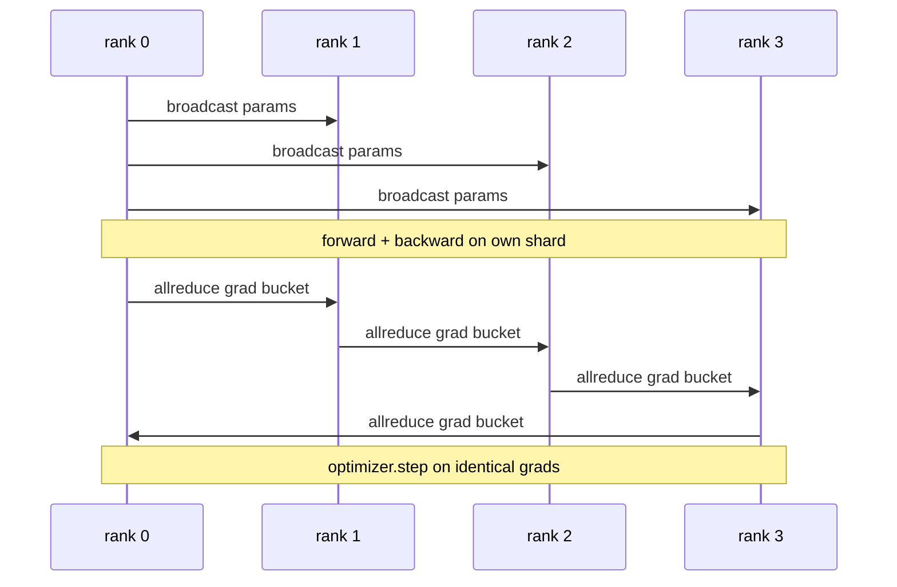

# DDP parallèle de données à partir de zéro

> DistribuéDataParallel est un crochet sur le dessus de allreduce. Enveloppez un modèle, diffusez les paramètres initiaux du rang 0 afin que chaque rang commence identique, installez un crochet arrière sur chaque paramètre qui émet un allreduce du gradient, et le reste est la descente du gradient.

**Type:** Build
**Languages:** Python
**Prerequisites:** Phase 19 Track C lessons 42-49
**Time:** ~90 min

## Objectifs d'apprentissage

- - Le câble`DistributedDataParallel`- enveloppe en forme de revêtement qui transmet les paramètres initiaux et réduit les dégradations après la retrogression.
- Spawn N CPU se classe avec `torch.multiprocessing.spawn`sur le fond sombre avec un rendez-vous basé sur des fichiers.
- Prouver la précision de la synchronisation entre les gradients en formant le même modèle sur les mêmes données séquentiellement et en montrant l'équivalence par étape des paramètres.
- Défendre l'utilisation de seaux (fusion gradiente) et de chevauchements (comm pendant l'arrière-plan) comme les deux changements qui transforment un DDP en DDP de production.

## Le problème

Un modèle de 1 milliard de paramètres avec 12 Go d'activations ne convient pas à un GPU de consommation. Même lorsqu'il convient, la formation prend des semaines. Les données parallèles divisent le lot en N rangs, chaque rang calcule l'avant et l'arrière sur son fragment, et à chaque étape les gradients de chaque rang sont sumés de sorte que toutes les copies N restent identiques.

Sans synchronisation des gradients, les N réplicas divergent par étape 2. Le modèle n'est plus "un modèle formé sur plus de données", c'est N modèles séparés qui partagent des poids initiaux. Avec une synchronisation des gradients mal réalisée (un allreduce par paramètre, aucun chevauchement, aucun bouquetage) le réseau est le goulet d'étranglement et les GPUs en attente de fil. Le métier de DDP rend la synchronisation des gradients presque libre par rapport à l'informatique. Le PyTorch DDP canonique le permet en faisant bouquetage des gradients, en superposant toutréduire avec l'arrière de la couche suivante et en utilisant NCCL sur NVLink. On peut faire les trois sur CPU avec gloo et apprendre les mêmes leçons.

## Le concept



### Les trois opérations dont a besoin le DDP

| Stage | Collective | Why |
|-------|-----------|-----|
| Init | broadcast from rank 0 | Every rank starts with the same parameters |
| After backward | allreduce of each grad | The mean gradient is what the optimiser steps on |
| Sometimes | broadcast of buffers | Batchnorm running stats stay synchronised |

### Pourquoi méchants et non sumatiques

Allreduce-SUM divisé par world_size donne le gradient moyen. La moyenne est invariante à world_size: un taux d'apprentissage réglé à un rang fonctionne à quatre rangs parce que la magnitude du gradient par étape ne change pas. Allreduce-SUM sans la division vous oblige à réajuster le taux d'apprentissage chaque fois que vous changez la taille du groupe. DDP enveloppe le SUM et divise; faites la même chose dans la leçon.

### Pourquoi les gradients de seau

Un transformateur a des milliers de tensors de paramètres. Un allreduce par tensor paie le plancher de latence gloo des milliers de fois. DDP regroupe les gradients en ~ 25 MB de seau et émet un allreduce par seau. Les mêmes octets totaux se déplacent sur le fil mais la latence est amortie sur le seau. Pour le modèle minuscule de la leçon, nous regrouper tout en un seau; la structure est ce qui transporte.

### Pourquoi enfoncer la graine ?

Chaque rang doit appeler`torch.manual_seed(seed + rank)`pour le mélange mais `torch.manual_seed(seed)`pour le paramètre init. Une seule graine partagée signifie que chaque rang voit le même ordre de lot (parallèle des données défaites); une graine spécifique de rang pour les paramètres signifie que les paramètres initiaux ne sont pas d'accord par epsilon flottant et la synchronisation des gradients ne rend plus les réplices identiques.

```figure
ci-ddp-grad-sync
```

## Faites-le

`code/main.py`les implémentations:

- `MiniMLP`: une MLP à 3 couches assez petite pour converger en quelques secondes, assez grande pour exposer le câblage.
- `DistributedDataParallel(model, world_size)`: diffuse des paramètres à l'heure de la construction, renvoie un emballage dont `sync_grads`Divise les diplômés accumulés tous réduits-résumés par la taille du monde.
- `worker(rank, world_size, ...)`: cycle complet de formation avec `torch.distributed`init sur gloo, vers l'avant, vers l'arrière, synchronisation, étape.
- `_reference_single_process_loop(...)`: entraîne le même modèle sur les mêmes données séquentiellement sur un rang, utilisé par l'essai d'équivalence par paramètre par octets après chaque étape.

- Je vais le faire.

```bash
python3 code/main.py
```

Résultats: une table d'entraînement par étape comparant la perte et la somme de paramètres de processus simples à la course DDP sur 4 rangées.

## Modèles de production dans la nature

Trois modèles durcissent le DDP suffisamment pour être expédié.

**Find unused parameters.**Certains chemins à l'avant sautent les paramètres conditionnellement (exit précoce, routeur de mélange d'experts). Les paramètres sautés n'ont pas de gradient, mais le crochet prêt à la boue de DDP les attend toujours et réduit les impasses. `find_unused_parameters=True`Le coût est un graph walk par étape, alors laissez-le à moins que vos branches avant.

**Static graph optimisation.**Quand la pointe est stable à travers les marches,`static_graph=True`L'optimisation est importante à l'échelle: le précomputing permet d'économiser quelques ms par étape qui se compose sur 10000 étapes.

**Gradient accumulation needs care.**L'accumulation de gradients sur K microbatches sans synchroniser chaque microbatch est une victoire de 10 fois le débit.`no_sync()`Si vous oubliez le gestionnaire, vous réduisez tous les temps K pour rien; le débit tombe à terre.

## Utilisez-le

Modèles de production:

- **PyTorch DDP.**La mise en œuvre canonique. `torch.nn.parallel.DistributedDataParallel(model)`Les fils se bouclent, se chevauchent et le contexte no_sync.
- **HuggingFace Accelerate.**Ajout d' un lanceur qui gère `torchrun`Le même DDP sous le capot.
- **Megatron-LM data parallel.**Combine le DDP avec le parallèle tensor pour les grands modèles; la pièce parallèle des données est le même modèle allreduce-after-backward.

## La faire partir

La leçon 78 (Zero sharding) remplace le paramètre allreduce par reduce_scatter de sorte que chaque rang ne stocke que son shard de l'état optimisateur.

## Exercices

1. Ajouter des seaux de gradients de taille configurable et mesurer la vitesse versus un all-reduce-par-paramètre sur un modèle plus profond.
2. Mise en œuvre `no_sync()`en tant que gestionnaire de contexte et vérifier que l'accumulation de gradients correspond à une ligne de base de processus unique sur les microbatches K.
3. Ajouter un `find_unused_parameters`mode où l'avant saute parfois l'une des couches de la PMP; sans le drapeau, la course devrait être bloquée.
4. Remplacez le gloo par `torch.distributed.barrier()`-seule synchronisation pour faire la différence entre synchronisation à base de réductions et synchronisation à base de barrières.
5. Mesurer le coût de synchronisation des gradients en fraction du temps d'étape pour les lots de taille 1, 16, 256 et expliquer l'échelle.

## Les termes clés

| Term | What people say | What it actually means |
|------|----------------|------------------------|
| DDP | "Data parallel" | Wrapper that broadcasts params and allreduces grads each step |
| Bucket | "Fuse grads" | Group N small allreduces into one large one |
| Overlap | "Hide comm" | Issue allreduce while later layers still computing backward |
| no_sync | "Accumulate" | Skip the post-backward allreduce for gradient accumulation |
| find_unused | "Branchy forward" | Detect parameters with no grad before reducing |

## Pour en savoir plus

- [PyTorch DistributedDataParallel docs](https://pytorch.org/docs/stable/generated/torch.nn.parallel.DistributedDataParallel.html)
- [PyTorch DDP internals tutorial](https://pytorch.org/tutorials/intermediate/ddp_tutorial.html)
- [Li et al, PyTorch Distributed: Experiences on Accelerating Data Parallel Training](https://arxiv.org/abs/2006.15704)
- L'étape 19 - Leçon 76 - Les collectifs DDP est construit sur
- L'étape 19 Leçon 78 - Le déchiquetage de ZeRO remplace le allreduce par paramètre par le réduire_scatter
