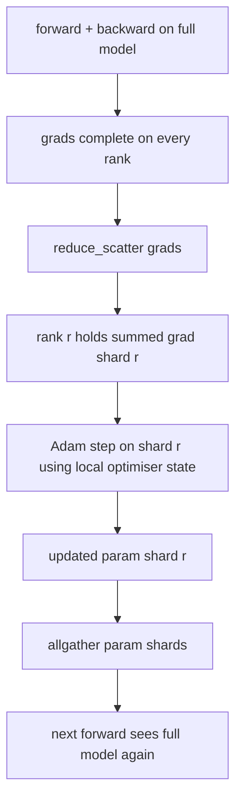

# Déchiquetage de l'état du ZeRO Optimizer

> Adam stocke deux estimations de moment par paramètre, toutes les deux dans float32. Un modèle à paramètre 7B possède 56 Go d'état optimisé. La ZeRO étape 1 décompose les rangs N; chaque rang possède 1/N de l'optimisateur. Après la phase locale, les fragments de paramètre mis à jour sont diffusés, chaque rang reconstruit le modèle complet, et la phase suivante commence. La victoire est une baisse de mémoire linéaire sur la plus grande allocation individuelle dans la pile d'entraînement.

**Type:** Build
**Languages:** Python
**Prerequisites:** Phase 19 Track C lessons 42-49
**Time:** ~90 min

## Objectifs d'apprentissage

- L'état de l'optimisateur de fragmentation (premier moment, deuxième moment, copie principale fp32) à travers N rangs de sorte que chaque rang possède 1/N.
- Utilisez reduce_scatter pour fournir à chaque rang seulement la somme du gradient de son fragment, puis rassemblez tous les paramètres mis à jour pour diffuser les fragments de retour.
- Computez le tableau d'épargne de mémoire de la phase 1, de la phase 2, de la phase 3 par rapport à la DDP de vanille.
- Défendre le choix de la phase 1 contre la phase 2 contre la phase 3 en fonction de la taille du modèle et du budget de la bande passante.

## Le problème

Le Vanilla DDP réplique tout: les paramètres, les gradients et l'état optimisateur sont présents dans leur intégralité sur chaque rang. Pour un modèle de paramètre 7B en fp16, cela signifie 14 Go de paramètres, 14 Go de gradients et 28 Go d'état optimisateur par rang. L'état optimisateur est le plus grand terme et le plus facile à déchiffrer car il n'est touché que pendant la étape, pas pendant l'avant ou l'arrière.

La phase 1 de ZeRO réduit l'état d'optimisation. Chaque rang contient 1/N des moments d'Adam. Après l'arrière, au lieu de réduire le gradient complet et de marcher localement, ZeRO réduit_scatters de sorte que chaque rang ne reçoit que le gradient sumé de son fragment. Le rang applique l'étape optimisatrice à son fragment des paramètres principaux. Les fragments de paramètre mis à jour se rassemblent alors pour que chaque rang ait le modèle complet pour le prochain avancé. La mémoire optimisée diminue de N. Le trafic de fil par étape est le même que le DDP: un réduire_scatter plus un allgather équivaut à un allréduire par bande passante. La mémoire gagne, le débit reste.

## Le concept



### Les étapes de la ZER

| Stage | What is sharded | Memory per rank | Comm per step |
|-------|----------------|------------------|---------------|
| DDP | nothing | params + grads + optim | 1x allreduce |
| ZeRO-1 | optimiser state | params + grads + optim/N | 1x reduce_scatter + 1x allgather |
| ZeRO-2 | optim + grads | params + grads/N + optim/N | 1x reduce_scatter + 1x allgather |
| ZeRO-3 | optim + grads + params | params/N + grads/N + optim/N | 1x allgather per layer + 1x reduce_scatter per layer |

La phase 1 est la plus bon marché, car l'état optimisateur domine le budget. La phase 2 nécessite la logique d'accumulation de la partie gradiente mais la bande passante est la même. La phase 3 (FSDP) paie la communication par couche pour chaque couche vers l'avant et vers l'arrière, obtenant la chute de la mémoire de la partie paramétrique.

### Les mathématiques de la mémoire, les nombres réels

Pour un modèle avec des paramètres P entraînés avec Adam en précision mixte:

| Term | Vanilla | ZeRO-1 | Why |
|------|---------|--------|-----|
| fp16 params | 2P bytes | 2P bytes | needed for forward |
| fp16 grads | 2P bytes | 2P bytes | needed for backward |
| fp32 master copy | 4P bytes | 4P/N bytes | only the optim uses it |
| fp32 first moment | 4P bytes | 4P/N bytes | only the optim uses it |
| fp32 second moment | 4P bytes | 4P/N bytes | only the optim uses it |
| Total | 16P bytes | 4P + 12P/N bytes |   |

À N=8: vanille 16P, ZeRO-1 5,5P, une baisse de 65%. à N=64: vanille 16P, ZeRO-1 4,19P, une baisse de 74%.

### Pourquoi réduire_scatter bat tous réduire-alors-partager

Allreduce donne à chaque rang le gradient total sumé. Si vous n'avez besoin que de la fraction r, le (N-1)/N du gradient qui a été réduit est gaspillé sur le rang r. Reduce_scatter fournit exactement le shard que possède chaque rang; les octets par rang sont les mêmes que allreduce (puisque allreduce est reduce_scatter + allgather), mais la seconde moitié est remplacée par le paramètre-shard allgather plus tard. Le fil net est identique à DDP, la mémoire est divisée.

```figure
cd-zero-shard
```

## Faites-le

`code/main.py`les implémentations:

- `flatten_params(module)`et `unflatten_into(module, flat)`Le plan plat est ce qui rend le déchiquetage par rang une simple tranche.
- `ZeroOptimizer(model, world_size, rank, lr)`qui possède le morceau de rang de la copie maîtresse et les moments d'Adam.
- `step()`qui exécute réduire_scatter sur le gradient plat, applique Adam à la tranche de rang, et recueille tous les paramètres mis à jour.
- Une démo qui entraîne un MLP à 3 couches pendant 20 étapes et imprime le budget de mémoire par étape avec une ligne de base de DDP vanille.

- Je vais le faire.

```bash
python3 code/main.py
```

Résultats: perte par étape et la table de mémoire qui montre ZeRO-1 contient 1/N de l'état optimisateur sur chaque rang par rapport à la copie complète de DDP.

## Modèles de production dans la nature

Trois modèles durcissent suffisamment le ZeRO pour le déployer.

**Sharded checkpointing matters.**L'état optimisateur de ZeRO-1 est divisé en rangs; le point de contrôle doit enregistrer quel rang possède quoi.

**Mixed precision is the point.**La technique de ZERO est une technique de précision mixte; la copie principale de fp32 est ce qui est fragmenté.

**Stage 1 is a near-free win.**La communication est identique à la DDP par bande passante. Les économies de mémoire sont linéaires en N. Le seul coût est la comptabilité du shard optimisateur. La production stacks par défaut à l'étape 1 à moins que la mémoire de shard paramètre soit également un problème; puis étape 2 ou 3 négocie la communication pour la mémoire.

## Utilisez-le

Modèles de production:

- **DeepSpeed ZeRO.**La mise en œuvre de référence. `deepspeed_config.json`sélectionne les dimensions de la phase 1/2/3 et de la partition.
- **PyTorch FSDP.**L'équivalent PyTorch-native.`ShardingStrategy.SHARD_GRAD_OP`est ZeRO-2; `FULL_SHARD`est ZeRO-3.
- **HuggingFace Accelerate.**Il embrasse DeepSpeed et FSDP sous un réglage uniforme.

## La faire partir

Leçon 79 (parallèle pipeline) est l'axe de déchiquetage orthogonal: au lieu de déchiquetage de l'état optimisateur sur le même modèle, les couches de pipeline déchiffrent les rangées.

## Exercices

1. Étendre à ZeRO-2 en déchiffrant les gradients: chaque rang ne stocke que le gradient de sa déchiffrement, obtenu en éliminant la partie non déchiffrée après l'arrière.
2. Ajouter un profilé de mémoire qui imprime l'utilisation réelle des octets fp32 sur le rang 0 par rapport à la prédiction de la formule.
3. Mesurez le temps par étape du mur-horloge de la vanille DDP par rapport à ZeRO-1 et décomposez-le en avant, en arrière, en communication.
4. Appliquer la coupe de gradient sous ZeRO-1: la norme L2 doit être calculée sur toutes les tranches par allréduction de la norme locale au carré.
5. Mettez en œuvre un "Zero naïf" avec allreduce au lieu de réduire_scatter, mesurez la différence de temps de fil. Défendez le choix de réduire_scatter avec des nombres.

## Les termes clés

| Term | What people say | What it actually means |
|------|----------------|------------------------|
| ZeRO-1 | "Shard the optimiser" | Each rank holds 1/N of fp32 master + Adam moments |
| ZeRO-2 | "Shard grads too" | Each rank also drops the non-shard gradients after reduce_scatter |
| ZeRO-3 | "Shard params" | Each rank holds 1/N of fp16 params; allgather per layer in forward |
| Master copy | "fp32 weights" | The high-precision parameter copy the optimiser updates |
| Reduce_scatter | "Split the sum" | Deliver each rank only its shard's summed gradient |

## Pour en savoir plus

- [Rajbhandari et al, ZeRO: Memory Optimizations Toward Training Trillion Parameter Models](https://arxiv.org/abs/1910.02054)
- [DeepSpeed ZeRO documentation](https://www.deepspeed.ai/tutorials/zero/)
- [PyTorch FSDP documentation](https://pytorch.org/docs/stable/fsdp.html)
- L'équipe de formation de l'équipe de formation de l'équipe de formation de l'équipe de formation de l'équipe de formation de l'équipe de formation de l'équipe de formation de l'équipe de formation de l'équipe de formation de l'équipe de formation de l'équipe de formation de l'équipe de formation de l'équipe de formation de l'équipe de formation de l'équipe de formation de l'équipe de formation de l'équipe de formation de l'équipe de formation de l'équipe de formation de l'équipe de formation de l'équipe de formation de l'équipe de formation de l'équipe de formation de l'équipe de formation de l'équipe de formation de l'équipe de formation de l'équipe de formation de formation de l'équipe de formation de l'équipe de formation de l'équipe de formation de formation de l'équipe de formation de l'équipe de formation de l'équipe de formation de formation de l'équipe de formation de l'équipe de formation de la classe de formation de l'équipe de formation de l'équipe de formation de la classe de formation de l'équipe de formation de l'équipe de formation de la classe de l'équipe de formation de l'équipe de la classe de l'équipe de formation de l'équipe de la classe de l'équipe de la classe de l'équipe de la classe de l'équipe de l'équipe de formation de la classe de l'équipe de l'équipe de l'équipe de la classe de l'équipe de l'équipe de la classe de l'équipe de l'équipe de la classe de l'équipe de la classe de l'équipe de l'équipe de la classe de l'équipe de l'équipe de la classe de l'équipe de la classe de la classe de l'équipe de l'équipe de la classe de l'équipe de la classe de l'équipe de la classe de la classe de l'équipe de la classe de la classe de l'équipe de la classe de la classe de la classe de l'équipe de la classe de la classe de
- Phase 19 Leçon 80 - point de contrôle fragmenté que l'État ZeRO doit utiliser
