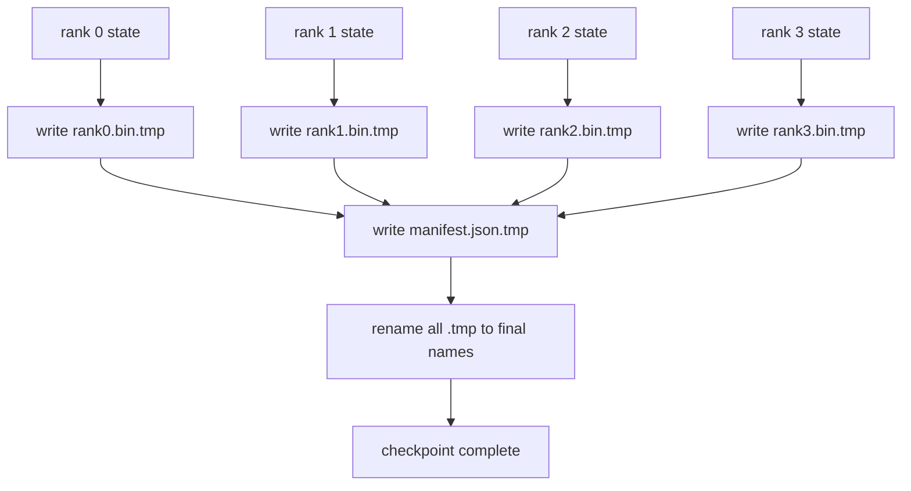

# Point de contrôle fragmenté et CV atomique

> Un travail de formation de paramètre 70B est interrompu par une défaillance de nœud toutes les quelques heures. Le format du point de contrôle décide si vous perdez 30 minutes ou 30 heures. Un poste de contrôle fragmenté écrit le fragment de chaque rang en parallèle et enregistre la propriété dans un manifeste. Le CV charge chaque fragment de rang de son propre dossier, reconstruit l'état sur la même taille mondiale, et les étapes plus optimisées comme si rien ne s'était passé. L'écriture atomique empêche un poste de contrôle à moitié terminé d'empoisonner le prochain CV.

**Type:** Build
**Languages:** Python
**Prerequisites:** Phase 19 Track C lessons 42-49
**Time:** ~90 min

## Objectifs d'apprentissage

- Conservez un point de contrôle multi-ranks comme un fichier de fragment par rang plus un manifeste qui enregistre quel rang possède quoi.
- Utilisez le modèle d'écriture atomique (écrivez sur un chemin temporaire puis renommez) afin qu'une écriture en milieu d'accident ne produit jamais un point de contrôle à moitié terminé.
- Résumé à partir du manifeste, vérifiant l'état d'équivalence en octets pour les deux paramètres fp16 et l'état d'optimisateur ZeRO sur chaque rang.
- Défendre le schéma manifeste contre les trois modes d'échec: changement de taille mondiale, déséquilibre du nombre de fragments et écriture partielle.

## Le problème

Un point de contrôle vanille lit tous les paramètres et l'état de l'optimisateur dans le rang 0, rassemble et écrit un seul fichier. Pour un modèle 70B qui est 1,1 TB d'état à travers le port réseau d'un rang. Les écrivains bloquent tous les autres rangs parce qu'ils attendent l'assemblée. La bande passante IO est la connexion réseau la plus lente d'un seul GPU, pas l'agrégat. Dans un cluster réel, la phase de collecte-écriture peut prendre plus de temps que l'heure de formation précédente, ce qui signifie que les emplois sont envoyés à moins d'un point de contrôle par jour de formation.

Les points de contrôle fragmentés inversent le schéma: chaque rang écrit son propre fragment sur son propre fichier en parallèle. Les enregistrements manifestes qui classent quel fragment possédait donc le CV peut remettre chaque fragment à l'endroit d'où il venait. L'agrégat écrit des échelles de bande passante avec le cluster. Un point de contrôle de 1 TB qui a pris 4 heures à travers un rang prend 4 minutes à travers 64 rangs. De plus, le manifeste vous donne un contrat pour des curricula incompatibles: des changements de taille mondiale sont détectables, des écritures partielles sont détectables, et le chemin de chargement peut échouer fort plutôt que silencieusement en utilisant des données obsolètes.

## Le concept



### Schéma manifesté

```json
{
  "world_size": 4,
  "step": 1234,
  "wall_clock_seconds": 4521,
  "shards": [
    {"rank": 0, "path": "rank0.bin", "sha256": "...", "param_shard_offset": 0, "param_shard_numel": 65536},
    {"rank": 1, "path": "rank1.bin", "sha256": "...", "param_shard_offset": 65536, "param_shard_numel": 65536}
  ],
  "schema_version": 1
}
```

Trois champs sont portables.`world_size`fait un CV de taille différente échouer fortement plutôt que de se corrompre silencieusement. `sha256`par fragment, les écrits sont partiels ou corrompus. `param_shard_offset`et `param_shard_numel`par fragment, laissez le chargement reconstruire le tensor de paramètre plat à la position correcte.

### Écriture atomique

Le modèle standard: écrire chaque fragment à `<name>.tmp`, écrivez le manifeste à `manifest.json.tmp`Un crash avant le renommé final laisse le point de contrôle précédent comme celui en cours. Sans écrire atomique un crash peut laisser une fragmentation partielle avec un manifeste présent qui le pointe vers elle, et la charge corrompt l'état optimisateur sur le CV.

### Trois modes d'échec contre lesquels le schéma doit se défendre

| Failure | Symptom | Defence |
|---------|---------|---------|
| World-size change | resume on N=8 with manifest from N=4 | world_size mismatch in manifest, fail loudly |
| Shard count mismatch | resume sees fewer rank*.bin files than shards in manifest | enumerate shards, verify every one exists |
| Partial write | shard file truncated mid-flush | sha256 verification on load |

Chaque défense rejette la mauvaise charge tôt; l'alternative est la corruption silencieuse qui apparaît 100 pas plus tard lorsque la perte va à NaN.

### Pourquoi des dossiers par rang, pas un seul grand dossier

Rédiger simultanément à un fichier via `O_APPEND`Les fichiers par rang ne sont pas en désaccord et bénéficient de la stripe lorsque le système de fichiers sous-jacent est parallèle (Lustre, GPFS).

```figure
ci-sharded-checkpoint
```

## Faites-le

`code/main.py`les implémentations:

- `ShardManifest`classe de données avec le schéma ci-dessus plus `to_json`- Je suis là.`from_json`- Je suis désolé .
- `save_sharded(state_dict_per_rank, dir, step)`qui écrit l'état binaire de chaque rang dans son propre fichier en utilisant le modèle atomique Temp-then-renommé, puis écrit le manifeste.
- `load_sharded(dir, expected_world_size)`qui lit le manifeste, vérifie la sha256 de chaque fragment et renvoie les dictes d'état par rang.
- Un test aller-retour: construire l'état par rang, enregistrer, charger, affirmer que le octet est égal.

- Je vais le faire.

```bash
python3 code/main.py
```

Sortie: 4 fichiers fragmentés plus manifeste écrit, puis rechargé avec une vérification par octets.

## Modèles de production dans la nature

Trois motifs durcissaient le poste de contrôle assez pour expédier.

**Async write.**Les piles de production émettent le point de contrôle écrire sur un fil ou un processus séparé afin que la formation continue.`async_io`La leçon maintient l'écriture synchrone afin que les étapes soient visibles.

**Local fast disk first, then async upload.**Écrivez à NVMe local (rapide), puis téléchargez-le asynchronyment à S3 ou GCS. Le schéma à deux niveaux garde le point de contrôle intégré rapide pour le CV tout en expédiant une copie durable hors du cluster pour l'archivage. Le manifeste porte le chemin local; un manifeste de téléchargement porte le chemin à distance.

**Rotation matters.**Les circuits de production gardent les derniers points de contrôle K (généralement 3-5) et tournent les plus anciens. Sans rotation, le disque remplit le milieu de la course et le prochain point de contrôle échoue.

## Utilisez-le

Modèles de production:

- **DeepSpeed checkpointing.** `deepspeed.save_checkpoint(tag=step)`écrit des fichiers par rang et un `latest`fichier indiquant la balise active.
- **PyTorch FSDP checkpointing.** `torch.distributed.checkpoint`économise l' état déchiqueté avec un `Planner`qui décide de la disposition par rang.
- **NeMo.**Enveloppe DeepSpeed et FSDP avec un uniforme `save_to_checkpoint`API qui ajoute des métadonnées.

## La faire partir

La leçon 81 conserve un point de contrôle fragmenté de la fonction DDP+ZeRO de bout en bout et le recharge sur la même taille mondiale pour prouver la validité du contrat de CV.

## Exercices

1. Ajouter une écriture asynchrone: démarrer le sauvegarde dans un fil et laisser l'entraînement continuer. Bloquer le suivant sauvegarder jusqu'à ce que le précédent soit terminé.
2. Ajouter un `last_5_steps`Retour: conserver les 5 points de contrôle les plus récents, supprimer les plus anciens avant de sauvegarder un nouveau.
3. Ajouter un chemin de vérification rapide à CRC uniquement pour la recharge interne (la rotation fait passer un point de contrôle en nouveau point actif sans sha256 complet).
4. Ajouter une charge de taille transversale: rééquilibrage des fragments de N=4 à N=8 en lisant le manifeste, concatenant et recartiguant.
5. Ajouter un téléchargement à un faux S3 (un deuxième répertoire) et écrire le manifeste de téléchargement.

## Les termes clés

| Term | What people say | What it actually means |
|------|----------------|------------------------|
| Sharded checkpoint | "Per-rank save" | Each rank writes its own shard file in parallel |
| Manifest | "Index" | JSON file recording shard paths, offsets, and sha256 |
| Atomic write | "tmp then rename" | Write to .tmp then POSIX rename so a crash leaves the previous file live |
| Partial write | "Truncated shard" | A crash during write produces a corrupt shard; sha256 catches it |
| Rotation | "Keep last K" | Delete oldest checkpoint before writing new one to bound disk usage |

## Pour en savoir plus

- [DeepSpeed checkpointing](https://deepspeed.readthedocs.io/en/latest/model-checkpointing.html)
- [PyTorch torch.distributed.checkpoint](https://pytorch.org/docs/stable/distributed.checkpoint.html)
- [POSIX rename atomicity](https://pubs.opengroup.org/onlinepubs/9699919799/functions/rename.html)
- Phase 19 Leçon 78 - l' état du ZERO ce point de contrôle est conçu pour sauver
- Phase 19 Leçon 81 - la démo de bout en bout fait des allers-retours de l'état sauvé
