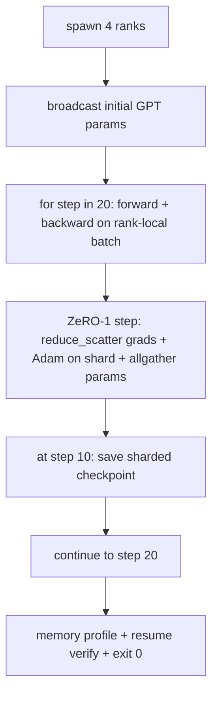

# Formation répartie de bout en bout

> Les leçons 76 à 80 ont chacune construit une pièce. Voici l'assemblage: un petit GPT entraîné sur 4 rangs simulés avec DDP pour la synchronisation de gradients, ZeRO-1 pour l'optimisation des éclats d'état, et un point de contrôle fragmenté à la mi-chemin. La démo fonctionne 20 étapes, se termine elle-même, imprime une courbe de perte plus un profil de mémoire, et écrit un point de contrôle réalisable.

**Type:** Build
**Languages:** Python
**Prerequisites:** Phase 19 Track C lessons 42-49
**Time:** ~90 min

## Objectifs d'apprentissage

- Composer le DDP (leçon 77) plus le ZeRO-1 (leçon 78) plus les points de contrôle fragmentés (leçon 80) en une seule boucle d'entraînement.
- Exercez un modèle de langage transformateur à 2 couches sur un petit corpus synthétique pendant 20 étapes sur 4 rangs simulés.
- Imprimez un tableau de perte par étape, un profil de mémoire par rang et un manifeste de point de contrôle qui reprend en octets-égaux sur la même taille mondiale.
- Défendre la composition: chaque pièce est testée indépendamment dans les leçons précédentes et cette leçon prouve qu'elle est composée.

## Le problème

Une pierre angulaire est la preuve que les pièces se fondent. Leçon 76 collectifs mis en œuvre. La leçon 77 les a enveloppés dans le DDP. Leçon 78 état optimisateur fragmenté avec réduire_scatter. Leçon 79 analyse le pipeline. La leçon 80 a sauvé un poste de contrôle fragmenté. Chaque leçon était unique avec son propre test. Une véritable course d'entraînement utilise tous les primitifs à la fois; si la composition est erronée, la perte diverge, le point de contrôle refuse de reprendre, ou la mémoire par rang augmente quand elle devrait se rétrécir.

Cette leçon exécute la démo de bout en bout et vérifie quatre invariants: a) la perte diminue de manière monotone sur les 20 étapes du bruit de flot, b) chaque rang conserve la même norme de paramètre à chaque étape, c) la mémoire optimisatrice par rang équivaut aux octets de la formule ZeRO-1 12P/N, et d) le point de contrôle à l'étape 10 se recharge par octets à la redémarrage. La démo se termine: 20 étapes, commande unique, sortie 0.

## Le concept



### Le mini GPT

Le modèle est petit à propos: 2 blocs de transformateurs, 32 étroits, 4 têtes d'attention, vocables 64, longueur de séquence 16, lot 4. Quelques milliers de paramètres. Suffisamment grand pour exercer chaque décision de câblage (l'attention multi-tête suit le chemin masqué standard; LayerNorm a des poids à synchroniser; la tête LM est une projection linéaire séparée vers le vocabulaire). assez petit pour que 20 étapes sur 4 rangs de processeurs se terminent en quelques secondes.

### Les règles de composition

| Lesson piece | What it owns | What it leaves to the loop |
|--------------|--------------|----------------------------|
| DDP broadcast | Initial parameter sync | One call at construct time |
| ZeRO-1 step | Gradient sync, master copy update, parameter broadcast | One call per step replacing optimiser.step |
| Sharded checkpoint | Persist per-rank state, manifest with sha256 | Called on rank 0 with state collected via allgather |
| Training loop | Forward, backward, loss logging | Calls the three above in order |

La boucle ne connaît pas les fichiers reduce_scatter ou rendez-vous.

### Pourquoi un petit GPT et pas seulement un MLP

Le PMA de la leçon 77 était suffisant pour vérifier la synchronisation des gradients. Un minuscule GPT ajoute trois choses: une tête LM séparée sur le vocabulaire (dans cette leçon, détachée pour la clarté; GPT complet lie généralement la tête à l'embedding de jeton), softmax + entropie croisée comme la perte (plus de cas de bord numérique que MSE), et une avance asymétrique (embedding puis attention puis MLP par couche). En se fixant un MLP pour la pierre angulaire, on ne sait pas si la composition traite correctement la forme de la couche de mise en place ou la forme de la couche de mise en place.

### Autotérminaison signifie sortie 0

La boucle passe à 20 étapes fixes et sort.`while True`Une pierre angulaire que vous pouvez laisser en marche sans surveillance et trouver un journal complet quand il est terminé est une pierre angulaire qui prouve que le système est câblé correctement.

```figure
ci-distributed-assembly
```

## Faites-le

`code/main.py`les implémentations:

- `MiniGPT`: transformateur à 2 couches avec une attention à soi masquée et une tête LM séparée.
- `make_corpus(seed, total_tokens)`: données déterministes de prévision des prochains jetons.
- `_train_worker`: généré par rang; diffuse les paramètres init, exécute la boucle, appelle la étape ZeRO, écrit le point de contrôle fragmenté à l'étape 10.
- `verify_resume`: après la mise en marche principale, recharger le point de contrôle étape 10 en cours de processus et affirmer que les fragments maîtres enregistrés correspondent à l'instantané par octet par octet dans la mémoire.
- `main`: orchestre l'ensemble de la démo, imprime la table des pertes, le profil de mémoire et le résultat de la vérification.

- Je vais le faire.

```bash
python3 code/main.py
```

Résultat: une table de 20 rangées de pertes, un profil de mémoire de 4 rangées par rang, un manifeste de checkpoint et une ligne "Résumé vérifié" sur le succès.

## Modèles de production dans la nature

Trois motifs finissent la composition pour les vrais runs.

**Checkpoint every K minutes, not every K steps.**Le temps de la phase varie selon la longueur de la séquence et le nombre de microbatches. Une cadence de checkpoint de 10 minutes capture le même calcul indépendamment de la taille du modèle.

**Detect divergence early.**Les courses de production ajoutent un garde NaN après le retrait et un détecteur de pointe de perte; si la perte saute de plus de 2 fois en une seule étape, retournez au point de contrôle précédent au lieu de laisser l'optimisateur marcher dans un état dégénéré.

**Aggregate the memory profile across ranks.**La mémoire par rang diffère par rang dans les courses réelles (le rang avec la plus grande étape du pipeline détient plus d'activations).

## Utilisez-le

Modèles de production:

- **DeepSpeed.**Combine DDP + ZeRO + pipeline + activation de point de contrôle sous une configuration.
- **PyTorch FSDP.**L'équivalent natif.`FullyShardedDataParallel`avec `ShardingStrategy.SHARD_GRAD_OP`est ZeRO-2.
- **NeMo and Megatron-LM.**Ajouter le parallèle tensor pour les modèles les plus grands; sinon la composition est la même forme.

## La faire partir

La suite complète se termine ici. Les 6 leçons ensemble sont le sous-système de formation distribuée qu'une véritable équipe construirait avant d'adopter DeepSpeed; l'abstraction a été prouvée contre le gloo et les modes de défaillance ont été exercés. La phase 17 (infrastructure et production) est l'endroit pour le faire passer à un véritable cluster.

## Exercices

1. Ajouter une fraction parallèle tensorielle de la tête d'attention et vérifier que la perte correspond à la ligne de base de rang unique.
2. Ajouter l'accumulation de gradients sur 4 microbatches et prouver que le gradient est égal au gradient d'un grand lot.
3. Ajoutez un parcours de CV de l'étape 10 qui continue l'entraînement jusqu'à l'étape 20 et produit la même perte finale que la course initiale.
4. Ajouter une mesure d'exportation (perte, norme de grad, temps d'étape) à JSONL afin que la course puisse être visualisée après le fait.
5. Ajoutez un garde NaN qui roule vers le point de contrôle précédent sur un pic de perte, et forcer un pic avec un multiplicateur LR d'un pas pour exercer le retour.

## Les termes clés

| Term | What people say | What it actually means |
|------|----------------|------------------------|
| End-to-end | "Wire it all up" | One run composes every piece, not a unit test per piece |
| Memory profile | "GB per rank" | Bytes held on each rank for params, grads, optimiser state |
| Resume contract | "Save and load" | Per-rank state byte-equal after a checkpoint round-trip |
| Self-terminating | "Bounded run" | Fixed step count, exit 0 on completion, no human in the loop |

## Pour en savoir plus

- [DeepSpeed end-to-end training tutorial](https://www.deepspeed.ai/getting-started/)
- [PyTorch FSDP advanced tutorial](https://pytorch.org/tutorials/intermediate/FSDP_advanced_tutorial.html)
- [Megatron-LM training script reference](https://github.com/NVIDIA/Megatron-LM)
- Phase 19 Leçons 76-80 - chaque pièce de cette leçon compose
- Phase 17 - déplacement de la composition vers un groupe réel
