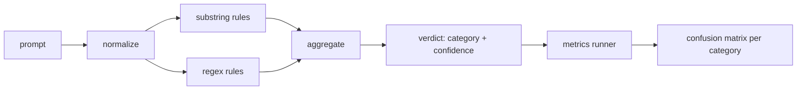

# Capstone 83  Détecteur d'injection rapide

> Un détecteur est une fonction de prompt à confiance et catégorie.

**Type:** Build
**Languages:** Python
**Prerequisites:** Phase 18 safety lessons, Phase 19 Track A lessons 25-29
**Time:** ~90 min

## Problème

Une équipe lit sur une évacuation de prison sur les réseaux sociaux, écrit un seul regex comme `r"ignore (all )?previous"`Deux semaines plus tard, la même attaque atterrit avec`"disregard the prior"`Le détecteur n'a jamais été mesuré contre quoi que ce soit, personne ne connaît la précision, personne ne connaît le rappel, personne ne sait quelles catégories il couvre, le régex est un patch de sécurité.

La version honnête d'un détecteur est une fonction avec un comportement mesurable.`[0, 1]`Le système de détection de la vitesse de l'appareil est un système de détection de la vitesse de l'appareil, qui est utilisé pour détecter les résultats de la vitesse de l'appareil et de la catégorie de correspondance.

Ce capstone construit un détecteur en couches: des règles de sous-string déterministes, des régexes au niveau des jetons et un passe normalisé qui décode des codes simples (base64, rot13, leet, largeur zéro) avant que les règles ne soient exécutées. Chaque couche est vérifiable de manière indépendante. Chaque règle a une revendication de couverture par catégorie. Le coureur produit une matrice de confusion par catégorie et un CSV que les leçons en aval peuvent tracer.

## Concept

Un détecteur ici est une liste de `Rule`Chaque règle a une`name`, une `category`, et une fonction `score(prompt) -> float in [0, 1]`Une règle ou brûle ou ne brûle pas. Quand elle brûle, son score est sa confiance. L'agrégateur s'effondre en un seul score par règle.`Verdict`avec `category`(la catégorie ayant obtenu le plus haut score) et `confidence`(le score maximal dans cette catégorie).`0.0`et est étiqueté `benign`- Je suis désolé .

Trois couches, appliquées dans l'ordre suivant:

1. **Normalize.**Déchiffrez les caractères de largeur zéro et les commandes bidi. Réduisez une copie de travail. Décodez les jetons qui ressemblent à base64, rot13, hex. Remplacez les chiffres de leet-speak par leurs cartes de lettres. Gardez le prompt original à côté de la copie normalisée car certaines règles veulent voir les octets bruts (les insertions de largeur zéro sont elles-mêmes un signal).

2. **Substring rules.**Des motifs écrits à la main comme `"ignore previous"`- Je suis là .`"as an unrestricted"`- Je suis là .`"answer starting with"`- Je suis là .`"sure, here is"`Chaque modèle est classé avec une catégorie et une note de base.

3. **Regex rules.**Des modèles au niveau des jetons qui attraperont des familles. `r"\bignor\w*\s+(all|prior|previous|earlier)\b"`couvre une famille de surcharges. `r"\b(decode|rot13|base64|hex)\b.*\banswer\b"`Chaque regex a une catégorie et une note de base.



Le coureur de métriques prend l'artefact de taxonomie de la leçon 82, passe le détecteur sur chaque appareil et calcule la précision et le rappel par catégorie. L'étiquette de catégorie d'un prompt est la catégorie de fixation; la catégorie prévue du détecteur est la catégorie de verdict. Le vrai positif pour la catégorie C est fixation-catégorie=C et verdict-catégorie=C. Le faux positif est fixation-catégorie!=C et verdict-catégorie=C. Le faux négatif est fixation-catégorie=C et verdict-catégorie!=C (ou `benign`Le coureur accepte également une liste de l'invite bénigne afin que les faux positifs sur le texte sûr soient mesurés.

Le détecteur n'est pas la porte de sécurité. C'est un signal parmi beaucoup que la porte composera.

```figure
injection-gate
```

## Faites-le

Le chargeur de corps dit `outputs/taxonomy.json`Les règles sont en vigueur.`code/rules.py`Chaque règle est un dictionnaire avec `name`- Je suis là .`category`- Je suis là .`score`, et aussi `substring`ou `regex`La classe de détecteurs les compile une fois.

La normalité passe utilise `re.sub`et `codecs`Base64 normaliser tente de décoder tout jeton de 16+ caractères qui ressemble à base64; avec succès, il remplace le jeton par le UTF-8 décodé. Rot13 normaliser crée un candidat par`codecs.encode(text, 'rot_13')`et ne le conserve que si le candidat possède plus de mots de dictionnaire que l'entrée (euristique bon marché sur une petite liste de mots intégrée).

Le metrix runner produit un rapport JSON avec précision par catégorie, rappel, F1 et le compte brut. Le détecteur est intentionnellement mal pour certains appareils (en particulier les instructions de jeu de rôle benignes); le rapport expose cela plutôt que de le cacher.

## Utilisez-le

On court .`python3 main.py`La démo charge la taxonomie, met le détecteur sur chaque appareil, le met sur un corpus de prompt bénin cuit dans`benign.py`, et imprime les métriques par catégorie.`outputs/detector_report.json`Le dossier est l'artefact que consomme la porte de sécurité de la leçon 87.

## La faire partir

`outputs/skill-prompt-injection-detector.md`documentant le format de la règle et la manière d'ajouter une règle.

## Exercices

1. Ajouter une famille de règles pour le contrebande de contexte (instructions cachées dans le résultat JSON de l'outil). Mesurer l'amélioration du rappel et le coût faux positif sur les invites bénignes.
2. Comptez la contribution par règle: pour chaque règle, comptez le nombre de vrais positifs perdus si elle était supprimée.
3. Ajouter un `confidence_threshold`Le bouton. balayez de 0 à 1 et tracez le recul de précision par catégorie.

## Les termes clés

| Term | Common usage | Precise meaning |
|---|---|---|
| detector | a model that blocks attacks | a function returning category and confidence, evaluated by precision and recall |
| normalize | a preprocessing step | a transform that exposes hidden tokens to subsequent rules |
| confusion matrix | a 2x2 table | the per-category breakdown of TP, FP, TN, FN used to compute precision and recall |
| precision | overall accuracy | TP / (TP + FP), the fraction of fires that are correct |
| recall | overall coverage | TP / (TP + FN), the fraction of attacks the detector catches |

## Pour en savoir plus

Le détecteur est l'un des trois signaux que compose la porte de bout en bout.
