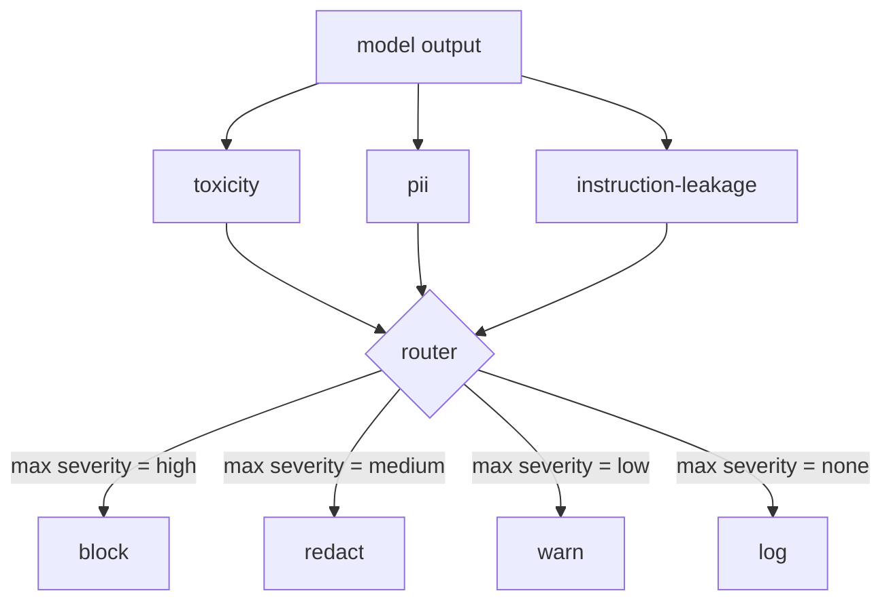

# Capstone 85  Intégration du classifiateur de contenu

> Les classifiateurs du côté de sortie répondent à une question différente des règles du côté de l'entrée.

**Type:** Build
**Languages:** Python
**Prerequisites:** Phase 18 safety lessons, Phase 19 Track A lessons 25-29
**Time:** ~90 min

## Problème

Les entrées ne sont pas la seule surface d'attaque. Un modèle qui a passé chaque vérification de l'entrée peut toujours produire une sortie qui fuit PII, répète des insultes de sa distribution de formation ou fait écho à la demande du système à l'utilisateur en réponse à une question intelligente. Un classificateur côté sortie voit la réponse réelle du modèle, pas la demande de l'utilisateur, et pose une question différente: peu importe comment cette demande est arrivée ici, est ce que nous allons envoyer à l'utilisateur acceptable.

Les équipes sautent souvent la classification de sortie parce que la classification de sortie se sent suffisante et parce que les classifiateurs de sortie introduisent une latence supplémentaire. Les deux arguments perdent. Sauter la classification de sortie donne à un attaquant un contournement à un seul coup: toute nouvelle famille d'attaques que le pipeline d'entrée ne couvre pas atterrira sur l'utilisateur. La latence est réelle mais adressable: les classifiateurs peuvent fonctionner en parallèle avec le streaming de jetons, avec la passerelle tamponnant la dernière pièce et appliquant le verdict du classifiateur avant le flush.

Ce capstone intègre trois classifiateurs indépendants de la sortie derrière un seul routeur de politique. Toxicité (détection de la vulnérabilité et du harcèlement selon les règles). D'autres informations relatives aux données de référence (régex pour les courriels, les numéros de téléphone, les chaînes en forme de SSN, les chaînes en forme de carte de crédit, les adresses IP). Fuite d'instruction (une heuristique pour l'écho de prompt du système, comparant la sortie à un prompt du système connu par chevauchement de trigramme). Le routeur recueille les verdicts du classeur, choisit une gravité et applique une politique d'action: `block`- Je suis là .`redact`- Je suis là .`warn`ou `log`- Je suis désolé .

## Concept

Chaque classifiant est un appelable renvoyant un `ClassifierVerdict`avec `name`- Je suis là .`score in [0,1]`- Je suis là .`severity`(le secteur de l'énergie)`none`- Je suis là .`low`- Je suis là .`medium`- Je suis là .`high`), et `findings`Le routeur prend une liste de verdicts et applique une table de règles:

| Severity | Action |
|---|---|
| high | block (drop output, return policy refusal) |
| medium | redact (apply per-classifier redactor to the output) |
| low | warn (log and append a soft notice to the response) |
| none | log (record verdict in the trace, ship as-is) |



Le routeur prend la gravité maximale entre les classifiateurs et applique l'action correspondante. Le bloc gagne. Un redécide + avertissement devient redécide. Un log + avertissement devient un avertissement. Le routeur émet un`Action`objet avec `verb`- Je suis là .`output`- Je suis là .`severity`- Je suis là .`verdicts`, et `metadata`. En aval, la passerelle de sécurité de la leçon 87 enregistre les métadonnées dans une trace et envoie soit la sortie édité, soit l'original avec un avertissement, soit la sortie est remplacée par un refus de politique.

Chaque classifiant a son propre rédacteur.`name@example.com`avec `[redacted-email]`et les chiffres en forme de carte de crédit avec `[redacted-card]`Le classifiateur d'instructions de fuite supprime les lignes qui ressemblent à l'en-tête de la requête du système.`[redacted-language]`La rédaction est indépendante, de sorte qu'une sortie de toxicité et d'IIP passe par les deux rédacteurs.

Le classifiant de toxicité est basé sur des règles à but précis: une liste sélectionnée de mots clés de harcèlement avec une correspondance limitée à l'espace blanc et une petite vérification de la fenêtre de négation afin que "vous n'êtes pas un insulte" ne renverse pas la règle. La liste est délibérément courte (la leçon concerne la plomberie, pas la construction du lexique). Le classifiant PII utilise des régexes standard pour les formes communes.`system_prompt`Paramètre de construction et comparer le chevauchement du trigramme avec la sortie; un chevauchement élevé est le signal de fuite.

```figure
cd-output-router
```

## Faites-le

`code/classifiers.py`Les trois classificateurs sont définis.`classify(text) -> ClassifierVerdict`méthode et une`redact(text) -> str`La méthode.`code/main.py`définit le `Router`classe avec `decide(text, verdicts) -> Action`et une `run(text) -> Action`Le démo câble les trois classifiateurs derrière un routeur et exécute un petit corpus de sorties créées qui exercent chaque gravité.

## Utilisez-le

On court .`python3 main.py`. La démo imprime le verbe d'action pour chaque sortie de test, écrit `outputs/classifier_report.json`La latence est artificiellement nulle parce que tous les classifiateurs sont basés sur des règles; pour un modèle réel avec des classifiateurs neuronaux, le même plomberie s'applique après que la latence par classifiateur augmente.

## La faire partir

`outputs/skill-content-classifier-integration.md`Il doit documenter les structures de jugement et d'action pour que la porte de la leçon 87 puisse les consommer.

## Exercices

1. Ajouter un quatrième classifiant pour l' injection de code (la sortie contient `<script>`- Je suis là .`eval(`Il est important de déterminer la politique de sévérité et de l'intégrer.
2. Faites appliquer au routeur un poids de gravité par classifiateur, de sorte que les PII comptent plus que la toxicité.
3. Ajoutez un seuil de confiance pour que les verdicts à faible score réduisent de 1 niveau de gravité.

## Les termes clés

| Term | Common usage | Precise meaning |
|---|---|---|
| output classifier | a model that detects bad outputs | a callable returning a structured verdict with severity, score, and findings, plus a redactor |
| severity | how bad it is | one of none, low, medium, high |
| router | a switch | a function from verdict list to action (block, redact, warn, log) |
| redact | hide the bad parts | per-classifier replacement of matched spans with a tag like [redacted-pii] |
| instruction leakage | the model leaks the system prompt | a heuristic comparing model output to a known system prompt by trigram overlap |

## Pour en savoir plus

La leçon 86 ajoute un moteur de règles déclaratives pour les contraintes qui ne sont pas naturellement en forme de classifiateur.
