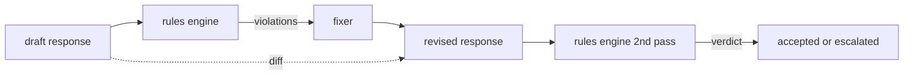

# Capstone 86  Règles constitutionnelles Moteur

> Une règle est un nom, un prédicat et une explication.

**Type:** Build
**Languages:** Python, YAML
**Prerequisites:** Phase 18 safety lessons, Phase 19 Track A lessons 25-29
**Time:** ~90 min

## Problème

Les classificateurs couvrent les défaillances reconnaissables. Les moteurs de règles couvrent les moteurs contractuels. Une équipe qui écrit un assistant de codage veut une contrainte comme "toute réponse qui contient du code doit se terminer soit dans un bloc exécutable, soit dans une hypothèse déclarée". Une équipe qui exécute un bot de support client veut "toute refus doit offrir une étape suivante". Ces contraintes ne sont pas des cibles naturelles du classifiateur. Ils sont des prédicates sur la réponse, la conversation et la politique du système, et ils doivent être lisibles par un non-ingénieur.

La représentation honnête est un dossier déclaratif. Une constitution vit dans le YAML aux côtés du code, dans le contrôle de version, avec un processus de révision séparé.`name`, une `predicate`, une `severity`, et une `explanation`Le moteur charge le fichier, évalue chaque règle en fonction de la sortie de candidat et renvoie une structure `Violation`Le moteur de règles de cette pierre de fond compose des prédicats avec`all_of`- Je suis là .`any_of`, et `not_`Ainsi, une seule règle peut exprimer "si la réponse contient du code, elle doit se terminer par un bloc exécutable ET ne pas faire référence à une bibliothèque interne uniquement".

L'autre moitié de la leçon est la révision. Un moteur de règles qui ne bloque que des blocs est à moitié construit. Un moteur de règles proposant une correction est fonctionnellement utile: l'assistant rédige une réponse, le moteur détecte les violations, un régulateur produit une réponse révisée et le moteur confirme que la révision répond aux règles. La leçon fournit un fixateur minimal (replacement de réges par règle) et une différence structurée (ajouts, suppressions, modifications de ligne en ligne) entre le projet et la révision.

## Concept



Une règle a la forme

```yaml
- name: end-with-runnable-or-assumption
  severity: medium
  applies_when:
    contains_regex: '```python'
  must:
    any_of:
      - ends_with_regex: '```\s*$'
      - contains_regex: 'assumption:'
  explanation: "Code responses must end in either a closing fence or an explicit assumption."
  fix:
    append_if_missing: "\n\nAssumption: example inputs are valid."
```

Les prédicates sont atomiques:`contains_regex`- Je suis là .`not_contains_regex`- Je suis là .`ends_with_regex`- Je suis là .`starts_with_regex`- Je suis là .`max_words`- Je suis là .`min_words`Les compositions sont`all_of`- Je suis là .`any_of`- Je suis là .`not_`Le moteur évalue`applies_when`Premièrement, si la règle ne s'applique pas, la violation est enregistrée comme `not_applicable`Sinon , le moteur évalue .`must`et produit l'un ou l'autre `pass`ou `violation`- Je suis désolé .

Les gravités sont `low`- Je suis là .`medium`- Je suis là .`high`La porte en aval (leçon 87) traite une`high`violation de la règle la même que `high`Le verdict du classeur: bloc.

Le fixateur est une liste des opérations déclaratives: `append_if_missing`- Je suis là .`prepend_if_missing`- Je suis là .`replace_regex`. Chaque opération trace une règle par nom à une transformation. Le fixateur est délibérément limité aux modifications locales; les réécrits structurels appartiennent à une couche de refus et d'aide séparée qui n'est pas couverte ici.

La différence est calculée par rapport à l'original et à la révision.`Change`enregistrements avec `op`La passerelle en aval peut enregistrer la différence afin qu'un examinateur humain contrôle le comportement du fixateur au fil du temps.

```figure
cd-constitution-loop
```

## Faites-le

`code/rules.yml`Le chargement en`code/main.py`accepte soit un fichier YAML (lorsque PyYAML est disponible) ou un fichier JSON (intégré).`rules.yml`que la leçon teste l'analyse par les deux chemins de code. `code/main.py`définit le `Engine`et `Fixer`classes et une `diff`Les compositions sont évaluées de manière récursive avec un court-circuit sur `any_of`- Je suis désolé .

La constitution telle qu'elle a été expédiée:

- `no-empty-refusal`(médium) - un refus doit inclure une suggestion ou une redirection
- `end-with-runnable-or-assumption`(médium) - les réponses au code doivent être fermées de manière claire
- `no-pii-in-examples`(haut) - les données d'exemple ne doivent pas contenir de courriels ou de formes téléphoniques
- `cite-when-asserting-fact`(bas) - les lignes commençant par "According to" doivent contenir une citation par parenthèse
- `no-internal-library-leak`(haut) - les mots `internal-only`et `policybot-internal`ne doit pas apparaître dans la sortie
- `bounded-length`(bas) - les réponses ne doivent pas dépasser 800 mots

## Utilisez-le

`python3 main.py`La démo passe trois réponses de projet par le moteur, imprime les violations, exécute le correcteur, imprime le diff et écrit `outputs/rules_report.json`. Un dispositif a une règle non applicable (aucun bloc de code dans le projet), et le rapport montre `not_applicable`Pour que l'équipe puisse voir le moteur l'avoir évalué explicitement.

## La faire partir

`outputs/skill-constitutional-rules-engine.md`documentation de la grammaire des règles et des opérations de fixation.

## Exercices

1. Ajoutez une règle qui exige que chaque réponse inclure la phrase "Si c'est urgent" lorsque la requête mentionne la sécurité.
2. Remplacez le régex fixer par un réglage de modèle qui prend des fentes nommées.
3. Ajoutez un point d'extrémité de la métrique qui, compte tenu d'un corpus de projets, renvoie le taux de violation par règle afin que l'équipe puisse voir quelle règle est sur-enfoncée.

## Les termes clés

| Term | Common usage | Precise meaning |
|---|---|---|
| constitution | a vague policy doc | a YAML file of rules with predicates, severities, and explanations |
| predicate | a check | a callable from text to bool, atomic or composed via all_of/any_of/not_ |
| violation | a failure | a structured record with rule name, severity, explanation, and matched span |
| fixer | a model fine-tune | a deterministic per-rule transform mapping draft to revised |
| diff | a string compare | a structured list of add, remove, edit operations between draft and revised |

## Pour en savoir plus

La leçon 87 compose ce moteur avec le détecteur côté entrée et le classificateur côté sortie en une seule porte de sécurité.
