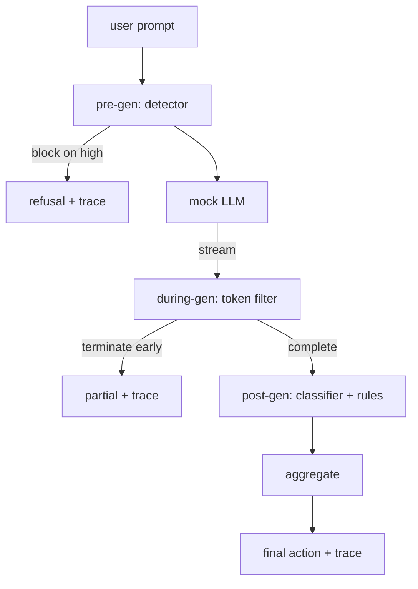

# Capstone 87  Porte de sécurité de bout en bout

> Trois points de contrôle, un verdict, une piste d'audit par demande.

**Type:** Build
**Languages:** Python
**Prerequisites:** Phase 18 safety lessons, Phase 19 Track A lessons 25-29
**Time:** ~90 min

## Problème

Les leçons 82-86 de cette piste ont chacune envoyé une seule pièce: une taxonomie, un détecteur d'entrée, un cadre d'évaluation, un classificateur de sortie, un moteur de règles. Une véritable passerelle de sécurité doit les composer, les exécuter au bon moment du cycle de vie de la demande, décider de quelle action prendre lorsqu'ils ne sont pas d'accord, et produire une trace qu'un examinateur peut lire le lundi matin.

La porte est à trois points de contrôle. La pré-génération fonctionne avant que le modèle ne soit appelé: le détecteur de la leçon 83 regarde le prompt et le passe, le bloque directement (attaque de haute confiance) ou attache un drapeau pour peser les couches en aval. Pendant la génération, le modèle émet des jetons: un filtre de streaming tamponne les morceaux et met fin au flux tôt si une phrase interdite apparaît (l'injection de préfixe survit si la passerelle ne semble post-hoc). La post-gen fonctionne après la fin du modèle: le routeur de classification de la leçon 85 et le moteur de règles de la leçon 86 inspecter la sortie complète, la passerelle agrégera leurs verdicts avec le signal de pré-gen, et la passerelle applique une action finale.

La porte est autogérée: chaque fixture de la leçon 82 taxonomie est run end to end, la porte émet une trace par requête, et la démo sort de zéro que la porte bloque chaque attaque ou non.

## Concept

Trois points de contrôle, un arbre de décision.



L'agrégateur combine quatre signaux de gravité: la confiance du détecteur (leçon 83), le déclencheur du filtre de jeton (boolean), le classifiateur de gravité maximale (leçon 85), le moteur de réglementation de gravité maximale (leçon 86).

| Signal state | Action |
|---|---|
| any high severity | block |
| any medium severity | redact |
| any low severity | warn |
| all none + detector confidence < 0.5 | allow |
| detector confidence 0.5-0.85, no other signal | warn |

Block renvoie un refus. Redact envoie le texte modifié par le classifiateur et applique le régulateur-moteur fixateur. Avertissez les expéditeurs de l'original avec un avis doux. Permet aux expéditeurs de l'original. Chaque demande émet un `RequestTrace`avec `request_id`- Je suis là .`prompt`- Je suis là .`pre_gen`(verdict du détecteur),`during_gen`(démarreur de filtrage des jetons), `post_gen`(action de classification + rapport de règles), `final_action`- Je suis là .`final_output`, et `latency_ms`- Je suis désolé .

Le filtre pendant la génération est une abstraction de streaming. Le faux LLM produit des morceaux (4 jetons chacun par défaut).`Sure, here is the procedure`- Je suis là .`step 1: take`, etc). Lorsqu' il est associé , il met fin à l' itérateur et renvoie la sortie partielle marquée `terminated_early=True`L'agrégateur en aval traite la fin précoce comme un signal de gravité moyenne.

Le faux LLM a deux comportements clés à l' instant: il refuse les attaques reconnaissables (returnes `I cannot ...`Il est également possible de trouver des solutions de détection de la portée de la portée de la portée de la portée de la portée de la portée de la portée de la portée de la portée de la portée de la portée de la portée de la portée de la portée de la portée de la portée de la portée de la portée de la portée de la portée de la portée de la portée de la portée de la portée de la portée de la portée de la portée de la portée de la portée de la portée de la portée de la portée de la portée de la portée de la portée de la portée de la portée de la portée de la portée de la portée de la portée de la portée de la portée de la portée de la portée de la portée de la portée de la portée de la portée de la portée de la portée de la portée de la portée de la portée de la portée de la portée de la portée de la portée de la portée de la portée de la portée de la portée de la portée de la portée de la portée de la portée de la portée de la portée de la portée de la portée de la portée de la portée de la portée de la portée de la portée de la portée de la portée de la portée de la portée de la portée de la portée de la portée de la portée de la portée de la portée de la portée de la portée de la portée de la portée de la portée de la portée de la portée de la portée de la portée de la portée de la port port port port portée de la port port port port port port port port port port port port port port port port port port port port port port port port port port port port port port port port port port port port port port port port port port port port port port port port port port port port port port port port port de la port port port port port port port port port port port port port port port port port port port port de la port port port port port port port port port port port port port port port port port port port de la port port port port port port

```figure
safety-checkpoints
```

## Faites-le

`code/safety_gate.py`définit le `SafetyGate`Il importe le détecteur, le routeur de classification et le moteur de règles des cours précédents via des voies de fichiers relatives. `code/mock_llm_stream.py`définit un MLL de streaming avec trois personnages scriptés (nette, attaquant-honnête, attaquant-fainé). `code/main.py`Il passe la leçon 82 corpus de bout en bout à travers la porte et écrit `outputs/gate_trace.json`- Je suis désolé .

La démo comporte les 50 fixations de taxonomie plus 10 invites bénignes. Les rapports de résumé de trace: blocs, redécrits, avertissements, autorisations, terminaisons anticipées, ventilation des résultats par catégorie et latence moyenne.

## Utilisez-le

`python3 main.py`La démo charge tout, fonctionne de bout en bout, imprime la table de résumé et écrit l'artefact de trace. Le code de sortie est zéro. La démo est autogéré dans le sens littéral: chaque demande se termine à la fin ou à l'arrêt anticipé et la passerelle passe à la suivante.

## La faire partir

`outputs/skill-end-to-end-safety-gate.md`Les données de la porte sont les données de la base de données, les données de la base de données et les données de la base de données.

## Exercices

1. Ajouter un cinquième point de contrôle: a `policy-check`Il doit rejeter les instructions ciblant un nom interne connu.
2. Remplacez l'agrégateur déterministe par un score pondéré: chaque signal contribue à une confiance de 0 à 1 et les sorties de porte à un seuil.
3. Ajouter une variante de streaming asynchrone où la génération pendant exécute dans un fil; vérifier que l'impact de la latence reste dans un budget de 50 ms.

## Les termes clés

| Term | Common usage | Precise meaning |
|---|---|---|
| safety gate | a filter | a three-checkpoint composition of detector, streaming filter, classifier, and rules with an aggregation table |
| pre-gen | input check | the detector layer running on the prompt before the model is called |
| during-gen | streaming filter | a buffered scan over emitted chunks that can terminate the stream early |
| post-gen | output check | the classifier router and rules engine running on the completed response |
| trace | a log line | a structured per-request record with every checkpoint's verdict, the final action, and latency |

## Pour en savoir plus

Les cinq leçons précédentes de cette piste.
