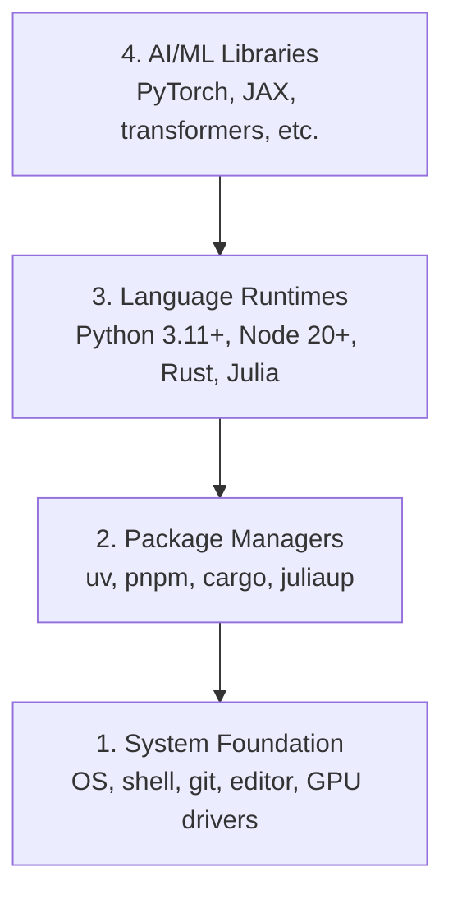

# विकास पर्यावरण

> आपके उपकरण आपकी सोच को आकार देते हैं, उन्हें एक बार सेट करें, उन्हें सही तरीके से सेट करें।

**Type:** Build
**Languages:** Python, Node.js, Rust
**Prerequisites:** None
**Time:** ~45 minutes

## सीखने के लक्ष्य

- पायथन 3.11+, नोड.जेएस 20+, और रस्ट टूलचैन को खरोंच से सेट करें
- पुनः प्रयोज्य बिल्ड के लिए वर्चुअल वातावरण और पैकेज प्रबंधक कॉन्फ़िगर करें
- CUDA/MPS के साथ GPU एक्सेस की जांच करें और एक टेस्ट टेंसर ऑपरेशन चलाएं
- चार-परत स्टैक को समझेंः सिस्टम, पैकेज, रनटाइम, एआई लाइब्रेरी

## समस्या

आप पायथन, टाइपस्क्रिप्ट, रुस्ट और जूलिया का उपयोग करके 500 से अधिक पाठों में एआई इंजीनियरिंग सीखने वाले हैं। यदि आपका वातावरण टूट जाता है, तो प्रत्येक पाठ सीखने के बजाय उपकरण बनाने के खिलाफ लड़ाई बन जाता है।

अधिकांश लोग पर्यावरण सेटअप छोड़ देते हैं, फिर वे आयात त्रुटियों, संस्करण संघर्षों और गायब CUDA ड्राइवरों डिबगिंग के लिए घंटे बिताते हैं. हम इसे एक बार करने जा रहे हैं, ठीक से.

## अवधारणा

एआई इंजीनियरिंग वातावरण में चार परतें होती हैंः



हम नीचे से ऊपर स्थापित करते हैं. प्रत्येक परत उसके नीचे की एक पर निर्भर करता है.

```figure
s0-env-stack
```

## इसे बनाओ

### चरण 1: सिस्टम फाउंडेशन

अपने सिस्टम की जाँच करें और मूल बातें स्थापित करें.

```bash
# macOS
xcode-select --install
brew install git curl wget

# Ubuntu/Debian
sudo apt update && sudo apt install -y build-essential git curl wget

# Windows (use WSL2)
wsl --install -d Ubuntu-24.04
```

### चरण 2: यूवी के साथ पायथन

हम उपयोग करते हैं`uv` यह पाइप से 10-100 गुना तेज है और आभासी वातावरण को स्वचालित रूप से संभालता है।

```bash
curl -LsSf https://astral.sh/uv/install.sh | sh

uv python install 3.12

uv venv
source .venv/bin/activate  # or .venv\Scripts\activate on Windows

uv pip install numpy matplotlib jupyter
```

सत्यापित करेंः

```python
import sys
print(f"Python {sys.version}")

import numpy as np
print(f"NumPy {np.__version__}")
a = np.array([1, 2, 3])
print(f"Vector: {a}, dot product with itself: {np.dot(a, a)}")
```

### चरण 3: pnpm के साथ Node.js

टाइपस्क्रिप्ट पाठों (एजेंट, एमसीपी सर्वर, वेब ऐप) के लिए।

```bash
curl -fsSL https://fnm.vercel.app/install | bash
fnm install 22
fnm use 22

npm install -g pnpm

node -e "console.log('Node', process.version)"
```

**macOS / Apple Silicon (M1/M2/M3/M4):**यदि इंस्टॉलर के साथ बंद हो जाता है `Error: Cannot install under Rosetta 2 in ARM default prefix (/opt/homebrew)`, आपका टर्मिनल Rosetta 2 के तहत चल रहा है (`arch`छापें `i386`जबकि Homebrew एक मूल arm64 निर्माण है. fnm बल arm64 स्थापित करें, इसे अपने खोल में तार, फिर ऊपर से आदेशों को फिर से चलाएँ.`fnm install 22`:

```bash
arch -arm64 brew install fnm
echo 'eval "$(fnm env --use-on-cd)"' >> ~/.zshrc
source ~/.zshrc
```

### चरण 4: जंग

प्रदर्शन-महत्वपूर्ण पाठों के लिए (उल्लेखना, प्रणालियों)

```bash
curl --proto '=https' --tlsv1.2 -sSf https://sh.rustup.rs | sh

rustc --version
cargo --version
```

### चरण 5: जूलिया (वैकल्पिक)

गणित के भारी पाठों के लिए जहां जूलिया चमकती है।

```bash
curl -fsSL https://install.julialang.org | sh

julia -e 'println("Julia ", VERSION)'
```

### चरण 6: GPU सेटअप (यदि आपके पास एक है)

**NVIDIA (Linux / Windows):**

```bash
nvidia-smi

# Install PyTorch with CUDA
uv pip install torch torchvision torchaudio --index-url https://download.pytorch.org/whl/cu124
```

**macOS / Apple Silicon (M1/M2/M3/M4):**मैक पर कोई CUDA नहीं है जो अपेक्षित है, कोई विफलता नहीं है।**not**पास `--index-url .../cuXXX`(वे पहियों केवल लिनक्स / विंडोज हैं, इसलिए स्थापना विफल होती है) सादा बिल्ड स्थापित करें, जिसमें एप्पल के एमपीएस (मेटल) जीपीयू बैकेंड शामिल हैः

```bash
uv pip install torch torchvision torchaudio
```

सत्यापित करें (किसी भी प्लेटफॉर्म पर काम करता है):

```python
import torch
print(f"CUDA available: {torch.cuda.is_available()}")           # False on macOS — expected
print(f"MPS available:  {torch.backends.mps.is_available()}")   # True on Apple Silicon
if torch.cuda.is_available():
    print(f"GPU: {torch.cuda.get_device_name(0)}")
```

कोई GPU नहीं? कोई समस्या नहीं. अधिकांश पाठ CPU पर काम करते हैं. प्रशिक्षण-भारी पाठ के लिए, Google Colab या क्लाउड GPU का उपयोग करें.

### चरण 7: जिस मार्ग से आप आरंभ करना चाहते हैं, उसे सत्यापित करें

इस पाठ में प्रत्येक आदेश को भंडारण रूट से चलाएं, निर्देशिका जो
`README.md`और `phases/`उड़ान से पहले केवल वही जांचता है जो आपको चाहिए
यह बाद के उपकरणों को डिफ़ॉल्ट रूप से छोड़ देता है ताकि एक नया छात्र देख सके
चेतावनी की दीवार के बजाय एक स्पष्ट उत्तर।

शुरुआत की पूरी अनुक्रम शुरू करेंः

```bash
python3 phases/00-setup-and-tooling/01-dev-environment/code/verify.py --route beginner
```

या केवल मार्ग की जाँच करें आप चाहते हैंः

```bash
python3 phases/00-setup-and-tooling/01-dev-environment/code/verify.py --route ml-foundations
python3 phases/00-setup-and-tooling/01-dev-environment/code/verify.py --route llm-engineering
python3 phases/00-setup-and-tooling/01-dev-environment/code/verify.py --route agents
python3 phases/00-setup-and-tooling/01-dev-environment/code/verify.py --route mcp
python3 phases/00-setup-and-tooling/01-dev-environment/code/verify.py --route agent-skills
python3 phases/00-setup-and-tooling/01-dev-environment/code/verify.py --route certification
```

जोड़ें `--show-later`जब आप वैकल्पिक उपकरण का निरीक्षण करने के लिए एक ही पूर्व उड़ान चाहते हैं
एक अनुपस्थित बाद के उपकरण कभी भी
चयनित मार्ग।

प्रत्येक असफल आवश्यक जांच में पता चला पथ या आयात त्रुटि और एक
एजेंट कौशल और प्रमाणन मार्गों भी दिखाता है
मैनुअल होस्ट जांच क्योंकि एक पायथन स्क्रिप्ट साबित नहीं कर सकता है कि एक एआई होस्ट है
किसी कौशल की खोज की या आपके द्वारा चुने गए कौशल का दायरा लिखना योग्य है।

जब शुरुआती प्री-फ्लाइट गुजरता है, यह सटीक पहला चलाने योग्य पाठ प्रिंट करता हैः

```text
Ready to start Beginner course.
Next: python3 phases/01-math-foundations/01-linear-algebra-intuition/code/vectors.py
```

## इसका प्रयोग करें

आपके पर्यावरण को आपके द्वारा जाँच किए गए मार्ग को शुरू करने के लिए तैयार है। बाद के उपकरण स्थापित करें
जब एक पाठ आपके पहले पाठ को पूरी तरह से अवरुद्ध करने के बजाय उनके लिए पूछता है
यहाँ है कि आप पाठ्यक्रम में उपयोग करेंगेः

| Language | Used In | Package Manager |
|----------|---------|-----------------|
| Python | Phases 1-12 (ML, DL, NLP, Vision, Audio, LLMs) | uv |
| TypeScript | Phases 13-17 (Tools, Agents, Swarms, Infra) | pnpm |
| Rust | Phases 12, 15-17 (Performance-critical systems) | cargo |
| Julia | Phase 1 (Math foundations) | Pkg |

## इसे भेजें

इस पाठ में एक सत्यापन स्क्रिप्ट उत्पन्न होती है जिसे कोई भी अपनी सेटिंग की जांच करने के लिए चला सकता है।

देखो`outputs/prompt-env-check.md`एक संकेत के लिए जो एआई सहायकों को पर्यावरण के मुद्दों का निदान करने में मदद करता है।

## व्यायाम

1. सत्यापन स्क्रिप्ट चलाएँ और किसी भी विफलता को ठीक करें
2. इस पाठ्यक्रम के लिए एक पायथन आभासी वातावरण बनाएं और PyTorch स्थापित करें
3. चार भाषाओं में "हैलो वर्ल्ड" लिखें और प्रत्येक को चलाएं
