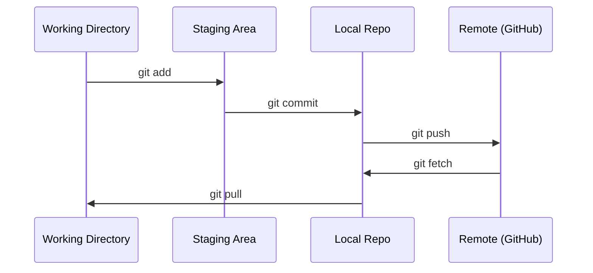

# Git & सहयोग

> प्रत्येक प्रयोग, प्रत्येक मॉडल, प्रत्येक पाठ जो आप यहां बनाते हैं, उसका ट्रैक किया जाता है।

**Type:** Learn
**Languages:** --
**Prerequisites:** Phase 0, Lesson 01
**Time:** ~30 minutes

## सीखने के लक्ष्य

- git पहचान को कॉन्फ़िगर करें और जोड़ने, प्रतिबद्ध करने और पुश के दैनिक कार्यप्रवाह का उपयोग करें
- बिना किसी प्रमुख टूटने के अलग-अलग प्रयोगों के लिए शाखाएं बनाएं और मिलाएं
- एक लिखें `.gitignore`जो मॉडल चेकपोइंट और बड़ी बाइनरी फाइलों को छोड़कर
-  के साथ प्रतिबद्धता इतिहास में नेविगेट करें`git log`परियोजना विकास को समझने के लिए

## समस्या

आप 20 चरणों में सैकड़ों कोड फ़ाइलें लिखने के बारे में हैं। बिना संस्करण नियंत्रण आप काम खो देंगे, आप चीजों को तोड़ देंगे आप रद्द नहीं कर सकते, और दूसरों के साथ सहयोग करने का कोई तरीका नहीं होगा।

Git उपकरण है. GitHub जहां कोड रहता है. यह सबक आप इस पाठ्यक्रम के लिए क्या जरूरत है और कुछ भी नहीं कवर.

## अवधारणा



तीन बातें याद रखनाः
1. अक्सर बचत करें (`git commit`)
2. दूरस्थ पर धक्का (`git push`)
3. प्रयोगों के लिए शाखा (`git checkout -b experiment`)

```figure
s0-commit-dag
```

## इसे बनाओ

### चरण 1: git को कॉन्फ़िगर करें

```bash
git config --global user.name "Your Name"
git config --global user.email "you@example.com"
```

### चरण 2: दैनिक कार्यप्रवाह

```bash
git status
git add file.py
git commit -m "Add perceptron implementation"
git push origin main
```

### चरण 3: प्रयोगों के लिए शाखा

```bash
git checkout -b experiment/new-optimizer

# ... make changes, commit ...

git checkout main
git merge experiment/new-optimizer
```

### चरण 4: इस पाठ्यक्रम रेपो के साथ काम करना

आप पाठ्यक्रम रेपो खुद को धक्का नहीं कर सकते  केवल रखरखावकर्ताओं को लिखने की पहुंच है. इसे पहले GitHub पर फोर्क (फोर्क बटन, शीर्ष दाएं) तो `origin`अपने स्वयं के प्रति में अंकः

```bash
git clone https://github.com/YOUR-USERNAME/ai-engineering-from-scratch.git
cd ai-engineering-from-scratch

git checkout -b my-progress
# work through lessons, commit your code
git push origin my-progress
```

## इसका प्रयोग करें

इस कोर्स के लिए, आपको इन आदेशों की आवश्यकता हैः

| Command | When |
|---------|------|
| `git clone` | Get the course repo |
| `git add` + `git commit` | Save your work |
| `git push` | Back it up to GitHub |
| `git checkout -b` | Try something without breaking main |
| `git log --oneline` | See what you've done |

यह है, आप इस पाठ्यक्रम के लिए रीबेस, चेरी-पिक, या उप मॉड्यूल की जरूरत नहीं है.

## व्यायाम

1. इस रेपो फोर्क, अपने फोर्क क्लोन, एक शाखा का निर्माण कहा जाता है`my-progress`, एक फ़ाइल बनाने, इसे प्रतिबद्ध, इसे धक्का
2. एक बनाओ `.gitignore`जो कि चेकपॉइंट फाइलों के मॉडल को छोड़कर (`.pt`,`.pth`,`.safetensors`)
3. इस रेपो के साथ प्रतिबद्धता इतिहास को देखो `git log --oneline`और पढ़ें कि कैसे पाठों को जोड़ा गया

## प्रमुख शर्तें

| Term | What people say | What it actually means |
|------|----------------|----------------------|
| Commit | "Saving" | A snapshot of your entire project at a point in time |
| Branch | "A copy" | A pointer to a commit that moves forward as you work |
| Merge | "Combining code" | Taking changes from one branch and applying them to another |
| Remote | "The cloud" | A copy of your repo hosted somewhere else (GitHub, GitLab) |
