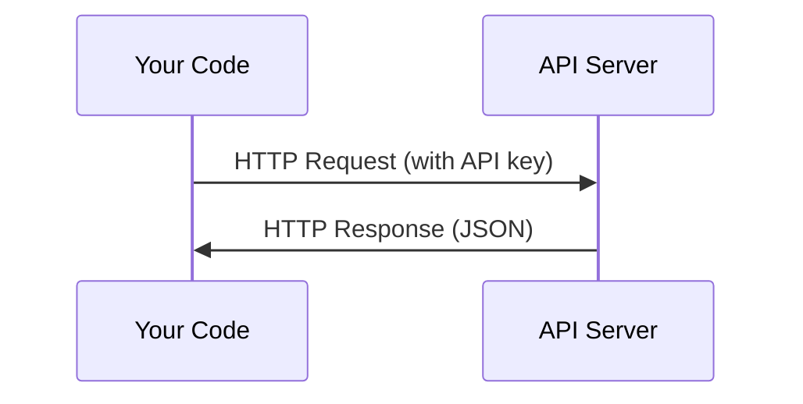

# एपीआई और कुंजी

> हर एआई एपीआई एक ही तरीके से काम करता हैः एक अनुरोध भेजें, एक प्रतिक्रिया प्राप्त करें। विवरण बदलते हैं, पैटर्न नहीं।

**Type:** Build
**Languages:** Python, TypeScript
**Prerequisites:** Phase 0, Lesson 01
**Time:** ~30 minutes

## सीखने के लक्ष्य

- पर्यावरण चर का उपयोग करके एपीआई कुंजी को सुरक्षित रूप से स्टोर करें और `.env`फ़ाइलें
- मानव पायथन एसडीके और कच्चे HTTP दोनों का उपयोग करके एलएलएम एपीआई कॉल करें
- डिबगिंग के लिए SDK आधारित और कच्चे HTTP अनुरोध/उत्तर प्रारूपों की तुलना करें
- प्रमाणीकरण और दर सीमाओं सहित सामान्य एपीआई त्रुटियों की पहचान और निपटान

## समस्या

चरण 11 से शुरू करते हुए, आप LLM API (एंट्रोपिक, ओपनएआई, गूगल) को कॉल करेंगे। चरण 13-16 में आप एजेंट बनाएंगे जो इन API का उपयोग लूप में करते हैं। आपको यह जानना होगा कि API कुंजी कैसे काम करती है, उन्हें सुरक्षित रूप से कैसे संग्रहीत किया जाए, और अपनी पहली API कॉल कैसे करें।

## अवधारणा



प्रत्येक एपीआई कॉल में हैः
1. एक अंत बिंदु (URL)
2. एपीआई कुंजी (प्रमाणन)
3. अनुरोध निकाय (आप क्या चाहते हैं)
4. एक प्रतिक्रिया शरीर (आप क्या वापस मिलता है)

```figure
s0-secret-inject
```

## इसे बनाओ

### चरण 1: सुरक्षित रूप से एपीआई कुंजी स्टोर करें

कभी भी एपीआई कुंजी को कोड में न डालें। पर्यावरण चर का उपयोग करें।

```bash
export ANTHROPIC_API_KEY="sk-ant-..."
export OPENAI_API_KEY="sk-..."
```

या एक `.env`फ़ाइल (इसका जोड़ें `.gitignore`):

```
ANTHROPIC_API_KEY=sk-ant-...
OPENAI_API_KEY=sk-...
```

### चरण 2: पहला एपीआई कॉल (पायथन)

```python
import os

import anthropic

client = anthropic.Anthropic()

MODEL = os.environ.get("LLM_MODEL", "claude-sonnet-5")

response = client.messages.create(
    model=MODEL,
    max_tokens=256,
    messages=[{"role": "user", "content": "What is a neural network in one sentence?"}]
)

print(response.content[0].text)
```

`LLM_MODEL`अन्य प्रदाता (ओपनएआई, गूगल, और अन्य) एक कुंजी के समान पैटर्न का पालन करते हैं, लेकिन प्रत्येक के पास अपना एसडीके, एंडपॉइंट और अनुरोध / प्रतिक्रिया योजना है।

### चरण 3: पहला एपीआई कॉल (टाइपस्क्रिप्ट)

```typescript
import Anthropic from "@anthropic-ai/sdk";

const client = new Anthropic();

const MODEL = process.env.LLM_MODEL ?? "claude-sonnet-5";

const response = await client.messages.create({
  model: MODEL,
  max_tokens: 256,
  messages: [{ role: "user", content: "What is a neural network in one sentence?" }],
});

console.log(response.content[0].text);
```

### चरण 4: कच्चे HTTP (कोई SDK)

```python
import os
import urllib.request
import json

url = "https://api.anthropic.com/v1/messages"
headers = {
    "Content-Type": "application/json",
    "x-api-key": os.environ["ANTHROPIC_API_KEY"],
    "anthropic-version": "2023-06-01",
}
body = json.dumps({
    "model": os.environ.get("LLM_MODEL", "claude-sonnet-5"),
    "max_tokens": 256,
    "messages": [{"role": "user", "content": "What is a neural network in one sentence?"}],
}).encode()

req = urllib.request.Request(url, data=body, headers=headers, method="POST")
with urllib.request.urlopen(req) as resp:
    result = json.loads(resp.read())
    print(result["content"][0]["text"])
```

यह है कि SDKs हुड के नीचे क्या करते हैं. कच्चे HTTP कॉल को समझने डिबगिंग करते समय मदद करता है.

## इसका प्रयोग करें

इस कोर्स के लिएः

| API | When you need it | Free tier |
|-----|-----------------|-----------|
| Anthropic (Claude) | Phases 11-16 (agents, tools) | $5 credit on signup |
| OpenAI | Phase 11 (comparison) | $5 credit on signup |
| Hugging Face | Phases 4-10 (models, datasets) | Free |

आपको अभी उन सभी की जरूरत नहीं है, उन्हें जब पाठ की आवश्यकता होगी, तब सेट करें।

## इसे भेजें

इस पाठ से उत्पन्न होता हैः
- `outputs/prompt-api-troubleshooter.md`- आम एपीआई त्रुटियों का निदान

## व्यायाम

1. एक मानव एपीआई कुंजी प्राप्त करें और अपनी पहली एपीआई कॉल करें
2. कच्चे HTTP संस्करण की कोशिश करें और प्रतिक्रिया प्रारूप की तुलना SDK संस्करण के साथ करें
3. जानबूझकर गलत एपीआई कुंजी का उपयोग करें और त्रुटि संदेश पढ़ें

## प्रमुख शर्तें

| Term | What people say | What it actually means |
|------|----------------|----------------------|
| API key | "Password for the API" | A unique string that identifies your account and authorizes requests |
| Rate limit | "They're throttling me" | Maximum requests per minute/hour to prevent abuse and ensure fair usage |
| Token | "A word" (in API context) | A billing unit: input and output tokens are counted and charged separately |
| Streaming | "Real-time responses" | Getting the response word by word instead of waiting for the full response |
