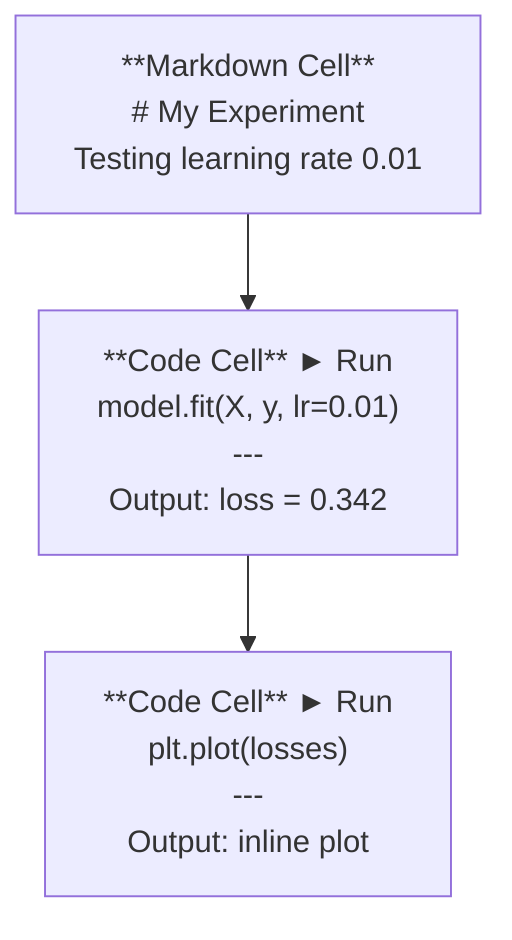
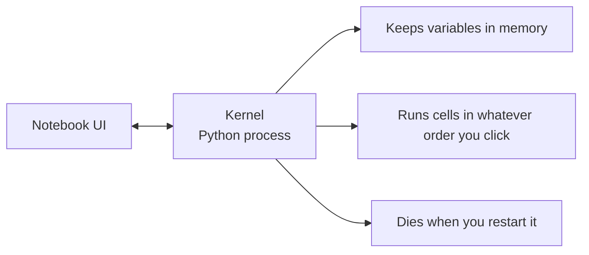

# ज्यूपिटर नोटबुक

> नोटबुक AI इंजीनियरिंग की प्रयोगशाला बेंच हैं. आप यहां प्रोटोटाइप करते हैं, फिर जो काम करता है उसे उत्पादन में ले जाते हैं.

**Type:** Build
**Languages:** Python
**Prerequisites:** Phase 0, Lesson 01
**Time:** ~30 minutes

## सीखने के लक्ष्य

- JupyterLab, Jupyter Notebook, या VS Code को Jupyter एक्सटेंशन के साथ स्थापित और लॉन्च करें
- जादू कमांड का उपयोग करें (`%timeit`,`%%time`,`%matplotlib inline`) इनलाइन को बेंचमार्क करने और दृश्यमान बनाने के लिए
- नोटबुक और स्क्रिप्ट का उपयोग कब करना है, इसका अंतर करें और "नोटबुक में खोजें, स्क्रिप्ट में जहाज करें" कार्यप्रवाह लागू करें
- सामान्य नोटबुक फंदे की पहचान करें और उनसे बचेंः अनियमित निष्पादन, छिपा हुआ राज्य और मेमोरी लीक

## समस्या

हर एआई पेपर, ट्यूटोरियल और कैगल प्रतियोगिता में ज्यूपिटर नोटबुक का उपयोग किया जाता है. वे आपको कोड को टुकड़ों में चलाने देते हैं, आउटपुट को लाइन में देखते हैं, कोड को स्पष्टीकरण के साथ मिलाते हैं, और तेजी से पुनरावृत्ति करते हैं। यदि आप नोटबुक के बिना एआई सीखने की कोशिश करते हैं, तो आप बिना कागज के खरोंच के गणित होमवर्क कर रहे हैं।

लेकिन नोटबुक में असली जाल हैं. लोग उन्हें हर चीज के लिए उपयोग करते हैं, जिसमें वे भयानक हैं। नोटबुक का उपयोग कब करना है और स्क्रिप्ट का उपयोग कब करना है यह जानना आपको बाद में बुराई के सपने से बचाएगा।

## अवधारणा

नोटबुक कोशिकाओं की एक सूची है। प्रत्येक कोशिका या तो कोड या पाठ है।



कर्नेल एक पायथन प्रक्रिया है जो पृष्ठभूमि में चलती है। जब आप एक सेल चलाते हैं, तो यह कोड को कर्नेल को भेजता है, जो इसे निष्पादित करता है और परिणाम वापस भेजता है। सभी कोशिकाएं एक ही कर्नेल साझा करती हैं, इसलिए कोशिकाओं के बीच चर बरकरार रहते हैं।



"जो भी आदेश आप क्लिक करें" भाग सुपर पावर और पैर बंदूक दोनों है।

```figure
s0-cell-order
```

## इसे बनाओ

### चरण 1: अपना इंटरफ़ेस चुनें

तीन विकल्प, एक प्रारूपः

| Interface | Install | Best for |
|-----------|---------|----------|
| JupyterLab | `pip install jupyterlab` then `jupyter lab` | Full IDE experience, multiple tabs, file browser, terminal |
| Jupyter Notebook | `pip install notebook` then `jupyter notebook` | Simple, lightweight, one notebook at a time |
| VS Code | Install "Jupyter" extension | Already in your editor, git integration, debugging |

तीनों एक ही पढ़ते और लिखते हैं `.ipynb`आप जो चाहें चुनें। JupyterLab AI काम में सबसे आम है।

```bash
pip install jupyterlab
jupyter lab
```

### चरण 2: महत्वपूर्ण कीबोर्ड शॉर्टकट

आप दो मोड में काम करते हैं। दबाएँ `Escape`कमांड मोड के लिए (बाएं ओर नीला पट्टी), `Enter`संपादन मोड (ग्रीन बार) के लिए।

**Command mode (most used):**

| Key | Action |
|-----|--------|
| `Shift+Enter` | Run cell, move to next |
| `A` | Insert cell above |
| `B` | Insert cell below |
| `DD` | Delete cell |
| `M` | Convert to markdown |
| `Y` | Convert to code |
| `Z` | Undo cell operation |
| `Ctrl+Shift+H` | Show all shortcuts |

**Edit mode:**

| Key | Action |
|-----|--------|
| `Tab` | Autocomplete |
| `Shift+Tab` | Show function signature |
| `Ctrl+/` | Toggle comment |

`Shift+Enter`यह वह है जिसका आप दिन में एक हजार बार उपयोग करेंगे. पहले इसे सीखें.

### चरण 3: कोशिका प्रकार

**Code cells**पायथन चलाएं और आउटपुट दिखाएंः

```python
import numpy as np
data = np.random.randn(1000)
data.mean(), data.std()
```

आउटपुट: `(0.0032, 0.9987)`

**Markdown cells**वे एक ही समय में एक ही समय में एक ही समय में एक ही समय में एक ही समय में एक ही समय में एक ही समय में एक ही समय में एक ही समय में एक ही समय में एक ही समय में एक ही समय में एक ही समय में एक ही समय में एक ही समय में एक ही समय में एक ही समय में एक ही समय में एक ही समय में एक ही समय में एक ही समय में एक ही समय में एक ही समय में एक ही समय में एक ही समय में एक ही समय में एक ही समय में एक ही समय में एक ही समय में एक ही समय में एक ही समय में एक ही समय में एक ही समय में एक ही समय में एक ही समय में एक ही समय में एक ही समय में एक ही समय में एक ही समय में एक ही समय में एक ही समय में एक ही समय में एक ही समय में एक ही समय में एक ही समय में एक ही समय में एक ही समय में एक ही समय में एक ही समय में एक ही समय में एक ही समय में एक ही समय में एक ही समय में एक ही समय में एक ही समय में एक ही समय में एक ही समय में एक ही समय में एक ही समय में एक ही समय में एक ही समय में एक ही समय में एक ही समय में एक ही एक ही समय में एक ही समय में एक ही समय में एक ही समय में एक ही एक समय में एक ही समय में एक समय में एक ही एक समय में एक समय में एक समय में एक ही एक समय में एक समय में एक समय में एक समय में एक समय में एक समय में एक समय में एक समय में एक समय में एक समय में एक समय में एक समय में एक समय में एक समय में एक समय में एक समय में एक समय में एक समय में एक समय में एक समय में एक समय में एक समय में एक समय में एक समय में एक समय में एक समय में एक समय में एक समय में एक समय में एक समय में एक समय में एक समय में एक समय में एक समय में एक समय में एक समय में एक समय में एक समय में एक समय में एक समय में एक समय में एक समय में एक समय में एक समय में एक समय में एक समय में एक समय में एक समय में एक समय में एक समय में एक समय में एक समय में एक समय में एक समय में एक समय में एक समय में एक समय में एक समय में एक समय में एक समय में एक समय में एक समय में एक समय में एक समय में एक समय में एक समय में एक समय में एक समय में एक समय में एक समय में एक समय में एक`$E = mc^2$`), तालिकाएँ और चित्र।

### चरण 4: जादूई आदेश

ये पायथन नहीं हैं, वे Jupyter विशिष्ट आदेश हैं जो शुरू होते हैं के साथ`%`(लाइन जादू) या `%%`(सेल जादू)

**Time your code:**

```python
%timeit np.random.randn(10000)
```

आउटपुट: `45.2 us +/- 1.3 us per loop`

```python
%%time
model.fit(X_train, y_train, epochs=10)
```

आउटपुट: `Wall time: 2.34 s`

`%timeit`कोड कई बार चलाता है और औसत। `%%time`इसे एक बार चलाता है।`%timeit`माइक्रोबेन्चमार्क के लिए, `%%time`प्रशिक्षण रन के लिए।

**Enable inline plots:**

```python
%matplotlib inline
```

हर `plt.plot()`या `plt.show()`अब सीधे नोटबुक में प्रस्तुत करता है।

**Install packages without leaving the notebook:**

```python
!pip install scikit-learn
```

`!`पूर्ववर्ती किसी भी शेल कमांड चलाता है।

**Check environment variables:**

```python
%env CUDA_VISIBLE_DEVICES
```

### चरण 5: रिच आउटपुट इनलाइन प्रदर्शित करें

नोटबुक ऑटो सेल में अंतिम अभिव्यक्ति प्रदर्शित करते हैं. लेकिन आप इसे नियंत्रित कर सकते हैंः

```python
import pandas as pd

df = pd.DataFrame({
    "model": ["Linear", "Random Forest", "Neural Net"],
    "accuracy": [0.72, 0.89, 0.94],
    "training_time": [0.1, 2.3, 45.6]
})
df
```

यह एक स्वरूपित HTML तालिका, एक पाठ डंप नहीं प्रस्तुत करता है।

```python
import matplotlib.pyplot as plt

plt.figure(figsize=(8, 4))
plt.plot([1, 2, 3, 4], [1, 4, 2, 3])
plt.title("Inline Plot")
plt.show()
```

प्लॉट सेल के नीचे दिखाई देता है. यही कारण है कि नोटबुक AI काम पर हावी हैं. आप डेटा, प्लॉट और कोड को एक साथ देखते हैं.

चित्रों के लिएः

```python
from IPython.display import Image, display
display(Image(filename="architecture.png"))
```

### चरण 6: गूगल कोलाब

कोलाब एक मुफ्त Jupyter नोटबुक है। यह आपको एक GPU, पूर्व-स्थापित पुस्तकालय और Google ड्राइव एकीकरण देता है। कोई सेटअप आवश्यक नहीं है।

1. जाओ [colab.research.google.com](https://colab.research.google.com)
2. किसी भी अपलोड `.ipynb`इस पाठ्यक्रम से फ़ाइल
3. रनटाइम > रनटाइम प्रकार बदलें > T4 GPU (मुफ्त)

स्थानीय ज्युपीटर से कोलाब अंतरः
- सत्रों के बीच फ़ाइलें नहीं बनी रहती हैं (ड्राइव या डाउनलोड पर सहेजें)
- पूर्व स्थापितः नम्पी, पांडा, मैटप्लोटलिब, मशाल, टेन्सॉर्फ्लो, स्क्लेयर
- `from google.colab import files`फ़ाइलों को अपलोड/डाउनलोड करने के लिए
- `from google.colab import drive; drive.mount('/content/drive')`निरंतर भंडारण के लिए
- 90 मिनट की निष्क्रियता के बाद सत्रों का समय (मुक्त स्तर)

## इसका प्रयोग करें

### नोटबुक बनाम स्क्रिप्टः कब कौन सा उपयोग करें

| Use notebooks for | Use scripts for |
|-------------------|-----------------|
| Exploring a dataset | Training pipelines |
| Prototyping a model | Reusable utilities |
| Visualizing results | Anything with `if __name__` |
| Explaining your work | Code that runs on a schedule |
| Quick experiments | Production code |
| Course exercises | Packages and libraries |

नियम: **explore in notebooks, ship in scripts**. .

एआई में एक आम कार्यप्रवाहः
1. नोटबुक में डेटा खोजें
2. नोटबुक में अपना मॉडल प्रोटोटाइप
3. एक बार यह काम करता है, कोड स्थानांतरित करने के लिए `.py`फ़ाइलें
4. उन आयात `.py`आगे के प्रयोगों के लिए फ़ाइलों को नोटबुक में वापस

### आम जाल

**Out-of-order execution.**आप सेल 5 चलाते हैं, फिर सेल 2 और फिर सेल 7। नोटबुक आपकी मशीन पर काम करता है लेकिन जब कोई इसे ऊपर से नीचे चलाता है तो टूट जाता है। ठीक करेंः साझा करने से पहले कर्नेल > पुनरारंभ और सभी चलाएं।

**Hidden state.**आप एक सेल को हटा देते हैं लेकिन यह परिवर्तनीय अभी भी स्मृति में है। नोटबुक साफ दिखता है लेकिन एक भूत सेल पर निर्भर करता है। फिक्सः नियमित रूप से कर्नेल को पुनरारंभ करें।

**Memory leaks.**4GB डेटा सेट लोड करना, एक मॉडल को प्रशिक्षित करना, एक और डेटा सेट लोड करना. कुछ भी मुक्त नहीं होता है।`del variable_name`और `gc.collect()`, या कर्नेल को पुनरारंभ करें.

## इसे भेजें

इस पाठ से उत्पन्न होता हैः
- `outputs/prompt-notebook-helper.md`नोटबुक समस्याओं को डिबग करने के लिए

## व्यायाम

1. JupyterLab खोलें, एक नोटबुक बनाएं और उसका उपयोग करें `%timeit`100,000 यादृच्छिक संख्याओं की सरणी बनाने के लिए सूची समझ बनाम numpy की तुलना करने के लिए
2. एक नोटबुक बनाएं जिसमें मार्कडाउन और कोड दोनों कोशिकाएं हों जो सीएसवी लोड करें, एक डेटाफ्रेम प्रदर्शित करें और एक चार्ट का ग्राफ बनाएं। फिर Kernel > Restart & Run All चलाएं ताकि यह सत्यापित हो सके कि यह ऊपर से नीचे तक काम करता है
3. कोड ले लो `code/notebook_tips.py`, इसे एक कोलाब नोटबुक में पेस्ट करें, और इसे एक मुक्त जीपीयू के साथ चलाएं

## प्रमुख शर्तें

| Term | What people say | What it actually means |
|------|----------------|----------------------|
| Kernel | "The thing running my code" | A separate Python process that executes cells and keeps variables in memory |
| Cell | "A code block" | An independently runnable unit in a notebook, either code or markdown |
| Magic command | "Jupyter tricks" | Special commands prefixed with `%` or `%%` that control the notebook environment |
| `.ipynb` | "Notebook file" | A JSON file containing cells, outputs, and metadata. Stands for IPython Notebook |

## आगे पढ़ना

- [JupyterLab Docs](https://jupyterlab.readthedocs.io/)पूर्ण विशेषता सेट के लिए
- [Google Colab FAQ](https://research.google.com/colaboratory/faq.html)कोलाब विशिष्ट सीमाओं और विशेषताओं के लिए
- [28 Jupyter Notebook Tips](https://www.dataquest.io/blog/jupyter-notebook-tips-tricks-shortcuts/)बिजली प्रयोक्ता शॉर्टकट के लिए
