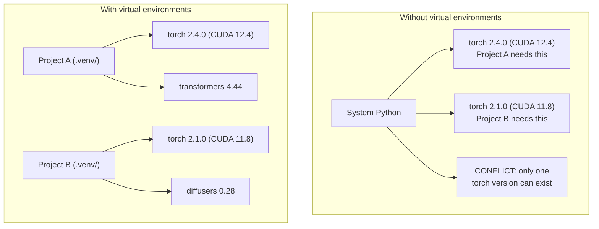

# पायथन वातावरण

> आश्रय नरक वास्तविक है. आभासी वातावरण इलाज है.

**Type:** Build
**Languages:** Shell
**Prerequisites:** Phase 0, Lesson 01
**Time:** ~30 minutes

## सीखने के लक्ष्य

-  का उपयोग करके अलग आभासी वातावरण बनाएँ`uv`,`venv`या `conda`
- एक लिखें `pyproject.toml`वैकल्पिक निर्भरता समूहों के साथ और पुनरुत्पादन के लिए लॉकफ़ाइल उत्पन्न करें
- सामान्य बाधाओं का निदान और समाधानः वैश्विक स्थापना, पाइप/कंड मिश्रण, CUDA संस्करण असंगतता
- परस्पर निर्भरता वाले परियोजनाओं के लिए प्रति चरण पर्यावरण रणनीति लागू करना

## समस्या

आप एक सूक्ष्म-ट्यूनिंग परियोजना के लिए PyTorch 2.4 स्थापित करते हैं. अगले सप्ताह, एक अलग परियोजना PyTorch 2.1 की आवश्यकता है क्योंकि इसके CUDA बिल्ड चिपके हुए है. आप वैश्विक स्तर पर अपग्रेड करते हैं, और पहली परियोजना टूट जाती है. आप डाउनग्रेड करते हैं, और दूसरा टूट जाता है.

यह निर्भरता नरक है. यह लगातार एआई / एमएल काम में होता है क्योंकिः

- PyTorch, JAX, और TensorFlow प्रत्येक अपने स्वयं के CUDA बंधन जहाज
- मॉडल लाइब्रेरी विशिष्ट फ्रेमवर्क संस्करणों को पिन करती हैं
- वैश्विक`pip install`जो कुछ भी पहले वहाँ था ओवरराइट करता है
- CUDA 11.8 बिल्ड CUDA 12.x ड्राइवर के साथ काम नहीं करते (और इसके विपरीत)

समाधानः प्रत्येक परियोजना को अपने स्वयं के पैकेज के साथ अपना अलग वातावरण मिलता है।

## अवधारणा



```figure
s0-env-isolation
```

## इसे बनाओ

### विकल्प 1: uv venv (अनुशंसित)

`uv`यह सबसे तेज़ पायथन पैकेज मैनेजर है (10-100 गुना पाइप से तेज़) । यह एक उपकरण में वर्चुअल वातावरण, पायथन संस्करण और निर्भरता संकल्प को संभालता है।

```bash
curl -LsSf https://astral.sh/uv/install.sh | sh

uv python install 3.12

cd your-project
uv venv
source .venv/bin/activate
```

पैकेज स्थापित करेंः

```bash
uv pip install torch numpy
```

 के साथ एक परियोजना बनाएं`pyproject.toml`एक कदम मेंः

```bash
uv init my-ai-project
cd my-ai-project
uv add torch numpy matplotlib
```

### विकल्प 2: venv (बनाया गया)

यदि आप स्थापित नहीं कर सकते `uv`, पायथन जहाजों के साथ `venv`:

```bash
python3 -m venv .venv
source .venv/bin/activate  # Linux/macOS
.venv\Scripts\activate     # Windows

pip install torch numpy
```

धीमी गति से `uv`, लेकिन काम करता है हर जगह पायथन स्थापित है.

### विकल्प 3: कॉंडा (जब आपको इसकी आवश्यकता हो)

कॉंडा गैर-पायथन निर्भरताओं जैसे CUDA टूलकिट, cuDNN, और C पुस्तकालयों का प्रबंधन करता है। इसका उपयोग जबः

- आप सिस्टम भर में स्थापित किए बिना एक विशिष्ट CUDA टूलकिट संस्करण की जरूरत है
- आप एक साझा क्लस्टर पर हैं जहां आप सिस्टम पैकेज स्थापित नहीं कर सकते
- पुस्तकालय की स्थापना निर्देशों में "कंडो का उपयोग करें" कहते हैं

```bash
# Install miniconda (not the full Anaconda)
curl -LsSf https://repo.anaconda.com/miniconda/Miniconda3-latest-Linux-x86_64.sh -o miniconda.sh
bash miniconda.sh -b

conda create -n myproject python=3.12
conda activate myproject

conda install pytorch torchvision torchaudio pytorch-cuda=12.4 -c pytorch -c nvidia
```

एक नियमः यदि आप किसी वातावरण के लिए कॉंडा का उपयोग करते हैं, तो उस वातावरण में सभी पैकेज के लिए कॉंडा का उपयोग करें। मिश्रण `pip install`एक conda env निर्भरता संघर्षों का कारण बनता है जो डिबग करने के लिए दर्दनाक हैं।

### इस कोर्स के लिएः चरण-दर-चरण रणनीति

आप पूरे कोर्स के लिए एक वातावरण बना सकते हैं। मत करो। विभिन्न चरणों को अलग (कभी-कभी विरोधाभासी) निर्भरता की आवश्यकता होती है।

रणनीति:

```
ai-engineering-from-scratch/
├── .venv/                    <-- shared lightweight env for phases 0-3
├── phases/
│   ├── 04-neural-networks/
│   │   └── .venv/            <-- PyTorch env
│   ├── 05-cnns/
│   │   └── .venv/            <-- same PyTorch env (symlink or shared)
│   ├── 08-transformers/
│   │   └── .venv/            <-- might need different transformer versions
│   └── 11-llm-apis/
│       └── .venv/            <-- API SDKs, no torch needed
```

`code/env_setup.sh`इस कोर्स के लिए आधार वातावरण बनाता है।

## pyproject.toml मूल बातें

प्रत्येक पायथन परियोजना में एक होना चाहिए`pyproject.toml`. . यह प्रतिस्थापन करता है`setup.py`,`setup.cfg`और `requirements.txt`एक फ़ाइल में।

```toml
[project]
name = "ai-engineering-from-scratch"
version = "0.1.0"
requires-python = ">=3.11"
dependencies = [
    "numpy>=1.26",
    "matplotlib>=3.8",
    "jupyter>=1.0",
    "scikit-learn>=1.4",
]

[project.optional-dependencies]
torch = ["torch>=2.3", "torchvision>=0.18"]
llm = ["anthropic>=0.39", "openai>=1.50"]
```

फिर स्थापित करेंः

```bash
uv pip install -e ".[torch]"    # base + PyTorch
uv pip install -e ".[llm]"     # base + LLM SDKs
uv pip install -e ".[torch,llm]" # everything
```

## तालाबंदी

एक लॉकफ़ाइल प्रत्येक निर्भरता (संक्रमणशील सहित) को सटीक संस्करणों में चिपकाती है। यह पुनरुत्पादनशीलता की गारंटी देता हैः जो कोई भी लॉकफ़ाइल से इंस्टॉल करता है, उसे बिल्कुल समान पैकेज प्राप्त होते हैं।

```bash
# uv generates uv.lock automatically when using uv add
uv add numpy

# pip-tools approach
uv pip compile pyproject.toml -o requirements.lock
uv pip install -r requirements.lock
```

जब कोई रेपो क्लोन करता है, वे लॉक फ़ाइल से स्थापित करते हैं और समान संस्करण प्राप्त करते हैं।

## आम गलतियाँ

### 1. वैश्विक स्तर पर स्थापित करना

```bash
pip install torch  # BAD: installs to system Python

source .venv/bin/activate
pip install torch  # GOOD: installs to virtual environment
```

अपने पैकेज को कहां ले जाएं, जाँचेंः

```bash
which python       # should show .venv/bin/python, not /usr/bin/python
which pip           # should show .venv/bin/pip
```

### 2. पिप और कॉंडा मिश्रण

```bash
conda create -n myenv python=3.12
conda activate myenv
conda install pytorch -c pytorch
pip install some-other-package   # BAD: can break conda's dependency tracking
conda install some-other-package # GOOD: let conda manage everything
```

यदि आपको कॉंडा के अंदर पिप का उपयोग करना है (कुछ पैकेज केवल पिप-केवल हैं), तो पहले सभी कॉंडा पैकेज स्थापित करें, फिर पिप पैकेज आखिरी हैं।

### 3. सक्रिय करना भूलना

```bash
python train.py           # uses system Python, missing packages
source .venv/bin/activate
python train.py           # uses project Python, packages found
```

आपके shell prompt में पर्यावरण का नाम दिखाना चाहिए:

```
(.venv) $ python train.py
```

### 4. . . . . . . . . . . . . . . . . . . . . . . . . . . . . . . . . . . . . . . . . . . . . . . . . . . . . . . . . . . . . . . . . . . . . . . . . . . . . . . . . . . . . . . . . . . . . . . . . . . . . . . . . . . . . . . . . . . . . . . . . . . . . . . . . . . . . . . . . . . . . . . . . . . . . . . . . . . . . . . . . . . . . . . . . . . . . . . . . . . . . . . . . . . . . . . . . . . . . . . . . . . . . . . . . . . . . . . . . . . . . . . . . . . . . . . . . . . . . . . . . . . . . . . . . . . . . . . . . . . . . . . . . . . . . . . . . . . . . . . . . . . . . . . . . . . . . . . . . . . . . . . . . . . . . . . . . . . . . . . . . . . . . . . . . . . . . . . . . . . . . . . . . . . . . . . . . . . . . . . . . . . . . . . . . . . . . . . . . . . . . . . . . . . . . . . . . . . . . . . . . . . . . . . . . . . . . . . . . . . . . . . . . . . . . . . . . . . . . . . . . . . . . . . . . . . . . . . . . . . . . . . . . . . . . . . . . . . . . . . . . . . . . . . . . . . . . . . . . . . . . . . . . . . . . . .

```bash
echo ".venv/" >> .gitignore
```

वर्चुअल वातावरण 200MB-2GB है. वे स्थानीय हैं, मशीनों के बीच पोर्टेबल नहीं. प्रतिबद्धता.`pyproject.toml`और इसके बजाय ताला फ़ाइल.

### 5. CUDA संस्करण असंगत

```bash
nvidia-smi                # shows driver CUDA version (e.g., 12.4)
python -c "import torch; print(torch.version.cuda)"  # shows PyTorch CUDA version

# These must be compatible.
# PyTorch CUDA version must be <= driver CUDA version.
```

## इसका प्रयोग करें

अपने पाठ्यक्रम वातावरण बनाने के लिए सेटअप स्क्रिप्ट चलाएंः

```bash
bash phases/00-setup-and-tooling/06-python-environments/code/env_setup.sh
```

यह एक बना देता है`.venv`कोर निर्भरता स्थापित और सत्यापित के साथ रेपो रूट पर।

## व्यायाम

1. दौड़ें`env_setup.sh`और सभी चेक पास की जांच करें
2. एक दूसरा आभासी वातावरण बनाएं, इसमें numpy का एक अलग संस्करण स्थापित करें, और पुष्टि करें कि दोनों वातावरण अलग हैं
3. एक लिखें `pyproject.toml`एक परियोजना के लिए जो PyTorch और मानव SDK दोनों की आवश्यकता है
4. जानबूझकर एक पैकेज को वैश्विक रूप से स्थापित करें (विनव को सक्रिय किए बिना), नोट करें कि यह कहां जाता है, फिर इसे अनइंस्टॉल करें

## प्रमुख शर्तें

| Term | What people say | What it actually means |
|------|----------------|----------------------|
| Virtual environment | "A venv" | An isolated directory containing a Python interpreter and packages, separate from the system Python |
| Lockfile | "Pinned dependencies" | A file listing every package and its exact version, guaranteeing identical installs across machines |
| pyproject.toml | "The new setup.py" | The standard Python project configuration file, replacing setup.py/setup.cfg/requirements.txt |
| Transitive dependency | "A dependency of a dependency" | Package B depends on C; if you install A which depends on B, C is a transitive dependency of A |
| CUDA mismatch | "My GPU isn't working" | PyTorch was compiled for a different CUDA version than what your GPU driver supports |
