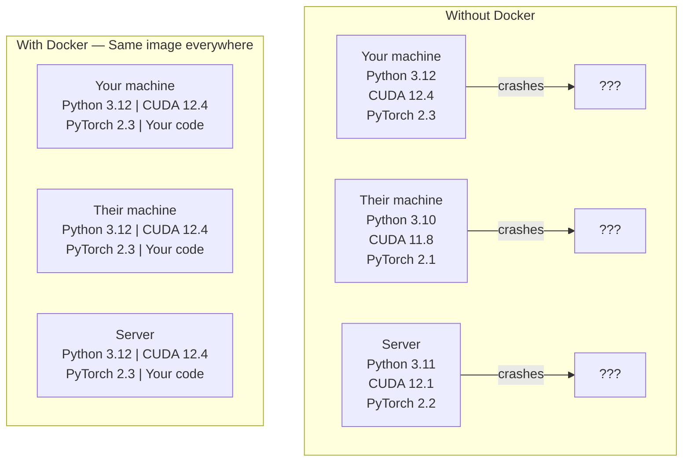

# एआई के लिए डॉकर

> कंटेनरों से "मेरी मशीन पर काम" अतीत की बात बन जाती है।

**Type:** Build
**Languages:** Docker
**Prerequisites:** Phase 0, Lessons 01 and 03
**Time:** ~60 minutes

## सीखने के लक्ष्य

- एक डॉकरफ़ाइल से CUDA, PyTorch, और AI पुस्तकालयों के साथ GPU-सक्षम Docker छवि बनाएं
- कंटेनर पुनर्निर्माणों में मॉडलों, डेटासेट और कोड को बनाए रखने के लिए मात्रा के रूप में होस्ट निर्देशिकाएं माउंट करें
- कंटेनर के अंदर जीपीयू को उजागर करने के लिए एनवीआईडीआई कंटेनर टूलकिट को कॉन्फ़िगर करें
- Docker Compose का उपयोग करके मल्टी-सर्विस एआई अनुप्रयोगों (इन्फरेंस सर्वर + वेक्टर डेटाबेस) को ऑर्केस्ट्रेट करें

## समस्या

आपने अपने लैपटॉप पर एक मॉडल को PyTorch 2.3, CUDA 12.4 और Python 3.12 के साथ प्रशिक्षित किया है। आपके सहयोगी के पास PyTorch 2.1, CUDA 11.8 और Python 3.10 है। आपका मॉडल उनकी मशीन पर दुर्घटनाग्रस्त हो जाता है। आपकी Dockerfile दोनों पर काम करती है।

एआई परियोजनाएं निर्भरता की दुःस्वप्न हैं। एक विशिष्ट स्टैक में पायथन, पायटॉर्च, CUDA ड्राइवर, cuDNN, सिस्टम-स्तरीय सी लाइब्रेरी और फ्लैश-एटीएन जैसे विशेष पैकेज शामिल हैं जिन्हें सटीक संकलक संस्करणों की आवश्यकता होती है। डॉकर इन सभी को एक एकल छवि में पैक करता है जो हर जगह समान रूप से चलता है।

## अवधारणा

डॉकर आपके कोड, रनटाइम, लाइब्रेरी और सिस्टम टूल्स को एक अलग इकाई में लपेटता है जिसे कंटेनर कहा जाता है। इसे एक हल्के आभासी मशीन के रूप में सोचें, सिवाय इसके कि यह अपने स्वयं के चलाने के बजाय होस्ट ओएस कर्नेल को साझा करता है, इसलिए यह मिनटों के बजाय सेकंड में शुरू होता है।



### क्यों AI परियोजनाओं को अधिकांश से अधिक Docker की जरूरत है

1. **GPU drivers are fragile.**CUDA 12.4 कोड CUDA 11.8 पर नहीं चलता है। डॉकर NVIDIA कंटेनर टूलकिट के माध्यम से मेजबान GPU ड्राइवर साझा करते हुए कंटेनर के अंदर CUDA टूलकिट को अलग करता है।

2. **Model weights are large.**7B पैरामीटर मॉडल 14 GB fp16 में है। आप इसे हर बार पुनर्निर्माण करने के लिए फिर से डाउनलोड नहीं करना चाहते हैं। डॉकर वॉल्यूम आपको होस्ट से मॉडल निर्देशिका को माउंट करने की अनुमति देते हैं।

3. **Multi-service architectures are common.**एक वास्तविक एआई एप्लिकेशन सिर्फ एक पायथन स्क्रिप्ट नहीं है. यह एक निष्कर्ष सर्वर है, RAG के लिए एक वेक्टर डेटाबेस, शायद एक वेब फ्रंटेंड। Docker Compose इन सभी को एक कमांड के साथ व्यवस्थित करता है।

### प्रमुख शब्दावली

| Term | What it means |
|------|---------------|
| Image | A read-only template. Your recipe. Built from a Dockerfile. |
| Container | A running instance of an image. Your kitchen. |
| Dockerfile | Instructions to build an image. Layer by layer. |
| Volume | Persistent storage that survives container restarts. |
| docker-compose | A tool for defining multi-container applications in YAML. |

### एआई में सामान्य कंटेनर पैटर्न

```
Dev Container
  Full toolkit. Editor support. Jupyter. Debugging tools.
  Used during development and experimentation.

Training Container
  Minimal. Just the training script and dependencies.
  Runs on GPU clusters. No editor, no Jupyter.

Inference Container
  Optimized for serving. Small image. Fast cold start.
  Runs behind a load balancer in production.
```

```figure
s0-image-layers
```

## इसे बनाओ

### चरण 1: डॉकर स्थापित करें

```bash
# macOS
brew install --cask docker
open /Applications/Docker.app

# Ubuntu
curl -fsSL https://get.docker.com | sh
sudo usermod -aG docker $USER
# Log out and back in for group change to take effect
```

सत्यापित करेंः

```bash
docker --version
docker run hello-world
```

### चरण 2: NVIDIA कंटेनर टूलकिट (NVIDIA GPU के साथ लिनक्स) स्थापित करें

यह Docker कंटेनरों को आपके GPU तक पहुँचने की अनुमति देता है। macOS और Windows (WSL2) उपयोगकर्ताओं को यह छोड़ सकते हैं; Docker Desktop उन प्लेटफार्मों पर GPU के माध्यम से अलग तरह से संभालता है।

```bash
distribution=$(. /etc/os-release;echo $ID$VERSION_ID)
curl -fsSL https://nvidia.github.io/libnvidia-container/gpgkey | sudo gpg --dearmor -o /usr/share/keyrings/nvidia-container-toolkit-keyring.gpg
curl -s -L https://nvidia.github.io/libnvidia-container/$distribution/libnvidia-container.list | \
    sed 's#deb https://#deb [signed-by=/usr/share/keyrings/nvidia-container-toolkit-keyring.gpg] https://#g' | \
    sudo tee /etc/apt/sources.list.d/nvidia-container-toolkit.list

sudo apt-get update
sudo apt-get install -y nvidia-container-toolkit
sudo nvidia-ctk runtime configure --runtime=docker
sudo systemctl restart docker
```

कंटेनर के अंदर जीपीयू एक्सेस का परीक्षण करेंः

```bash
docker run --rm --gpus all nvidia/cuda:12.4.1-base-ubuntu22.04 nvidia-smi
```

यदि आप अपने जीपीयू जानकारी देखते हैं, उपकरण किट काम कर रहा है.

### चरण 3: मूल चित्रों को समझें

सही आधार छवि चुनने डिबगिंग के घंटे बचाता है।

```
nvidia/cuda:12.4.1-devel-ubuntu22.04
  Full CUDA toolkit. Compilers included.
  Use for: building packages that need nvcc (flash-attn, bitsandbytes)
  Size: ~4 GB

nvidia/cuda:12.4.1-runtime-ubuntu22.04
  CUDA runtime only. No compilers.
  Use for: running pre-built code
  Size: ~1.5 GB

pytorch/pytorch:2.6.0-cuda12.4-cudnn9-runtime
  PyTorch pre-installed on top of CUDA.
  Use for: skipping the PyTorch install step
  Size: ~6 GB

python:3.12-slim
  No CUDA. CPU only.
  Use for: inference on CPU, lightweight tools
  Size: ~150 MB
```

### चरण 4: एआई विकास के लिए एक डॉकरफ़ाइल लिखें

यहाँ डॉकरफ़ाइल है `code/Dockerfile`. . . . . . . . . . . . . . . . . . . . . . . . . . . . . . . . . . . . . . . . . . . . . . . . . . . . . . . . . . . . . . . . . . . . . . . . . . . . . . . . . . . . . . . . . . . . . . . . . . . . . . . . . . . . . . . . . . . . . . . . . . . . . . . . . . . . . . . . . . . . . . . . . . . . . . . . . . . . . . . . . . . . . . . . . . . . . . . . . . . . . . . . . . . . . . . . . . . . . . . . . . . . . . . . . . . . . . . . . . . . . . . . . . . . . . . . . . . . . . . . . . . . . . . . . . . . . . . . . . . . . . . . . . . . . . . . . . . . . . . . . . . . . . . . . . . . . . . . . . . . . . . . . . . . . . . . . . . . . . . . . . . . . . . . . . . . . . . . . . . . . . . . . . . . . . . . . . . . . . . . . . . . . . . . . . . . . . . . . . . . . . . . . . . . . . . . . . . . . . . . . . . . . . . . . . . . . . . . . . . . . . . . . . . . . . . . . . . . . . . . . . . . . . . . . . . . . . . . . . . . . . . . . . . . . . . . . . . . . . . . . . . . . . . . . . . . . . . . . . . . . . . . . . . . . .

```dockerfile
FROM nvidia/cuda:12.4.1-devel-ubuntu22.04

ENV DEBIAN_FRONTEND=noninteractive
ENV PYTHONUNBUFFERED=1

RUN apt-get update && apt-get install -y --no-install-recommends \
    software-properties-common \
    git \
    curl \
    build-essential \
    && add-apt-repository -y ppa:deadsnakes/ppa \
    && apt-get update && apt-get install -y --no-install-recommends \
    python3.12 \
    python3.12-venv \
    python3.12-dev \
    && rm -rf /var/lib/apt/lists/*

RUN update-alternatives --install /usr/bin/python python /usr/bin/python3.12 1

RUN curl -sSL https://raw.githubusercontent.com/pypa/get-pip/3b73145063be545b649ad9ca83ea8da5fc915a4f/public/get-pip.py -o /tmp/get-pip.py \
    && echo "a341e1a43e38001c551a1508a73ff23636a11970b61d901d9a1cad2a18f57055  /tmp/get-pip.py" | sha256sum -c - \
    && python /tmp/get-pip.py \
    && rm /tmp/get-pip.py \
    && update-alternatives --install /usr/bin/pip pip /usr/local/bin/pip3.12 1

RUN python -m pip install --no-cache-dir --upgrade pip setuptools wheel

RUN python -m pip install --no-cache-dir \
    torch==2.6.0+cu124 \
    torchvision==0.21.0+cu124 \
    torchaudio==2.6.0+cu124 \
    --index-url https://download.pytorch.org/whl/cu124

RUN python -m pip install --no-cache-dir \
    numpy \
    pandas \
    scikit-learn \
    matplotlib \
    jupyter \
    transformers \
    datasets \
    accelerate \
    safetensors

WORKDIR /workspace

VOLUME ["/workspace", "/models"]

EXPOSE 8888

CMD ["python"]
```

इसे बनाओः

```bash
docker build -t ai-dev -f phases/00-setup-and-tooling/07-docker-for-ai/code/Dockerfile .
```

यह पहली बार कुछ समय लेता है (CUDA बेस छवि + PyTorch डाउनलोड करना) । बाद के निर्माण कैश परतों का उपयोग करते हैं।

इसे चलाओः

```bash
docker run --rm -it --gpus all \
    -v $(pwd):/workspace \
    -v ~/models:/models \
    ai-dev python -c "import torch; print(f'PyTorch {torch.__version__}, CUDA: {torch.cuda.is_available()}')"
```

कंटेनर के अंदर Jupyter चलाएं:

```bash
docker run --rm -it --gpus all \
    -v $(pwd):/workspace \
    -v ~/models:/models \
    -p 8888:8888 \
    ai-dev jupyter notebook --ip=0.0.0.0 --port=8888 --no-browser --allow-root
```

### चरण 5: डेटा और मॉडल के लिए वॉल्यूम म्यूटेशन

AI के काम के लिए वॉल्यूम माउंट महत्वपूर्ण हैं. उनके बिना, आपके 14 GB मॉडल डाउनलोड तब गायब हो जाते हैं जब कंटेनर बंद हो जाता है।

```bash
# Mount your code
-v $(pwd):/workspace

# Mount a shared models directory
-v ~/models:/models

# Mount datasets
-v ~/datasets:/data
```

अपने प्रशिक्षण स्क्रिप्ट के अंदर, सवार पथ से लोडः

```python
from transformers import AutoModel

model = AutoModel.from_pretrained("/models/llama-7b")
```

मॉडल आपके होस्ट फ़ाइल सिस्टम पर रहता है. आप फिर से डाउनलोड किए बिना कंटेनर को जितनी बार आप चाहते हैं पुनर्निर्माण.

### चरण 6: मल्टी-सर्विस एआई ऐप के लिए डॉकर कंपोज़ करें

एक वास्तविक RAG अनुप्रयोग को एक निष्कर्ष सर्वर और एक वेक्टर डेटाबेस की आवश्यकता होती है। Docker Compose दोनों एक कमांड के साथ चलाता है।

देखो`code/docker-compose.yml`:

```yaml
services:
  ai-dev:
    build:
      context: .
      dockerfile: Dockerfile
    deploy:
      resources:
        reservations:
          devices:
            - driver: nvidia
              count: all
              capabilities: [gpu]
    volumes:
      - ../../../:/workspace
      - ~/models:/models
      - ~/datasets:/data
    ports:
      - "8888:8888"
    stdin_open: true
    tty: true
    command: jupyter notebook --ip=0.0.0.0 --port=8888 --no-browser --allow-root

  qdrant:
    image: qdrant/qdrant:v1.12.5
    ports:
      - "6333:6333"
      - "6334:6334"
    volumes:
      - qdrant_data:/qdrant/storage

volumes:
  qdrant_data:
```

सब कुछ शुरू करेंः

```bash
cd phases/00-setup-and-tooling/07-docker-for-ai/code
docker compose up -d
```

अब आपके एआई डेवलपर कंटेनर वेक्टर डेटाबेस तक पहुँच सकते हैं `http://qdrant:6333`सेवा नाम द्वारा. Docker Compose स्वचालित रूप से साझा नेटवर्क बनाता है।

एआई कंटेनर के अंदर से कनेक्शन का परीक्षण करेंः

```python
from qdrant_client import QdrantClient

client = QdrantClient(host="qdrant", port=6333)
print(client.get_collections())
```

सब कुछ बंद करो:

```bash
docker compose down
```

जोड़ें `-v`qdrant मात्रा को भी हटाने के लिएः

```bash
docker compose down -v
```

### चरण 7: एआई कार्य के लिए उपयोगी डॉकर कमांड

```bash
# List running containers
docker ps

# List all images and their sizes
docker images

# Remove unused images (reclaim disk space)
docker system prune -a

# Check GPU usage inside a running container
docker exec -it <container_id> nvidia-smi

# Copy a file from container to host
docker cp <container_id>:/workspace/results.csv ./results.csv

# View container logs
docker logs -f <container_id>
```

## इसका प्रयोग करें

अब आपके पास एक पुनरुत्पादित एआई विकास वातावरण है। इस पाठ्यक्रम के बाकी के लिएः

- उपयोग करें`docker compose up`अपने डेवलपर वातावरण और वेक्टर डेटाबेस को एक साथ शुरू करने के लिए
- अपने कोड, मॉडल और डेटा को मात्रा में जोड़ें ताकि पुनर्निर्माण के बीच कुछ भी खो न जाए
- जब एक पाठ के लिए एक नया पायथन पैकेज की आवश्यकता है, तो इसे Docker फ़ाइल में जोड़ें और पुनर्निर्माण
- अपने Docker फ़ाइल को टीम के साथ साझा करें। उन्हें बिल्कुल एक ही वातावरण मिलता है।

### कोई जीपीयू नहीं?

 हटाएँ`--gpus all`पीआईटॉर्च सीयूडीए की अनुपस्थिति का पता लगाता है और स्वचालित रूप से सीपीयू पर वापस गिर जाता है।

## व्यायाम

1. Docker फ़ाइल बनाएं और चलाएँ `python -c "import torch; print(torch.__version__)"`कंटेनर के अंदर
2. डॉकर-कंपोज स्टैक शुरू करें और Qdrant को AI कंटेनर से पहुंच योग्य है `http://qdrant:6333/collections`
3. जोड़ें `flask`Docker फ़ाइल के लिए, पुनर्निर्माण, और बंदरगाह 5000 पर एक सरल एपीआई सर्वर चलाएं.`-p 5000:5000`
4.  से छवि आकार मापें`docker images`.  से मूल छवि स्विच करने की कोशिश करें`devel``runtime`और आकारों की तुलना करें

## प्रमुख शर्तें

| Term | What people say | What it actually means |
|------|----------------|----------------------|
| Container | "Lightweight VM" | An isolated process using the host kernel, with its own filesystem and network |
| Image layer | "Cached step" | Each Dockerfile instruction creates a layer. Unchanged layers are cached, so rebuilds are fast. |
| NVIDIA Container Toolkit | "GPU in Docker" | A runtime hook that exposes host GPUs to containers via `--gpus` flag |
| Volume mount | "Shared folder" | A directory on the host mapped into the container. Changes persist after the container stops. |
| Base image | "Starting point" | The `FROM` image your Dockerfile builds on top of. Determines what is pre-installed. |
