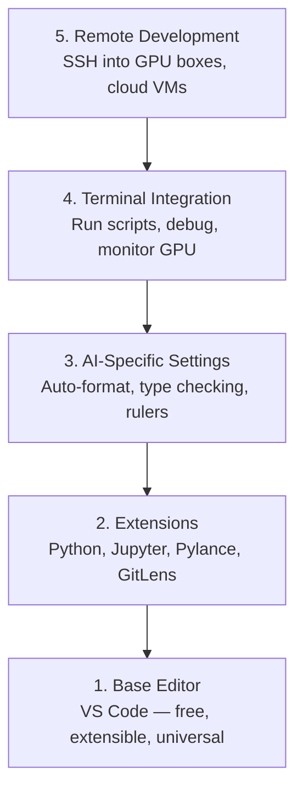

# संपादक सेटअप

> अपने संपादक अपने सह पायलट है. इसे एक बार कॉन्फ़िगर तो यह अपने रास्ते में रहने के लिए और अपने वजन खींचने शुरू होता है.

**Type:** Build
**Languages:** --
**Prerequisites:** Phase 0, Lesson 01
**Time:** ~20 minutes

## सीखने के लक्ष्य

- पायथन, ज्युपीटर, लिंटिंग और रिमोट एसएसएच के लिए आवश्यक एक्सटेंशन के साथ वीएस कोड स्थापित करें
- एआई वर्कफ़्लो के लिए प्रारूप-ऑन-सेव, टाइप चेक और नोटबुक आउटपुट स्क्रॉलिंग कॉन्फ़िगर करें
- रिमोट जीपीयू मशीनों पर कोड संपादित करने और डिबग करने के लिए रिमोट एसएसएच सेट करें जैसे कि वे स्थानीय हैं
- एआई कार्य के लिए संपादक विकल्पों (क्रसर, विंडसर्फ, नीओविम) और उनके व्यापारों का मूल्यांकन करें

## समस्या

आप अपने संपादक के अंदर हजारों घंटे बिताएंगे पायथन लिखते हुए, नोटबुक चलाते हुए, प्रशिक्षण लूप डिबग करते हुए और GPU बॉक्स में SSH-इंजेक्शन करते हुए। एक गलत कॉन्फ़िगर किए गए संपादक हर सत्र को घर्षण में बदल देता हैः कोई ऑटो-कंपल, कोई टाइप संकेत, कोई इनलाइन त्रुटियां नहीं, मैनुअल स्वरूपण, और एक नासमझ टर्मिनल वर्कफ़्लो।

सही सेटअप में 20 मिनट लगते हैं, इसे छोड़ने से आपको हर दिन 20 मिनट लगते हैं।

## अवधारणा

एक एआई इंजीनियरिंग संपादक सेटअप के लिए पांच चीजों की जरूरत हैः



```figure
s0-lsp-roundtrip
```

## इसे बनाओ

### चरण 1: VS कोड स्थापित करें

VS Code अनुशंसित संपादक है. यह मुफ्त है, हर ओएस पर चलता है, इसमें प्रथम श्रेणी का Jupyter नोटबुक समर्थन है, और एक्सटेंशन पारिस्थितिकी तंत्र आपको एआई काम के लिए आवश्यक सब कुछ कवर करता है।

इसे डाउनलोड करें [code.visualstudio.com](https://code.visualstudio.com/). .

टर्मिनल से सत्यापित करेंः

```bash
code --version
```

यदि`code`macOS पर नहीं मिला है, खोलें VS कोड, दबाएँ `Cmd+Shift+P`, "शेल कमांड" टाइप करें, और "PATH में 'कोड' कमांड स्थापित करें" चुनें.

### चरण 2: आवश्यक एक्सटेंशन स्थापित करें

VS कोड में एकीकृत टर्मिनल खोलें (`` Ctrl+```) और एआई काम के लिए महत्वपूर्ण एक्सटेंशन स्थापित करेंः

```bash
code --install-extension ms-python.python
code --install-extension ms-python.vscode-pylance
code --install-extension ms-toolsai.jupyter
code --install-extension eamodio.gitlens
code --install-extension ms-vscode-remote.remote-ssh
code --install-extension ms-python.debugpy
code --install-extension ms-python.black-formatter
code --install-extension charliermarsh.ruff
```

प्रत्येक व्यक्ति क्या करता हैः

| Extension | Why |
|-----------|-----|
| Python | Language support, virtual env detection, run/debug |
| Pylance | Fast type checking, autocomplete, import resolution |
| Jupyter | Run notebooks inside VS Code, variable explorer |
| GitLens | See who changed what, inline git blame |
| Remote SSH | Open a folder on a remote GPU box as if it were local |
| Debugpy | Step-through debugging for Python |
| Black Formatter | Auto-format on save, consistent style |
| Ruff | Fast linting, catches common mistakes |

फ़ाइल `code/.vscode/extensions.json`इस पाठ में सिफारिशों की पूरी सूची है. जब आप परियोजना फ़ोल्डर खोलें, VS कोड आपको उन्हें स्थापित करने के लिए कहेंगे.

### चरण 3: सेटिंग्स को कॉन्फ़िगर करें

सेटिंग्स को कॉपी करें `code/.vscode/settings.json`इस पाठ में, या उन्हें मैन्युअल रूप से लागू करें`Settings > Open Settings (JSON)`. .

एआई कार्य के लिए प्रमुख सेटिंग्सः

```jsonc
{
    "python.analysis.typeCheckingMode": "basic",
    "editor.formatOnSave": true,
    "editor.rulers": [88, 120],
    "notebook.output.scrolling": true,
    "files.autoSave": "afterDelay"
}
```

ये क्यों मायने रखते हैंः

- **Type checking on basic**: आप चलाने से पहले गलत तर्क प्रकार पकड़ता है. tensor आकार असंगतता और गलत एपीआई पैरामीटर पर डिबगिंग समय बचाता है.
- **Format on save**कभी भी फिर से स्वरूपण के बारे में नहीं सोचें। काला इसे संभालता है।
- **Rulers at 88 and 120**: ब्लैक 88 पर लपेटता है। 120 मार्कर दिखाता है कि डॉक्यूमेंट्री स्ट्रिंग और कमेंट्स बहुत लंबे हो रहे हैं।
- **Notebook output scrolling**: ट्रेनिंग लूप्स हजारों लाइनें प्रिंट करती हैं. बिना स्क्रॉल किए, आउटपुट पैनल विस्फोट होता है।
- **Auto-save**आप सहेजने के लिए भूल जाएगा. आपका प्रशिक्षण स्क्रिप्ट पुराने कोड चलाएगा. ऑटो सहेजने इससे बचाता है.

### चरण 4: टर्मिनल एकीकरण

वीएस कोड के एकीकृत टर्मिनल में आप प्रशिक्षण स्क्रिप्ट चलाते हैं, जीपीयू की निगरानी करते हैं, और वातावरण का प्रबंधन करते हैं।

इसे ठीक से सेट करेंः

```jsonc
{
    "terminal.integrated.defaultProfile.osx": "zsh",
    "terminal.integrated.defaultProfile.linux": "bash",
    "terminal.integrated.fontSize": 13,
    "terminal.integrated.scrollback": 10000
}
```

उपयोगी शॉर्टकटः

| Action | macOS | Linux/Windows |
|--------|-------|---------------|
| Toggle terminal | `` Ctrl+` `` | `` Ctrl+` `` |
| New terminal | `` Ctrl+Shift+` `` | `` Ctrl+Shift+` `` |
| Split terminal | `Cmd+\` | `Ctrl+Shift+5` |

स्प्लिट टर्मिनल उपयोगी हैंः एक आपकी स्क्रिप्ट चलाने के लिए, एक GPU के साथ निगरानी के लिए `nvidia-smi -l 1`या `watch -n 1 nvidia-smi`. .

### चरण 5: रिमोट डेवलपमेंट (जीपीयू बॉक्स में एसएसएच)

यह एआई काम के लिए सबसे महत्वपूर्ण एक्सटेंशन है। आप दूरस्थ मशीनों (क्लाउड वीएम, लैब सर्वर, लैम्ब्डा, वास्ट.एआई) पर प्रशिक्षण चलाएंगे। दूरस्थ एसएसएच आपको दूरस्थ फ़ाइल सिस्टम खोलने, फ़ाइलों को संपादित करने, टर्मिनल चलाने और डिबग करने की अनुमति देता है जैसे कि सब कुछ स्थानीय था।

सेटअपः

1. रिमोट SSH एक्सटेंशन (चरण 2 में किया गया) स्थापित करें।
2. प्रेस `Ctrl+Shift+P`(या `Cmd+Shift+P`), "रिमोट-एसएसएचः होस्ट से कनेक्ट करें" टाइप करें।
3. प्रवेश करें`user@your-gpu-box-ip`. .
4. वीएस कोड अपने सर्वर घटक को दूरस्थ मशीन पर स्वचालित रूप से स्थापित करता है।

पासवर्ड रहित पहुँच के लिए SSH कुंजी सेट करेंः

```bash
ssh-keygen -t ed25519 -C "your-email@example.com"
ssh-copy-id user@your-gpu-box-ip
```

मेजबान को जोड़ें `~/.ssh/config`सुविधा के लिएः

```
Host gpu-box
    HostName 203.0.113.50
    User ubuntu
    IdentityFile ~/.ssh/id_ed25519
    ForwardAgent yes
```

अब`Remote-SSH: Connect to Host > gpu-box`तुरंत कनेक्ट करता है।

## विकल्प

### कर्सर

[cursor.com](https://cursor.com)यह एक अंतर्निहित एआई कोड जनरेशन के साथ एक वीएस कोड कांटा है। यह एक ही विस्तार पारिस्थितिकी तंत्र और सेटिंग्स प्रारूप का उपयोग करता है। यदि आप पाठ्यक्रम का उपयोग करते हैं, तो इस सबक में सब कुछ अभी भी लागू होता है। वही आयात करें `settings.json`और `extensions.json`. .

### विंडसर्फ

[windsurf.com](https://windsurf.com)एक ही कहानीः एक ही एक्सटेंशन, एक ही सेटिंग्स प्रारूप, एक ही रिमोट SSH समर्थन.

### वीम/नियोवम

यदि आप पहले से ही Vim या Neovim का उपयोग कर रहे हैं और इसमें उत्पादक हैं, तो वहां रहें। एआई पायथन काम करने के लिए न्यूनतम सेटअपः

- **pyright**या **pylsp**प्रकार की जांच के लिए (मेसन या मैनुअल स्थापना के माध्यम से)
- **nvim-lspconfig**भाषा सर्वर एकीकरण के लिए
- **jupyter-vim**या **molten-nvim**नोटबुक की तरह निष्पादन के लिए
- **telescope.nvim**फ़ाइल/सिंबल खोज के लिए
- **none-ls.nvim**स्वरूपण/लिनिंग के लिए काले और रफ के साथ

यदि आप पहले से ही Vim का उपयोग नहीं करते हैं, तो अभी शुरू न करें। सीखने की वक्र AI इंजीनियरिंग सीखने के साथ प्रतिस्पर्धा करेगी। VS कोड का उपयोग करें।

## इसका प्रयोग करें

इस सेटअप के साथ, आपके दैनिक कार्यप्रवाह की तरह दिखता हैः

1. VS कोड में परियोजना फ़ोल्डर खोलें (या रिमोट SSH के माध्यम से GPU बॉक्स से कनेक्ट करें).
2. ऑटो-कंपल, टाइप सुझाव और इनलाइन त्रुटियों के साथ संपादक में पायथन लिखें।
3. Jupyter विस्तार के साथ लाइन में Jupyter नोटबुक चलाएं।
4. प्रशिक्षण स्क्रिप्ट के लिए एकीकृत टर्मिनल का उपयोग करें,`uv pip install`, और GPU निगरानी.
5. प्रतिबद्ध करने से पहले GitLens के साथ परिवर्तनों की समीक्षा करें।

## व्यायाम

1. VS कोड और चरण 2 में सूचीबद्ध सभी एक्सटेंशन स्थापित करें
2. कॉपी `settings.json`इस पाठ से अपने VS कोड विन्यास में
3. एक पायथन फ़ाइल खोलें और सत्यापित करें कि Pylance सहेजने पर टाइप सुझाव और काले प्रारूप दिखाता है
4. यदि आपके पास रिमोट मशीन तक पहुंच है, तो रिमोट SSH सेट करें और उस पर एक फ़ोल्डर खोलें

## प्रमुख शर्तें

| Term | What people say | What it actually means |
|------|----------------|----------------------|
| LSP | "Autocomplete engine" | Language Server Protocol: a standard for editors to get type info, completions, and diagnostics from a language-specific server |
| Pylance | "The Python plugin" | Microsoft's Python language server using Pyright for type checking and IntelliSense |
| Remote SSH | "Working on the server" | VS Code extension that runs a lightweight server on a remote machine and streams the UI to your local editor |
| Format on save | "Auto-prettier" | The editor runs a formatter (Black, Ruff) every time you save, so code style is always consistent |
