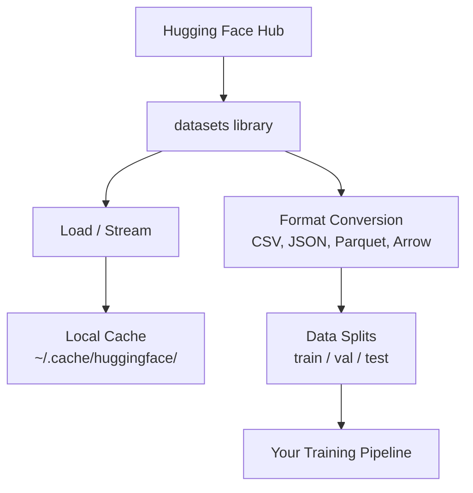

# डेटा प्रबंधन

> डेटा ही ईंधन है, आप इसे कैसे प्रबंधित करते हैं, यह निर्धारित करता है कि आप कितनी तेजी से चलते हैं।

**Type:** Build
**Language:**पायथन
**Prerequisites:** Phase 0, Lesson 01
**Time:** ~45 minutes

## सीखने के लक्ष्य

- Hugging Face का उपयोग करके लोड, स्ट्रीम और कैश डेटासेट `datasets`पुस्तकालय
- CSV, JSON, Parquet, और तीर प्रारूपों के बीच परिवर्तित करें और उनके व्यापार को समझाएं
- फिक्स्ड रैंडम बीज के साथ पुनरावर्ती ट्रेन/वैलिडेशन/टेस्ट स्प्लिट बनाएं
-  का उपयोग करके बड़े मॉडल और डेटासेट फ़ाइलों का प्रबंधन करें`.gitignore`, Git LFS या DVC

## समस्या

हर एआई प्रोजेक्ट डेटा से शुरू होता है. आपको डेटा सेट ढूंढने, उन्हें डाउनलोड करने, उन्हें प्रारूपों के बीच परिवर्तित करने, उन्हें प्रशिक्षण और मूल्यांकन के लिए विभाजित करने और उन्हें संस्करण करने की आवश्यकता है ताकि प्रयोग पुनः उत्पन्न हो सकें। यह हर बार मैन्युअल रूप से करना धीमा और त्रुटि प्रवण है। आपको एक दोहराए जाने योग्य कार्यप्रवाह की आवश्यकता है।

## अवधारणा



गले लगाते हुए चेहरा `datasets`पुस्तकालय एआई काम के लिए डेटा लोड करने का मानक तरीका है। यह डाउनलोड, कैशिंग, प्रारूप रूपांतरण और बॉक्स से बाहर स्ट्रीमिंग को संभालता है।

```figure
s0-data-pipeline
```

## इसे बनाओ

### चरण 1: डेटासेट लाइब्रेरी स्थापित करें

```bash
pip install datasets huggingface_hub
```

### चरण 2: डेटा सेट लोड करें

```python
from datasets import load_dataset

dataset = load_dataset("stanfordnlp/imdb")
print(dataset)
print(dataset["train"][0])
```

यह IMDB फिल्म समीक्षा डेटासेट डाउनलोड करता है. पहले डाउनलोड के बाद, यह कैश से लोड करता है `~/.cache/huggingface/datasets/`. .

### चरण 3: बड़े डेटासेट स्ट्रीम करें

कुछ डेटासेट डिस्क पर फिट होने के लिए बहुत बड़े होते हैं। स्ट्रीमिंग उन्हें पूरी चीज डाउनलोड किए बिना पंक्ति-पैक लोड करता है।

```python
dataset = load_dataset("wikimedia/wikipedia", "20220301.en", split="train", streaming=True)

for i, example in enumerate(dataset):
    print(example["title"])
    if i >= 4:
        break
```

स्ट्रीमिंग आपको एक देता है `IterableDataset`. आप पंक्तियों को संसाधित करते हैं जैसे वे आते हैं. मेमोरी उपयोग डेटासेट के आकार के बावजूद निरंतर रहता है.

### चरण 4: डेटासेट प्रारूप

`datasets`आप अपनी पाइपलाइन की जरूरतों के आधार पर अन्य प्रारूपों में परिवर्तित कर सकते हैं।

```python
dataset = load_dataset("stanfordnlp/imdb", split="train")

dataset.to_csv("imdb_train.csv")
dataset.to_json("imdb_train.json")
dataset.to_parquet("imdb_train.parquet")
```

प्रारूप तुलनाः

| Format | Size | Read Speed | Best For |
|--------|------|-----------|----------|
| CSV | Large | Slow | Human readability, spreadsheets |
| JSON | Large | Slow | APIs, nested data |
| Parquet | Small | Fast | Analytics, columnar queries |
| Arrow | Small | Fastest | In-memory processing (what `datasets` uses internally) |

AI काम के लिए, Parquet सबसे अच्छा भंडारण प्रारूप है. तीर वह है जो आप स्मृति में काम करते हैं. CSV और JSON आदान-प्रदान के लिए हैं.

### चरण 5: डेटा विभाजन

प्रत्येक एमएल परियोजना को तीन विभाजनों की आवश्यकता होती हैः

- **Train**: मॉडल इससे सीखता है (आमतौर पर 80%)
- **Validation**प्रशिक्षण के दौरान प्रगति की जांच करें (आमतौर पर 10%)
- **Test**: प्रशिक्षण पूरा होने के बाद अंतिम मूल्यांकन (आमतौर पर 10%)

कुछ डेटा सेट पूर्व-विभाजित होते हैं. जब वे नहीं करते हैं, उन्हें स्वयं विभाजित करेंः

```python
dataset = load_dataset("stanfordnlp/imdb", split="train")

split = dataset.train_test_split(test_size=0.2, seed=42)
train_val = split["train"].train_test_split(test_size=0.125, seed=42)

train_ds = train_val["train"]
val_ds = train_val["test"]
test_ds = split["test"]

print(f"Train: {len(train_ds)}, Val: {len(val_ds)}, Test: {len(test_ds)}")
```

हमेशा एक बीज को पुनः उत्पन्न करने के लिए सेट करें। एक ही बीज हर बार एक ही विभाजन पैदा करता है।

### चरण 6: डाउनलोड और कैश मॉडल

मॉडल बड़ी फ़ाइलें हैं।`huggingface_hub`पुस्तकालय डाउनलोड और कैशिंग संभालता है।

```python
from huggingface_hub import hf_hub_download, snapshot_download

model_path = hf_hub_download(
    repo_id="sentence-transformers/all-MiniLM-L6-v2",
    filename="config.json"
)
print(f"Cached at: {model_path}")

model_dir = snapshot_download("sentence-transformers/all-MiniLM-L6-v2")
print(f"Full model at: {model_dir}")
```

 के लिए मॉडल कैश`~/.cache/huggingface/hub/`एक बार डाउनलोड किया जाता है, वे तुरंत बाद में रन पर लोड.

### चरण 7: बड़ी फ़ाइलों को संभालें

मॉडल वजन और बड़े डेटा सेट को git में नहीं जाना चाहिए। तीन विकल्पः

**Option A: .gitignore (simplest)**

```
*.bin
*.safetensors
*.pt
*.onnx
data/*.parquet
data/*.csv
models/
```

**Option B: Git LFS (track large files in git)**

```bash
git lfs install
git lfs track "*.bin"
git lfs track "*.safetensors"
git add .gitattributes
```

Git LFS आपके रेपो में पॉइंटर और वास्तविक फ़ाइलों को एक अलग सर्वर पर संग्रहीत करता है। GitHub आपको 1 GB मुफ्त देता है।

**Option C: DVC (data version control)**

```bash
pip install dvc
dvc init
dvc add data/training_set.parquet
git add data/training_set.parquet.dvc data/.gitignore
git commit -m "Track training data with DVC"
```

डीवीसी छोटे बनाता है `.dvc`डेटा स्वयं S3, GCS, या किसी अन्य रिमोट स्टोरेज बैकेंड में रहता है।

| Approach | Complexity | Best For |
|----------|-----------|----------|
| .gitignore | Low | Personal projects, downloaded data you can re-fetch |
| Git LFS | Medium | Teams sharing model weights via git |
| DVC | High | Reproducible experiments, large datasets, teams |

इस कोर्स के लिए, `.gitignore`DVC का उपयोग करें जब आपको मशीनों के बीच सटीक प्रयोगों को पुनः पेश करने की आवश्यकता हो।

### चरण 8: भंडारण पैटर्न

**Local storage**10 GB से कम डेटा सेट के लिए काम करता है। एचएफ कैश इसे स्वचालित रूप से संभालता है।

**Cloud storage**यह किसी भी बड़ी या मशीनों के बीच साझा की गई चीज़ के लिए हैः

```python
import os

local_path = os.path.expanduser("~/.cache/huggingface/datasets/")

# s3_path = "s3://my-bucket/datasets/"
# gcs_path = "gs://my-bucket/datasets/"
```

डीवीसी सीधे एस3 और जीसीएस के साथ एकीकृत होता हैः

```bash
dvc remote add -d myremote s3://my-bucket/dvc-store
dvc push
```

इस कोर्स के लिए, स्थानीय भंडारण पर्याप्त है. जब आप दूरस्थ GPU उदाहरणों पर ठीक-ठीक ट्यून करते हैं तो क्लाउड भंडारण प्रासंगिक हो जाता है।

## इस कोर्स में इस्तेमाल किए गए डेटासेट

| Dataset | Lessons | Size | What It Teaches |
|---------|---------|------|----------------|
| IMDB | Tokenization, classification | 84 MB | Text classification basics |
| WikiText | Language modeling | 181 MB | Next-token prediction |
| SQuAD | QA systems | 35 MB | Question answering, spans |
| Common Crawl (subset) | Embeddings | Varies | Large-scale text processing |
| MNIST | Vision basics | 21 MB | Image classification fundamentals |
| COCO (subset) | Multimodal | Varies | Image-text pairs |

हर पाठ में आपको क्या चाहिए, इसकी जानकारी दी जाती है।

## इसका प्रयोग करें

सब कुछ काम करता है की पुष्टि करने के लिए उपयोगिता स्क्रिप्ट चलाएंः

```bash
python code/data_utils.py
```

यह एक छोटा सा डेटा सेट डाउनलोड करता है, उसे परिवर्तित करता है, उसे विभाजित करता है, और सारांश प्रिंट करता है।

## इसे भेजें

इस पाठ से उत्पन्न होता हैः
- `code/data_utils.py`- पुनः प्रयोज्य डेटा लोड और कैशिंग उपयोगिता
- `outputs/prompt-data-helper.md`- किसी कार्य के लिए सही डेटा सेट खोजने के लिए शीघ्र

## व्यायाम

1. लोड करें `glue``mrpc`पहले 5 उदाहरणों को कॉन्फ़िगर और निरीक्षण करें
2. `c4`डेटासेट और गणना करें कि आप 10 सेकंड में कितने उदाहरणों को संसाधित कर सकते हैं
3. एक डेटासेट को पार्केट में परिवर्तित करें और फ़ाइल आकार को CSV में तुलना करें
4. एक निश्चित बीज के साथ 70/15/15 ट्रेन/वैल/टेस्ट स्प्लिट बनाएं और आकारों की जांच करें

## प्रमुख शर्तें

| Term | What people say | What it actually means |
|------|----------------|----------------------|
| Dataset split | "Training data" | A named subset (train/val/test) used at different stages of the ML lifecycle |
| Streaming | "Load it lazily" | Processing data row by row from a remote source without downloading the full dataset |
| Parquet | "Compressed CSV" | A columnar file format optimized for analytical queries and storage efficiency |
| Arrow | "Fast dataframe" | An in-memory columnar format used internally by the datasets library for zero-copy reads |
| Git LFS | "Git for big files" | An extension that stores large files outside the git repo while keeping pointers in version control |
| DVC | "Git for data" | A version control system for datasets and models that integrates with cloud storage |
| Cache | "Already downloaded" | A local copy of previously fetched data, stored at ~/.cache/huggingface/ by default |
