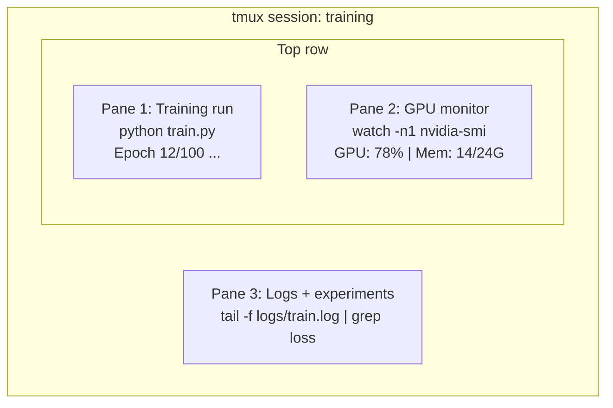

# टर्मिनल और शेल

> टर्मिनल में AI इंजीनियरों के रहने के लिए है. यहाँ आरामदायक हो जाओ.

**Type:** Learn
**Languages:** --
**Prerequisites:** Phase 0, Lesson 01
**Time:** ~35 minutes

## सीखने के लक्ष्य

- पाइपिंग का उपयोग करें, पुनर्निर्देशित करें, और `grep`कमांड लाइन से प्रशिक्षण लॉग को फ़िल्टर और संसाधित करने के लिए
- समवर्ती प्रशिक्षण और GPU निगरानी के लिए कई पैनलों के साथ निरंतर tmux सत्र बनाएं
-  के साथ प्रणाली और GPU संसाधनों की निगरानी`htop`,`nvtop`और `nvidia-smi`
- SSH का उपयोग करके स्थानीय और दूरस्थ मशीनों के बीच फ़ाइलें स्थानांतरित करें, `scp`और `rsync`

## समस्या

आप किसी भी संपादक की तुलना में टर्मिनल में अधिक समय बिताएंगे. प्रशिक्षण रन, जीपीयू निगरानी, लॉग टेलिंग, रिमोट एसएसएच सत्र, पर्यावरण प्रबंधन. हर एआई वर्कफ़्लो खोल को छूता है. यदि आप यहां धीमे हैं, तो आप हर जगह धीमे हैं।

यह सबक एआई के काम के लिए महत्वपूर्ण टर्मिनल कौशल को कवर करता है. कोई यूनिक्स इतिहास नहीं है. कोई गहरी गोता लगाना नहीं है Bash स्क्रिप्टिंग. बस आप क्या जरूरत है.

## अवधारणा



तीन चीजें एक साथ चल रही हैं एक टर्मिनल आप अलग हो सकते हैं, घर जाओ, SSH वापस में, और फिर से संलग्न. प्रशिक्षण चल रहा है.

```figure
s0-shell-pipeline
```

## इसे बनाओ

### चरण 1: अपनी शैल को जानें

जांचें कि आप किस गोले को चला रहे हैं:

```bash
echo $SHELL
```

अधिकांश प्रणालियों का उपयोग `bash`या `zsh`दोनों ठीक काम करते हैं. इस पाठ्यक्रम में आदेश दोनों में काम करते हैं.

जाननी चाहिए कि क्या है

```bash
# Move around
cd ~/projects/ai-engineering-from-scratch
pwd
ls -la

# History search (most useful shortcut you'll learn)
# Ctrl+R then type part of a previous command
# Press Ctrl+R again to cycle through matches

# Clear terminal
clear   # or Ctrl+L

# Cancel a running command
# Ctrl+C

# Suspend a running command (resume with fg)
# Ctrl+Z
```

### चरण 2: पाइपिंग और रीडायरेक्ट

पाइपिंग कमांड को एक साथ जोड़ती है. इस तरह आप लॉग, फिल्टर आउटपुट और श्रृंखला उपकरण को संसाधित करते हैं। आप इसे लगातार उपयोग करेंगे।

```bash
# Count how many times "loss" appears in a log
cat train.log | grep "loss" | wc -l

# Extract just the loss values from training output
grep "loss:" train.log | awk '{print $NF}' > losses.txt

# Watch a log file update in real time, filtering for errors
tail -f train.log | grep --line-buffered "ERROR"

# Sort experiments by final accuracy
grep "final_accuracy" results/*.log | sort -t= -k2 -n -r

# Redirect stdout and stderr to separate files
python train.py > output.log 2> errors.log

# Redirect both to the same file
python train.py > train_full.log 2>&1
```

तीन पुनर्निर्देशन आप की जरूरत हैः

| Symbol | What it does |
|--------|-------------|
| `>` | Write stdout to file (overwrite) |
| `>>` | Append stdout to file |
| `2>` | Write stderr to file |
| `2>&1` | Send stderr to same place as stdout |
| `\|` | Send stdout of one command as stdin to the next |

### चरण 3: पृष्ठभूमि प्रक्रियाएं

प्रशिक्षण में घंटों लगते हैं, आप अपना टर्मिनल हर समय खुला नहीं रखना चाहते।

```bash
# Run in background (output still goes to terminal)
python train.py &

# Run in background, immune to hangup (closing terminal won't kill it)
nohup python train.py > train.log 2>&1 &

# Check what's running in background
jobs
ps aux | grep train.py

# Bring a background job to foreground
fg %1

# Kill a background process
kill %1
# or find its PID and kill that
kill $(pgrep -f "train.py")
```

`&`,`nohup`और `screen`/`tmux`:

| Method | Survives terminal close? | Can reattach? |
|--------|-------------------------|---------------|
| `command &` | No | No |
| `nohup command &` | Yes | No (check log file) |
| `screen` / `tmux` | Yes | Yes |

कुछ मिनट से अधिक समय के लिए, Tmux का प्रयोग करें।

### चरण 4: tmux

tmux आप कई पैनलों के साथ निरंतर टर्मिनल सत्र बनाने के लिए अनुमति देता है. यह प्रशिक्षण रन के प्रबंधन के लिए सबसे उपयोगी उपकरण है.

```bash
# Install
# macOS
brew install tmux
# Ubuntu
sudo apt install tmux

# Start a named session
tmux new -s training

# Split horizontally
# Ctrl+B then "

# Split vertically
# Ctrl+B then %

# Navigate between panes
# Ctrl+B then arrow keys

# Detach (session keeps running)
# Ctrl+B then d

# Reattach
tmux attach -t training

# List sessions
tmux ls

# Kill a session
tmux kill-session -t training
```

एक विशिष्ट एआई वर्कफ़्लो सत्रः

```bash
tmux new -s train

# Pane 1: start training
python train.py --epochs 100 --lr 1e-4

# Ctrl+B, " to split, then run GPU monitor
watch -n1 nvidia-smi

# Ctrl+B, % to split vertically, tail the logs
tail -f logs/experiment.log

# Now detach with Ctrl+B, d
# SSH out, go get coffee, come back
# tmux attach -t train
```

### चरण 5: htop और nvtop के साथ निगरानी

```bash
# System processes (better than top)
htop

# GPU processes (if you have NVIDIA GPU)
# Install: sudo apt install nvtop (Ubuntu) or brew install nvtop (macOS)
nvtop

# Quick GPU check without nvtop
nvidia-smi

# Watch GPU usage update every second
watch -n1 nvidia-smi

# See which processes are using the GPU
nvidia-smi --query-compute-apps=pid,name,used_memory --format=csv
```

`htop`कुंजी बंधन आप उपयोग करेंगेः
- `F6`या `>`स्तंभ द्वारा क्रमबद्ध करने के लिए (मेमोरी लीक खोजने के लिए स्मृति द्वारा क्रमबद्ध)
- `F5`पेड़ दृश्य को स्विच करने के लिए (देखें बच्चे प्रक्रियाएं)
- `F9`किसी प्रक्रिया को मारने के लिए
- `/`प्रक्रिया नाम की खोज करने के लिए

### चरण 6: रिमोट जीपीयू बॉक्स के लिए SSH

जब आप क्लाउड जीपीयू (लैम्ब्डा, रनपॉड, वास्ट.एआई) किराए पर लेते हैं, तो आप SSH के माध्यम से कनेक्ट होते हैं।

```bash
# Basic connection
ssh user@gpu-box-ip

# With a specific key
ssh -i ~/.ssh/my_gpu_key user@gpu-box-ip

# Copy files to remote
scp model.pt user@gpu-box-ip:~/models/

# Copy files from remote
scp user@gpu-box-ip:~/results/metrics.json ./

# Sync a whole directory (faster for many files)
rsync -avz ./data/ user@gpu-box-ip:~/data/

# Port forward (access remote Jupyter/TensorBoard locally)
ssh -L 8888:localhost:8888 user@gpu-box-ip
# Now open localhost:8888 in your browser

# SSH config for convenience
# Add to ~/.ssh/config:
# Host gpu
#     HostName 192.168.1.100
#     User ubuntu
#     IdentityFile ~/.ssh/gpu_key
#
# Then just:
# ssh gpu
```

### चरण 7: एआई कार्य के लिए उपयोगी उपनाम

अपने लिए इन जोड़ें `~/.bashrc`या `~/.zshrc`:

```bash
source phases/00-setup-and-tooling/10-terminal-and-shell/code/shell_aliases.sh
```

या आप चाहते हैं कि जो कॉपी.

```bash
# GPU status at a glance
alias gpu='nvidia-smi --query-gpu=index,name,utilization.gpu,memory.used,memory.total,temperature.gpu --format=csv,noheader'

# Kill all Python training processes
alias killtraining='pkill -f "python.*train"'

# Quick virtual environment activate
alias ae='source .venv/bin/activate'

# Watch training loss
alias watchloss='tail -f logs/*.log | grep --line-buffered "loss"'
```

देखो`code/shell_aliases.sh`पूरी सेट के लिए.

### चरण 8: आम एआई टर्मिनल पैटर्न

ये व्यवहार में बार-बार सामने आते हैंः

```bash
# Run training, log everything, notify when done
python train.py 2>&1 | tee train.log; echo "DONE" | mail -s "Training complete" you@email.com

# Compare two experiment logs side by side
diff <(grep "accuracy" exp1.log) <(grep "accuracy" exp2.log)

# Find the largest model files (clean up disk space)
find . -name "*.pt" -o -name "*.safetensors" | xargs du -h | sort -rh | head -20

# Download a model from Hugging Face
wget https://huggingface.co/model/resolve/main/model.safetensors

# Untar a dataset
tar xzf dataset.tar.gz -C ./data/

# Count lines in all Python files (see how big your project is)
find . -name "*.py" | xargs wc -l | tail -1

# Check disk space (training data fills disks fast)
df -h
du -sh ./data/*

# Environment variable check before training
env | grep -i cuda
env | grep -i torch
```

## इसका प्रयोग करें

यहाँ है जब प्रत्येक उपकरण इस पाठ्यक्रम के दौरान खेल में आता हैः

| Tool | When you use it |
|------|----------------|
| tmux | Every training run (Phases 3+) |
| `tail -f` + `grep` | Monitoring training logs |
| `nohup` / `&` | Quick background tasks |
| `htop` / `nvtop` | Debugging slow training, OOM errors |
| SSH + `rsync` | Working on cloud GPUs |
| Piping + redirects | Processing experiment results |
| Aliases | Saving time on repetitive commands |

## व्यायाम

1. tmux स्थापित करें, तीन पैनलों के साथ एक सत्र बनाएं, और चलाएं `htop`एक में, `watch -n1 date`एक और में, और तीसरे में एक पायथन स्क्रिप्ट. अलग और फिर से संलग्न.
2.  से उपनाम जोड़ें`code/shell_aliases.sh`अपने खोल के साथ कॉन्फ़िगर और पुनः लोड करने के लिए`source ~/.zshrc`(या `~/.bashrc`) ।
3.  के साथ एक नकली प्रशिक्षण लॉग बनाएं`for i in $(seq 1 100); do echo "epoch $i loss: $(echo "scale=4; 1/$i" | bc)"; sleep 0.1; done > fake_train.log`और फिर उपयोग करें `grep`,`tail`और `awk`केवल हानि मानों को निकालने के लिए।
4. एक SSH कॉन्फ़िग प्रविष्टि सेट करें सर्वर के लिए आप पहुँच (या उपयोग) है`localhost`संश्लेषण का अभ्यास करने के लिए) ।

## प्रमुख शर्तें

| Term | What people say | What it actually means |
|------|----------------|----------------------|
| Shell | "The terminal" | The program that interprets your commands (bash, zsh, fish) |
| tmux | "Terminal multiplexer" | A program that lets you run multiple terminal sessions inside one window, and detach/reattach |
| Pipe | "The bar thing" | The `\|` operator that sends one command's output as input to another |
| PID | "Process ID" | A unique number assigned to every running process, used to monitor or kill it |
| nohup | "No hangup" | Runs a command immune to the hangup signal, so closing the terminal won't kill it |
| SSH | "Connecting to the server" | Secure Shell, an encrypted protocol for running commands on a remote machine |
