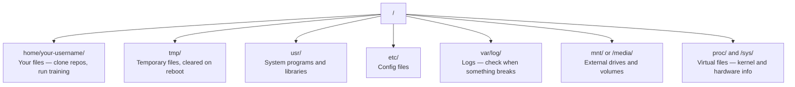

# एआई के लिए लिनक्स

> अधिकांश एआई लिनक्स पर चलता है. आपको फंसने से बचने के लिए पर्याप्त ज्ञान होना चाहिए.

**Type:** Learn
**Languages:** --
**Prerequisites:** Phase 0, Lesson 01
**Time:** ~30 minutes

## सीखने के लक्ष्य

- लिनक्स फ़ाइल प्रणाली को नेविगेट करें और कमांड लाइन से आवश्यक फ़ाइल संचालन करें
-  के साथ फ़ाइल अनुमतियों का प्रबंधन करें`chmod`और `chown`"अनुमति अस्वीकृत" त्रुटियों को हल करने के लिए
-  के साथ सिस्टम पैकेज स्थापित करें`apt`और एआई काम के लिए एक नया जीपीयू बॉक्स सेट
- मैकओएस-लिनक्स अंतरों की पहचान करें जो आमतौर पर दूरस्थ मशीनों पर काम करने वाले डेवलपर्स को ठोकर देते हैं

## समस्या

आप macOS या विंडोज पर विकसित करते हैं। लेकिन जैसे ही आप एक क्लाउड जीपीयू बॉक्स में SSH, एक लैम्ब्डा उदाहरण किराए पर, या एक EC2 मशीन को चालू करते हैं, आप उबंटू में उतरते हैं। टर्मिनल आपका एकमात्र इंटरफ़ेस है। कोई खोजकर्ता नहीं है, कोई एक्सप्लोरर नहीं है, कोई जीआई नहीं है। यदि आप फ़ाइल प्रणाली को नेविगेट नहीं कर सकते हैं, पैकेज स्थापित कर सकते हैं, और कमांड लाइन से प्रक्रियाओं का प्रबंधन नहीं कर सकते हैं, तो आप गुगल पर "लिनक्स में फ़ाइल को अनज़िप करने का तरीका" खोजते हुए निष्क्रिय GPU घंटों के लिए भुगतान कर रहे हैं।

यह एक अस्तित्व गाइड है. यह ठीक से कवर करता है कि आप एक रिमोट लिनक्स मशीन पर काम करने के लिए की जरूरत है एआई काम करने के लिए. और कुछ नहीं.

## फ़ाइल सिस्टम लेआउट

लिनक्स एक ही जड़ के तहत सब कुछ व्यवस्थित करता है `/`. . कोई नहीं है .`C:\`या `/Volumes`. . . निर्देशिकाओं आप वास्तव में स्पर्श करेंगेः



आपका होम डायरेक्टरी है `~`या `/home/your-username`लगभग सब कुछ आप यहाँ होता है.

## आवश्यक आज्ञाएँ

ये 15 कमांड हैं जो 95% को कवर करते हैं जो आप एक रिमोट जीपीयू बॉक्स पर करेंगे।

### घूमना

```bash
pwd                         # Where am I?
ls                          # What's here?
ls -la                      # What's here, including hidden files with details?
cd /path/to/dir             # Go there
cd ~                        # Go home
cd ..                       # Go up one level
```

### फ़ाइलें और निर्देशिकाएँ

```bash
mkdir my-project            # Create a directory
mkdir -p a/b/c              # Create nested directories in one shot

cp file.txt backup.txt      # Copy a file
cp -r src/ src-backup/      # Copy a directory (recursive)

mv old.txt new.txt          # Rename a file
mv file.txt /tmp/           # Move a file

rm file.txt                 # Delete a file (no trash, it's gone)
rm -rf my-dir/              # Delete a directory and everything inside
```

`rm -rf`प्रवेश करने से पहले पथ की दो बार जांच करें।

### फ़ाइलें पढ़ना

```bash
cat file.txt                # Print entire file
head -20 file.txt           # First 20 lines
tail -20 file.txt           # Last 20 lines
tail -f log.txt             # Follow a log file in real time (Ctrl+C to stop)
less file.txt               # Scroll through a file (q to quit)
```

### खोज

```bash
grep "error" training.log           # Find lines containing "error"
grep -r "learning_rate" .           # Search all files in current directory
grep -i "cuda" config.yaml          # Case-insensitive search

find . -name "*.py"                 # Find all Python files under current dir
find . -name "*.ckpt" -size +1G     # Find checkpoint files larger than 1GB
```

## अनुमति

लिनक्स में हर फ़ाइल में एक मालिक और अनुमति बिट्स है. आप इस पर चला जाएगा जब स्क्रिप्ट निष्पादित नहीं होगा या आप एक निर्देशिका में लिखने के लिए नहीं कर सकते.

```bash
ls -l train.py
# -rwxr-xr-- 1 user group 2048 Mar 19 10:00 train.py
#  ^^^             owner permissions: read, write, execute
#     ^^^          group permissions: read, execute
#        ^^        everyone else: read only
```

सामान्य सुधार:

```bash
chmod +x train.sh           # Make a script executable
chmod 755 deploy.sh         # Owner: full, others: read+execute
chmod 644 config.yaml       # Owner: read+write, others: read only

chown user:group file.txt   # Change who owns a file (needs sudo)
```

जब कुछ कहता है "अनुमति अस्वीकार कर दी गई है", यह लगभग हमेशा एक अनुमतियों का मुद्दा है। `chmod +x`या `sudo`ज्यादातर मामलों को ठीक करेगा।

## पैकेज प्रबंधन (अनुकूलित)

उबंटू का उपयोग करता है `apt`यह है कि कैसे आप सिस्टम स्तर पर सॉफ्टवेयर स्थापित करते हैं.

```bash
sudo apt update             # Refresh the package list (always do this first)
sudo apt install -y htop    # Install a package (-y skips confirmation)
sudo apt install -y build-essential  # C compiler, make, etc. Needed by many Python packages
sudo apt install -y tmux    # Terminal multiplexer (keep sessions alive after disconnect)

apt list --installed        # What's installed?
sudo apt remove htop        # Uninstall
```

सामान्य पैकेज आप एक ताजा GPU बॉक्स पर स्थापित करेंगेः

```bash
sudo apt update && sudo apt install -y \
    build-essential \
    git \
    curl \
    wget \
    tmux \
    htop \
    unzip \
    python3-venv
```

## उपयोगकर्ता और sudo

आप आमतौर पर एक नियमित उपयोगकर्ता के रूप में लॉग इन कर रहे हैं. कुछ संचालन रूट (प्रशासक) पहुंच की आवश्यकता है.

```bash
whoami                      # What user am I?
sudo command                # Run a single command as root
sudo su                     # Become root (exit to go back, use sparingly)
```

क्लाउड जीपीयू उदाहरणों पर, आप आमतौर पर एकमात्र उपयोगकर्ता हैं और पहले से ही sudo पहुंच है. सब कुछ रूट के रूप में नहीं चलाना. केवल आवश्यक होने पर sudo का उपयोग करें.

## प्रक्रियाएँ और प्रणाली

जब आपका प्रशिक्षण लटका हुआ है, या आप जांच करने की जरूरत है कि क्या चल रहा हैः

```bash
htop                        # Interactive process viewer (q to quit)
ps aux | grep python        # Find running Python processes
kill 12345                  # Gracefully stop process with PID 12345
kill -9 12345               # Force kill (use when graceful doesn't work)
nvidia-smi                  # GPU processes and memory usage
```

systemd सेवाओं (बैकग्राउंड डेमोन) का प्रबंधन करता है. आप इसका उपयोग करेंगे यदि आप inference सर्वर चलाते हैंः

```bash
sudo systemctl start nginx          # Start a service
sudo systemctl stop nginx           # Stop it
sudo systemctl restart nginx        # Restart it
sudo systemctl status nginx         # Check if it's running
sudo systemctl enable nginx         # Start automatically on boot
```

## डिस्क स्थान

GPU बॉक्स में अक्सर डिस्क स्थान सीमित होता है। मॉडल और डेटासेट इसे तेजी से भरते हैं।

```bash
df -h                       # Disk usage for all mounted drives
df -h /home                 # Disk usage for /home specifically

du -sh *                    # Size of each item in current directory
du -sh ~/.cache             # Size of your cache (pip, huggingface models land here)
du -sh /data/checkpoints/   # Check how big your checkpoints are

# Find the biggest space hogs
du -h --max-depth=1 / 2>/dev/null | sort -hr | head -20
```

सामान्य अंतरिक्ष बचतकर्ताः

```bash
# Clear pip cache
pip cache purge

# Clear apt cache
sudo apt clean

# Remove old checkpoints you don't need
rm -rf checkpoints/epoch_01/ checkpoints/epoch_02/
```

## नेटवर्किंग

आप मॉडल डाउनलोड करेंगे, फ़ाइलें स्थानांतरित, और कमांड लाइन से एपीआई हिट.

```bash
# Download files
wget https://example.com/model.bin                   # Download a file
curl -O https://example.com/data.tar.gz              # Same thing with curl
curl -s https://api.example.com/health | python3 -m json.tool  # Hit an API, pretty-print JSON

# Transfer files between machines
scp model.bin user@remote:/data/                     # Copy file to remote machine
scp user@remote:/data/results.csv .                  # Copy file from remote to local
scp -r user@remote:/data/checkpoints/ ./local-dir/   # Copy directory

# Sync directories (faster than scp for large transfers, resumes on failure)
rsync -avz --progress ./data/ user@remote:/data/
rsync -avz --progress user@remote:/results/ ./results/
```

उपयोग करें`rsync`खत्म हो गया`scp`यह केवल स्थानांतरण बदल गया बाइट्स और संभालता है टूट कनेक्शन.

## सत्रों को जीवित रखें

जब आप एक रिमोट बॉक्स में SSH, अपने लैपटॉप बंद करने के लिए अपने प्रशिक्षण रन को मारता है।

```bash
tmux new -s train           # Start a new session named "train"
# ... start your training, then:
# Ctrl+B, then D            # Detach (training keeps running)

tmux ls                     # List sessions
tmux attach -t train        # Reattach to session

# Inside tmux:
# Ctrl+B, then %            # Split pane vertically
# Ctrl+B, then "            # Split pane horizontally
# Ctrl+B, then arrow keys   # Switch between panes
```

हमेशा Tmux के अंदर लंबे प्रशिक्षण काम करते हैं.

## विंडोज उपयोगकर्ताओं के लिए WSL2

यदि आप विंडोज पर हैं, तो WSL2 आपको डबल-बूटिंग के बिना एक वास्तविक लिनक्स वातावरण देता है।

```bash
# In PowerShell (admin)
wsl --install -d Ubuntu-24.04

# After restart, open Ubuntu from Start menu
sudo apt update && sudo apt upgrade -y
```

WSL2 एक असली लिनक्स कर्नेल चलाता है. इस सब कुछ इस सबक में अंदर काम करता है. आपके विंडोज फ़ाइलें पर हैं`/mnt/c/Users/YourName/`WSL के अंदर से।

जीपीयू पास के माध्यम से विंडोज पक्ष पर स्थापित एनवीआईडीआईए ड्राइवर के साथ काम करता है। विंडोज एनवीआईडीआईए ड्राइवर (लिनक्स नहीं) स्थापित करें, और CUDA WSL2 के अंदर उपलब्ध होगा।

## Gotchas: macOS से लिनक्स

चीजें जो आपको ठोकर खाएगी यदि आप macOS से आ रहे हैंः

| macOS | Linux | Notes |
|-------|-------|-------|
| `brew install` | `sudo apt install` | Different package names sometimes. `brew install htop` vs `sudo apt install htop` works the same, but `brew install readline` vs `sudo apt install libreadline-dev` does not. |
| `open file.txt` | `xdg-open file.txt` | But you won't have a GUI on a remote box. Use `cat` or `less`. |
| `pbcopy` / `pbpaste` | Not available | Pipe to/from clipboard doesn't exist over SSH. |
| `~/.zshrc` | `~/.bashrc` | macOS defaults to zsh. Most Linux servers use bash. |
| `/opt/homebrew/` | `/usr/bin/`, `/usr/local/bin/` | Binaries live in different places. |
| `sed -i '' 's/a/b/' file` | `sed -i 's/a/b/' file` | macOS sed needs an empty string after `-i`. Linux does not. |
| Case-insensitive filesystem | Case-sensitive filesystem | `Model.py` and `model.py` are two different files on Linux. |
| Line endings `\n` | Line endings `\n` | Same. But Windows uses `\r\n`, which breaks bash scripts. Run `dos2unix` to fix. |

## त्वरित संदर्भ कार्ड

```
Navigation:     pwd, ls, cd, find
Files:          cp, mv, rm, mkdir, cat, head, tail, less
Search:         grep, find
Permissions:    chmod, chown, sudo
Packages:       apt update, apt install
Processes:      htop, ps, kill, nvidia-smi
Services:       systemctl start/stop/restart/status
Disk:           df -h, du -sh
Network:        curl, wget, scp, rsync
Sessions:       tmux new/attach/detach
```

```figure
s0-process-fork
```

## व्यायाम

1. किसी भी लिनक्स मशीन (या खुला WSL2) में SSH और अपने होम निर्देशिका में नेविगेट करें। एक परियोजना फ़ोल्डर बनाएं, इसके अंदर तीन खाली फ़ाइलें बनाएँ`touch`, फिर उन्हें सूचीबद्ध करें `ls -la`. .
2. स्थापित करें`htop`apt के साथ, इसे चलाएं, और पहचानें कि कौन सी प्रक्रिया सबसे अधिक स्मृति का उपयोग कर रही है।
3. एक tmux सत्र शुरू करें, चलें `sleep 300`अंदर, अलग, सूची सत्र, और फिर से संलग्न.
4. उपयोग करें`df -h`उपलब्ध डिस्क स्थान की जांच करने के लिए, फिर उपयोग करें `du -sh ~/.cache/*`अपने कैश में जगह ले रहा है क्या खोजने के लिए.
5. अपने स्थानीय मशीन से एक फ़ाइल को रिमोट पर स्थानांतरित करें `scp`, फिर वही स्थानांतरण करें `rsync`और अनुभव की तुलना करें।
