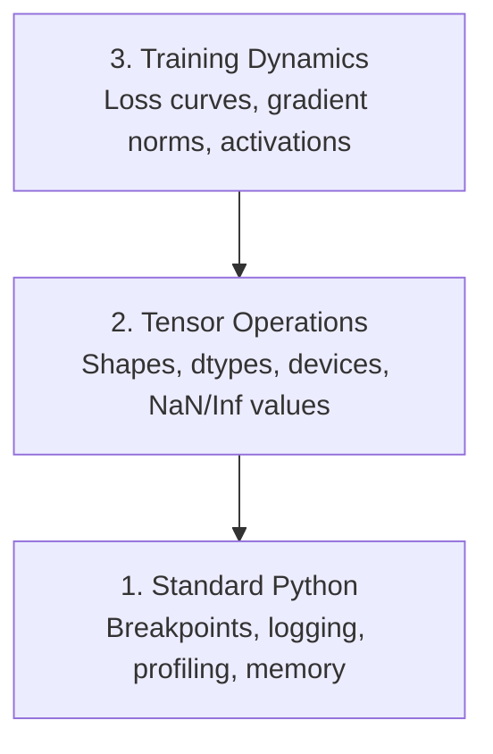

# डिबगिंग और प्रोफाइलिंग

> सबसे खराब AI कीड़े दुर्घटना नहीं करते हैं, वे चुपचाप कूड़े पर प्रशिक्षण देते हैं और एक सुंदर नुकसान वक्र रिपोर्ट करते हैं।

**Type:** Build
**Language:**पायथन
**Prerequisites:** Lesson 1 (Dev Environment), basic PyTorch familiarity
**Time:** ~60 minutes

## सीखने के लक्ष्य

- शर्त का उपयोग करें `breakpoint()`और `debug_print`प्रशिक्षण के बीच में टेन्सर के आकार, प्रकार और एनएएन मानों की जांच करने के लिए
-  के साथ प्रोफ़ाइल प्रशिक्षण लूप`cProfile`,`line_profiler`और `tracemalloc`बोतल की खाई ढूंढना
- सामान्य एआई बग का पता लगाएंः आकार असंगतता, एनएएन हानि, डेटा रिसाव, और गलत डिवाइस टेंसर
- हानि वक्रों, वजन हिस्टोग्राम, और ग्रेडिएंट वितरण को देखने के लिए TensorBoard सेट करें

## समस्या

एआई कोड सामान्य कोड से अलग तरह से विफल होता है। एक वेब ऐप स्टैक ट्रैक के साथ क्रैश होता है। एक गलत कॉन्फ़िगर प्रशिक्षण लूप 8 घंटे तक चलता है, जीपीयू समय में $ 200 जलाता है, और एक मॉडल का उत्पादन करता है जो प्रत्येक इनपुट के औसत का अनुमान लगाता है। कोड कभी भी त्रुटि नहीं करता है। बग गलत डिवाइस पर एक Tensor था, एक भूल गया `.detach()`, या लेबल सुविधाओं में लीक.

आपको डिबगिंग टूल की जरूरत है जो आपके समय और गणना को बर्बाद करने से पहले इन चुप विफलताओं को पकड़ते हैं।

## अवधारणा

एआई डिबगिंग तीन स्तरों पर काम करता हैः



अधिकांश लोग सीधे स्तर 3 पर कूदते हैं (टेंसरबोर्ड को देखते हुए) लेकिन 80% एआई बग 1 और 2 स्तर पर रहते हैं।

```figure
s0-flame-hot
```

## इसे बनाओ

### भाग 1: प्रिंट डिबगिंग (हाँ, यह काम करता है)

प्रिंट डिबगिंग को खारिज कर दिया जाता है. यह नहीं करना चाहिए. टेन्सर कोड के लिए, एक लक्षित प्रिंट कथन डिबगर से गुजरने से बेहतर है क्योंकि आपको एक ही समय में आकार, प्रकार और मूल्य रेंज देखने की आवश्यकता है।

```python
def debug_print(name, tensor):
    print(f"{name}: shape={tensor.shape}, dtype={tensor.dtype}, "
          f"device={tensor.device}, "
          f"min={tensor.min().item():.4f}, max={tensor.max().item():.4f}, "
          f"mean={tensor.mean().item():.4f}, "
          f"has_nan={tensor.isnan().any().item()}")
```

हर संदिग्ध ऑपरेशन के बाद इसे कॉल करें।

### भाग 2: पायथन डिबगर (पीडीबी और ब्रेकपॉइंट)

अंतर्निहित डिबगर AI काम के लिए कम मूल्यांकन किया गया है. ड्रॉप `breakpoint()`अपने प्रशिक्षण लूप में और इंटरैक्टिव रूप से टेन्सर की जांच.

```python
def training_step(model, batch, criterion, optimizer):
    inputs, labels = batch
    outputs = model(inputs)
    loss = criterion(outputs, labels)

    if loss.item() > 100 or torch.isnan(loss):
        breakpoint()

    loss.backward()
    optimizer.step()
```

जब डिबगर आप में छोड़ देता है, उपयोगी आदेशः

- `p outputs.shape`आकारों की जांच करने के लिए
- `p loss.item()`हानि मूल्य देखने के लिए
- `p torch.isnan(outputs).sum()`एनएएन की गिनती
- `p model.fc1.weight.grad`ग्रेडिएंट की जांच करने के लिए
- `c`जारी रखने के लिए,`q`छोड़ना

यह सशर्त डिबगिंग है, आप केवल जब कुछ गलत लग रहा है बंद. एक 10,000 कदम प्रशिक्षण रन के लिए, यह मायने रखता है.

### भाग 3: पायथन लॉगिंग

जब आपका डिबगिंग त्वरित जांच से परे हो तो प्रिंट स्टेटमेंट को लॉगिंग से बदलें।

```python
import logging

logging.basicConfig(
    level=logging.INFO,
    format="%(asctime)s [%(levelname)s] %(message)s",
    handlers=[
        logging.FileHandler("training.log"),
        logging.StreamHandler()
    ]
)
logger = logging.getLogger(__name__)

logger.info("Starting training: lr=%.4f, batch_size=%d", lr, batch_size)
logger.warning("Loss spike detected: %.4f at step %d", loss.item(), step)
logger.error("NaN loss at step %d, stopping", step)
```

लॉगिंग आपको समय स्टैम्प, गंभीरता स्तर और फ़ाइल आउटपुट देता है। जब प्रशिक्षण रन 3 AM पर विफल होता है, तो आप एक लॉग फ़ाइल चाहते हैं, न कि टर्मिनल आउटपुट जो स्क्रीन से स्क्रॉल किया गया है।

### भाग 4: समय कोड अनुभाग

समय कहाँ जाता है यह जानना अनुकूलन की दिशा में पहला कदम है।

```python
import time

class Timer:
    def __init__(self, name=""):
        self.name = name

    def __enter__(self):
        self.start = time.perf_counter()
        return self

    def __exit__(self, *args):
        elapsed = time.perf_counter() - self.start
        print(f"[{self.name}] {elapsed:.4f}s")

with Timer("data loading"):
    batch = next(dataloader_iter)

with Timer("forward pass"):
    outputs = model(batch)

with Timer("backward pass"):
    loss.backward()
```

सामान्य निष्कर्षः डेटा लोड करने में प्रशिक्षण समय का 60% समय लगता है।`num_workers > 0`अपने डेटा लोडर में, एक तेज जीपीयू नहीं.

### भाग 5: cProfile और line_profiiler

जब आपको मैनुअल टाइमर से ज्यादा की जरूरत हो:

```bash
python -m cProfile -s cumtime train.py
```

यह संचयी समय द्वारा क्रमबद्ध प्रत्येक फ़ंक्शन कॉल को दर्शाता है। लाइन-दर-लाइन प्रोफाइलिंग के लिएः

```bash
pip install line_profiler
```

```python
@profile
def train_step(model, data, target):
    output = model(data)
    loss = F.cross_entropy(output, target)
    loss.backward()
    return loss

# Run with: kernprof -l -v train.py
```

### भाग 6: स्मृति प्रोफाइलिंग

#### ट्रैसेमलॉक के साथ सीपीयू मेमोरी

```python
import tracemalloc

tracemalloc.start()

# your code here
model = build_model()
data = load_dataset()

snapshot = tracemalloc.take_snapshot()
top_stats = snapshot.statistics("lineno")
for stat in top_stats[:10]:
    print(stat)
```

#### memory_profiler के साथ CPU मेमोरी

```bash
pip install memory_profiler
```

```python
from memory_profiler import profile

@profile
def load_data():
    raw = read_csv("data.csv")       # watch memory jump here
    processed = preprocess(raw)       # and here
    return processed
```

दौड़ो`python -m memory_profiler your_script.py`लाइन-दर-लाइन मेमोरी उपयोग देखने के लिए।

#### PyTorch के साथ GPU मेमोरी

```python
import torch

if torch.cuda.is_available():
    print(torch.cuda.memory_summary())

    print(f"Allocated: {torch.cuda.memory_allocated() / 1e9:.2f} GB")
    print(f"Cached: {torch.cuda.memory_reserved() / 1e9:.2f} GB")
```

जब आप OOM (Out of Memory) दबाएँः

1. बैच आकार को कम करें (पहली कोशिश हमेशा करें)
2. उपयोग करें`torch.cuda.empty_cache()`कैश मेमोरी को मुक्त करने के लिए
3. उपयोग करें`del tensor`इसके बाद `torch.cuda.empty_cache()`बड़े मध्यवर्ती वस्तुओं के लिए
4. मिश्रित परिशुद्धता का उपयोग करें (`torch.cuda.amp`) मेमोरी उपयोग को आधा करने के लिए
5. बहुत गहरे मॉडल के लिए ग्रेडिएंट चेकपोइंटिंग का उपयोग करें

### भाग 7: आम AI कीड़े और उन्हें कैसे पकड़ें

#### आकृति असंगत

सबसे आम बग. एक tensor के आकार है`[batch, features]`जब मॉडल उम्मीद करता है `[batch, channels, height, width]`. .

```python
def check_shapes(model, sample_input):
    print(f"Input: {sample_input.shape}")
    hooks = []

    def make_hook(name):
        def hook(module, inp, out):
            in_shape = inp[0].shape if isinstance(inp, tuple) else inp.shape
            out_shape = out.shape if hasattr(out, "shape") else type(out)
            print(f"  {name}: {in_shape} -> {out_shape}")
        return hook

    for name, module in model.named_modules():
        hooks.append(module.register_forward_hook(make_hook(name)))

    with torch.no_grad():
        model(sample_input)

    for h in hooks:
        h.remove()
```

यह नमूना बैच के साथ एक बार चलाएं. यह आपके मॉडल में हर आकार परिवर्तन का नक्शा.

#### नॉन लॉस

एनएएन हानि का अर्थ है कुछ विस्फोट।

- सीखने की दर बहुत अधिक
- कस्टम हानि में शून्य से विभाजन
- शून्य या ऋणात्मक संख्या का लॉग
- आरएनएन में विस्फोटक ग्रेडिएंट

```python
def detect_nan(model, loss, step):
    if torch.isnan(loss):
        print(f"NaN loss at step {step}")
        for name, param in model.named_parameters():
            if param.grad is not None:
                if torch.isnan(param.grad).any():
                    print(f"  NaN gradient in {name}")
                if torch.isinf(param.grad).any():
                    print(f"  Inf gradient in {name}")
        return True
    return False
```

#### डेटा लीक

आपका मॉडल परीक्षण सेट पर 99% सटीकता प्राप्त करता है. यह बहुत अच्छा लगता है. यह एक बग है.

```python
def check_data_leakage(train_set, test_set, id_column="id"):
    train_ids = set(train_set[id_column].tolist())
    test_ids = set(test_set[id_column].tolist())
    overlap = train_ids & test_ids
    if overlap:
        print(f"DATA LEAKAGE: {len(overlap)} samples in both train and test")
        return True
    return False
```

समय लीक की भी जांच करेंः अतीत की भविष्यवाणी करने के लिए भविष्य के डेटा का उपयोग करें। विभाजन से पहले समय टिकट द्वारा क्रमबद्ध करें।

#### गलत उपकरण

विभिन्न उपकरणों पर टेंसर (CPU बनाम GPU) रनटाइम त्रुटियों का कारण बनते हैं। लेकिन कभी-कभी एक टेंसर चुपचाप CPU पर रहता है जबकि बाकी सब कुछ GPU पर है, और प्रशिक्षण केवल धीमा चलता है।

```python
def check_devices(model, *tensors):
    model_device = next(model.parameters()).device
    print(f"Model device: {model_device}")
    for i, t in enumerate(tensors):
        if t.device != model_device:
            print(f"  WARNING: tensor {i} on {t.device}, model on {model_device}")
```

### भाग 8: TensorBoard मूल बातें

TensorBoard आपको दिखाता है कि समय के साथ प्रशिक्षण के अंदर क्या हो रहा है।

```bash
pip install tensorboard
```

```python
from torch.utils.tensorboard import SummaryWriter

writer = SummaryWriter("runs/experiment_1")

for step in range(num_steps):
    loss = train_step(model, batch)

    writer.add_scalar("loss/train", loss.item(), step)
    writer.add_scalar("lr", optimizer.param_groups[0]["lr"], step)

    if step % 100 == 0:
        for name, param in model.named_parameters():
            writer.add_histogram(f"weights/{name}", param, step)
            if param.grad is not None:
                writer.add_histogram(f"grads/{name}", param.grad, step)

writer.close()
```

इसे लॉन्च करेंः

```bash
tensorboard --logdir=runs
```

क्या खोजेंः

- **Loss not decreasing**: सीखने की दर बहुत कम, या मॉडल वास्तुकला समस्या
- **Loss oscillating wildly**: सीखने की दर बहुत अधिक
- **Loss goes to NaN**: संख्यात्मक अस्थिरता (उपर NaN अनुभाग देखें)
- **Train loss decreasing, val loss increasing**: अति-फिटिंग
- **Weight histograms collapsing to zero**: विलुप्त हो रहे ग्रेडिएंट
- **Gradient histograms exploding**: ग्रेडिएंट क्लिपिंग की आवश्यकता

### भाग 9: वीएस कोड डिबगर

इंटरैक्टिव डिबगिंग के लिए, एक के साथ VS कोड कॉन्फ़िगर करें `launch.json`:

```json
{
    "version": "0.2.0",
    "configurations": [
        {
            "name": "Debug Training",
            "type": "debugpy",
            "request": "launch",
            "program": "${file}",
            "console": "integratedTerminal",
            "justMyCode": false
        }
    ]
}
```

डिबग कंसोल आपको मध्य निष्पादन में मनमाने पायथन अभिव्यक्ति चलाने की अनुमति देता है।

डेटा पूर्व प्रसंस्करण पाइपलाइनों के माध्यम से कदम के लिए उपयोगी जहां आप प्रत्येक परिवर्तन देखना चाहते हैं।

## इसका प्रयोग करें

यहाँ डिबगिंग वर्कफ़्लो है जो अधिकांश AI बग को पकड़ता हैः

1. **Before training**दौड़ `check_shapes`इनपुट और आउटपुट आयामों की उम्मीदों के अनुरूप जांच करें।
2. **First 10 steps**उपयोगः `debug_print`नुकसान, आउटपुट, और gradients पर पुष्टि करें कुछ भी NaN है और मान उचित सीमा में हैं।
3. **During training**: लॉग हानि, सीखने की दर, और ग्रेडिएंट मानकों। दृश्य के लिए TensorBoard का उपयोग करें।
4. **When something breaks**: ड्रॉप `breakpoint()`विफलता बिंदु पर. इंटरैक्टिव रूप से tensors निरीक्षण.
5. **For performance**: समय अपने डेटा लोड करने के लिए आगे बनाम पीछे पास. प्रोफ़ाइल स्मृति यदि आप OOM के पास हैं.

## इसे भेजें

डिबगिंग टूलकिट स्क्रिप्ट चलाएँ:

```bash
python phases/00-setup-and-tooling/12-debugging-and-profiling/code/debug_tools.py
```

देखो`outputs/prompt-debug-ai-code.md`एक संकेत के लिए जो एआई विशिष्ट बग का निदान करने में मदद करता है।

## व्यायाम

1. दौड़ें`debug_tools.py`एक NaN (संकेतः आगे पास में शून्य से विभाजित करें) पेश करने के लिए डमी मॉडल को संशोधित करें और डिटेक्टर को पकड़ते हुए देखें।
2. प्रशिक्षण लूप के साथ प्रोफ़ाइल करें `cProfile`और सबसे धीमी फ़ंक्शन की पहचान करें।
3. उपयोग करें`tracemalloc`यह पता लगाने के लिए कि आपके डेटा लोडिंग पाइपलाइन में कौन सी लाइन सबसे अधिक मेमोरी आवंटित करती है।
4. एक साधारण प्रशिक्षण रन के लिए TensorBoard सेट करें और यह पता लगाएं कि मॉडल अति उपयुक्त है या नहीं।
5. उपयोग करें`breakpoint()`प्रशिक्षण लूप के अंदर। डिबगर प्रॉम्प्ट से टेन्सर के आकार, उपकरणों और ग्रेडिएंट मानों का निरीक्षण करने का अभ्यास करें।
