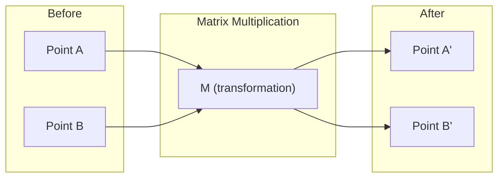
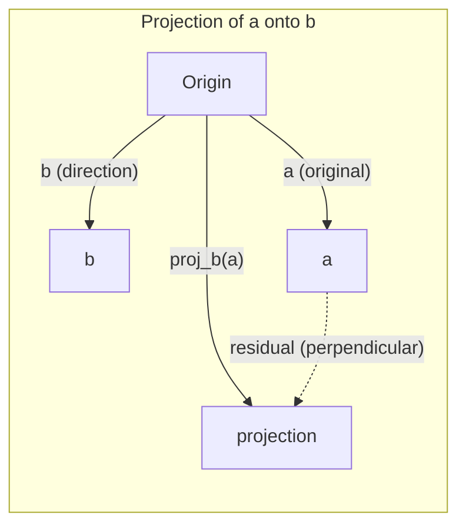

# रैखिक बीजगणित अंतर्ज्ञान

> हर एआई मॉडल सिर्फ मैट्रिक्स गणित है एक शानदार टोपी पहनने.

**Type:** Learn
**Languages:** Python, Julia
**Prerequisites:** Phase 0
**Time:** ~60 minutes

## सीखने के लक्ष्य

- पायथन में वेक्टर और मैट्रिक्स ऑपरेशन (अधिवेशन, डॉट उत्पाद, मैट्रिक्स गुणा) को खरोंच से लागू करें
- ज्यामितीय रूप से बताएं कि डॉट उत्पाद, प्रोजेक्शन और ग्राम-स्मिड्ट प्रक्रिया क्या करती है
- पंक्ति घटाने का उपयोग करके वेक्टरों के सेट की रैखिक स्वतंत्रता, रैंक और आधार का निर्धारण करें
- रैखिक बीजगणित अवधारणाओं को उनके एआई अनुप्रयोगों से जोड़ेंः एम्बेडिंग, ध्यान स्कोर और लोरा

## समस्या

किसी भी एमएल पेपर खोलें. पहले पृष्ठ के भीतर, आप वेक्टर, मैट्रिक्स, डॉट उत्पाद और परिवर्तन देखेंगे. रैखिक बीजगणित अंतर्ज्ञान के बिना, ये सिर्फ प्रतीक हैं. इसके साथ, आप देख सकते हैं कि एक तंत्रिका नेटवर्क वास्तव में क्या कर रहा है - अंतरिक्ष में चारों ओर बिंदुओं को स्थानांतरित करना।

आपको गणितज्ञ होने की जरूरत नहीं है आपको यह देखना होगा कि इन ऑपरेशनों का ज्यामितीय अर्थ क्या है, फिर उन्हें स्वयं कोड करें।

## अवधारणा

### वेक्टर बिंदु (और दिशाएं) हैं

वेक्टर सिर्फ संख्याओं की सूची है. लेकिन उन संख्याओं का अर्थ कुछ है - वे अंतरिक्ष में निर्देशांक हैं.

**2D vector [3, 2]:**

| x | y | Point |
|---|---|-------|
| 3 | 2 | The vector points from origin (0,0) to (3, 2) on the plane |

वेक्टर का आयाम वर्ग (३^2 + २^2) = वर्ग (१३) है और ऊपर और दाईं ओर इंगित करता है।

एआई में, वेक्टर सब कुछ का प्रतिनिधित्व करते हैंः
- एक शब्द → 768 संख्याओं का वेक्टर (इसे एम्बेडिंग स्पेस में "अर्थ" कहा जाता है)
- एक छवि → लाखों पिक्सेल मानों का वेक्टर
- एक उपयोगकर्ता → वरीयताओं का वेक्टर

### मैट्रिक्स परिवर्तन हैं

एक मैट्रिक्स एक वेक्टर को दूसरे वेक्टर में बदल देती है। यह घूम सकती है, स्केल कर सकती है, खिंचा सकती है या प्रोजेक्ट कर सकती है।



एआई में, मैट्रिक्स मॉडल हैंः
- तंत्रिका नेटवर्क वजन → मैट्रिक्स जो इनपुट को आउटपुट में परिवर्तित करते हैं
- ध्यान अंक → मैट्रिक्स जो तय करते हैं कि किस पर ध्यान केंद्रित किया जाए
- एम्बेड → मैट्रिक्स जो शब्दों को वेक्टरों में मानचित्रण करते हैं

### डॉट उत्पाद उपायों की समानता

दो वेक्टरों का डॉट गुणक आपको बताता है कि वे कितने समान हैं।

```
a · b = a₁×b₁ + a₂×b₂ + ... + aₙ×bₙ

Same direction:      a · b > 0  (similar)
Perpendicular:       a · b = 0  (unrelated)
Opposite direction:  a · b < 0  (dissimilar)
```

यह सचमुच है कि खोज इंजन, सिफारिश प्रणाली और आरएजी कैसे काम करते हैं -- उच्च बिंदु उत्पादों के साथ वेक्टर ढूंढें।

### रैखिक स्वतंत्रता

वेक्टर रैखिक रूप से स्वतंत्र हैं यदि सेट में कोई भी वेक्टर अन्य के संयोजन के रूप में नहीं लिखा जा सकता है। यदि v1, v2, v3 स्वतंत्र हैं, तो वे 3D स्थान को कवर करते हैं। यदि एक अन्य के संयोजन है, तो वे केवल एक विमान को कवर करते हैं।

AI के लिए यह महत्वपूर्ण क्यों हैः आपके फीचर मैट्रिक्स में रैखिक रूप से स्वतंत्र स्तंभ होना चाहिए। यदि दो फीचर पूरी तरह से सहसंबंधित हैं (रेखात्मक रूप से निर्भर), तो मॉडल उनके प्रभावों को अलग नहीं कर सकता है। यह प्रतिगमन में बहु-रैखिकता का कारण बनता है - वजन मैट्रिक्स अस्थिर हो जाता है, और छोटे इनपुट परिवर्तन जंगली आउटपुट स्विंग का उत्पादन करते हैं।

**Concrete example:**

```
v1 = [1, 0, 0]
v2 = [0, 1, 0]
v3 = [2, 1, 0]   # v3 = 2*v1 + v2
```

v1 और v2 स्वतंत्र हैं - न तो एक स्केलर गुणक है और न ही दूसरे का संयोजन है. लेकिन v3 = 2*v1 + v2, इसलिए {v1, v2, v3} एक निर्भर सेट है. ये तीन वेक्टर सभी xy-plane में स्थित हैं. आप उन्हें कैसे भी जोड़ें, आप [0, 0, 1] तक नहीं पहुंच सकते हैं। आपके पास तीन वेक्टर हैं लेकिन स्वतंत्रता के केवल दो आयाम हैं।

एक डेटासेट मेंः यदि feature_3 = 2*feature_1 + feature_2, feature_3 जोड़ने से मॉडल शून्य नई जानकारी देता है। इससे भी बदतर, यह सामान्य समीकरणों को एकल बनाता है - भार के लिए कोई अद्वितीय समाधान नहीं है।

### आधार और पद

आधार रैखिक रूप से स्वतंत्र वेक्टरों का एक न्यूनतम सेट है जो पूरे स्थान को कवर करता है। आधार वेक्टरों की संख्या अंतरिक्ष का आयाम है।

3D अंतरिक्ष के लिए मानक आधार {[1,0,0], [0,1,0], [0,0,1] है। लेकिन 3D में कोई भी तीन स्वतंत्र वेक्टर एक मान्य आधार बनाते हैं। आधार का चयन निर्देशांक प्रणाली का चयन है।

किसी मैट्रिक्स की रैंक = रैखिक रूप से स्वतंत्र स्तंभों की संख्या = रैखिक रूप से स्वतंत्र पंक्तियों की संख्या। यदि रैंक < min(पंक्तियाँ, कॉल) है, तो मैट्रिक्स रैंक-अभावी है। इसका मतलब हैः
- प्रणाली में अंतहीन कई समाधान हैं (या कोई भी नहीं)
- परिवर्तन में जानकारी खो जाती है
- मैट्रिक्स को उल्टा नहीं किया जा सकता है

| Situation | Rank | What it means for ML |
|-----------|------|---------------------|
| Full rank (rank = min(m, n)) | Maximum possible | Unique least-squares solution exists. Model is well-conditioned. |
| Rank deficient (rank < min(m, n)) | Below maximum | Features are redundant. Infinitely many weight solutions. Regularization needed. |
| Rank 1 | 1 | Every column is a scaled copy of one vector. All data lies on a line. |
| Near rank-deficient (small singular values) | Numerically low | Matrix is ill-conditioned. Tiny input noise causes large output changes. Use SVD truncation or ridge regression. |

### प्रक्षेपण

प्रोजेक्शन वेक्टर **a**वेक्टर पर **b** का घटक देता है**a**दिशा में **b**:

```
proj_b(a) = (a dot b / b dot b) * b
```

शेष (a - proj_b(a)) b के लिए लंबवत है। यह स्थिरांक घटाव न्यूनतम-वर्ग फिटिंग का आधार है।

प्रोजेक्शन ML में हर जगह हैः
- रैखिक विघटन अवलोकन से स्तंभ स्थान की दूरी को कम करता है - समाधान एक प्रक्षेपण है
- पीसीए अधिकतम भिन्नता की दिशाओं पर डेटा का अनुमान लगाता है
- ट्रांसफार्मर में ध्यान कुंजी पर क्वेरी के अनुमानों की गणना करता है



**Example:**a = [3, 4], b = [1, 0]

proj_b(a) = (3*1 + 4*0) / (1*1 + 0*0) * [1, 0] = 3 * [1, 0] = [3, 0]

प्रोजेक्शन y घटक को गिरा देता है. यह आयामता में कमी है अपने सबसे सरल रूप में - आप परवाह नहीं करते दिशाओं को फेंक.

### ग्राम-स्मिड्ट प्रक्रिया

किसी भी सेट को स्वतंत्र वेक्टरों में एक ओर्थोनॉर्मल आधार में परिवर्तित करना। ओर्थोनॉर्मल का मतलब है कि प्रत्येक वेक्टर की लंबाई 1 है और प्रत्येक जोड़ी लंबवत है।

एल्गोरिथ्मः
1. पहले वेक्टर को लें, इसे सामान्य करें
2. दूसरे वेक्टर को लें, पहले पर इसकी प्रोजेक्शन घटाएं, सामान्यीकरण करें
3. तीसरे वेक्टर को लें, सभी पिछले वेक्टरों पर इसके अनुमानों को घटाएं, सामान्यीकरण
4. शेष वेक्टरों के लिए दोहराएं

```
Input:  v1, v2, v3, ... (linearly independent)

u1 = v1 / |v1|

w2 = v2 - (v2 dot u1) * u1
u2 = w2 / |w2|

w3 = v3 - (v3 dot u1) * u1 - (v3 dot u2) * u2
u3 = w3 / |w3|

Output: u1, u2, u3, ... (orthonormal basis)
```

क्यूआर विघटन आंतरिक रूप से इस प्रकार काम करता है। क्यू ऑर्थोनॉर्मल आधार है, आर प्रोजेक्शन गुणांक को कैप्चर करता है। क्यूआर विघटन का उपयोग निम्नलिखित में किया जाता हैः
- रैखिक प्रणालियों का समाधान (गॉसियन उन्मूलन से अधिक स्थिर)
- कम्प्यूटिंग स्वमूल्य (क्यूआर एल्गोरिथ्म)
- न्यूनतम वर्गों की regression (मानक संख्यात्मक विधि)

```figure
eigen-directions
```

## इसे बनाओ

### चरण 1: खरोंच से वेक्टर (पाइटन)

```python
class Vector:
    def __init__(self, components):
        self.components = list(components)
        self.dim = len(self.components)

    def __add__(self, other):
        return Vector([a + b for a, b in zip(self.components, other.components)])

    def __sub__(self, other):
        return Vector([a - b for a, b in zip(self.components, other.components)])

    def dot(self, other):
        return sum(a * b for a, b in zip(self.components, other.components))

    def magnitude(self):
        return sum(x**2 for x in self.components) ** 0.5

    def normalize(self):
        mag = self.magnitude()
        return Vector([x / mag for x in self.components])

    def cosine_similarity(self, other):
        return self.dot(other) / (self.magnitude() * other.magnitude())

    def __repr__(self):
        return f"Vector({self.components})"


a = Vector([1, 2, 3])
b = Vector([4, 5, 6])

print(f"a + b = {a + b}")
print(f"a · b = {a.dot(b)}")
print(f"|a| = {a.magnitude():.4f}")
print(f"cosine similarity = {a.cosine_similarity(b):.4f}")
```

### चरण 2: स्क्रैच से मैट्रिक्स (पाइटन)

```python
class Matrix:
    def __init__(self, rows):
        self.rows = [list(row) for row in rows]
        self.shape = (len(self.rows), len(self.rows[0]))

    def __matmul__(self, other):
        if isinstance(other, Vector):
            return Vector([
                sum(self.rows[i][j] * other.components[j] for j in range(self.shape[1]))
                for i in range(self.shape[0])
            ])
        rows = []
        for i in range(self.shape[0]):
            row = []
            for j in range(other.shape[1]):
                row.append(sum(
                    self.rows[i][k] * other.rows[k][j]
                    for k in range(self.shape[1])
                ))
            rows.append(row)
        return Matrix(rows)

    def transpose(self):
        return Matrix([
            [self.rows[j][i] for j in range(self.shape[0])]
            for i in range(self.shape[1])
        ])

    def __repr__(self):
        return f"Matrix({self.rows})"


rotation_90 = Matrix([[0, -1], [1, 0]])
point = Vector([3, 1])

rotated = rotation_90 @ point
print(f"Original: {point}")
print(f"Rotated 90°: {rotated}")
```

### चरण 3: यह एआई के लिए महत्वपूर्ण क्यों है

```python
import random

random.seed(42)
weights = Matrix([[random.gauss(0, 0.1) for _ in range(3)] for _ in range(2)])
input_vector = Vector([1.0, 0.5, -0.3])

output = weights @ input_vector
print(f"Input (3D): {input_vector}")
print(f"Output (2D): {output}")
print("This is what a neural network layer does -- matrix multiplication.")
```

### चरण 4: जूलिया संस्करण

```julia
a = [1.0, 2.0, 3.0]
b = [4.0, 5.0, 6.0]

println("a + b = ", a + b)
println("a · b = ", a ⋅ b)       # Julia supports unicode operators
println("|a| = ", √(a ⋅ a))
println("cosine = ", (a ⋅ b) / (√(a ⋅ a) * √(b ⋅ b)))

# Matrix-vector multiplication
W = [0.1 -0.2 0.3; 0.4 0.5 -0.1]
x = [1.0, 0.5, -0.3]
println("Wx = ", W * x)
println("This is a neural network layer.")
```

### चरण 5: रैखिक स्वतंत्रता और खरोंच से प्रक्षेपण (पाइटन)

```python
def is_linearly_independent(vectors):
    n = len(vectors)
    dim = len(vectors[0].components)
    mat = Matrix([v.components[:] for v in vectors])
    rows = [row[:] for row in mat.rows]
    rank = 0
    for col in range(dim):
        pivot = None
        for row in range(rank, len(rows)):
            if abs(rows[row][col]) > 1e-10:
                pivot = row
                break
        if pivot is None:
            continue
        rows[rank], rows[pivot] = rows[pivot], rows[rank]
        scale = rows[rank][col]
        rows[rank] = [x / scale for x in rows[rank]]
        for row in range(len(rows)):
            if row != rank and abs(rows[row][col]) > 1e-10:
                factor = rows[row][col]
                rows[row] = [rows[row][j] - factor * rows[rank][j] for j in range(dim)]
        rank += 1
    return rank == n


def project(a, b):
    scalar = a.dot(b) / b.dot(b)
    return Vector([scalar * x for x in b.components])


def gram_schmidt(vectors):
    orthonormal = []
    for v in vectors:
        w = v
        for u in orthonormal:
            proj = project(w, u)
            w = w - proj
        if w.magnitude() < 1e-10:
            continue
        orthonormal.append(w.normalize())
    return orthonormal


v1 = Vector([1, 0, 0])
v2 = Vector([1, 1, 0])
v3 = Vector([1, 1, 1])
basis = gram_schmidt([v1, v2, v3])
for i, u in enumerate(basis):
    print(f"u{i+1} = {u}")
    print(f"  |u{i+1}| = {u.magnitude():.6f}")

print(f"u1 · u2 = {basis[0].dot(basis[1]):.6f}")
print(f"u1 · u3 = {basis[0].dot(basis[2]):.6f}")
print(f"u2 · u3 = {basis[1].dot(basis[2]):.6f}")
```

## इसका प्रयोग करें

अब NumPy के साथ भी वही बात है -- जो आप वास्तव में अभ्यास में उपयोग करेंगेः

```python
import numpy as np

a = np.array([1, 2, 3], dtype=float)
b = np.array([4, 5, 6], dtype=float)

print(f"a + b = {a + b}")
print(f"a · b = {np.dot(a, b)}")
print(f"|a| = {np.linalg.norm(a):.4f}")
print(f"cosine = {np.dot(a, b) / (np.linalg.norm(a) * np.linalg.norm(b)):.4f}")

W = np.random.randn(2, 3) * 0.1
x = np.array([1.0, 0.5, -0.3])
print(f"Wx = {W @ x}")
```

### NumPy के साथ रैंक, प्रोजेक्शन और क्यूआर

```python
import numpy as np

A = np.array([[1, 2], [2, 4]])
print(f"Rank: {np.linalg.matrix_rank(A)}")

a = np.array([3, 4])
b = np.array([1, 0])
proj = (np.dot(a, b) / np.dot(b, b)) * b
print(f"Projection of {a} onto {b}: {proj}")

Q, R = np.linalg.qr(np.random.randn(3, 3))
print(f"Q is orthogonal: {np.allclose(Q @ Q.T, np.eye(3))}")
print(f"R is upper triangular: {np.allclose(R, np.triu(R))}")
```

### PyTorch -- टेंसर ऑटोडिफ के साथ वेक्टर हैं

```python
import torch

x = torch.randn(3, requires_grad=True)
y = torch.tensor([1.0, 0.0, 0.0])

similarity = torch.dot(x, y)
similarity.backward()

print(f"x = {x.data}")
print(f"y = {y.data}")
print(f"dot product = {similarity.item():.4f}")
print(f"d(dot)/dx = {x.grad}")
```

x के संबंध में बिंदु उत्पाद का ग्रेडिएंट केवल y है. PyTorch ने इसे स्वचालित रूप से गणना की. एक तंत्रिका नेटवर्क में प्रत्येक ऑपरेशन इस तरह के संचालन से बनाया गया है - मैट्रिक्स गुणक, बिंदु उत्पाद, अनुमान - और ऑटोडिफ़ उन सभी के माध्यम से ग्रेडिएंट ट्रैक करता है।

आप सिर्फ एक पंक्ति में शुरू से ही बनाया है कि NumPy क्या करता है. अब आप जानते हैं कि हुड के नीचे क्या हो रहा है.

## इसे भेजें

इस पाठ से उत्पन्न होता हैः
- `outputs/prompt-linear-algebra-tutor.md`-- एआई सहायक के लिए एक संकेत ज्यामितीय अंतर्ज्ञान के माध्यम से रैखिक बीजगणित सिखाने के लिए

## संबंध

इस पाठ में सब कुछ आधुनिक एआई के विशिष्ट हिस्सों से जुड़ा हुआ हैः

| Concept | Where it shows up |
|---------|------------------|
| Dot product | Attention scores in transformers, cosine similarity in RAG |
| Matrix multiply | Every neural network layer, every linear transformation |
| Linear independence | Feature selection, avoiding multicollinearity |
| Rank | Determining if a system is solvable, LoRA (low-rank adaptation) |
| Projection | Linear regression (projecting onto column space), PCA |
| Gram-Schmidt / QR | Numerical solvers, eigenvalue computation |
| Orthonormal basis | Stable numerical computation, whitening transforms |

लोरा विशेष रूप से उल्लेख के योग्य है। यह बड़े भाषा मॉडल को निम्न श्रेणी के मैट्रिक्स में वजन अद्यतनों को तोड़कर ठीक-ठीक करता है। 4096x4096 वजन मैट्रिक्स (16M पैरामीटर) को अपडेट करने के बजाय, LoRA आकार 4096x16 और 16x4096 (131K पैरामीटर) के दो मैट्रिक्स को अपडेट करता है। रैंक-16 प्रतिबंध का अर्थ है कि लोरा वजन अद्यतन 4096 आयामी अंतरिक्ष के 16 आयामी उप-स्थान में रहता है। यह रैखिक बीजगणित है जो वास्तविक काम करता है।

## व्यायाम

1. कार्यान्वयन`Vector.angle_between(other)`जो दो वेक्टरों के बीच डिग्री में कोण लौटाता है
2. एक 2D स्केलिंग मैट्रिक्स बनाएं जो एक्स-संयोजन को दोगुना और वाई-संयोजन को तीन गुना करता है, फिर इसे वेक्टर पर लागू करें [1, 1]
3. 5 यादृच्छिक शब्द-जैसे वेक्टर (आयामी 50), कोसिन समानता का उपयोग करके दो सबसे समान खोजें
4. जांचें कि ग्राम-स्मिड आउटपुट वास्तव में ओर्थोनॉर्मल हैः जांचें कि प्रत्येक जोड़ी में अंक उत्पाद 0 है और प्रत्येक वेक्टर में परिमाण 1 है
5. रैंक 2 के साथ एक 3x3 मैट्रिक्स बनाएं।  का उपयोग करके सत्यापित करें`rank()`फिर बताओ कि स्तंभों का किनारे का ज्यामितीय वस्तु क्या है।
6. वेक्टर [1, 2, 3] को [1, 1, 1] पर प्रक्षेपित करें। परिणाम ज्यामितीय रूप से क्या दर्शाता है?

## प्रमुख शर्तें

| Term | What people say | What it actually means |
|------|----------------|----------------------|
| Vector | "An arrow" | A list of numbers representing a point or direction in n-dimensional space |
| Matrix | "A table of numbers" | A transformation that maps vectors from one space to another |
| Dot product | "Multiply and sum" | A measure of how aligned two vectors are -- the core of similarity search |
| Embedding | "Some AI magic" | A vector that represents the meaning of something (word, image, user) |
| Linear independence | "They don't overlap" | No vector in the set can be written as a combination of the others |
| Rank | "How many dimensions" | The number of linearly independent columns (or rows) in a matrix |
| Projection | "The shadow" | The component of one vector in the direction of another |
| Basis | "The coordinate axes" | A minimal set of independent vectors that span the space |
| Orthonormal | "Perpendicular unit vectors" | Vectors that are mutually perpendicular and each have length 1 |
