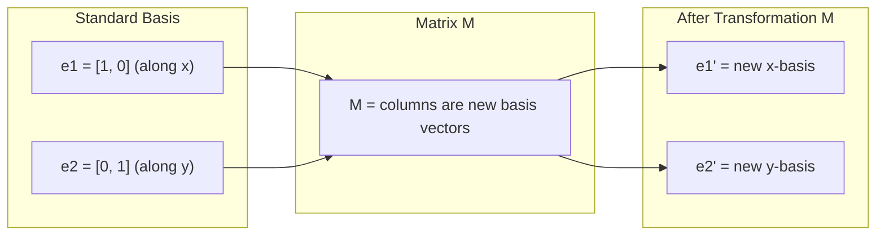
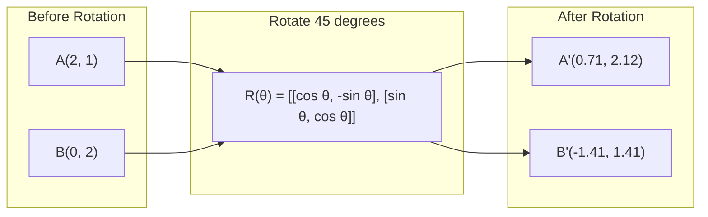
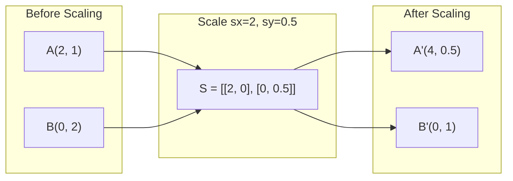
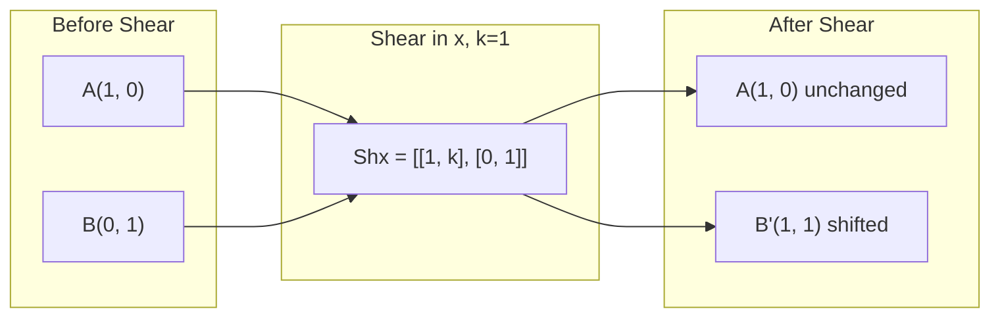
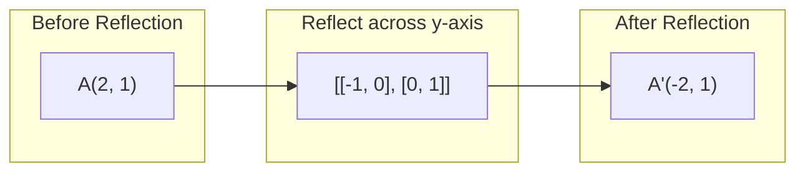
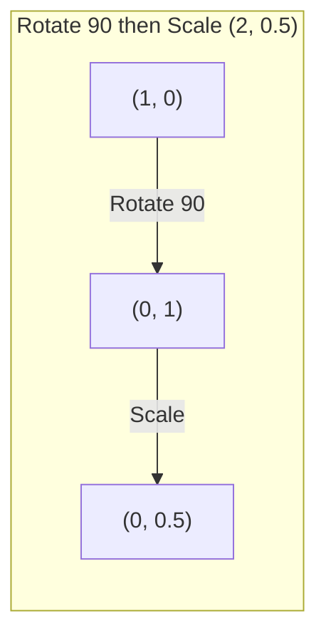
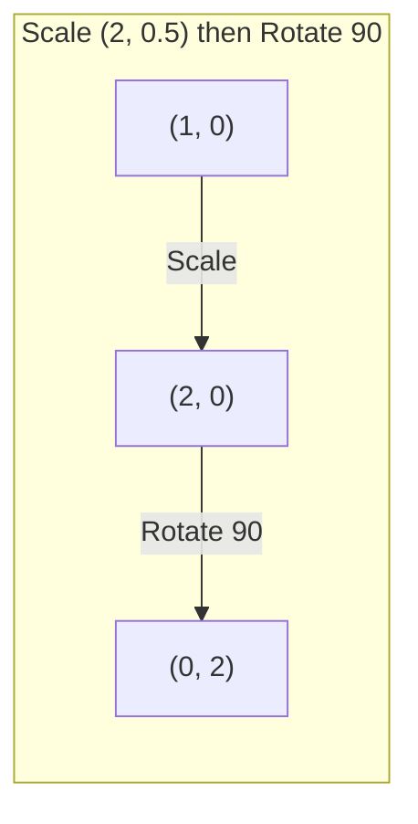

# मैट्रिक्स परिवर्तन

> मैट्रिक्स एक ऐसी मशीन है जो अंतरिक्ष को फिर से आकार देती है. जानें कि यह प्रत्येक बिंदु पर क्या करता है, और आप पूरे परिवर्तन को समझते हैं।

**Type:** Build
**Languages:** Python, Julia
**Prerequisites:** Phase 1, Lessons 01-02 (Linear Algebra Intuition, Vectors & Matrices Operations)
**Time:** ~75 minutes

## सीखने के लक्ष्य

- घूर्णन, स्केलिंग, स्केरिंग और प्रतिबिंब मैट्रिक्स का निर्माण करें और उन्हें 2D और 3D बिंदुओं पर लागू करें
- मैट्रिक्स गुणा द्वारा कई परिवर्तनों को लिखें और सत्यापित करें कि क्रम मायने रखता है
- विशेषता समीकरण से 2x2 मैट्रिक्स के स्वमूल्य और स्ववेक्टरों की गणना करें
- स्पष्ट करें कि स्वमानों ने पीसीए दिशाओं, आरएनएन स्थिरता और स्पेक्ट्रल क्लस्टरिंग व्यवहार को क्यों निर्धारित किया है

## समस्या

आप पीसीए के बारे में पढ़ते हैं और देखते हैं "कोवरिएंसी मैट्रिक्स के स्व-वेक्टर खोजें।" आप मॉडल स्थिरता के बारे में पढ़ते हैं और देखते हैं "जाँच करें कि क्या सभी स्व-मूल्यों का परिमाण 1 से कम है।" आप डेटा वृद्धि के बारे में पढ़ते हैं और देखते हैं "एक यादृच्छिक घूर्णन लागू करें।" इनमें से कोई भी समझ में नहीं आता है जब तक आप समझ नहीं लेते कि मैट्रिक्स ज्यामितीय रूप से अंतरिक्ष के लिए क्या करते हैं।

मैट्रिक्स केवल संख्याओं के ग्रिड नहीं हैं। वे स्थानिक मशीनें हैं। एक घूर्णन मैट्रिक्स बिंदुओं को घुमाता है। एक स्केलिंग मैट्रिक्स उन्हें खींचता है। एक स्केलिंग मैट्रिक्स उन्हें झुकाता है। डेटा पर लागू होने वाला प्रत्येक परिवर्तन इन कार्यों में से एक है या उनकी संरचना है। यह सबक उन कार्यों को ठोस बनाता है।

## अवधारणा

### मैट्रिक्स के रूप में परिवर्तन

2D में प्रत्येक रैखिक परिवर्तन को 2x2 मैट्रिक्स के रूप में लिखा जा सकता है. मैट्रिक्स आपको बताता है कि आधार वेक्टर [1, 0] और [0, 1] कहां समाप्त होते हैं। बाकी सब कुछ बाद में होता है।



### घूर्णन

कोण द्वारा 2D घूर्णन से दूरी और कोण बरकरार रहते हैं। यह एक वृत्त आर्क के साथ प्रत्येक बिंदु को स्थानांतरित करता है।



3D में, आप एक अक्ष के चारों ओर घूमते हैं. प्रत्येक अक्ष का अपना घूर्णन मैट्रिक्स हैः

```
Rz(theta) = | cos  -sin  0 |     Rotate around z-axis
            | sin   cos  0 |     (x-y plane spins, z stays)
            |  0     0   1 |

Rx(theta) = | 1   0     0    |   Rotate around x-axis
            | 0  cos  -sin   |   (y-z plane spins, x stays)
            | 0  sin   cos   |

Ry(theta) = |  cos  0  sin |     Rotate around y-axis
            |   0   1   0  |     (x-z plane spins, y stays)
            | -sin  0  cos |
```

### स्केलिंग

स्केलिंग प्रत्येक अक्ष के साथ स्वतंत्र रूप से खिंचाव या संपीड़न करती है।



### कतरनी

काटने से एक अक्ष को झुकाया जाता है जबकि दूसरा स्थिर रहता है। यह आयताकारों को समानांतर में बदल देता है।



स्कार्फ मैट्रिक्सः
- `Shx = [[1, k], [0, 1]]`k * y द्वारा x को शिफ्ट करता है
- `Shy = [[1, 0], [k, 1]]`k * x द्वारा y को शिफ्ट करता है

### चिंतन

प्रतिबिंब एक अक्ष या रेखा के पार बिंदुओं को दर्शाता है।



प्रतिबिंबण मैट्रिक्सः
- y अक्ष पर प्रतिबिंबित करें: `[[-1, 0], [0, 1]]`
- एक्स-अक्ष पर प्रतिबिंबित करेंः `[[1, 0], [0, -1]]`

### संरचनाः चेन परिवर्तन

परिवर्तन A और B को लागू करना उनकी मैट्रिक्स को गुणा करने के समान हैः `result = B @ A @ point`फिर घुमाओ तब पैमाने से अलग परिणाम देता है।



इसमें शामिल हैंः `S @ R = [[0, -2], [0.5, 0]]`



इसमें शामिल हैंः `R @ S = [[0, -0.5], [2, 0]]`

भिन्न परिणाम. मैट्रिक्स गुणा कम्यूटेटिव नहीं है.

### स्वमूल्य और स्ववेक्टर

अधिकांश वेक्टर उस समय दिशा बदलते हैं जब एक मैट्रिक्स उन्हें हिट करता है। स्व-वेक्टर विशेष होते हैंः मैट्रिक्स केवल उन्हें स्केल करता है, उन्हें कभी नहीं घुमाता है। स्केलिंग कारक स्व-मूल्य है।

```
A @ v = lambda * v

v is the eigenvector (direction that survives)
lambda is the eigenvalue (how much it stretches)

Example: A = | 2  1 |
             | 1  2 |

Eigenvector [1, 1] with eigenvalue 3:
  A @ [1,1] = [3, 3] = 3 * [1, 1]     (same direction, scaled by 3)

Eigenvector [1, -1] with eigenvalue 1:
  A @ [1,-1] = [1, -1] = 1 * [1, -1]  (same direction, unchanged)
```

मैट्रिक्स [1, 1] के साथ 3x से अंतरिक्ष को बढ़ाता है और [1, -1] को अपरिवर्तित रखता है। प्रत्येक अन्य दिशा इन दोनों का मिश्रण है।

### स्वयं संरचना

यदि किसी मैट्रिक्स में n रैखिक रूप से स्वतंत्र स्ववेक्टर हैं, तो इसे विघटित किया जा सकता हैः

```
A = V @ D @ V^(-1)

V = matrix whose columns are eigenvectors
D = diagonal matrix of eigenvalues
V^(-1) = inverse of V

This says: rotate into eigenvector coordinates, scale along each axis, rotate back.
```

### स्व-मूल्य क्यों मायने रखते हैं

**PCA.**सह-परिवर्तन मैट्रिक्स के स्वयं वेक्टर मुख्य घटक हैं। स्वयं मूल्य आपको बताते हैं कि प्रत्येक घटक कितना भिन्नता कैप्चर करता है। स्वयं मूल्य द्वारा क्रमबद्ध करें, शीर्ष k को बनाए रखें, और आपके पास आयामता में कमी है।

**Stability.**पुनरावर्ती नेटवर्क और गतिशील प्रणालियों में, परिमाण > 1 के साथ स्वमान आउटपुट को विस्फोट करने का कारण बनते हैं। परिमाण < 1 उन्हें गायब होने का कारण बनता है। यह एक वाक्य में वर्णित गायब होने / विस्फोट ग्रेडिएंट समस्या है।

**Spectral methods.**ग्राफ न्यूरल नेटवर्क आसन्नता मैट्रिक्स के स्वमान का उपयोग करते हैं। स्पेक्ट्रल क्लस्टरिंग लैप्लाशियन के स्वमान का उपयोग करता है। स्वमेणव ग्राफ की संरचना का खुलासा करते हैं।

### वॉल्यूम स्केलिंग कारक के रूप में निर्धारक

परिवर्तन मैट्रिक्स का निर्धारक आपको बताता है कि यह क्षेत्र (2D) या मात्रा (3D) को कितना स्केल करता है।

```
det = 1:   area preserved (rotation)
det = 2:   area doubled
det = 0:   space crushed to lower dimension (singular)
det = -1:  area preserved but orientation flipped (reflection)

| det(Rotation) | = 1        (always)
| det(Scale sx, sy) | = sx * sy
| det(Shear) | = 1           (area preserved)
| det(Reflection) | = -1     (orientation flipped)
```

```figure
matrix-transform
```

## इसे बनाओ

### चरण 1: खरोंच से परिवर्तन मैट्रिक्स (पाइटन)

```python
import math

def rotation_2d(theta):
    c, s = math.cos(theta), math.sin(theta)
    return [[c, -s], [s, c]]

def scaling_2d(sx, sy):
    return [[sx, 0], [0, sy]]

def shearing_2d(kx, ky):
    return [[1, kx], [ky, 1]]

def reflection_x():
    return [[1, 0], [0, -1]]

def reflection_y():
    return [[-1, 0], [0, 1]]

def mat_vec_mul(matrix, vector):
    return [
        sum(matrix[i][j] * vector[j] for j in range(len(vector)))
        for i in range(len(matrix))
    ]

def mat_mul(a, b):
    rows_a, cols_b = len(a), len(b[0])
    cols_a = len(a[0])
    return [
        [sum(a[i][k] * b[k][j] for k in range(cols_a)) for j in range(cols_b)]
        for i in range(rows_a)
    ]

point = [1.0, 0.0]
angle = math.pi / 4

rotated = mat_vec_mul(rotation_2d(angle), point)
print(f"Rotate (1,0) by 45 deg: ({rotated[0]:.4f}, {rotated[1]:.4f})")

scaled = mat_vec_mul(scaling_2d(2, 3), [1.0, 1.0])
print(f"Scale (1,1) by (2,3): ({scaled[0]:.1f}, {scaled[1]:.1f})")

sheared = mat_vec_mul(shearing_2d(1, 0), [1.0, 1.0])
print(f"Shear (1,1) kx=1: ({sheared[0]:.1f}, {sheared[1]:.1f})")

reflected = mat_vec_mul(reflection_y(), [2.0, 1.0])
print(f"Reflect (2,1) across y: ({reflected[0]:.1f}, {reflected[1]:.1f})")
```

### चरण 2: परिवर्तनों की संरचना

```python
R = rotation_2d(math.pi / 2)
S = scaling_2d(2, 0.5)

rotate_then_scale = mat_mul(S, R)
scale_then_rotate = mat_mul(R, S)

point = [1.0, 0.0]
result1 = mat_vec_mul(rotate_then_scale, point)
result2 = mat_vec_mul(scale_then_rotate, point)

print(f"Rotate 90 then scale: ({result1[0]:.2f}, {result1[1]:.2f})")
print(f"Scale then rotate 90: ({result2[0]:.2f}, {result2[1]:.2f})")
print(f"Same? {result1 == result2}")
```

### चरण 3: स्क्रैच से स्व-मूल्य (2x2)

एक 2x2 मैट्रिक्स के लिए `[[a, b], [c, d]]`, स्वमूल्य विशेषता समीकरण को हल करते हैंः `lambda^2 - (a+d)*lambda + (ad - bc) = 0`. .

```python
def eigenvalues_2x2(matrix):
    a, b = matrix[0]
    c, d = matrix[1]
    trace = a + d
    det = a * d - b * c
    discriminant = trace ** 2 - 4 * det
    if discriminant < 0:
        real = trace / 2
        imag = (-discriminant) ** 0.5 / 2
        return (complex(real, imag), complex(real, -imag))
    sqrt_disc = discriminant ** 0.5
    return ((trace + sqrt_disc) / 2, (trace - sqrt_disc) / 2)

def eigenvector_2x2(matrix, eigenvalue):
    a, b = matrix[0]
    c, d = matrix[1]
    if abs(b) > 1e-10:
        v = [b, eigenvalue - a]
    elif abs(c) > 1e-10:
        v = [eigenvalue - d, c]
    else:
        if abs(a - eigenvalue) < 1e-10:
            v = [1, 0]
        else:
            v = [0, 1]
    mag = (v[0] ** 2 + v[1] ** 2) ** 0.5
    return [v[0] / mag, v[1] / mag]

A = [[2, 1], [1, 2]]
vals = eigenvalues_2x2(A)
print(f"Matrix: {A}")
print(f"Eigenvalues: {vals[0]:.4f}, {vals[1]:.4f}")

for val in vals:
    vec = eigenvector_2x2(A, val)
    result = mat_vec_mul(A, vec)
    scaled = [val * vec[0], val * vec[1]]
    print(f"  lambda={val:.1f}, v={[round(x,4) for x in vec]}")
    print(f"    A@v = {[round(x,4) for x in result]}")
    print(f"    l*v = {[round(x,4) for x in scaled]}")
```

### चरण 4: वॉल्यूम स्केलिंग कारक के रूप में निर्धारक

```python
def det_2x2(matrix):
    return matrix[0][0] * matrix[1][1] - matrix[0][1] * matrix[1][0]

print(f"det(rotation 45) = {det_2x2(rotation_2d(math.pi/4)):.4f}")
print(f"det(scale 2,3)   = {det_2x2(scaling_2d(2, 3)):.1f}")
print(f"det(shear kx=1)  = {det_2x2(shearing_2d(1, 0)):.1f}")
print(f"det(reflect y)   = {det_2x2(reflection_y()):.1f}")

singular = [[1, 2], [2, 4]]
print(f"det(singular)     = {det_2x2(singular):.1f}")
print("Singular: columns are proportional, space collapses to a line.")
```

## इसका प्रयोग करें

NumPy अनुकूलित दिनचर्या के साथ यह सब संभालता है।

```python
import numpy as np

theta = np.pi / 4
R = np.array([[np.cos(theta), -np.sin(theta)],
              [np.sin(theta),  np.cos(theta)]])

point = np.array([1.0, 0.0])
print(f"Rotate (1,0) by 45 deg: {R @ point}")

S = np.diag([2.0, 3.0])
composed = S @ R
print(f"Scale(2,3) after Rotate(45): {composed @ point}")

A = np.array([[2, 1], [1, 2]], dtype=float)
eigenvalues, eigenvectors = np.linalg.eig(A)
print(f"\nEigenvalues: {eigenvalues}")
print(f"Eigenvectors (columns):\n{eigenvectors}")

for i in range(len(eigenvalues)):
    v = eigenvectors[:, i]
    lam = eigenvalues[i]
    print(f"  A @ v{i} = {A @ v}, lambda * v{i} = {lam * v}")

print(f"\ndet(R) = {np.linalg.det(R):.4f}")
print(f"det(S) = {np.linalg.det(S):.1f}")

B = np.array([[3, 1], [0, 2]], dtype=float)
vals, vecs = np.linalg.eig(B)
D = np.diag(vals)
V = vecs
reconstructed = V @ D @ np.linalg.inv(V)
print(f"\nEigendecomposition A = V @ D @ V^-1:")
print(f"Original:\n{B}")
print(f"Reconstructed:\n{reconstructed}")
```

### NumPy के साथ 3D घूर्णन

```python
def rotation_3d_z(theta):
    c, s = np.cos(theta), np.sin(theta)
    return np.array([[c, -s, 0], [s, c, 0], [0, 0, 1]])

def rotation_3d_x(theta):
    c, s = np.cos(theta), np.sin(theta)
    return np.array([[1, 0, 0], [0, c, -s], [0, s, c]])

point_3d = np.array([1.0, 0.0, 0.0])
rotated_z = rotation_3d_z(np.pi / 2) @ point_3d
rotated_x = rotation_3d_x(np.pi / 2) @ point_3d

print(f"\n3D point: {point_3d}")
print(f"Rotate 90 around z: {np.round(rotated_z, 4)}")
print(f"Rotate 90 around x: {np.round(rotated_x, 4)}")
```

## इसे भेजें

इस पाठ में पीसीए (चरण 2) और तंत्रिका नेटवर्क वजन विश्लेषण के लिए ज्यामितीय आधार बनाया गया है। यहां निर्मित स्व-मूल्य / ईजेनवेक्टर कोड वही एल्गोरिथ्म है जो उत्पादन एमएल सिस्टम में आयामता कमी, स्पेक्ट्रल क्लस्टरिंग और स्थिरता विश्लेषण को संचालित करता है।

## व्यायाम

1. एक इकाई वर्ग (कोने [0,0], [1,0], [1,1], [0,1]) पर घूर्णन, स्केलिंग और शेयरिंग लागू करें। प्रत्येक के लिए परिवर्तित कोनों को प्रिंट करें। जांचें कि घूर्णन को कोनों के बीच दूरी बनाए रखता है।

2. विशेषता समीकरण का उपयोग करके मैट्रिक्स [[4, 2], [1, 3]] के स्व-मूल्यों को हाथ से खोजें। फिर अपने खरोंच फ़ंक्शन और NumPy के साथ सत्यापित करें।

3. तीन परिवर्तनों की एक रचना बनाएं (30 डिग्री घूर्णन, [1.5, 0.8 द्वारा स्केल करें], kx=0.3 के साथ काटें) और इसे एक वृत्त में व्यवस्थित 8 बिंदुओं पर लागू करें। निर्देशांक से पहले और बाद में प्रिंट करें। गठित मैट्रिक्स के निर्धारक की गणना करें और सत्यापित करें कि यह व्यक्तिगत निर्धारकों के उत्पाद के बराबर है।

## प्रमुख शर्तें

| Term | What people say | What it actually means |
|------|----------------|----------------------|
| Rotation matrix | "Spins things" | An orthogonal matrix that moves points along circular arcs while preserving distances and angles. Determinant is always 1. |
| Scaling matrix | "Makes things bigger" | A diagonal matrix that stretches or compresses independently along each axis. Determinant is the product of scale factors. |
| Shearing matrix | "Slants things" | A matrix that shifts one coordinate proportionally to another, turning rectangles into parallelograms. Determinant is 1. |
| Reflection | "Mirrors things" | A matrix that flips space across an axis or plane. Determinant is -1. |
| Composition | "Do two things" | Multiplying transformation matrices to chain operations. Order matters: B @ A means apply A first, then B. |
| Eigenvector | "Special direction" | A direction that the matrix only scales, never rotates. The transformation's fingerprint. |
| Eigenvalue | "How much it stretches" | The scalar factor by which the matrix scales its eigenvector. Can be negative (flip) or complex (rotation). |
| Eigendecomposition | "Break the matrix apart" | Writing a matrix as V @ D @ V^(-1), separating it into its fundamental scaling directions and magnitudes. |
| Determinant | "A single number from a matrix" | The factor by which the transformation scales area (2D) or volume (3D). Zero means the transformation is irreversible. |
| Characteristic equation | "Where eigenvalues come from" | det(A - lambda * I) = 0. The polynomial whose roots are the eigenvalues. |

## आगे पढ़ना

- [3Blue1Brown: Linear Transformations](https://www.3blue1brown.com/lessons/linear-transformations)-- दृश्य अंतर्ज्ञान के लिए कैसे मैट्रिक्स अंतरिक्ष को फिर से आकार देने के लिए
- [3Blue1Brown: Eigenvectors and Eigenvalues](https://www.3blue1brown.com/lessons/eigenvalues)-- स्व-वेक्टरों का ज्यामितीय रूप से क्या अर्थ है की सबसे अच्छी दृश्य व्याख्या
- [MIT 18.06 Lecture 21: Eigenvalues and Eigenvectors](https://ocw.mit.edu/courses/18-06-linear-algebra-spring-2010/)- गिल्बर्ट स्ट्रैंग का क्लासिक उपचार
