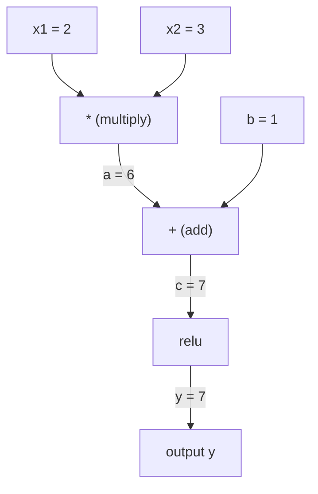
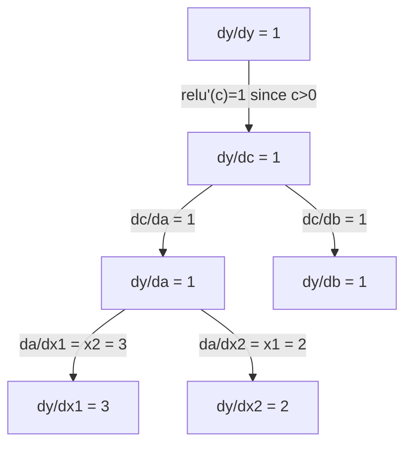

# चेन नियम और स्वचालित अंतर

> चेन नियम प्रत्येक तंत्रिका नेटवर्क के पीछे इंजन है जो सीखता है।

**Type:** Build
**Language:**पायथन
**Prerequisites:** Phase 1, Lesson 04 (Derivatives & Gradients)
**Time:** ~90 minutes

## सीखने के लक्ष्य

- एक न्यूनतम ऑटोग्रेड इंजन (मूल्य वर्ग) का निर्माण करें जो ऑपरेशन रिकॉर्ड करता है और रिवर्स मोड ऑटोडिफ के माध्यम से ग्रेडिएंट्स की गणना करता है
- टॉपॉलॉजिकल सॉर्ट का उपयोग करके गणना ग्राफ के माध्यम से आगे और पीछे की ओर गुजरना
- केवल स्क्रैच से ऑटोग्रेड इंजन का उपयोग करके XOR पर एक बहु-परत perceptron का निर्माण और प्रशिक्षण
- संख्यात्मक अंतहीन अंतरों के खिलाफ ग्रेडिएंट जांच का उपयोग करके ऑटोडिफ़ सटीकता की जांच करें

## समस्या

आप सरल कार्यों के व्युत्पन्नों की गणना कर सकते हैं। लेकिन एक तंत्रिका नेटवर्क एक सरल कार्य नहीं है। यह एक साथ मिलकर बने सैकड़ों कार्यों का है: मैट्रिक्स गुणा, पूर्वाग्रह जोड़ें, सक्रियण लागू करें, मैट्रिक्स फिर से गुणा करें, सॉफ्टमैक्स, क्रॉस-एंट्रोपी हानि। आउटपुट एक फ़ंक्शन का एक फ़ंक्शन है।

नेटवर्क को प्रशिक्षित करने के लिए, आपको प्रत्येक वजन के संबंध में हानि के ग्रेडिएंट की आवश्यकता होती है। लाखों मापदंडों के लिए इसे हाथ से करना असंभव है। इसे संख्यात्मक रूप से करना (सीमित अंतर) बहुत धीमा है।

श्रृंखला नियम आपको गणित देता है। स्वचालित विभेदन आपको एल्गोरिथ्म देता है। साथ में वे आपको एक एकल आगे के पास के समान समय में कार्यों की मनमाने रचनाओं के माध्यम से सटीक ग्रेडिएंट की गणना करने की अनुमति देते हैं।

यह है कि कैसे PyTorch, TensorFlow, और JAX काम करते हैं. आप खरोंच से एक लघु संस्करण का निर्माण करेंगे.

## अवधारणा

### श्रृंखला नियम

यदि`y = f(g(x))`,  के व्युत्पन्न`y`के संबंध में `x`है:

```
dy/dx = dy/dg * dg/dx = f'(g(x)) * g'(x)
```

श्रृंखला के साथ व्युत्पन्न को गुणा करें। प्रत्येक लिंक अपने स्थानीय व्युत्पन्न में योगदान देता है।

उदाहरण: `y = sin(x^2)`

```
g(x) = x^2       g'(x) = 2x
f(g) = sin(g)     f'(g) = cos(g)

dy/dx = cos(x^2) * 2x
```

गहरी रचनाओं के लिए, श्रृंखला विस्तारित हैः

```
y = f(g(h(x)))

dy/dx = f'(g(h(x))) * g'(h(x)) * h'(x)
```

न्यूरल नेटवर्क में हर परत इस श्रृंखला में एक कड़ी है।

### कम्प्यूटेशनल ग्राफ

एक कम्प्यूटेशनल ग्राफ श्रृंखला नियम को दृश्य बनाता है. प्रत्येक ऑपरेशन नोड बन जाता है. डेटा ग्राफ के माध्यम से आगे बहता है. ग्रेडिएंट पीछे की ओर बहते हैं.

**Forward pass (compute values):**



**Backward pass (compute gradients):**



पिछड़े पास प्रत्येक नोड पर श्रृंखला नियम लागू करता है, आउटपुट से इनपुट तक ग्रेडिएंट को प्रसारित करता है।

### आगे की मोड बनाम रिवर्स मोड

एक ग्राफ के माध्यम से श्रृंखला नियम लागू करने के दो तरीके हैं।

**Forward mode**इनपुट पर शुरू होता है और डेरिवेटिव आगे धकेलता है। यह गणना करता है`dx/dx = 1`अच्छा है जब आप कम इनपुट और कई आउटपुट है।

```
Forward mode: seed dx/dx = 1, propagate forward

  x = 2       (dx/dx = 1)
  a = x^2     (da/dx = 2x = 4)
  y = sin(a)  (dy/dx = cos(a) * da/dx = cos(4) * 4 = -2.615)
```

**Reverse mode**आउटपुट पर शुरू होता है और पीछे की ओर gradients खींचता है. यह गणना करता है`dy/dy = 1`और प्रत्येक ऑपरेशन के माध्यम से विपरीत में प्रसारित. अच्छा जब आप कई इनपुट और कुछ आउटपुट है.

```
Reverse mode: seed dy/dy = 1, propagate backward

  y = sin(a)  (dy/dy = 1)
  a = x^2     (dy/da = cos(a) = cos(4) = -0.654)
  x = 2       (dy/dx = dy/da * da/dx = -0.654 * 4 = -2.615)
```

न्यूरल नेटवर्क में लाखों इनपुट (वेट) और एक आउटपुट (लॉस) होते हैं। रिवर्स मोड एक बैकवर्ड पास में सभी ग्रेडिएंट की गणना करता है। यही कारण है कि बैकप्रॉपेगेशन रिवर्स मोड का उपयोग करता है।

| Mode | Seed | Direction | Best when |
|------|------|-----------|-----------|
| Forward | `dx_i/dx_i = 1` | Input to output | Few inputs, many outputs |
| Reverse | `dy/dy = 1` | Output to input | Many inputs, few outputs (neural nets) |

### आगे के मोड के लिए दोहरे संख्याएँ

आगे के मोड को डबल नंबरों के साथ सुरुचिपूर्ण रूप से लागू किया जा सकता है।`a + b*epsilon`कहाँ`epsilon^2 = 0`. .

```
Dual number: (value, derivative)

(2, 1) means: value is 2, derivative w.r.t. x is 1

Arithmetic rules:
  (a, a') + (b, b') = (a+b, a'+b')
  (a, a') * (b, b') = (a*b, a'*b + a*b')
  sin(a, a')         = (sin(a), cos(a)*a')
```

इनपुट चर को व्युत्पन्न 1 के साथ बीज करें। प्रत्येक ऑपरेशन के माध्यम से व्युत्पन्न स्वचालित रूप से संवर्धित होता है।

### ऑटोग्राड इंजन बनाना

एक ऑटोग्रेड इंजन तीन चीजों की जरूरत हैः

1. **Value wrapping.**किसी वस्तु में प्रत्येक संख्या को लपेटें जो उसका मूल्य और ग्रेडिएंट संग्रहीत करे।
2. **Graph recording.**प्रत्येक ऑपरेशन में इनपुट और स्थानीय ग्रेडिएंट फ़ंक्शन दर्ज होते हैं।
3. **Backward pass.**ग्राफ को टोपोलॉजिकल क्रमबद्ध करें, फिर इसे उल्टा करें, प्रत्येक नोड पर श्रृंखला नियम लागू करें।

यह ठीक यही है कि PyTorch है `autograd`है।`torch.Tensor`वर्ग मानों को लपेटता है, जब ऑपरेशन रिकॉर्ड करता है `requires_grad=True`, और गणना gradients जब आप कॉल`.backward()`. .

### कैसे PyTorch Autograd हुड के नीचे काम करता है

जब आप PyTorch कोड लिखते हैंः

```python
x = torch.tensor(2.0, requires_grad=True)
y = x ** 2 + 3 * x + 1
y.backward()
print(x.grad)  # 7.0 = 2*x + 3 = 2*2 + 3
```

PyTorch आंतरिक रूप सेः

1. एक `Tensor` के लिए नोड`x`के साथ`requires_grad=True`
2. प्रत्येक कार्य (`**`,`*`,`+`) एक नया नोड बनाता है और पीछे की फ़ंक्शन रिकॉर्ड करता है
3. `y.backward()`रिकॉर्ड किए गए ग्राफ के माध्यम से रिवर्स मोड ऑटोडिफ को ट्रिगर करता है
4. प्रत्येक नोड के `grad_fn`स्थानीय ग्रेडिएंट की गणना करता है और उन्हें माता-पिता नोड्स में पारित करता है
5. ग्रेडिएंट्स में जमा होते हैं `.grad`अतिरिक्त (बदला नहीं) के माध्यम से विशेषताएं

ग्राफ गतिशील है (रनिंग-दर-रनिंग) । प्रत्येक आगे के पास पर एक नया ग्राफ बनाया जाता है। यही कारण है कि PyTorch मॉडल के अंदर नियंत्रण प्रवाह (यदि / अन्यथा, लूप) का समर्थन करता है।

```figure
chain-rule
```

## इसे बनाओ

### चरण 1: मूल्य वर्ग

```python
class Value:
    def __init__(self, data, children=(), op=''):
        self.data = data
        self.grad = 0.0
        self._backward = lambda: None
        self._prev = set(children)
        self._op = op

    def __repr__(self):
        return f"Value(data={self.data:.4f}, grad={self.grad:.4f})"
```

हर `Value`यह अपने संख्यात्मक डेटा, उसके ग्रेडिएंट (शुरुआती शून्य), एक पिछड़े फ़ंक्शन को संग्रहीत करता है, और इसे उत्पन्न करने वाले बाल नोड्स को इंगित करता है।

### चरण 2: ग्रेडिएंट ट्रैकिंग के साथ अंकगणितीय संचालन

```python
    def __add__(self, other):
        other = other if isinstance(other, Value) else Value(other)
        out = Value(self.data + other.data, (self, other), '+')
        def _backward():
            self.grad += out.grad
            other.grad += out.grad
        out._backward = _backward
        return out

    def __mul__(self, other):
        other = other if isinstance(other, Value) else Value(other)
        out = Value(self.data * other.data, (self, other), '*')
        def _backward():
            self.grad += other.data * out.grad
            other.grad += self.data * out.grad
        out._backward = _backward
        return out

    def relu(self):
        out = Value(max(0, self.data), (self,), 'relu')
        def _backward():
            self.grad += (1.0 if out.data > 0 else 0.0) * out.grad
        out._backward = _backward
        return out
```

प्रत्येक ऑपरेशन एक बंद बनाता है जो जानता है कि स्थानीय ग्रेडिएंट की गणना कैसे की जाए और अपस्ट्रीम ग्रेडिएंट से गुणा किया जाए (`out.grad`                                                                                                                                                                                                                                                                                                                                                                                                                                                                                                                             `+=`ऐसे मामले को संभालता है जहां एक मान का उपयोग कई ऑपरेशन में किया जाता है।

### चरण 3: पीछे की ओर जाने का रास्ता

```python
    def backward(self):
        topo = []
        visited = set()
        def build_topo(v):
            if v not in visited:
                visited.add(v)
                for child in v._prev:
                    build_topo(child)
                topo.append(v)
        build_topo(self)

        self.grad = 1.0
        for v in reversed(topo):
            v._backward()
```

टोपोलॉजिकल सॉर्ट सुनिश्चित करता है कि प्रत्येक नोड का ग्रेडिएंट अपने बच्चों में फैलने से पहले पूरी तरह से गणना की जाए। बीज ग्रेडिएंट 1.0 (डी / डी = 1) है।

### चरण 4: पूर्ण इंजन के लिए अधिक संचालन

मूल मूल्य वर्ग जोड़, गुणा और रील्यू को संभालता है। एक वास्तविक ऑटोग्रेड इंजन को अधिक की आवश्यकता होती है। यहां तंत्रिका नेटवर्क बनाने के लिए आपको जिन कार्यों की आवश्यकता होती है वे हैंः

```python
    def __neg__(self):
        return self * -1

    def __sub__(self, other):
        return self + (-other)

    def __radd__(self, other):
        return self + other

    def __rmul__(self, other):
        return self * other

    def __rsub__(self, other):
        return other + (-self)

    def __pow__(self, n):
        out = Value(self.data ** n, (self,), f'**{n}')
        def _backward():
            self.grad += n * (self.data ** (n - 1)) * out.grad
        out._backward = _backward
        return out

    def __truediv__(self, other):
        return self * (other ** -1) if isinstance(other, Value) else self * (Value(other) ** -1)

    def exp(self):
        import math
        e = math.exp(self.data)
        out = Value(e, (self,), 'exp')
        def _backward():
            self.grad += e * out.grad
        out._backward = _backward
        return out

    def log(self):
        import math
        out = Value(math.log(self.data), (self,), 'log')
        def _backward():
            self.grad += (1.0 / self.data) * out.grad
        out._backward = _backward
        return out

    def tanh(self):
        import math
        t = math.tanh(self.data)
        out = Value(t, (self,), 'tanh')
        def _backward():
            self.grad += (1 - t ** 2) * out.grad
        out._backward = _backward
        return out
```

**Why each operation matters:**

| Operation | Backward rule | Used in |
|-----------|--------------|---------|
| `__sub__` | Reuses add + neg | Loss computation (pred - target) |
| `__pow__` | n * x^(n-1) | Polynomial activations, MSE (error^2) |
| `__truediv__` | Reuses mul + pow(-1) | Normalization, learning rate scaling |
| `exp` | exp(x) * upstream | Softmax, log-likelihood |
| `log` | (1/x) * upstream | Cross-entropy loss, log probabilities |
| `tanh` | (1 - tanh^2) * upstream | Classic activation function |

चतुर भागः `__sub__`और `__truediv__`वे सही ग्रेडिएंट मुफ्त में प्राप्त करते हैं क्योंकि श्रृंखला नियम अंतर्निहित जोड़/मल/पू ऑपरेशन के माध्यम से बना होता है।

### चरण 5: स्क्रैच से मिनी एमएलपी

एक पूर्ण मूल्य वर्ग के साथ, आप एक तंत्रिका नेटवर्क का निर्माण कर सकते हैं कोई PyTorch नहीं, कोई NumPy नहीं, केवल मूल्यों और श्रृंखला नियम।

```python
import random

class Neuron:
    def __init__(self, n_inputs):
        self.w = [Value(random.uniform(-1, 1)) for _ in range(n_inputs)]
        self.b = Value(0.0)

    def __call__(self, x):
        act = sum((wi * xi for wi, xi in zip(self.w, x)), self.b)
        return act.tanh()

    def parameters(self):
        return self.w + [self.b]

class Layer:
    def __init__(self, n_inputs, n_outputs):
        self.neurons = [Neuron(n_inputs) for _ in range(n_outputs)]

    def __call__(self, x):
        return [n(x) for n in self.neurons]

    def parameters(self):
        return [p for n in self.neurons for p in n.parameters()]

class MLP:
    def __init__(self, sizes):
        self.layers = [Layer(sizes[i], sizes[i+1]) for i in range(len(sizes)-1)]

    def __call__(self, x):
        for layer in self.layers:
            x = layer(x)
        return x[0] if len(x) == 1 else x

    def parameters(self):
        return [p for layer in self.layers for p in layer.parameters()]
```

ए `Neuron`गणना `tanh(w1*x1 + w2*x2 + ... + b)`.`Layer`न्यूरॉन्स की सूची है।`MLP`प्रत्येक भार एक है`Value`, तो बुला रहा है`loss.backward()`प्रत्येक पैरामीटर के लिए gradients प्रचारित करता है।

**Training on XOR:**

```python
random.seed(42)
model = MLP([2, 4, 1])  # 2 inputs, 4 hidden neurons, 1 output

xs = [[0, 0], [0, 1], [1, 0], [1, 1]]
ys = [-1, 1, 1, -1]  # XOR pattern (using -1/1 for tanh)

for step in range(100):
    preds = [model(x) for x in xs]
    loss = sum((p - y) ** 2 for p, y in zip(preds, ys))

    for p in model.parameters():
        p.grad = 0.0
    loss.backward()

    lr = 0.05
    for p in model.parameters():
        p.data -= lr * p.grad

    if step % 20 == 0:
        print(f"step {step:3d}  loss = {loss.data:.4f}")

print("\nPredictions after training:")
for x, y in zip(xs, ys):
    print(f"  input={x}  target={y:2d}  pred={model(x).data:6.3f}")
```

यह माइक्रोग्रेड है. शुद्ध पायथन में पूर्ण तंत्रिका नेटवर्क प्रशिक्षण लूप स्वचालित विभेदन के साथ. हर वाणिज्यिक गहरे सीखने फ्रेमवर्क बड़े पैमाने पर एक ही काम करता है.

### चरण 6: ग्रेडिएंट जांच

आप कैसे जानते हैं कि आपका ऑटोडिफ़ सही है? इसे संख्यात्मक व्युत्पन्न के साथ तुलना करें. यह ग्रेडिएंट जांच है।

```python
def gradient_check(build_expr, x_val, h=1e-7):
    x = Value(x_val)
    y = build_expr(x)
    y.backward()
    autodiff_grad = x.grad

    y_plus = build_expr(Value(x_val + h)).data
    y_minus = build_expr(Value(x_val - h)).data
    numerical_grad = (y_plus - y_minus) / (2 * h)

    diff = abs(autodiff_grad - numerical_grad)
    return autodiff_grad, numerical_grad, diff
```

इसे एक जटिल अभिव्यक्ति पर परीक्षण करेंः

```python
def expr(x):
    return (x ** 3 + x * 2 + 1).tanh()

ad, num, diff = gradient_check(expr, 0.5)
print(f"Autodiff:  {ad:.8f}")
print(f"Numerical: {num:.8f}")
print(f"Difference: {diff:.2e}")
# Difference should be < 1e-5
```

नए ऑपरेशन को लागू करते समय ग्रेडिएंट जांच आवश्यक है। यदि आपके बैकवर्ड पास में बग है, तो संख्यात्मक जांच इसे पकड़ती है। विकास के दौरान हर गंभीर गहन सीखने के कार्यान्वयन ग्रेडिएंट जांच चलाता है।

**When to use gradient checking:**

| Situation | Do gradient check? |
|-----------|-------------------|
| Adding a new operation to your autograd | Yes, always |
| Debugging a training loop that won't converge | Yes, check gradients first |
| Production training | No, too slow (2x forward passes per parameter) |
| Unit tests for autograd code | Yes, automate it |

### चरण 7: मैनुअल गणना के खिलाफ सत्यापित करें

```python
x1 = Value(2.0)
x2 = Value(3.0)
a = x1 * x2          # a = 6.0
b = a + Value(1.0)    # b = 7.0
y = b.relu()          # y = 7.0

y.backward()

print(f"y = {y.data}")          # 7.0
print(f"dy/dx1 = {x1.grad}")   # 3.0 (= x2)
print(f"dy/dx2 = {x2.grad}")   # 2.0 (= x1)
```

मैनुअल जांच: `y = relu(x1*x2 + 1)`. . .`x1*x2 + 1 = 7 > 0`, रीलू पहचान है।
`dy/dx1 = x2 = 3`. .`dy/dx2 = x1 = 2`इंजन मेल खाता है.

## इसका प्रयोग करें

### PyTorch के खिलाफ जांचें

```python
import torch

x1 = torch.tensor(2.0, requires_grad=True)
x2 = torch.tensor(3.0, requires_grad=True)
a = x1 * x2
b = a + 1.0
y = torch.relu(b)
y.backward()

print(f"PyTorch dy/dx1 = {x1.grad.item()}")  # 3.0
print(f"PyTorch dy/dx2 = {x2.grad.item()}")  # 2.0
```

आपके इंजन PyTorch के समान परिणाम की गणना करता है क्योंकि गणित एक ही हैः रिवर्स मोड ऑटोडिफ के माध्यम से श्रृंखला नियम.

### अधिक जटिल अभिव्यक्ति

```python
a = Value(2.0)
b = Value(-3.0)
c = Value(10.0)
f = (a * b + c).relu()  # relu(2*(-3) + 10) = relu(4) = 4

f.backward()
print(f"df/da = {a.grad}")  # -3.0 (= b)
print(f"df/db = {b.grad}")  #  2.0 (= a)
print(f"df/dc = {c.grad}")  #  1.0
```

## इसे भेजें

इस पाठ से उत्पन्न होता हैः
- `outputs/skill-autodiff.md`-- ऑटोग्रेड सिस्टम बनाने और डिबग करने की क्षमता
- `code/autodiff.py`-- एक न्यूनतम ऑटोग्रेड इंजन आप विस्तार कर सकते हैं

यहाँ निर्मित मूल्य वर्ग चरण 3 में तंत्रिका नेटवर्क प्रशिक्षण लूप के लिए आधार है।

## व्यायाम

1. जोड़ें `__pow__`मान वर्ग में आप गणना कर सकते हैं`x ** n`. . यह सत्यापित करें .`d/dx(x^3)`पर`x=2`बराबर `12.0`. .

2. जोड़ें `tanh`एक सक्रियण समारोह के रूप में. यह सत्यापित करें कि`tanh'(0) = 1`और `tanh'(2) = 0.0707`(अंदाजी)

3. एक ही न्यूरॉन के लिए एक गणना ग्राफ बनाएंः `y = relu(w1*x1 + w2*x2 + b)`सभी पांच ग्रेडिएंट की गणना करें और PyTorch के खिलाफ सत्यापित करें।

4. दोहरे संख्याओं का उपयोग करके आगे मोड ऑटोडिफ्लिकेशन लागू करें।`Dual`वर्ग और यह सत्यापित है कि यह आपके रिवर्स मोड इंजन के रूप में एक ही व्युत्पन्न देता है.

## प्रमुख शर्तें

| Term | What people say | What it actually means |
|------|----------------|----------------------|
| Chain rule | "Multiply the derivatives" | The derivative of composed functions equals the product of each function's local derivative, evaluated at the right point |
| Computational graph | "The network diagram" | A directed acyclic graph where nodes are operations and edges carry values (forward) or gradients (backward) |
| Forward mode | "Push derivatives forward" | Autodiff that propagates derivatives from inputs to outputs. One pass per input variable. |
| Reverse mode | "Backpropagation" | Autodiff that propagates gradients from outputs to inputs. One pass per output variable. |
| Autograd | "Automatic gradients" | A system that records operations on values, builds a graph, and computes exact gradients via the chain rule |
| Dual numbers | "Value plus derivative" | Numbers of the form a + b*epsilon (epsilon^2 = 0) that carry derivative information through arithmetic |
| Topological sort | "Dependency order" | Ordering graph nodes so every node comes after all its dependencies. Required for correct gradient propagation. |
| Gradient accumulation | "Add, don't replace" | When a value feeds into multiple operations, its gradient is the sum of all incoming gradient contributions |
| Dynamic graph | "Define by run" | A computation graph rebuilt on every forward pass, allowing Python control flow inside models (PyTorch style) |
| Gradient checking | "Numerical verification" | Comparing autodiff gradients against numerical finite-difference gradients to verify correctness. Essential for debugging. |
| MLP | "Multi-layer perceptron" | A neural network with one or more hidden layers of neurons. Each neuron computes a weighted sum plus bias, then applies an activation function. |
| Neuron | "Weighted sum + activation" | The basic unit: output = activation(w1*x1 + w2*x2 + ... + b). The weights and bias are learnable parameters. |

## आगे पढ़ना

- [3Blue1Brown: Backpropagation calculus](https://www.youtube.com/watch?v=tIeHLnjs5U8)-- तंत्रिका नेटवर्क में श्रृंखला नियम की दृश्य व्याख्या
- [PyTorch Autograd mechanics](https://pytorch.org/docs/stable/notes/autograd.html)-- वास्तविक प्रणाली कैसे काम करती है
- [Baydin et al., Automatic Differentiation in Machine Learning: a Survey](https://arxiv.org/abs/1502.05767)-- व्यापक संदर्भ
