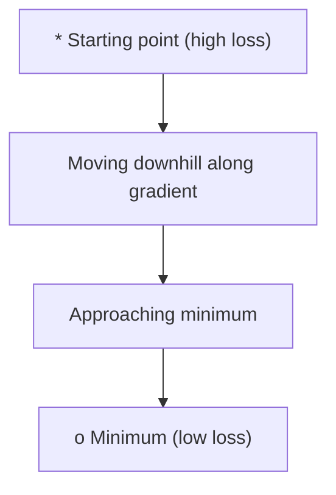
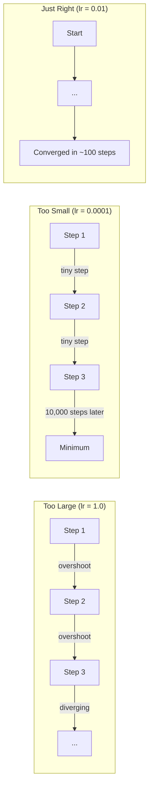
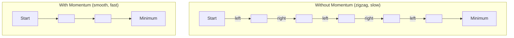
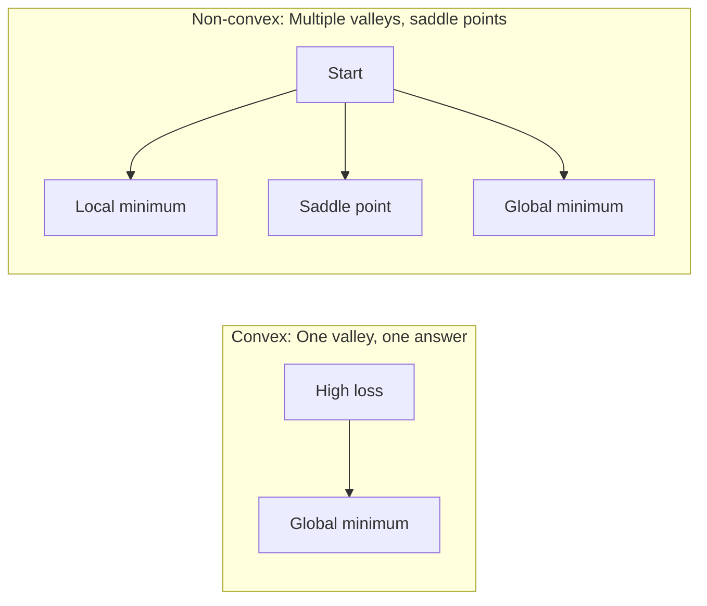
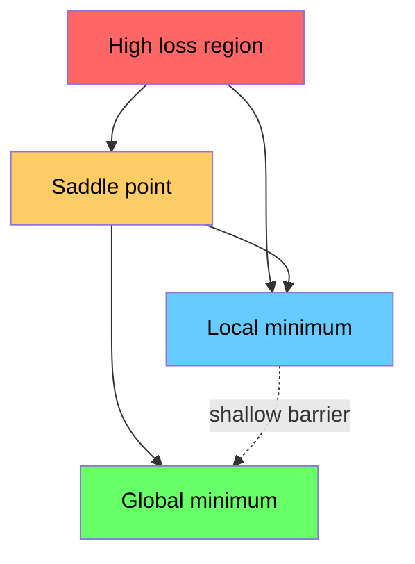

# अनुकूलन

> एक तंत्रिका नेटवर्क को प्रशिक्षित करना किसी घाटी के नीचे की खोज से ज्यादा कुछ नहीं है।

**Type:** Build
**Language:**पायथन
**Prerequisites:** Phase 1, Lessons 04-05 (Derivatives, Gradients)
**Time:** ~75 minutes

## सीखने के लक्ष्य

- वेनिला ग्रेडिएंट गिरावट, गति के साथ एसजीडी लागू करें, और आदम खरोंच से
- Rosenbrock समारोह पर अनुकूलक अभिसरण की तुलना करें और समझाएं कि क्यों एडम प्रति वजन सीखने की दरों को अनुकूलित करता है
- घुमावदार और गैर घुमावदार हानि परिदृश्यों को अलग करें और उच्च आयामों में सaddle points की भूमिका की व्याख्या करें
- प्रशिक्षण स्थिरता के लिए सीखने की दर के कार्यक्रमों (चरण गिरावट, कोसिन annealing, वार्मिंग) को कॉन्फ़िगर करें

## समस्या

आप एक हानि समारोह है. यह आपको बताता है कि आपका मॉडल कितना गलत है. आप gradients है. वे आपको बताता है कि किस दिशा में नुकसान को बदतर बनाता है. अब आप एक रणनीति की जरूरत है गिरने के लिए चलना.

साफ़-साफ़ दृष्टिकोण सरल हैः ग्रेडिएंट के विपरीत कदम उठाएं। सीखने की दर के नाम से किसी संख्या से कदम को मापें। दोहराएँ। यह ग्रेडिएंट गिरावट है, और यह काम करता है. लेकिन "काम" में चेतावनी है। बहुत बड़ी सीखने की दर और आप पूरी तरह से घाटी पार, दीवारों के बीच कूद. बहुत छोटा है और आप हजारों अनावश्यक कदमों पर उत्तर की ओर रेंगते हैं। एक सड़ल बिंदु पर हिट करें और आप एक न्यूनतम नहीं मिला है, भले ही आप आगे बढ़ना बंद कर दें.

गहन सीखने में हर अनुकूलक एक ही प्रश्न का उत्तर है: आप घाटी के नीचे कैसे तेजी से और अधिक विश्वसनीय रूप से पहुंचते हैं?

## अवधारणा

### अनुकूलन का क्या अर्थ है

अनुकूलन इनपुट मानों को खोजना है जो किसी फ़ंक्शन को न्यूनतम (या अधिकतम) करते हैं। मशीन लर्निंग में, फ़ंक्शन हानि है। इनपुट मॉडल के वजन हैं। प्रशिक्षण अनुकूलन है।

```
minimize L(w) where:
  L = loss function
  w = model weights (could be millions of parameters)
```

### ग्रेडिएंट अवतरण (वैनिला)

सबसे सरल अनुकूलक. हर वजन के संबंध में हानि के ग्रेडिएंट की गणना करें. प्रत्येक वजन को उसके ग्रेडिएंट के विपरीत दिशा में ले जाएं. सीखने की दर से कदम को मापें।

```
w = w - lr * gradient
```

यह पूरी एल्गोरिथ्म है. एक पंक्ति.



### सीखने की दरः सबसे महत्वपूर्ण हाइपरपरमैटर

सीखने की दर कदम के आकार को नियंत्रित करती है. यह अभिसरण के बारे में सब कुछ निर्धारित करती है.



सही सीखने की दर के लिए कोई सूत्र नहीं है. आप इसे प्रयोग से पाते हैं. आम प्रारंभिक बिंदुः एडम के लिए 0.001, गति के साथ एसजीडी के लिए 0.01।

### एसजीडी बनाम बैच बनाम मिनी बैच

वैनिला ग्रेडिएंट डाउनग्रेड एक कदम लेने से पहले पूरे डेटासेट पर ग्रेडिएंट की गणना करता है। इसे बैच ग्रेडिएंट डाउनग्रेड कहा जाता है। यह स्थिर है लेकिन धीमा है।

स्टोकास्टिक ग्रेडिएंट डाउनसेंट (SGD) एक एकल यादृच्छिक नमूने पर ग्रेडिएंट की गणना करता है और तुरंत कदम उठाता है। यह शोरदार लेकिन तेज़ है।

मिनी बैच ग्रेडिएंट डाउनग्रेड अंतर को विभाजित करता है। एक छोटे बैच (32, 64, 128, 256 नमूने) पर ग्रेडिएंट की गणना करें, फिर कदम। यह वास्तव में हर कोई उपयोग करता है।

| Variant | Batch size | Gradient quality | Speed per step | Noise |
|---------|-----------|-----------------|---------------|-------|
| Batch GD | Entire dataset | Exact | Slow | None |
| SGD | 1 sample | Very noisy | Fast | High |
| Mini-batch | 32-256 | Good estimate | Balanced | Moderate |

एसजीडी और मिनी बैच में शोर कोई बग नहीं है. यह स्थानिक न्यूनतम और सaddle points से बचने में मदद करता है।

### गतिः गेंद गिरती है

वैनिला ग्रेडिएंट की गिरावट केवल वर्तमान ग्रेडिएंट को देखता है। यदि ग्रेडिएंट ज़िगज़ैग (झीले घाटियों में आम) हैं, तो प्रगति धीमी होती है। गति पिछले ग्रेडिएंट को गति अवधि में जमा करके इसे ठीक करती है।

```
v = beta * v + gradient
w = w - lr * v
```

इसी तरह, एक गेंद गिरती है, हर झटके पर रुकती नहीं है और फिर से शुरू नहीं होती है। यह लगातार दिशाओं में गति बढ़ाता है और घर्षणों को धीमा करता है।



`beta`(आमतौर पर 0.9) यह नियंत्रित करता है कि कितना इतिहास रखने के लिए। उच्च बीटा का मतलब है अधिक गति, चिकनी मार्ग, लेकिन दिशा परिवर्तनों के लिए धीमी प्रतिक्रिया।

### एडमः अनुकूलनशील सीखने की दरें

अलग-अलग वजन को अलग-अलग सीखने की दरों की आवश्यकता होती है। एक वजन जो शायद ही कभी बड़े ग्रेडिएंट प्राप्त करता है, उसे बड़े कदम उठाने चाहिए जब वह अंततः करता है। एक वजन जो लगातार बड़े ग्रेडिएंट प्राप्त करता है, उसे छोटे कदम उठाने चाहिए।

एडम (अनुकूली क्षण अनुमान) वजन के प्रति दो चीजों को ट्रैक करता हैः

1. प्रथम क्षण (m): गति के समान ग्रेडिएंट का चल रहा औसत
2. दूसरा क्षण (v): वर्ग ग्रेडिएंट्स का चल रहा औसत (ग्रेडिएंट ग्रेडिएंट)

```
m = beta1 * m + (1 - beta1) * gradient
v = beta2 * v + (1 - beta2) * gradient^2

m_hat = m / (1 - beta1^t)    bias correction
v_hat = v / (1 - beta2^t)    bias correction

w = w - lr * m_hat / (sqrt(v_hat) + epsilon)
```

 द्वारा विभाजन`sqrt(v_hat)`बड़े ग्रेडिएंट वाले वजन को बड़ी संख्या (छोटे प्रभावी कदम) से विभाजित किया जाता है। छोटे ग्रेडिएंट वाले वजन को छोटी संख्या (बड़े प्रभावी कदम) से विभाजित किया जाता है। प्रत्येक वजन को अपनी अनुकूलन सीखने की दर मिलती है।

डिफ़ॉल्ट हाइपरपरमैटर्स: `lr=0.001, beta1=0.9, beta2=0.999, epsilon=1e-8`ये डिफ़ॉल्ट अधिकांश समस्याओं के लिए अच्छी तरह से काम करते हैं।

### सीखने की दर के कार्यक्रम

एक निश्चित सीखने की दर एक समझौता है। प्रशिक्षण की शुरुआत में, आप तेजी से प्रगति करने के लिए बड़े कदम चाहते हैं। प्रशिक्षण में देर से, आप न्यूनतम के करीब बारीकी से समायोजित करने के लिए छोटे कदम चाहते हैं।

सामान्य कार्यक्रमः

| Schedule | Formula | Use case |
|----------|---------|----------|
| Step decay | lr = lr * factor every N epochs | Simple, manual control |
| Exponential decay | lr = lr_0 * decay^t | Smooth reduction |
| Cosine annealing | lr = lr_min + 0.5 * (lr_max - lr_min) * (1 + cos(pi * t / T)) | Transformers, modern training |
| Warmup + decay | Linear ramp up, then decay | Large models, prevents early instability |

### कंवेक्स बनाम गैर-कंवेक्स

एक घुमावदार समारोह में एक न्यूनतम है. ग्रेडिएंट अवतरण हमेशा यह पाता है. एक वर्गिक जैसे`f(x) = x^2`घुंघराली है।

तंत्रिका नेटवर्क हानि कार्य गैर-कुंभिक हैं। उनके पास कई स्थानीय न्यूनतम, सaddle points और flat regions हैं।



व्यावहारिक रूप से, उच्च-आयामी तंत्रिका नेटवर्क में स्थानीय न्यूनतम शायद ही कभी एक समस्या होती है। अधिकांश स्थानीय न्यूनतम में वैश्विक न्यूनतम के करीब हानि मूल्य होते हैं। सaddle points (कुछ दिशाओं में सपाट, अन्य दिशाओं में घुमावदार) वास्तविक बाधा हैं। मिनी बैचों से गति और शोर उन्हें बचाने में मदद करता है।

### भू-भाग का नुकसान

हानि सभी भारों का एक कार्य है. 1 मिलियन भारों के साथ एक मॉडल के लिए, हानि परिदृश्य 1,000,001 आयामी अंतरिक्ष में रहता है. हम इसे वजन अंतरिक्ष में दो यादृच्छिक दिशाओं को चुनकर और उन दिशाओं के साथ हानि का ग्राफ बनाकर 2D सतह का उत्पादन करते हैं.



तेज न्यूनतम खराब रूप से सामान्य होते हैं। फ्लैट न्यूनतम अच्छी तरह से सामान्य होते हैं। यह एक कारण है कि गति के साथ एसजीडी अक्सर अंतिम परीक्षण सटीकता पर एडम से बेहतर प्रदर्शन करता हैः इसकी शोर तेज न्यूनतम में बसने से रोकती है।

```figure
gradient-descent
```

## इसे बनाओ

### चरण 1: एक परीक्षण समारोह को परिभाषित करें

रोसेनब्रोक फ़ंक्शन एक क्लासिक अनुकूलन बेंचमार्क है। इसका न्यूनतम (1, 1) एक संकीर्ण वक्र घाटी के अंदर है जिसे ढूंढना आसान है लेकिन पीछा करना मुश्किल है।

```
f(x, y) = (1 - x)^2 + 100 * (y - x^2)^2
```

```python
def rosenbrock(params):
    x, y = params
    return (1 - x) ** 2 + 100 * (y - x ** 2) ** 2

def rosenbrock_gradient(params):
    x, y = params
    df_dx = -2 * (1 - x) + 200 * (y - x ** 2) * (-2 * x)
    df_dy = 200 * (y - x ** 2)
    return [df_dx, df_dy]
```

### चरण 2: वैनिला ग्रेडिएंट गिरावट

```python
class GradientDescent:
    def __init__(self, lr=0.001):
        self.lr = lr

    def step(self, params, grads):
        return [p - self.lr * g for p, g in zip(params, grads)]
```

### चरण 3: गति के साथ एसजीडी

```python
class SGDMomentum:
    def __init__(self, lr=0.001, momentum=0.9):
        self.lr = lr
        self.momentum = momentum
        self.velocity = None

    def step(self, params, grads):
        if self.velocity is None:
            self.velocity = [0.0] * len(params)
        self.velocity = [
            self.momentum * v + g
            for v, g in zip(self.velocity, grads)
        ]
        return [p - self.lr * v for p, v in zip(params, self.velocity)]
```

### चरण 4: आदम

```python
class Adam:
    def __init__(self, lr=0.001, beta1=0.9, beta2=0.999, epsilon=1e-8):
        self.lr = lr
        self.beta1 = beta1
        self.beta2 = beta2
        self.epsilon = epsilon
        self.m = None
        self.v = None
        self.t = 0

    def step(self, params, grads):
        if self.m is None:
            self.m = [0.0] * len(params)
            self.v = [0.0] * len(params)

        self.t += 1

        self.m = [
            self.beta1 * m + (1 - self.beta1) * g
            for m, g in zip(self.m, grads)
        ]
        self.v = [
            self.beta2 * v + (1 - self.beta2) * g ** 2
            for v, g in zip(self.v, grads)
        ]

        m_hat = [m / (1 - self.beta1 ** self.t) for m in self.m]
        v_hat = [v / (1 - self.beta2 ** self.t) for v in self.v]

        return [
            p - self.lr * mh / (vh ** 0.5 + self.epsilon)
            for p, mh, vh in zip(params, m_hat, v_hat)
        ]
```

### चरण 5: चलाएँ और तुलना करें

```python
def optimize(optimizer, func, grad_func, start, steps=5000):
    params = list(start)
    history = [params[:]]
    for _ in range(steps):
        grads = grad_func(params)
        params = optimizer.step(params, grads)
        history.append(params[:])
    return history

start = [-1.0, 1.0]

gd_history = optimize(GradientDescent(lr=0.0005), rosenbrock, rosenbrock_gradient, start)
sgd_history = optimize(SGDMomentum(lr=0.0001, momentum=0.9), rosenbrock, rosenbrock_gradient, start)
adam_history = optimize(Adam(lr=0.01), rosenbrock, rosenbrock_gradient, start)

for name, history in [("GD", gd_history), ("SGD+M", sgd_history), ("Adam", adam_history)]:
    final = history[-1]
    loss = rosenbrock(final)
    print(f"{name:6s} -> x={final[0]:.6f}, y={final[1]:.6f}, loss={loss:.8f}")
```

अपेक्षित उत्पादनः एडम सबसे तेजी से अभिसरण करता है। गति के साथ एसजीडी एक चिकनी मार्ग का अनुसरण करता है। वैनिला जीडी संकीर्ण घाटी के साथ धीमी प्रगति करता है।

## इसका प्रयोग करें

अभ्यास में, PyTorch या JAX अनुकूलक का उपयोग करें। वे पैरामीटर समूहों, वजन घटाने, ग्रेडिएंट क्लिपिंग और GPU त्वरण को संभालते हैं।

```python
import torch

model = torch.nn.Linear(784, 10)

sgd = torch.optim.SGD(model.parameters(), lr=0.01, momentum=0.9)
adam = torch.optim.Adam(model.parameters(), lr=0.001)
adamw = torch.optim.AdamW(model.parameters(), lr=0.001, weight_decay=0.01)

scheduler = torch.optim.lr_scheduler.CosineAnnealingLR(adam, T_max=100)
```

अंगूठे के नियमः

- यह एडम (lr=0.001) से शुरू करें। यह अधिकांश समस्याओं के लिए बिना ट्यूनिंग के काम करता है।
- गति के साथ SGD पर स्विच करें (lr=0.01, गति=0.9) जब आपको सर्वोत्तम अंतिम सटीकता की आवश्यकता होती है और अधिक ट्यूनिंग का खर्च आ सकता है।
- ट्रांसफार्मर के लिए एडमडब्ल्यू (डिस्कॉपल वजन घटाने वाला एडम) का उपयोग करें।
- प्रशिक्षण के लिए हमेशा कुछ काल से अधिक समय के लिए सीखने की दर का समय सारिणी का उपयोग करें।
- यदि प्रशिक्षण अस्थिर है, तो सीखने की दर को कम करें। यदि प्रशिक्षण बहुत धीमा है, तो इसे बढ़ाएं।

## इसे भेजें

इस पाठ में सही ऑप्टिमाइज़र चुनने के लिए एक संकेत मिलता है।`outputs/prompt-optimizer-guide.md`. .

यहाँ निर्मित अनुकूलक वर्ग चरण 3 में फिर से दिखाई देते हैं जब हम एक तंत्रिका नेटवर्क को खरोंच से प्रशिक्षित करते हैं।

## व्यायाम

1. **Learning rate sweep.**[0.0001, 0.0005, 0.001, 0.005, 0.01] सीखने की दर के साथ रोजेनब्रोक फ़ंक्शन पर वैनिला ग्रेडिएंट गिरावट चलाएं। प्रत्येक के लिए 5000 चरणों के बाद अंतिम नुकसान का ग्राफ या प्रिंट करें। सबसे बड़ी सीखने की दर खोजें जो अभी भी अभिसरण करती है।

2. **Momentum comparison.**रॉसेनब्रोक फ़ंक्शन पर गतिमानता मानों [0.0, 0.5, 0.9, 0.99] के साथ SGD चलाएं. हर कदम पर नुकसान का ट्रैक करें. किस गतिमानता मूल्य में सबसे तेजी से अभिसरण होता है? कौन सा ओवरशॉट होता है?

3. **Saddle point escape.**फ़ंक्शन को परिभाषित करें `f(x, y) = x^2 - y^2`(उत्पत्ति पर एक सaddle बिंदु) से शुरू करें (0.01, 0.01) तुलना करें कि कैसे वैनिला GD, गति के साथ SGD, और एडम व्यवहार करते हैं. कौन से सaddle बिंदु से बचता है?

4. **Implement learning rate decay.**GradientDescent वर्ग में एक घातीय क्षय अनुसूची जोड़ेंः `lr = lr_0 * 0.999^step`. रोसेनब्रोक फ़ंक्शन पर गिरावट के साथ और बिना गिरावट के अभिसरण की तुलना करें.

## प्रमुख शर्तें

| Term | What people say | What it actually means |
|------|----------------|----------------------|
| Gradient descent | "Go downhill" | Update weights by subtracting the gradient scaled by the learning rate. The most basic optimizer. |
| Learning rate | "Step size" | A scalar that controls how far each update moves the weights. Too large causes divergence. Too small wastes compute. |
| Momentum | "Keep rolling" | Accumulate past gradients into a velocity vector. Dampens oscillations and accelerates movement through consistent directions. |
| SGD | "Random sampling" | Stochastic gradient descent. Compute gradient on a random subset instead of the full dataset. Almost always means mini-batch SGD in practice. |
| Mini-batch | "A chunk of data" | A small subset of training data (32-256 samples) used to estimate the gradient. Balances speed and gradient accuracy. |
| Adam | "The default optimizer" | Adaptive Moment Estimation. Tracks per-weight running averages of gradients and squared gradients to give each weight its own learning rate. |
| Bias correction | "Fix the cold start" | Adam's first and second moments are initialized to zero. Bias correction divides by (1 - beta^t) to compensate during early steps. |
| Learning rate schedule | "Change lr over time" | A function that adjusts the learning rate during training. Large steps early, small steps late. |
| Convex function | "One valley" | A function where any local minimum is the global minimum. Gradient descent always finds it. Neural network losses are not convex. |
| Saddle point | "Flat but not a minimum" | A point where the gradient is zero but it is a minimum in some directions and a maximum in others. Common in high dimensions. |
| Loss landscape | "The terrain" | The loss function plotted over weight space. Visualized by slicing along two random directions. |
| Convergence | "Getting there" | The optimizer has reached a point where further steps do not meaningfully reduce the loss. |

## आगे पढ़ना

- [Sebastian Ruder: An overview of gradient descent optimization algorithms](https://ruder.io/optimizing-gradient-descent/)- सभी प्रमुख अनुकूलक का व्यापक सर्वेक्षण
- [Why Momentum Really Works (Distill)](https://distill.pub/2017/momentum/)- गति गतिशीलता का इंटरैक्टिव दृश्य
- [Adam: A Method for Stochastic Optimization (Kingma & Ba, 2014)](https://arxiv.org/abs/1412.6980)- मूल एडम पेपर, पठनीय और संक्षिप्त
- [Visualizing the Loss Landscape of Neural Nets (Li et al., 2018)](https://arxiv.org/abs/1712.09913)- पेपर जो स्पष्ट बनाम फ्लैट न्यूनतम दिखाया
