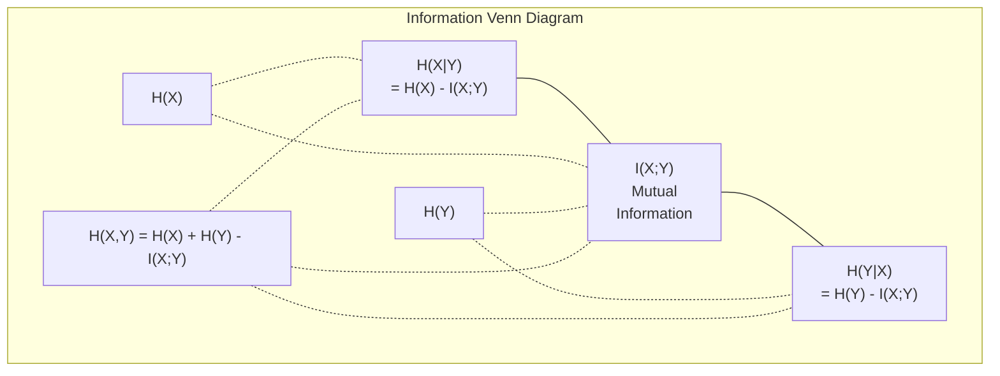

# सूचना सिद्धांत

> सूचना सिद्धांत आश्चर्य का उपाय करता है। हानि फ़ंक्शन उस पर निर्मित हैं।

**Type:** Learn
**Language:**पायथन
**Prerequisites:** Phase 1, Lesson 06 (Probability)
**Time:** ~60 minutes

## सीखने के लक्ष्य

- शून्य से एंट्रॉपी, क्रॉस-एंट्रोपी और केएल विचलन की गणना करें और उनके संबंध की व्याख्या करें
- पता करें कि क्रॉस-एंट्रोपी हानि को कम करने का मतलब लॉग-संभाव्यता को अधिकतम करने के बराबर क्यों है
- विशेषताओं और लक्ष्य के बीच आपसी जानकारी की गणना करें ताकि विशेषता महत्व को रैंक किया जा सके
- भाषा मॉडल द्वारा चुने गए प्रभावी शब्दावली आकार के रूप में भ्रम को समझाएं

## समस्या

आप कॉल`CrossEntropyLoss()`आप प्रत्येक वर्गीकरण मॉडल में "गंभीरता" देखेंगे भाषा मॉडल पेपर में आप VAEs, डिस्टिलैशन और RLHF में KL विचलन के बारे में पढ़ेंगे ये डिस्कनेक्ट अवधारणाएं नहीं हैं वे सभी एक ही विचार हैं अलग-अलग टोपी पहनने के लिए

सूचना सिद्धांत आपको अनिश्चितता, संपीड़न और भविष्यवाणी के बारे में तर्क करने की भाषा देता है। क्लाउड शैनन ने संचार समस्याओं को हल करने के लिए 1948 में इसका आविष्कार किया। यह पता चला है कि तंत्रिका नेटवर्क को प्रशिक्षित करना एक संचार समस्या हैः मॉडल सीखने वाले वजन के शोर के माध्यम से सही लेबल को प्रसारित करने की कोशिश कर रहा है।

इस पाठ में हर सूत्र को स्क्रैच से बनाया गया है ताकि आप देख सकें कि वे कहां से आते हैं और वे क्यों काम करते हैं।

## अवधारणा

### सूचना सामग्री (अपरिहार)

जब कुछ असंभव होता है, तो इसमें अधिक जानकारी होती है. सिक्के के सिर? कोई आश्चर्य नहीं। लॉटरी जीत? बहुत आश्चर्यजनक।

संभावना p वाली घटना की सूचना सामग्री हैः

```
I(x) = -log(p(x))
```

लॉग बेस 2 का उपयोग करके आपको बिट्स मिलता है। प्राकृतिक लॉग का उपयोग करके आपको नाट्स मिलता है। एक ही विचार, अलग-अलग इकाइयां।

```
Event              Probability    Surprise (bits)
Fair coin heads    0.5            1.0
Rolling a 6        0.167          2.58
1-in-1000 event    0.001          9.97
Certain event      1.0            0.0
```

कुछ घटनाओं में शून्य जानकारी होती है। आप पहले से ही जानते थे कि वे होने वाली हैं।

### एंट्रोपी (औसत आश्चर्य)

एंट्रोपी वितरण के सभी संभावित परिणामों पर अपेक्षित आश्चर्य है।

```
H(P) = -sum( p(x) * log(p(x)) )  for all x
```

एक निष्पक्ष सिक्के में बाइनरी चर के लिए अधिकतम एंट्रॉपी होती हैः 1 बिट। एक पक्षपातपूर्ण सिक्के (99% सिर) में कम एंट्रॉपी होती हैः 0.08 बिट। आप पहले से ही जानते हैं कि क्या होगा, इसलिए प्रत्येक फ्लिप आपको लगभग कुछ नहीं बताता है।

```
Fair coin:    H = -(0.5 * log2(0.5) + 0.5 * log2(0.5)) = 1.0 bit
Biased coin:  H = -(0.99 * log2(0.99) + 0.01 * log2(0.01)) = 0.08 bits
```

एंट्रोपी वितरण में अनिश्चितता को मापती है। आप इसके नीचे संपीड़न नहीं कर सकते।

### क्रॉस-एंट्रोपी (आप हर दिन उपयोग करने वाले हानि कार्य)

क्रॉस-एंट्रोपी औसत आश्चर्य मापता है जब आप वितरण Q का उपयोग घटनाओं को एन्कोड करने के लिए जो वास्तव में वितरण P से आते हैं।

```
H(P, Q) = -sum( p(x) * log(q(x)) )  for all x
```

P सही वितरण (लेबल) है। Q आपके मॉडल की भविष्यवाणियां है। यदि Q P से पूरी तरह मेल खाता है, तो क्रॉस-एंट्रोपी एंट्रॉपी के बराबर है। कोई भी असंगत इसे बड़ा बनाता है।

वर्गीकरण में, P एक-गर्म वेक्टर है (सच्चा वर्ग में संभावना 1 है, बाकी सब कुछ 0 है) । यह क्रॉस-एंट्रोपी को सरल करता हैः

```
H(P, Q) = -log(q(true_class))
```

यह वर्गीकरण के लिए क्रॉस-एंट्रोपी हानि सूत्र है। सही वर्ग की भविष्यवाणी की संभावना अधिकतम।

### KL विभेदन (वितरणों के बीच दूरी)

KL विचलन मापता है कि आप P के बजाय Q का उपयोग करने से कितना अतिरिक्त आश्चर्य मिलता है।

```
D_KL(P || Q) = sum( p(x) * log(p(x) / q(x)) )  for all x
             = H(P, Q) - H(P)
```

क्रॉस-एंट्रोपी एंट्रोपी प्लस केएल विभेदन है। चूंकि वास्तविक वितरण की एंट्रोपी प्रशिक्षण के दौरान स्थिर है, क्रॉस-एंट्रोपी को कम करना केएल विभेदन को कम करने के समान है। आप अपने मॉडल के वितरण को वास्तविक वितरण की ओर धक्का दे रहे हैं।

KL विचलन सममित नहीं हैः D_KL(P  Q) != D_KL(Q  P) यह एक वास्तविक दूरी मीट्रिक नहीं है।

### परस्पर सूचना

आपसी सूचना यह मापती है कि एक चर को जानने से आपको दूसरे के बारे में कितना पता चलता है।

```
I(X; Y) = H(X) - H(X|Y)
        = H(X) + H(Y) - H(X, Y)
```

यदि X और Y स्वतंत्र हैं, तो आपसी जानकारी शून्य है। एक को जानना आपको दूसरे के बारे में कुछ नहीं बताता है। यदि वे पूरी तरह से संबद्ध हैं, तो आपसी जानकारी किसी भी चर की एंट्रोपी के बराबर है।

सुविधा चयन में, एक विशेषता और लक्ष्य के बीच उच्च पारस्परिक जानकारी का मतलब है कि विशेषता उपयोगी है। कम पारस्परिक जानकारी का मतलब है कि यह शोर है।

### सशर्त प्रवेश

H(Y में X) मापता है कि आप X का अवलोकन करने के बाद Y के बारे में कितना अनिश्चितता बनी हुई है।

```
H(Y|X) = H(X,Y) - H(X)
```

दो चरम सीमाएं:
- यदि X पूरी तरह से Y को निर्धारित करता है, तो H(Y X) = 0. X को जानने से Y के बारे में सभी अनिश्चितता को समाप्त कर दिया जाता है। उदाहरणः X = तापमान सेल्सियस में, Y = तापमान फ़ारेनहाइट में।
- यदि X आपको Y के बारे में कुछ नहीं बताता है, तो H(YX ) = H(Y) । X को जानना आपकी अनिश्चितता को बिल्कुल भी कम नहीं करता है। उदाहरणः X = सिक्का फ्लिप, Y = कल का मौसम।

सशर्त एंट्रॉपी हमेशा गैर-नकारात्मक होती है और कभी भी H(Y से अधिक नहीं होती है):

```
0 <= H(Y|X) <= H(Y)
```

मशीन लर्निंग में, सशर्त एंट्रॉपी निर्णय पेड़ों में दिखाई देती है। प्रत्येक विभाजन पर, एल्गोरिथम विशेषता X को चुनता है जो H(Y) को कम करता है - विशेषता जो Y लेबल के बारे में सबसे अधिक अनिश्चितता को हटा देती है।

### संयुक्त एंट्रोपी

H ((X,Y) X और Y के संयुक्त वितरण की एंट्रॉपी है।

```
H(X,Y) = -sum sum p(x,y) * log(p(x,y))   for all x, y
```

मुख्य गुण:

```
H(X,Y) <= H(X) + H(Y)
```

समानता तब होती है जब X और Y स्वतंत्र होते हैं। यदि वे जानकारी साझा करते हैं, तो संयुक्त एंट्रोपी व्यक्तिगत एंट्रोपी के योग से कम होती है। "गुम" एंट्रोपी वास्तव में आपसी जानकारी है।



रिश्तेः
- H(X,Y) = H(X) + H(Y
- X;Y) = H(X) - H(IX
- H(X,Y) = H(X) + H(Y) - I(X;Y)

### आपसी जानकारी (गहन गोताखोरी)

आपसी जानकारी I(X;Y) यह बताती है कि एक चर को जानने से दूसरे के बारे में अनिश्चितता कम होती है।

```
I(X;Y) = H(X) - H(X|Y)
       = H(Y) - H(Y|X)
       = H(X) + H(Y) - H(X,Y)
       = sum sum p(x,y) * log(p(x,y) / (p(x) * p(y)))
```

गुण:
- I ((X;Y) >= 0 हमेशा. आप कभी भी कुछ भी देखने से जानकारी खो नहीं देते.
- I(X;Y) = 0 यदि और केवल यदि X और Y स्वतंत्र हैं।
- यह सीएल विचलन के विपरीत, सममित है।
- I(X;X) = H(X) एक चर अपनी सभी जानकारी स्वयं के साथ साझा करता है।

**Mutual information for feature selection.**एमएल में, आप उन सुविधाओं को चाहते हैं जो लक्ष्य के बारे में जानकारीपूर्ण हों। आपसी जानकारी आपको सुविधाओं को रैंक करने का एक सिद्धांतबद्ध तरीका देती हैः

1. प्रत्येक विशेषता X_i के लिए, गणना I(X_i; Y) जहां Y लक्ष्य चर है।
2. एमआई स्कोर द्वारा रैंक सुविधाएँ।
3. शीर्ष के फीचर्स रखें।

यह सुविधा और लक्ष्य के बीच किसी भी संबंध के लिए काम करता है -- रैखिक, गैर रैखिक, एकांत या नहीं। सहसंबंध केवल रैखिक संबंधों को पकड़ता है। MI सब कुछ पकड़ता है।

| Method | Detects | Computational cost | Handles categorical? |
|--------|---------|-------------------|---------------------|
| Pearson correlation | Linear relationships | O(n) | No |
| Spearman correlation | Monotonic relationships | O(n log n) | No |
| Mutual information | Any statistical dependency | O(n log n) with binning | Yes |

### लेबल स्लीडिंग और क्रॉस-एंट्रोपी

मानक वर्गीकरण कठिन लक्ष्य का उपयोग करता हैः [0, 0, 1, 0]. वास्तविक वर्ग को संभावना 1 मिलती है, बाकी सब कुछ 0 मिलता है। लेबल चिकनाई उन्हें नरम लक्ष्य के साथ बदल देता हैः

```
soft_target = (1 - epsilon) * hard_target + epsilon / num_classes
```

एप्सिलन = 0.1 और 4 वर्गों के साथः
- कठिन लक्ष्य: [0, 0, 1, 0]
- नरम लक्ष्य: [0.025, 0.025, 0.925, 0.025]

सूचना सिद्धांत के दृष्टिकोण से, लेबल चिकनाई लक्ष्य वितरण की एंट्रॉपी को बढ़ाता है। हार्ड एक गर्म लक्ष्य में एंट्रॉपी 0 है - कोई अनिश्चितता नहीं है। नरम लक्ष्य में सकारात्मक एंट्रॉपी है।

इससे मदद क्यों मिलती हैः
- मॉडल को लॉजिट को चरम मानों तक ले जाने से रोकता है (क्रॉस-एंट्रोपी के तहत एक-हॉट लक्ष्य के साथ सही ढंग से मेल खाने के लिए अंतहीन लॉजिट की आवश्यकता होगी)
- नियमितता के रूप में कार्य करता हैः मॉडल 100% आत्मविश्वास नहीं हो सकता है
- माप में सुधारः भविष्यवाणी की गई संभावनाएं वास्तविक अनिश्चितता को बेहतर ढंग से दर्शाती हैं
- प्रशिक्षण और निष्कर्ष व्यवहार के बीच अंतर को कम करता है

लेबल चिकनाई के साथ क्रॉस-एंट्रोपी हानि बन जाती हैः

```
L = (1 - epsilon) * CE(hard_target, prediction) + epsilon * H_uniform(prediction)
```

दूसरा शब्द भविष्यवाणियों को दंडित करता है जो एक समान से दूर हैं -- विश्वास पर प्रत्यक्ष नियमितता।

### क्रॉस-एंट्रोपी वर्गीकरण का नुकसान क्यों है

तीन दृष्टिकोण, एक ही निष्कर्ष।

**Information theory view.**क्रॉस-एंट्रोपी मापता है कि आप वास्तविक वितरण के बजाय अपने मॉडल के वितरण का उपयोग करके कितना बिट्स बर्बाद करते हैं। इसे कम करने से आपका मॉडल वास्तविकता का सबसे कुशल एन्कोडर बन जाता है।

**Maximum likelihood view.**वास्तविक वर्ग y_i के साथ N प्रशिक्षण नमूनों के लिएः

```
Likelihood     = product( q(y_i) )
Log-likelihood = sum( log(q(y_i)) )
Negative log-likelihood = -sum( log(q(y_i)) )
```

अंतिम पंक्ति क्रॉस-एंट्रोपी हानि है। क्रॉस-एंट्रोपी को कम करना = आपके मॉडल के तहत प्रशिक्षण डेटा की संभावना को अधिकतम करना।

**Gradient view.**लॉजिट के संबंध में क्रॉस-एंट्रोपी का ग्रेडिएंट सरल (पूर्वानुमान - सच) है। गणना करने के लिए साफ, स्थिर और तेज़ है। यही कारण है कि यह सॉफ्टमैक्स के साथ पूरी तरह से जोड़ा जाता है।

### बिट्स बनाम नट्स

केवल अंतर लॉग आधार है।

```
log base 2   -> bits      (information theory tradition)
log base e   -> nats      (machine learning convention)
log base 10  -> hartleys  (rarely used)
```

1 nat = 1/ln(2) बिट्स = 1.4427 बिट्स। PyTorch और TensorFlow डिफ़ॉल्ट रूप से प्राकृतिक लॉग (nats) का उपयोग करते हैं।

### उलझन

उलझन क्रॉस-एंट्रोपी का एक्सपोनेंशियल है. यह आपको बताता है कि मॉडल के बीच समान रूप से संभव विकल्पों की प्रभावी संख्या अनिश्चित है.

```
Perplexity = 2^H(P,Q)   (if using bits)
Perplexity = e^H(P,Q)   (if using nats)
```

50 की जटिलता वाला भाषा मॉडल, औसतन, उतना ही भ्रमित है जैसे उसे 50 संभावित अगले टोकनों में से समान रूप से चुनना होगा।

जीपीटी-2 ने सामान्य बेंचमार्क पर ~30 की जटिलता हासिल की। आधुनिक मॉडल अच्छी तरह से प्रतिनिधित्व किए गए डोमेन के लिए एकल अंकों में हैं।

```figure
entropy-kl
```

## इसे बनाओ

### चरण 1: सूचना सामग्री और एंट्रॉपी

```python
import math

def information_content(p, base=2):
    if p <= 0 or p > 1:
        return float('inf') if p <= 0 else 0.0
    return -math.log(p) / math.log(base)

def entropy(probs, base=2):
    return sum(
        p * information_content(p, base)
        for p in probs if p > 0
    )

fair_coin = [0.5, 0.5]
biased_coin = [0.99, 0.01]
fair_die = [1/6] * 6

print(f"Fair coin entropy:   {entropy(fair_coin):.4f} bits")
print(f"Biased coin entropy: {entropy(biased_coin):.4f} bits")
print(f"Fair die entropy:    {entropy(fair_die):.4f} bits")
```

### चरण 2: क्रॉस-एंट्रोपी और KL विचलन

```python
def cross_entropy(p, q, base=2):
    total = 0.0
    for pi, qi in zip(p, q):
        if pi > 0:
            if qi <= 0:
                return float('inf')
            total += pi * (-math.log(qi) / math.log(base))
    return total

def kl_divergence(p, q, base=2):
    return cross_entropy(p, q, base) - entropy(p, base)

true_dist = [0.7, 0.2, 0.1]
good_model = [0.6, 0.25, 0.15]
bad_model = [0.1, 0.1, 0.8]

print(f"Entropy of true dist:     {entropy(true_dist):.4f} bits")
print(f"CE (good model):          {cross_entropy(true_dist, good_model):.4f} bits")
print(f"CE (bad model):           {cross_entropy(true_dist, bad_model):.4f} bits")
print(f"KL divergence (good):     {kl_divergence(true_dist, good_model):.4f} bits")
print(f"KL divergence (bad):      {kl_divergence(true_dist, bad_model):.4f} bits")
```

### चरण 3: वर्गीकरण हानि के रूप में क्रॉस-एंट्रोपी

```python
def softmax(logits):
    max_logit = max(logits)
    exps = [math.exp(z - max_logit) for z in logits]
    total = sum(exps)
    return [e / total for e in exps]

def cross_entropy_loss(true_class, logits):
    probs = softmax(logits)
    return -math.log(probs[true_class])

logits = [2.0, 1.0, 0.1]
true_class = 0

probs = softmax(logits)
loss = cross_entropy_loss(true_class, logits)

print(f"Logits:      {logits}")
print(f"Softmax:     {[f'{p:.4f}' for p in probs]}")
print(f"True class:  {true_class}")
print(f"Loss:        {loss:.4f} nats")
print(f"Perplexity:  {math.exp(loss):.2f}")
```

### चरण 4: क्रॉस-एंट्रोपी नकारात्मक लॉग-संभाव्यता के बराबर है

```python
import random

random.seed(42)

n_samples = 1000
n_classes = 3
true_labels = [random.randint(0, n_classes - 1) for _ in range(n_samples)]
model_logits = [[random.gauss(0, 1) for _ in range(n_classes)] for _ in range(n_samples)]

ce_loss = sum(
    cross_entropy_loss(label, logits)
    for label, logits in zip(true_labels, model_logits)
) / n_samples

nll = -sum(
    math.log(softmax(logits)[label])
    for label, logits in zip(true_labels, model_logits)
) / n_samples

print(f"Cross-entropy loss:      {ce_loss:.6f}")
print(f"Negative log-likelihood: {nll:.6f}")
print(f"Difference:              {abs(ce_loss - nll):.2e}")
```

### चरण 5: आपसी जानकारी

```python
def mutual_information(joint_probs, base=2):
    rows = len(joint_probs)
    cols = len(joint_probs[0])

    margin_x = [sum(joint_probs[i][j] for j in range(cols)) for i in range(rows)]
    margin_y = [sum(joint_probs[i][j] for i in range(rows)) for j in range(cols)]

    mi = 0.0
    for i in range(rows):
        for j in range(cols):
            pxy = joint_probs[i][j]
            if pxy > 0:
                mi += pxy * math.log(pxy / (margin_x[i] * margin_y[j])) / math.log(base)
    return mi

independent = [[0.25, 0.25], [0.25, 0.25]]
dependent = [[0.45, 0.05], [0.05, 0.45]]

print(f"MI (independent): {mutual_information(independent):.4f} bits")
print(f"MI (dependent):   {mutual_information(dependent):.4f} bits")
```

## इसका प्रयोग करें

NumPy का उपयोग करते हुए वही अवधारणाएं, जिस तरह से आप उन्हें व्यवहार में उपयोग करेंगेः

```python
import numpy as np

def np_entropy(p):
    p = np.asarray(p, dtype=float)
    mask = p > 0
    result = np.zeros_like(p)
    result[mask] = p[mask] * np.log(p[mask])
    return -result.sum()

def np_cross_entropy(p, q):
    p, q = np.asarray(p, dtype=float), np.asarray(q, dtype=float)
    mask = p > 0
    return -(p[mask] * np.log(q[mask])).sum()

def np_kl_divergence(p, q):
    return np_cross_entropy(p, q) - np_entropy(p)

true = np.array([0.7, 0.2, 0.1])
pred = np.array([0.6, 0.25, 0.15])
print(f"Entropy:    {np_entropy(true):.4f} nats")
print(f"Cross-ent:  {np_cross_entropy(true, pred):.4f} nats")
print(f"KL div:     {np_kl_divergence(true, pred):.4f} nats")
```

आपने खरोंच से क्या बनाया है`torch.nn.CrossEntropyLoss()`अब आप जानते हैं कि प्रशिक्षण के दौरान नुकसान क्यों कम होता हैः आपके मॉडल का अनुमानित वितरण वास्तविक वितरण के करीब आ रहा है, बर्बाद जानकारी के नाट्स में मापा गया।

## व्यायाम

1. अंग्रेजी वर्णमाला की एंट्रॉपी को एक समान वितरण (26 अक्षर) पर आधारित गणना करें। फिर वास्तविक अक्षर आवृत्तियों का उपयोग करके इसका अनुमान लगाएं। कौन सा अधिक है और क्यों?

2. एक मॉडल वास्तविक वर्ग के साथ एक नमूना के लिए [5.0, 2.0, 0.5] लॉजिट आउटपुट करता है।`cross_entropy_loss`कार्य. कौन सी लॉजिट शून्य हानि देता है?

3. दिखाएं कि KL विचलन सममित नहीं है। दो वितरण P और Q चुनें और D_KL_P_K  Q) और DL Q  P) की गणना करें। वे क्यों भिन्न हैं, समझाएं।

4. एक फ़ंक्शन बनाएं जो टोकन भविष्यवाणियों के अनुक्रम के लिए जटिलता की गणना करता है। (true_token_index, predicted_logits) जोड़े की सूची दी गई है, अनुक्रम की जटिलता लौटाएं।

## प्रमुख शर्तें

| Term | What people say | What it actually means |
|------|----------------|----------------------|
| Information content | "Surprise" | The number of bits (or nats) needed to encode an event: -log(p) |
| Entropy | "Randomness" | The average surprise across all outcomes of a distribution. Measures irreducible uncertainty. |
| Cross-entropy | "The loss function" | Average surprise when using model distribution Q to encode events from true distribution P. |
| KL divergence | "Distance between distributions" | Extra bits wasted by using Q instead of P. Equals cross-entropy minus entropy. Not symmetric. |
| Mutual information | "How related are X and Y" | Reduction in uncertainty about X from knowing Y. Zero means independent. |
| Softmax | "Turn logits into probabilities" | Exponentiate and normalize. Maps any real-valued vector to a valid probability distribution. |
| Perplexity | "How confused the model is" | Exponential of cross-entropy. The effective vocabulary size the model is choosing from at each step. |
| Bits | "Shannon's unit" | Information measured with log base 2. One bit resolves one fair coin flip. |
| Nats | "ML's unit" | Information measured with natural log. Used by PyTorch and TensorFlow by default. |
| Negative log-likelihood | "NLL loss" | Identical to cross-entropy loss for one-hot labels. Minimizing it maximizes the probability of correct predictions. |

## आगे पढ़ना

- [Shannon 1948: A Mathematical Theory of Communication](https://people.math.harvard.edu/~ctm/home/text/others/shannon/entropy/entropy.pdf)- मूल कागज, अभी भी पठनीय
- [Visual Information Theory (Chris Olah)](https://colah.github.io/posts/2015-09-Visual-Information/)- एंट्रॉपी और KL विचलन का सबसे अच्छा दृश्य स्पष्टीकरण
- [PyTorch CrossEntropyLoss docs](https://pytorch.org/docs/stable/generated/torch.nn.CrossEntropyLoss.html)- कैसे ढांचे ने आप अभी जो बनाया है उसे लागू किया है
