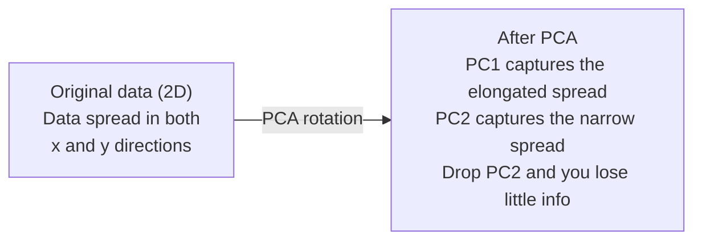

# आयामों में कमी

> उच्च आयामी डेटा में संरचना है. आप इसे सही कोण से देख कर पा सकते हैं.

**Type:** Build
**Language:**पायथन
**Prerequisites:** Phase 1, Lessons 01 (Linear Algebra Intuition), 02 (Vectors, Matrices & Operations), 03 (Eigenvalues & Eigenvectors), 06 (Probability & Distributions)
**Time:** ~90 minutes

## सीखने के लक्ष्य

- सीपीए को खरोंच से लागू करेंः केंद्र डेटा, कोवरिएंसी मैट्रिक्स की गणना, eigendecompose, और परियोजना
- मुख्य घटकों की संख्या चुनने के लिए स्पष्ट भिन्नता अनुपात और कोहनी विधि का उपयोग करें
- 2D में MNIST अंकों को दृश्यमान बनाने के लिए PCA, t-SNE, और UMAP की तुलना करें और उनके व्यापार को समझाएं
- गैर-रेखीय डेटा संरचनाओं को अलग करने के लिए आरबीएफ कर्नेल के साथ कर्नेल पीसीए लागू करें जिन्हें मानक पीसीए संभाल नहीं सकता है

## समस्या

आपके पास प्रति नमूना 784 फीचर्स के साथ एक डेटासेट है. शायद यह हाथ से लिखे गए अंकों के पिक्सेल मान हैं. शायद यह जीन अभिव्यक्ति स्तर है. शायद यह उपयोगकर्ता व्यवहार संकेत है. आप 784 आयामों को कल्पना नहीं कर सकते हैं। आप उन्हें नहीं लिख सकते हैं। आप उनके बारे में भी नहीं सोच सकते हैं।

लेकिन उन 784 सुविधाओं में से अधिकांश अपर्याप्त हैं. वास्तविक जानकारी एक बहुत छोटी सतह पर रहती है। एक हाथ से लिखे गए "7" को इसे वर्णित करने के लिए 784 स्वतंत्र संख्याओं की आवश्यकता नहीं है। इसके लिए कुछ की आवश्यकता हैः स्ट्रोक का कोण, क्रॉसबार की लंबाई, यह कितना झुका है। बाकी शोर है।

आयामों में कमी उस छोटे सतह को ढूंढती है। यह आपके 784 आयामी डेटा को लेती है और इसे 2, 10 या 50 आयामों में संपीड़ित करती है जबकि संरचना को बनाए रखती है जो मायने रखता है।

## अवधारणा

### आयामता का शाप

उच्च आयामी स्थानों में सहज ज्ञान नहीं होता है। आयामों के बढ़ने के साथ तीन चीजें टूट जाती हैं।

**Distance becomes meaningless.**उच्च आयामों में, किसी भी दो यादृच्छिक बिंदुओं के बीच की दूरी एक ही मूल्य पर मिलती है। यदि प्रत्येक बिंदु प्रत्येक अन्य बिंदु से लगभग एक ही दूरी है, तो निकटतम पड़ोसी खोज काम करना बंद कर देती है।

```
Dimension    Avg distance ratio (max/min between random points)
2            ~5.0
10           ~1.8
100          ~1.2
1000         ~1.02
```

**Volume concentrates in corners.**एक इकाई हाइपर क्यूब में 2 आयामों 2 आयामों है। 100 आयामों में, लगभग सभी मात्रा को केंद्र से दूर कोनों में है। डेटा बिंदु किनारों तक फैलते हैं और आपके मॉडल अंदर डेटा के लिए भूखे रहते हैं।

**You need exponentially more data.**एक अंतरिक्ष में नमूने की समान घनत्व बनाए रखने के लिए, 2D से 20D तक जाने का मतलब है कि आपको 10^18 गुना अधिक डेटा की आवश्यकता है. आपके पास कभी भी पर्याप्त नहीं है। आयामों को कम करने से डेटा घनत्व वापस कुछ काम करने योग्य हो जाता है।

### पीसीएः महत्वपूर्ण दिशाएं खोजें

मुख्य घटक विश्लेषण (पीसीए) उन अक्षों को ढूंढता है जिनके साथ आपके डेटा सबसे अधिक भिन्न होते हैं। यह आपके निर्देशांक प्रणाली को घूमता है ताकि पहली अक्ष सबसे अधिक भिन्नता को पकड़ ले, दूसरी सबसे अधिक पकड़ ले, और इसी तरह।

एल्गोरिथ्मः

```
1. Center the data        (subtract the mean from each feature)
2. Compute covariance     (how features move together)
3. Eigendecomposition     (find the principal directions)
4. Sort by eigenvalue     (biggest variance first)
5. Project               (keep top k eigenvectors, drop the rest)
```

स्व-संयोजन क्यों? सह-विवर्तन मैट्रिक्स सममित और सकारात्मक अर्ध-परिभाषित है। इसके स्व-वेक्टर विशेषता अंतरिक्ष में ऑर्थोगनल दिशाएं हैं। स्व-मूल्य आपको बताते हैं कि प्रत्येक दिशा कितनी भिन्नता को पकड़ती है। अधिकतम भिन्नता की दिशा के साथ सबसे बड़े स्व-मूल्य बिंदुओं वाला स्व-वेक्टर।



- **Before PCA:**डेटा बादल दोनों एक्स और वाई अक्षों पर विघात रूप से फैला है
- **After PCA:**समन्वय प्रणाली को घूमा जाता है ताकि PC1 अधिकतम भिन्नता (अलंकृत प्रसार) की दिशा के साथ संरेखित हो और PC2 न्यूनतम भिन्नता (समीप्त प्रसार) की दिशा के साथ संरेखित हो।
- **Dimensionality reduction:**पीसी 2 को छोड़ने से डेटा पीसी 1 पर प्रोजेक्ट होता है, बहुत कम जानकारी खो जाती है

### स्पष्ट भिन्नता अनुपात

प्रत्येक मुख्य घटक कुल भिन्नता का एक अंश कैप्चर करता है। समझाया गया भिन्नता अनुपात आपको बताता है कि कितना।

```
Component    Eigenvalue    Explained ratio    Cumulative
PC1          4.73          0.473              0.473
PC2          2.51          0.251              0.724
PC3          1.12          0.112              0.836
PC4          0.89          0.089              0.925
...
```

जब संचयी व्याख्या भिन्नता 0.95 तक पहुंच जाती है, तो आप जानते हैं कि कई घटकों में 95% जानकारी को कैप्चर किया जाता है। उसके बाद सब कुछ ज्यादातर शोर है।

### घटकों की संख्या चुनना

तीन रणनीतियाँ:

1. **Threshold.**90-95% भिन्नता को स्पष्ट करने के लिए पर्याप्त घटक रखें।
2. **Elbow method.**प्लॉट प्रत्येक घटक के लिए भिन्नता की व्याख्या. एक तेज गिरावट के लिए देखो.
3. **Downstream performance.**पीसीए को पूर्व प्रसंस्करण के रूप में उपयोग करें। क को झाड़ो और अपने मॉडल की सटीकता को मापें। सबसे अच्छा क सटीकता पठारों पर है।

### t-SNE: पड़ोसों को संरक्षित करें

t-विभाजित स्टोकास्टिक पड़ोसी एम्बेडिंग (t-SNE) दृश्यता के लिए डिज़ाइन किया गया है। यह 2D (या 3D) में उच्च आयामी डेटा का नक्शा बनाता है जबकि यह संरक्षित करता है कि कौन से बिंदु एक दूसरे के करीब हैं।

अंतर्ज्ञानः मूल स्थान में, अपनी दूरी के आधार पर बिंदुओं के जोड़ों पर संभावना वितरण की गणना करें। निकट बिंदुओं पर उच्च संभावना मिलती है। दूर के बिंदुओं पर कम संभावना मिलती है। फिर एक 2D व्यवस्था खोजें जहां समान संभावना वितरण होता है। 784 आयामों में पड़ोसी थे जो बिंदु 2D में पड़ोसी रहते हैं।

t-SNE के मुख्य गुणः
- यह जटिल manifolds के लिए खुलासा कर सकते हैं कि PCA नहीं कर सकते.
- अलग-अलग रन अलग-अलग लेआउट पैदा करते हैं।
- विडंबना पैरामीटर यह नियंत्रित करता है कि कितने पड़ोसियों को विचार किया जाना चाहिए (आमतौर पर रेंजः 5-50).
- आउटपुट में क्लस्टर के बीच की दूरी कोई मायने नहीं रखती है। केवल क्लस्टर स्वयं मायने रखती हैं।
- बड़े डेटा सेट पर धीमा।

### UMAP: तेजी से, बेहतर वैश्विक संरचना

यूनिफ़ॉर्म मनिफोल्ड एप्रोक्सिमेशन एंड प्रोजेक्शन (UMAP) t-SNE के समान कार्य करता है लेकिन दो लाभों के साथः
- यह सभी जोड़ी दूरी की गणना के बजाय निकटतम पड़ोसी के ग्राफ का उपयोग करता है।
- बेहतर वैश्विक संरचना। उत्पादन में समूहों की सापेक्ष स्थिति टी-एसएनई की तुलना में अधिक सार्थक होती है।

UMAP उच्च-आयामी स्थान में एक भारित ग्राफ ( "फ्यूजी टॉपॉलॉजिकल प्रतिनिधित्व") बनाता है और फिर एक निम्न-आयामी लेआउट पाता है जो इस ग्राफ को यथासंभव संरक्षित करता है।

मुख्य पैरामीटरः
- `n_neighbors`: कितने पड़ोसियों ने स्थानीय संरचना को परिभाषित किया है (मिर्गी के समान) । उच्च मूल्य अधिक वैश्विक संरचना को बनाए रखते हैं।
- `min_dist`निम्न मान अधिक घने क्लस्टर बनाते हैं।

### किसको कब इस्तेमाल करना है

| Method | Use case | Preserves | Speed |
|--------|----------|-----------|-------|
| PCA | Preprocessing before training | Global variance | Fast (exact), works on millions of samples |
| PCA | Quick exploratory visualization | Linear structure | Fast |
| t-SNE | Publication-quality 2D plots | Local neighborhoods | Slow (< 10k samples ideal) |
| UMAP | 2D visualization at scale | Local + some global structure | Medium (handles millions) |
| PCA | Feature reduction for models | Variance-ranked features | Fast |
| t-SNE / UMAP | Understanding cluster structure | Cluster separation | Medium to slow |

अंगूठे का नियमः पूर्व प्रसंस्करण और डेटा संपीड़न के लिए पीसीए का उपयोग करें। जब आपको 2 डी में संरचना को दृश्यमान बनाने की आवश्यकता हो तो टी-एसएनई या यूएमएपी का उपयोग करें।

### कर्नेल पीसीए

मानक पीसीए रैखिक उप-स्थानों को ढूंढता है। यह आपके निर्देशांक प्रणाली को घूमता है और अक्षों को छोड़ देता है। लेकिन क्या होगा यदि डेटा एक गैर-रेखीय बहुभुज पर स्थित है? 2 डी में एक वृत्त को किसी भी रेखा से अलग नहीं किया जा सकता है। मानक पीसीए मदद नहीं करेगा।

कर्नेल पीसीए एक उच्च आयामी सुविधा अंतरिक्ष में लागू करता है कर्नेल फ़ंक्शन द्वारा प्रेरित, स्पष्ट रूप से उस अंतरिक्ष में निर्देशांक की गणना किए बिना। यह कर्नेल ट्रिक है - एसवीएम के पीछे एक ही विचार।

एल्गोरिथ्मः
1. कर्नेल मैट्रिक्स K की गणना करें जहां K_ij = k(x_i, x_j)
2. सुविधाओं स्थान में कर्नेल मैट्रिक्स केंद्र
3. Eigendecompose केंद्रित कर्नेल मैट्रिक्स
4. शीर्ष स्वयं वेक्टर (1/sqrt द्वारा स्केल किया गया)

सामान्य कर्नेल फ़ंक्शंसः

| Kernel | Formula | Good for |
|--------|---------|----------|
| RBF (Gaussian) | exp(-gamma * \|\|x - y\|\|^2) | Most nonlinear data, smooth manifolds |
| Polynomial | (x . y + c)^d | Polynomial relationships |
| Sigmoid | tanh(alpha * x . y + c) | Neural network-like mappings |

कर्णल पीसीए बनाम मानक पीसीए का उपयोग कब करेंः

| Criterion | Standard PCA | Kernel PCA |
|-----------|-------------|------------|
| Data structure | Linear subspace | Nonlinear manifold |
| Speed | O(min(n^2 d, d^2 n)) | O(n^2 d + n^3) |
| Interpretability | Components are linear combinations of features | Components lack direct feature interpretation |
| Scalability | Works on millions of samples | Kernel matrix is n x n, memory-limited |
| Reconstruction | Direct inverse transform | Requires pre-image approximation |

क्लासिक उदाहरणः 2D में एकाग्र वृत्त। दो अंक के छल्ले, एक दूसरे के अंदर। मानक पीसीए दोनों को एक ही रेखा पर प्रक्षेपित करता है - वर्गीकरण के लिए बेकार। आरबीएफ के साथ कर्नेल पीसीए आंतरिक वृत्त और बाहरी वृत्त को विभिन्न क्षेत्रों में मानचित्रित करता है, जिससे वे रैखिक रूप से अलग हो सकते हैं।

### पुनर्निर्माण त्रुटि

आप 784 आयामों को 50 तक संपीड़ित किया है। आप क्या खो दिया है?

पुनर्निर्माण त्रुटि का मापः
1. k आयामों तक परियोजना डेटाः X_reduced = X @ W_k
2. पुनः निर्माणः X_hat = X_reduced @ W_k^T
3. गणना MSE: औसत

पीसीए के लिए, पुनर्निर्माण त्रुटि का स्पष्ट भिन्नता के साथ एक स्पष्ट संबंध हैः

```
Reconstruction error = sum of eigenvalues NOT included
Total variance = sum of ALL eigenvalues
Fraction lost = (sum of dropped eigenvalues) / (sum of all eigenvalues)
```

प्रत्येक घटक के लिए स्पष्ट भिन्नता अनुपात हैः

```
explained_ratio_k = eigenvalue_k / sum(all eigenvalues)
```

घटकों की संख्या के खिलाफ संचयी व्याख्या भिन्नता को रेखांकन आपको "उलकह" वक्र देता है। घटकों की सही संख्या है जहांः
- वक्र फ्लैट आउट (कम रिटर्न)
- संचयी भिन्नता आपके सीमा पार करती है (आमतौर पर 0.90 या 0.95)
- कार्य प्रदर्शन के निचले स्तर

पुनर्निर्माण त्रुटि के चयन के अलावा उपयोगी है। आप इसे विसंगतियों का पता लगाने के लिए उपयोग कर सकते हैंः उच्च पुनर्निर्माण त्रुटि वाले नमूने असाधारण हैं जो सीखे गए उप-स्थान में फिट नहीं होते हैं। यह उत्पादन प्रणालियों में पीसीए-आधारित विसंगतियों का पता लगाने का आधार है।

```figure
pca-axes
```

## इसे बनाओ

### चरण 1: पीसीए खरोंच से

```python
import numpy as np

class PCA:
    def __init__(self, n_components):
        self.n_components = n_components
        self.components = None
        self.mean = None
        self.eigenvalues = None
        self.explained_variance_ratio_ = None

    def fit(self, X):
        self.mean = np.mean(X, axis=0)
        X_centered = X - self.mean

        cov_matrix = np.cov(X_centered, rowvar=False)

        eigenvalues, eigenvectors = np.linalg.eigh(cov_matrix)

        sorted_idx = np.argsort(eigenvalues)[::-1]
        eigenvalues = eigenvalues[sorted_idx]
        eigenvectors = eigenvectors[:, sorted_idx]

        self.components = eigenvectors[:, :self.n_components].T
        self.eigenvalues = eigenvalues[:self.n_components]
        total_var = np.sum(eigenvalues)
        self.explained_variance_ratio_ = self.eigenvalues / total_var

        return self

    def transform(self, X):
        X_centered = X - self.mean
        return X_centered @ self.components.T

    def fit_transform(self, X):
        self.fit(X)
        return self.transform(X)
```

### चरण 2: सिंथेटिक डेटा पर परीक्षण

```python
np.random.seed(42)
n_samples = 500

t = np.random.uniform(0, 2 * np.pi, n_samples)
x1 = 3 * np.cos(t) + np.random.normal(0, 0.2, n_samples)
x2 = 3 * np.sin(t) + np.random.normal(0, 0.2, n_samples)
x3 = 0.5 * x1 + 0.3 * x2 + np.random.normal(0, 0.1, n_samples)

X_synthetic = np.column_stack([x1, x2, x3])

pca = PCA(n_components=2)
X_reduced = pca.fit_transform(X_synthetic)

print(f"Original shape: {X_synthetic.shape}")
print(f"Reduced shape:  {X_reduced.shape}")
print(f"Explained variance ratios: {pca.explained_variance_ratio_}")
print(f"Total variance captured: {sum(pca.explained_variance_ratio_):.4f}")
```

### चरण 3: 2D में MNIST अंक

```python
from sklearn.datasets import fetch_openml

mnist = fetch_openml("mnist_784", version=1, as_frame=False, parser="auto")
X_mnist = mnist.data[:5000].astype(float)
y_mnist = mnist.target[:5000].astype(int)

pca_mnist = PCA(n_components=50)
X_pca50 = pca_mnist.fit_transform(X_mnist)
print(f"50 components capture {sum(pca_mnist.explained_variance_ratio_):.2%} of variance")

pca_2d = PCA(n_components=2)
X_pca2d = pca_2d.fit_transform(X_mnist)
print(f"2 components capture {sum(pca_2d.explained_variance_ratio_):.2%} of variance")
```

### चरण 4: स्क्लेयरन की तुलना करें

```python
from sklearn.decomposition import PCA as SklearnPCA
from sklearn.manifold import TSNE

sklearn_pca = SklearnPCA(n_components=2)
X_sklearn_pca = sklearn_pca.fit_transform(X_mnist)

print(f"\nOur PCA explained variance:     {pca_2d.explained_variance_ratio_}")
print(f"Sklearn PCA explained variance: {sklearn_pca.explained_variance_ratio_}")

diff = np.abs(np.abs(X_pca2d) - np.abs(X_sklearn_pca))
print(f"Max absolute difference: {diff.max():.10f}")

tsne = TSNE(n_components=2, perplexity=30, random_state=42)
X_tsne = tsne.fit_transform(X_mnist)
print(f"\nt-SNE output shape: {X_tsne.shape}")
```

### चरण 5: UMAP तुलना

```python
try:
    from umap import UMAP

    reducer = UMAP(n_components=2, n_neighbors=15, min_dist=0.1, random_state=42)
    X_umap = reducer.fit_transform(X_mnist)
    print(f"UMAP output shape: {X_umap.shape}")
except ImportError:
    print("Install umap-learn: pip install umap-learn")
```

## इसका प्रयोग करें

एक वर्गीकरणकर्ता के पहले पूर्व प्रसंस्करण के रूप में पीसीएः

```python
from sklearn.decomposition import PCA as SklearnPCA
from sklearn.linear_model import LogisticRegression
from sklearn.model_selection import train_test_split
from sklearn.metrics import accuracy_score

X_train, X_test, y_train, y_test = train_test_split(
    X_mnist, y_mnist, test_size=0.2, random_state=42
)

results = {}
for k in [10, 30, 50, 100, 200]:
    pca_k = SklearnPCA(n_components=k)
    X_tr = pca_k.fit_transform(X_train)
    X_te = pca_k.transform(X_test)

    clf = LogisticRegression(max_iter=1000, random_state=42)
    clf.fit(X_tr, y_train)
    acc = accuracy_score(y_test, clf.predict(X_te))
    var_captured = sum(pca_k.explained_variance_ratio_)
    results[k] = (acc, var_captured)
    print(f"k={k:>3d}  accuracy={acc:.4f}  variance={var_captured:.4f}")
```

784 आयामों से पहले प्रदर्शन पठारों।

## इसे भेजें

इस पाठ से उत्पन्न होता हैः
- `outputs/skill-dimensionality-reduction.md`- किसी दिए गए कार्य के लिए सही आयामीकरण घटाने की तकनीक चुनने की क्षमता

## व्यायाम

1. समर्थन के लिए पीसीए वर्ग को संशोधित करें `inverse_transform`. MNIST अंक को 10, 50 और 200 घटकों से पुनर्निर्माण करें. प्रत्येक के लिए पुनर्निर्माण त्रुटि (मूल से औसत वर्ग अंतर) प्रिंट करें।

2. 5, 30 और 100 के साथ एक ही MNIST उपसमूह पर t-SNE चलाएं। आउटपुट कैसे बदलता है, इसका वर्णन करें। उलझन क्लस्टर तंगता को क्यों प्रभावित करता है?

3. 50 सुविधाओं के साथ एक डेटासेट लें जहां केवल 5 सूचनात्मक हैं (एक के साथ उत्पन्न करें `sklearn.datasets.make_classification`) पीसीए लागू करें और जांचें कि क्या समझाया गया भिन्नता वक्र सही ढंग से पहचानता है कि डेटा प्रभावी रूप से 5-आयामी है।

## प्रमुख शर्तें

| Term | What people say | What it actually means |
|------|----------------|----------------------|
| Curse of dimensionality | "Too many features" | Distances, volumes, and data density all behave counterintuitively as dimensions grow. Models need exponentially more data to compensate. |
| PCA | "Reduce dimensions" | Rotate your coordinate system so the axes align with the directions of maximum variance, then drop the low-variance axes. |
| Principal component | "An important direction" | An eigenvector of the covariance matrix. The direction in feature space along which the data varies most. |
| Explained variance ratio | "How much info this component has" | The fraction of total variance captured by one principal component. Sum the top k ratios to see how much k components preserve. |
| Covariance matrix | "How features correlate" | A symmetric matrix where entry (i,j) measures how feature i and feature j move together. Diagonal entries are individual variances. |
| t-SNE | "That cluster plot" | A nonlinear method that maps high-dimensional data to 2D by preserving pairwise neighborhood probabilities. Good for visualization, not for preprocessing. |
| UMAP | "Faster t-SNE" | A nonlinear method based on topological data analysis. Preserves both local and some global structure. Scales better than t-SNE. |
| Perplexity | "A t-SNE knob" | Controls the effective number of neighbors each point considers. Low perplexity focuses on very local structure. High perplexity captures broader patterns. |
| Manifold | "The surface the data lives on" | A lower-dimensional surface embedded in a higher-dimensional space. A sheet of paper crumpled in 3D is a 2D manifold. |

## आगे पढ़ना

- [A Tutorial on Principal Component Analysis](https://arxiv.org/abs/1404.1100)(शिलेंस) - पीसीए का स्पष्ट व्युत्पन्न
- [How to Use t-SNE Effectively](https://distill.pub/2016/misread-tsne/)(Wattenberg et al.) - t-SNE की फंदे और पैरामीटर विकल्पों के लिए इंटरैक्टिव गाइड
- [UMAP documentation](https://umap-learn.readthedocs.io/)- UMAP के लेखकों द्वारा सिद्धांत और व्यावहारिक मार्गदर्शन
