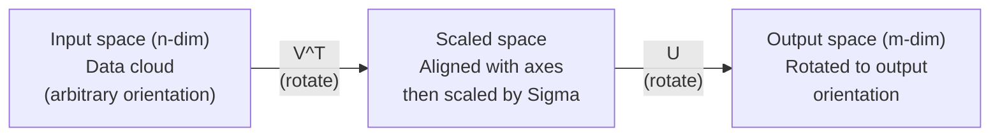
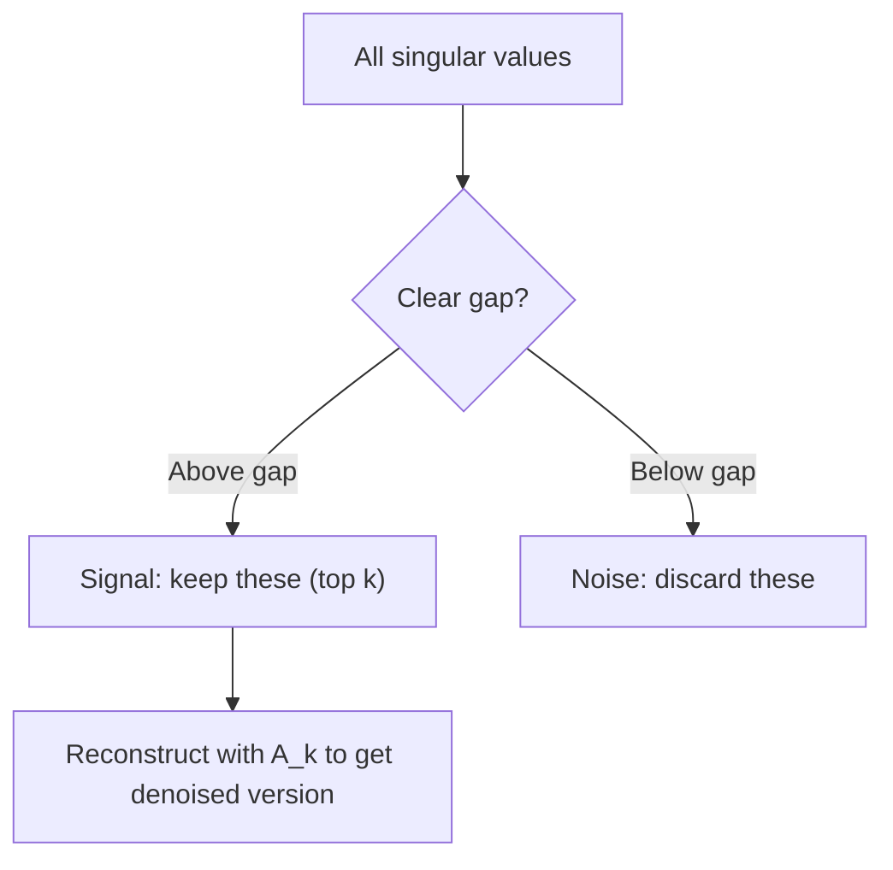

# एकल मूल्य विघटन

> SVD रैखिक बीजगणित की स्विस सेना की चाकू है. हर मैट्रिक्स में एक है. हर डेटा वैज्ञानिक को एक की जरूरत है.

**Type:** Build
**Languages:** Python, Julia
**Prerequisites:** Phase 1, Lessons 01 (Linear Algebra Intuition), 02 (Vectors & Matrices Operations), 03 (Matrix Transformations)
**Time:** ~120 minutes

## सीखने के लक्ष्य

- पावर पुनरावृत्ति के माध्यम से एसवीडी को लागू करें और यू, सिग्मा और वी ^ टी के ज्यामितीय अर्थ की व्याख्या करें
- छवि संपीड़न के लिए ट्रंक एसवीडी लागू करें और संपीड़न अनुपात बनाम पुनर्निर्माण त्रुटि मापें
- अधिक निर्धारित न्यूनतम वर्गों प्रणाली को हल करने के लिए एसवीडी के माध्यम से मूर-पेनरोज के छद्म उलट गणना
- एसवीडी को पीसीए, सिफारिश प्रणाली (लैटिनेंट फैक्टर) और एनएलपी में लैटिनेंट सेमैन्टिक विश्लेषण से जोड़ें

## समस्या

आपके पास 1000x2000 मैट्रिक्स है. शायद यह उपयोगकर्ता-फिल्म रेटिंग है. शायद यह एक दस्तावेज़-अवधि आवृत्ति तालिका है. शायद यह एक छवि के पिक्सेल मान हैं. आपको इसे संपीड़ित करने, इसे निरुपित करने, इसमें छिपी संरचना खोजने, या इसके साथ न्यूनतम वर्ग प्रणाली को हल करने की आवश्यकता है। Eigendecomposition केवल वर्ग मैट्रिक्स पर काम करता है। फिर भी, यह मैट्रिक्स के लिए आवश्यक है रैखिक रूप से स्वतंत्र स्ववेक्टरों का एक पूरा सेट है।

SVD किसी भी मैट्रिक्स पर काम करता है। किसी भी आकार पर। कोई भी रैंक। कोई शर्तें नहीं। यह मैट्रिक्स को तीन कारकों में तोड़ता है जो अंतरिक्ष के लिए मैट्रिक्स के क्या करने की ज्यामिति को प्रकट करते हैं। यह सभी रैखिक बीजगणित में सबसे सामान्य और सबसे उपयोगी कारककरण है।

## अवधारणा

### एसवीडी ज्यामितीय रूप से क्या करता है

प्रत्येक मैट्रिक्स, आकार के बावजूद, क्रमशः तीन ऑपरेशन करता हैः घूमना, पैमाने, घूमना। एसवीडी इस विघटन को स्पष्ट बनाता है।

```
A = U * Sigma * V^T

      m x n     m x m    m x n    n x n
     (any)    (rotate)  (scale)  (rotate)
```

किसी भी मैट्रिक्स ए को देखते हुए, एसवीडी इसे निम्न में शामिल करता हैः
- V^T इनपुट अंतरिक्ष में वेक्टरों को घूमता है (एन-आयामी)
- प्रत्येक अक्ष के साथ सिग्मा स्केल (ट्रेच या कंप्रेसेस)
- U आउटपुट स्पेस में परिणाम घुमाता है (एम-आयामी)



इस तरह सोचिए. आप SVD को एक मैट्रिक्स देते हैं. यह आपको बताता हैः "यह मैट्रिक्स इनपुट के एक क्षेत्र को लेता है, पहले इसे V^T द्वारा घुमाता है, फिर इसे सिग्मा द्वारा एक दीर्घवृत्त में फैलाता है, फिर दीर्घवृत्त को U द्वारा घुमाता है। " एकतरफा मान दीर्घवृत्त की धुरी की लंबाई हैं।

### पूर्ण विघटन

आकार m x n के साथ मैट्रिक्स A के लिएः

```
A = U * Sigma * V^T

where:
  U     is m x m, orthogonal (U^T U = I)
  Sigma is m x n, diagonal (singular values on the diagonal)
  V     is n x n, orthogonal (V^T V = I)

The singular values sigma_1 >= sigma_2 >= ... >= sigma_r > 0
where r = rank(A)
```

U के स्तंभों को बाएं एकल वेक्टर कहा जाता है। V के स्तंभों को दाएं एकल वेक्टर कहा जाता है। सिग्मा के विकर्ण प्रविष्टियों को एकल मान कहा जाता है। वे हमेशा गैर-नकारात्मक और पारंपरिक रूप से घटते क्रम में क्रमबद्ध होते हैं।

### बाएं एकल वेक्टर, एकल मान, दाएं एकल वेक्टर

एसवीडी के प्रत्येक घटक का एक विशिष्ट ज्यामितीय अर्थ होता है।

**Right singular vectors (columns of V):**ये इनपुट स्पेस (R^n) के लिए एक ऑर्थोनोर्मल आधार बनाते हैं। ये इनपुट स्पेस में दिशाएं हैं जो मैट्रिक्स आउटपुट स्पेस में ऑर्थोगोनल दिशाओं का नक्शा बनाता है। उन्हें डोमेन के लिए प्राकृतिक निर्देशांक प्रणाली के रूप में सोचें।

**Singular values (diagonal of Sigma):**ये स्केलिंग कारक हैं. i-th एकल मान आपको बताता है कि मैट्रिक्स i-th दाएं एकल वेक्टर के साथ वेक्टरों को कितना बढ़ाता है. शून्य का एकल मान का मतलब है कि मैट्रिक्स उस दिशा को पूरी तरह से कुचल देता है।

**Left singular vectors (columns of U):**ये आउटपुट स्पेस (R^m) के लिए एक ऑर्थोनॉर्मल आधार बनाते हैं। i-th बाएं एकल वेक्टर आउटपुट स्पेस में वह दिशा है जहां i-th दाएं एकल वेक्टर लैंड (स्केलिंग के बाद) ।

उनके बीच संबंधः

```
A * v_i = sigma_i * u_i

The matrix A takes the i-th right singular vector v_i,
scales it by sigma_i, and maps it to the i-th left singular vector u_i.
```

यह आपको किसी भी मैट्रिक्स के कार्यों की एक निर्देशांक-द्वारा-निर्देशांक तस्वीर देता है।

### बाहरी उत्पाद रूप

एसवीडी को रैंक-1 मैट्रिक्स के योग के रूप में लिखा जा सकता हैः

```
A = sigma_1 * u_1 * v_1^T + sigma_2 * u_2 * v_2^T + ... + sigma_r * u_r * v_r^T

Each term sigma_i * u_i * v_i^T is a rank-1 matrix (an outer product).
The full matrix is the sum of r such matrices, where r is the rank.
```

यह फॉर्म निम्न-रैंक अनुमान का आधार है. प्रत्येक शब्द संरचना की एक परत जोड़ता है. पहला शब्द सबसे महत्वपूर्ण पैटर्न को कैप्चर करता है। दूसरा सबसे महत्वपूर्ण पैटर्न को कैप्चर करता है। और इसी तरह। इस योग को छोटा करने से आपको किसी भी दिए गए रैंक पर सबसे अच्छा संभव अनुमान मिलता है।

```
Rank-1 approx:    A_1 = sigma_1 * u_1 * v_1^T
                  (captures the dominant pattern)

Rank-2 approx:    A_2 = sigma_1 * u_1 * v_1^T + sigma_2 * u_2 * v_2^T
                  (captures the two most important patterns)

Rank-k approx:    A_k = sum of top k terms
                  (optimal by the Eckart-Young theorem)
```

### अपने-अपने संरचना के संबंध

SVD और eigendecomposition गहरे संबंध में हैं। A के सिंगलर मान और वेक्टर सीधे A^T A और A^T के स्वमान और स्वमान से आते हैं।

```
A^T A = V * Sigma^T * U^T * U * Sigma * V^T
      = V * Sigma^T * Sigma * V^T
      = V * D * V^T

where D = Sigma^T * Sigma is a diagonal matrix with sigma_i^2 on the diagonal.

So:
- The right singular vectors (V) are eigenvectors of A^T A
- The singular values squared (sigma_i^2) are eigenvalues of A^T A

Similarly:
A A^T = U * Sigma * V^T * V * Sigma^T * U^T
      = U * Sigma * Sigma^T * U^T

So:
- The left singular vectors (U) are eigenvectors of A A^T
- The eigenvalues of A A^T are also sigma_i^2
```

यह संबंध आपको तीन बातें बताता हैः
1. सिंगलर मान हमेशा वास्तविक और गैर-नकारात्मक होते हैं (वे सकारात्मक अर्ध-परिभाषित मैट्रिक्स के स्व-मूल्यों के वर्गमूल होते हैं) ।
2. आप एटी ए के अपने स्वयं के संयोजन के माध्यम से एसवीडी की गणना कर सकते हैं, लेकिन यह स्थिति संख्या को वर्ग करता है और संख्यात्मक सटीकता खो देता है। समर्पित एसवीडी एल्गोरिदम इससे बचते हैं।
3. जब A वर्ग और सममित सकारात्मक अर्ध-परिभाषित है, तो SVD और eigendecomposition एक ही बात है।

### घटित एसवीडीः निम्न श्रेणी के अनुमान

इकार्ट-युंग-मिर्स्की प्रमेय बताता है कि ए के लिए सबसे अच्छा रैंक-के अनुमान (फ्रॉबेनियस और स्पेक्ट्रल दोनों मानकों में) केवल शीर्ष के एकल मानों और उनके संबंधित वेक्टरों को बनाए रखकर प्राप्त किया जाता हैः

```
A_k = U_k * Sigma_k * V_k^T

where:
  U_k     is m x k  (first k columns of U)
  Sigma_k is k x k  (top-left k x k block of Sigma)
  V_k     is n x k  (first k columns of V)

Approximation error = sigma_{k+1}  (in spectral norm)
                    = sqrt(sigma_{k+1}^2 + ... + sigma_r^2)  (in Frobenius norm)
```

यह सिर्फ "अच्छा" अनुमान नहीं है. यह रैंक k का सबसे अच्छा अनुमान है। कोई अन्य रैंक-k मैट्रिक्स A के करीब नहीं है।

| Component | Relative magnitude | Kept in rank-3 approx? |
|-----------|-------------------|------------------------|
| sigma_1 | Largest | Yes |
| sigma_2 | Large | Yes |
| sigma_3 | Medium-large | Yes |
| sigma_4 | Medium | No (error) |
| sigma_5 | Medium-small | No (error) |
| sigma_6 | Small | No (error) |
| sigma_7 | Very small | No (error) |
| sigma_8 | Tiny | No (error) |

शीर्ष 3 रखेंः A_3 तीन सबसे बड़े एकल मानों को कैप्चर करता है। त्रुटि = शेष मान (सिग्मा_4 से सिग्मा_8) ।

यदि एकल मान तेजी से गिरावट करते हैं, तो एक छोटा k मैट्रिक्स का अधिकांश हिस्सा पकड़ लेता है। यदि वे धीरे-धीरे गिरावट करते हैं, तो मैट्रिक्स में कोई निम्न-श्रेणी संरचना नहीं है।

### एसवीडी के साथ छवि संपीड़न

ग्रे स्केल की छवि पिक्सेल तीव्रता की एक मैट्रिक्स है। 800x600 की छवि में 480,000 मान हैं। SVD आपको इसे बहुत कम के साथ अनुमानित करने की अनुमति देता है।

```
Original image: 800 x 600 = 480,000 values

SVD with rank k:
  U_k:      800 x k values
  Sigma_k:  k values
  V_k:      600 x k values
  Total:    k * (800 + 600 + 1) = k * 1401 values

  k=10:   14,010 values   (2.9% of original)
  k=50:   70,050 values  (14.6% of original)
  k=100: 140,100 values  (29.2% of original)

  The compression ratio improves as k gets smaller,
  but visual quality degrades.
```

मुख्य अंतर्दृष्टिः प्राकृतिक छवियों में तेजी से घटते एकल मान होते हैं। पहले कुछ एकल मान व्यापक संरचना (आकार, ग्रेडिएंट) को कैप्चर करते हैं। बाद में बारीक विवरण और शोर को कैप्चर करते हैं। रैंक 50 पर ट्रंकिंग अक्सर एक छवि का उत्पादन करती है जो 85% कम भंडारण का उपयोग करते हुए मूल के समान दिखती है।

### सिफारिश प्रणाली के लिए एसवीडी

नेटफ्लिक्स पुरस्कार ने इसे प्रसिद्ध किया. आपके पास एक उपयोगकर्ता-फिल्म रेटिंग मैट्रिक्स है जहां अधिकांश प्रविष्टियां गायब हैं।

```
             Movie1  Movie2  Movie3  Movie4  Movie5
  User1      [  5      ?       3       ?       1  ]
  User2      [  ?      4       ?       2       ?  ]
  User3      [  3      ?       5       ?       ?  ]
  User4      [  ?      ?       ?       4       3  ]

  ? = unknown rating
```

विचारः इस रेटिंग मैट्रिक्स में निम्न रैंक है। उपयोगकर्ताओं के पास पूरी तरह से स्वतंत्र स्वाद नहीं है। कुछ लटके कारक (क्रिया बनाम नाटक, पुराना बनाम नया, मस्तिष्क बनाम विसेंरल) हैं जो अधिकांश वरीयताओं की व्याख्या करते हैं।

(भरी) रेटिंग मैट्रिक्स पर एसवीडी इसे निम्न में विघटित करता हैः
- यूः लटेंट फैक्टर स्पेस में उपयोगकर्ता प्रोफाइल
- सिग्माः प्रत्येक लटेंट कारक का महत्व
- V^T: लटेंट फैक्टर स्पेस में फिल्म प्रोफाइल

एक उपयोगकर्ता की एक फिल्म के लिए अनुमानित रेटिंग उनकी उपयोगकर्ता प्रोफ़ाइल के डॉट उत्पाद है फिल्म के प्रोफ़ाइल के साथ (सिंगुलर मानों द्वारा वजन किया गया) । निम्न-रैंक अनुमानित प्रविष्टियों को भरता है।

अभ्यास में, आप साइमन फैंक के क्रमिक एसवीडी या एएलएस जैसे वेरिएंट का उपयोग करते हैं जो सीधे गायब डेटा को संभालते हैं। लेकिन मूल विचार एक ही हैः एसवीडी के माध्यम से लोटेंट कारक विघटन।

### एनएलपी में एसवीडीः लातेंट सेमेटिक विश्लेषण

लटेंट सेमेन्टिक एनालिसिस (एलएसए), जिसे लटेंट सेमेन्टिक इंडेक्सिंग (एलएसआई) भी कहा जाता है, एक शब्द-दस्तावेज मैट्रिक्स पर एसवीडी लागू करता है।

```
             Doc1   Doc2   Doc3   Doc4
  "cat"      [  3      0      1      0  ]
  "dog"      [  2      0      0      1  ]
  "fish"     [  0      4      1      0  ]
  "pet"      [  1      1      1      1  ]
  "ocean"    [  0      3      0      0  ]

After SVD with rank k=2:

  Each document becomes a point in 2D "concept space."
  Each term becomes a point in the same 2D space.
  Documents about similar topics cluster together.
  Terms with similar meanings cluster together.

  "cat" and "dog" end up near each other (land pets).
  "fish" and "ocean" end up near each other (water concepts).
  Doc1 and Doc3 cluster if they share similar topics.
```

एलएसए कच्चे पाठ से अर्थिक समानता को कैप्चर करने के लिए पहली सफल विधियों में से एक था। यह काम करता है क्योंकि समानार्थी शब्द समान दस्तावेजों में दिखाई देते हैं, इसलिए एसवीडी उन्हें एक ही लटेंट आयामों में समूहबद्ध करता है। आधुनिक शब्द एम्बेडिंग (वर्ड 2 वीईसी, ग्लोवी) को इस विचार के वंशज के रूप में देखा जा सकता है।

### शोर घटाने के लिए एसवीडी

शोर डेटा में सिग्नल शीर्ष एकल मानों में केंद्रित है और शोर सभी एकल मानों में फैलता है। ट्रंकटिंग शोर तल को हटा देता है।

**Clean signal singular values:**

| Component | Magnitude | Type |
|-----------|-----------|------|
| sigma_1 | Very large | Signal |
| sigma_2 | Large | Signal |
| sigma_3 | Medium | Signal |
| sigma_4 | Near zero | Negligible |
| sigma_5 | Near zero | Negligible |

**Noisy signal singular values (noise adds to all):**

| Component | Magnitude | Type |
|-----------|-----------|------|
| sigma_1 | Very large | Signal |
| sigma_2 | Large | Signal |
| sigma_3 | Medium | Signal |
| sigma_4 | Small | Noise |
| sigma_5 | Small | Noise |
| sigma_6 | Small | Noise |
| sigma_7 | Small | Noise |



इसका उपयोग सिग्नल प्रसंस्करण, वैज्ञानिक माप और डेटा सफाई में किया जाता है। जब भी आप एक मैट्रिक्स को जोड़ती शोर से क्षतिग्रस्त करते हैं, तो ट्रंकड एसवीडी शोर से सिग्नल को अलग करने का एक सिद्धांत तरीका है।

### एसवीडी के माध्यम से झूठी उलटा

मूर-पेनरोज के छद्म-विपरित ए+ ने गैर-चौरस और एकल मैट्रिक्स के लिए मैट्रिक्स विपरित को सामान्य बनाया। एसवीडी इसे कम्प्यूटिंग को तुच्छ बनाता है।

```
If A = U * Sigma * V^T, then:

A+ = V * Sigma+ * U^T

where Sigma+ is formed by:
  1. Transpose Sigma (swap rows and columns)
  2. Replace each non-zero diagonal entry sigma_i with 1/sigma_i
  3. Leave zeros as zeros

For A (m x n):      A+ is (n x m)
For Sigma (m x n):  Sigma+ is (n x m)
```

यदि Ax = b का कोई सटीक समाधान नहीं है (अधिक निर्धारित प्रणाली), तो x = A + b सबसे कम वर्ग समाधान है (बराबरी से कम से कम है) ।

```
Overdetermined system (more equations than unknowns):

  [1  1]         [3]
  [2  1] x   =   [5]       No exact solution exists.
  [3  1]         [6]

  x_ls = A+ b = V * Sigma+ * U^T * b

  This gives the x that minimizes the sum of squared residuals.
  Same result as the normal equations (A^T A)^(-1) A^T b,
  but numerically more stable.
```

### संख्यात्मक स्थिरता के लाभ

ए^टी ए के स्वयं के संश्लेषण की गणना करना एकल मानों को वर्ग करता है (ए^टी ए के स्वयं के मान सिग्मा_आई^2 हैं) । यह स्थिति संख्या को वर्ग करता है, जिससे संख्यात्मक त्रुटियां बढ़ जाती हैं।

```
Example:
  A has singular values [1000, 1, 0.001]
  Condition number of A: 1000 / 0.001 = 10^6

  A^T A has eigenvalues [10^6, 1, 10^{-6}]
  Condition number of A^T A: 10^6 / 10^{-6} = 10^{12}

  Computing SVD directly: works with condition number 10^6
  Computing via A^T A:     works with condition number 10^{12}
                           (6 extra digits of precision lost)
```

आधुनिक एसवीडी एल्गोरिदम (गोलब-काहन द्वि-जागरण) सीधे ए पर काम करते हैं, कभी भी ए^टी ए का गठन नहीं करते हैं। यही कारण है कि आपको हमेशा पसंद करना चाहिए `np.linalg.svd(A)`खत्म हो गया`np.linalg.eig(A.T @ A)`. .

### पीसीए से कनेक्शन

यह एक समानता नहीं है, यह सचमुच एक ही गणना है।

```
Given data matrix X (n_samples x n_features), centered (mean subtracted):

Covariance matrix: C = (1/(n-1)) * X^T X

PCA finds eigenvectors of C. But:

  X = U * Sigma * V^T    (SVD of X)

  X^T X = V * Sigma^2 * V^T

  C = (1/(n-1)) * V * Sigma^2 * V^T

So the principal components are exactly the right singular vectors V.
The explained variance for each component is sigma_i^2 / (n-1).

In sklearn, PCA is implemented using SVD, not eigendecomposition.
It is faster and more numerically stable.
```

इसका मतलब है कि सब कुछ आप सीखा आयामता कमी के बारे में पाठ 10 में है SVD के नीचे हुड. पीसीए मशीन सीखने में SVD का सबसे आम आवेदन है.

```figure
svd-rank-reconstruction
```

## इसे बनाओ

### चरण 1: बिजली पुनरावृत्ति का उपयोग करके खरोंच से SVD

विचारः सबसे बड़ा एकल मान और उसके वेक्टर खोजने के लिए, ए^टी ए (या ए ए^टी) पर पावर पुनरावृत्ति का उपयोग करें। फिर मैट्रिक्स को डिफ्लट करें और अगले एकल मान के लिए दोहराएं।

```python
import numpy as np

def power_iteration(M, num_iters=100):
    n = M.shape[1]
    v = np.random.randn(n)
    v = v / np.linalg.norm(v)

    for _ in range(num_iters):
        Mv = M @ v
        v = Mv / np.linalg.norm(Mv)

    eigenvalue = v @ M @ v
    return eigenvalue, v

def svd_from_scratch(A, k=None):
    m, n = A.shape
    if k is None:
        k = min(m, n)

    sigmas = []
    us = []
    vs = []

    A_residual = A.copy().astype(float)

    for _ in range(k):
        AtA = A_residual.T @ A_residual
        eigenvalue, v = power_iteration(AtA, num_iters=200)

        if eigenvalue < 1e-10:
            break

        sigma = np.sqrt(eigenvalue)
        u = A_residual @ v / sigma

        sigmas.append(sigma)
        us.append(u)
        vs.append(v)

        A_residual = A_residual - sigma * np.outer(u, v)

    U = np.column_stack(us) if us else np.empty((m, 0))
    S = np.array(sigmas)
    V = np.column_stack(vs) if vs else np.empty((n, 0))

    return U, S, V
```

### चरण 2: NumPy के साथ परीक्षण और तुलना करें

```python
np.random.seed(42)
A = np.random.randn(5, 4)

U_ours, S_ours, V_ours = svd_from_scratch(A)
U_np, S_np, Vt_np = np.linalg.svd(A, full_matrices=False)

print("Our singular values:", np.round(S_ours, 4))
print("NumPy singular values:", np.round(S_np, 4))

A_reconstructed = U_ours @ np.diag(S_ours) @ V_ours.T
print(f"Reconstruction error: {np.linalg.norm(A - A_reconstructed):.8f}")
```

### चरण 3: छवि संपीड़न डेमो

```python
def compress_image_svd(image_matrix, k):
    U, S, Vt = np.linalg.svd(image_matrix, full_matrices=False)
    compressed = U[:, :k] @ np.diag(S[:k]) @ Vt[:k, :]
    return compressed

image = np.random.seed(42)
rows, cols = 200, 300
image = np.random.randn(rows, cols)

for k in [1, 5, 10, 20, 50]:
    compressed = compress_image_svd(image, k)
    error = np.linalg.norm(image - compressed) / np.linalg.norm(image)
    original_size = rows * cols
    compressed_size = k * (rows + cols + 1)
    ratio = compressed_size / original_size
    print(f"k={k:>3d}  error={error:.4f}  storage={ratio:.1%}")
```

### चरण 4: शोर में कमी

```python
np.random.seed(42)
clean = np.outer(np.sin(np.linspace(0, 4*np.pi, 100)),
                 np.cos(np.linspace(0, 2*np.pi, 80)))
noise = 0.3 * np.random.randn(100, 80)
noisy = clean + noise

U, S, Vt = np.linalg.svd(noisy, full_matrices=False)
denoised = U[:, :5] @ np.diag(S[:5]) @ Vt[:5, :]

print(f"Noisy error:    {np.linalg.norm(noisy - clean):.4f}")
print(f"Denoised error: {np.linalg.norm(denoised - clean):.4f}")
print(f"Improvement:    {(1 - np.linalg.norm(denoised - clean) / np.linalg.norm(noisy - clean)):.1%}")
```

### चरण 5: झूठी उलटा

```python
A = np.array([[1, 1], [2, 1], [3, 1]], dtype=float)
b = np.array([3, 5, 6], dtype=float)

U, S, Vt = np.linalg.svd(A, full_matrices=False)
S_inv = np.diag(1.0 / S)
A_pinv = Vt.T @ S_inv @ U.T

x_svd = A_pinv @ b
x_lstsq = np.linalg.lstsq(A, b, rcond=None)[0]
x_pinv = np.linalg.pinv(A) @ b

print(f"SVD pseudoinverse solution:  {x_svd}")
print(f"np.linalg.lstsq solution:   {x_lstsq}")
print(f"np.linalg.pinv solution:    {x_pinv}")
```

## इसका प्रयोग करें

पूर्ण कामकाजी डेमो में हैं `code/svd.py`. इसे चलाकर SVD को छवि संपीड़न, सिफारिश प्रणाली, लटेंट सेमेटिक विश्लेषण और शोर में कमी के लिए लागू करने के लिए देखें।

```bash
python svd.py
```

 में जुलिया संस्करण`code/svd.jl`जूलिया के मूल का उपयोग करके एक ही अवधारणाओं का प्रदर्शन करता है `svd()`कार्य और `LinearAlgebra`पैकेज।

```bash
julia svd.jl
```

## इसे भेजें

इस पाठ से उत्पन्न होता हैः
- `outputs/skill-svd.md`- वास्तविक परियोजनाओं में एसवीडी को कब और कैसे लागू किया जाए, यह जानने की क्षमता

## व्यायाम

1. पावर इटरेशन का उपयोग किए बिना स्क्रैच से पूर्ण एसवीडी को लागू करें। इसके बजाय, वी और एकल मान प्राप्त करने के लिए एटी ए की स्वयं संरचना की गणना करें, फिर U = A V सिग्मा^{-1} की गणना करें। अपने पावर इटरेशन संस्करण और नंबरपी के साथ संख्यात्मक सटीकता की तुलना करें।

2. एक वास्तविक ग्रेस्केल छवि लोड करें (या इसे ग्रेस्केल में परिवर्तित करें) इसे रैंक 1, 5, 10, 25, 50, 100 पर संपीड़ित करें। प्रत्येक रैंक के लिए संपीड़न अनुपात और सापेक्ष त्रुटि की गणना करें। उस रैंक को खोजें जहां छवि दृश्य रूप से स्वीकार्य हो जाती है।

3. एक छोटी सी सिफारिश प्रणाली बनाएं। कुछ ज्ञात प्रविष्टियों के साथ 10 × 8 उपयोगकर्ता-फिल्म रेटिंग मैट्रिक्स बनाएं। पंक्ति के माध्यम से यादृच्छिक प्रविष्टियों को भरें। एसवीडी की गणना करें और रैंक-3 अनुमान को पुनर्निर्माण करें। यादृच्छिक रेटिंग का पूर्वानुमान करने के लिए पुनर्निर्माण मैट्रिक्स का उपयोग करें। जांचें कि भविष्यवाणियां उचित हैं।

4. 3 सिंथेटिक विषयों के साथ 100x50 दस्तावेज़-अवधि मैट्रिक्स बनाएं। प्रत्येक विषय में 5 संबद्ध शब्द हैं। शोर जोड़ें। एसवीडी लागू करें और सत्यापित करें कि शीर्ष 3 एकल मान बाकी से बहुत बड़े हैं। 3 डी लटेंट स्थान में दस्तावेज़ों का प्रोजेक्ट करें और जांचें कि एक ही विषय क्लस्टर से दस्तावेज एक साथ हैं।

5. एक स्वच्छ निम्न-रैंक मैट्रिक्स (रैंक 3, आकार 50x40) उत्पन्न करें और विभिन्न स्तरों (सिग्मा = 0.1, 0.5, 1.0, 2.0) पर गौशियन शोर जोड़ें। प्रत्येक शोर स्तर के लिए, 1 से 40 तक के माध्यम से परिमार्जन करके और स्वच्छ मैट्रिक्स के खिलाफ पुनर्निर्माण त्रुटि को मापकर इष्टतम ट्रंकशन रैंक खोजें।

## प्रमुख शर्तें

| Term | What people say | What it actually means |
|------|----------------|----------------------|
| SVD | "Factor any matrix" | Decompose A into U Sigma V^T where U and V are orthogonal and Sigma is diagonal with non-negative entries. Works for any matrix of any shape. |
| Singular value | "How important this component is" | The i-th diagonal entry of Sigma. Measures how much the matrix stretches along the i-th principal direction. Always non-negative, sorted in decreasing order. |
| Left singular vector | "Output direction" | A column of U. The direction in output space that the i-th right singular vector maps to (after scaling by sigma_i). |
| Right singular vector | "Input direction" | A column of V. The direction in input space that the matrix maps to the i-th left singular vector (after scaling by sigma_i). |
| Truncated SVD | "Low-rank approximation" | Keep only the top k singular values and their vectors. Produces the provably best rank-k approximation to the original matrix (Eckart-Young theorem). |
| Rank | "True dimensionality" | The number of non-zero singular values. Tells you how many independent directions the matrix actually uses. |
| Pseudoinverse | "Generalized inverse" | V Sigma+ U^T. Inverts non-zero singular values, leaves zeros as zeros. Solves least-squares problems for non-square or singular matrices. |
| Condition number | "How sensitive to errors" | sigma_max / sigma_min. A large condition number means small input changes cause large output changes. SVD reveals this directly. |
| Latent factor | "Hidden variable" | A dimension in the low-rank space discovered by SVD. In recommendations, a latent factor might correspond to genre preference. In NLP, it might correspond to a topic. |
| Frobenius norm | "Total matrix size" | Square root of the sum of squared entries. Equals the square root of the sum of squared singular values. Used to measure approximation error. |
| Eckart-Young theorem | "SVD gives the best compression" | For any target rank k, the truncated SVD minimizes the approximation error over all possible rank-k matrices. |
| Power iteration | "Find the biggest eigenvector" | Repeatedly multiply a random vector by the matrix and normalize. Converges to the eigenvector with the largest eigenvalue. The building block of many SVD algorithms. |

## आगे पढ़ना

- [Gilbert Strang: Linear Algebra and Its Applications, Chapter 7](https://math.mit.edu/~gs/linearalgebra/)- एसवीडी के लिए आवेदनों के साथ गहन उपचार
- [3Blue1Brown: But what is the SVD?](https://www.youtube.com/watch?v=vSczTbgc8Rc)- एसवीडी के लिए ज्यामितीय अंतर्ज्ञान
- [We Recommend a Singular Value Decomposition](https://www.ams.org/publicoutreach/feature-column/fcarc-svd)- अमेरिकन मैथमेटिकल सोसाइटी से उपलब्ध अवलोकन
- [Netflix Prize and Matrix Factorization](https://sifter.org/~simon/journal/20061211.html)- सिफारिशों के लिए एसवीडी पर साइमन फंक की मूल ब्लॉग पोस्ट
- [Latent Semantic Analysis](https://en.wikipedia.org/wiki/Latent_semantic_analysis)- एसवीडी के मूल एनएलपी अनुप्रयोग
- [Numerical Linear Algebra by Trefethen and Bau](https://people.maths.ox.ac.uk/trefethen/text.html)- एसवीडी एल्गोरिदम और उनके संख्यात्मक गुणों को समझने के लिए स्वर्ण मानक
