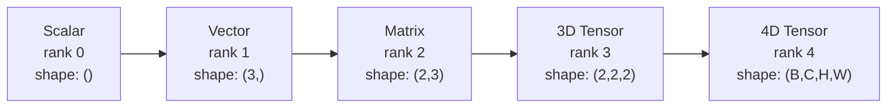
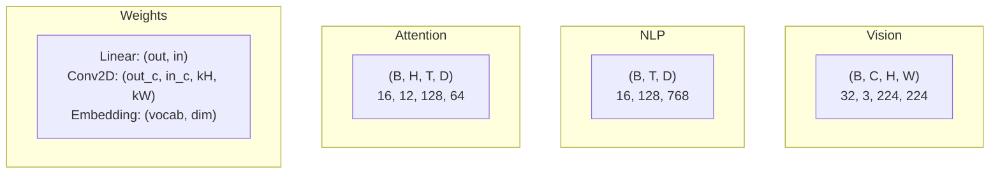
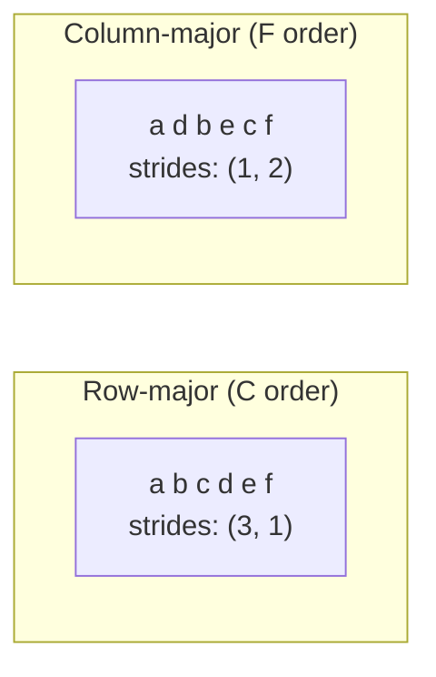
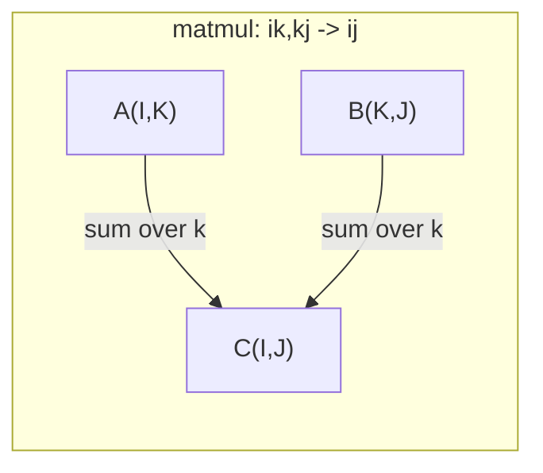

# टेंसर ऑपरेशन

> टेन्सर डेटा और गहन सीखने के बीच आम भाषा है. हर छवि, हर वाक्य, हर ग्रेडिएंट उनके माध्यम से बहता है.

**Type:** Build
**Language:**पायथन
**Prerequisites:** Phase 1, Lessons 01 (Linear Algebra Intuition), 02 (Vectors, Matrices & Operations)
**Time:** ~90 minutes

## सीखने के लक्ष्य

- आकार, कदम, रीफॉर्म, ट्रांसपोज और तत्व-बुद्धिमान संचालन के साथ एक टेन्सर वर्ग को लागू करें
- डेटा को कॉपी किए बिना विभिन्न आकारों के टेंसर पर काम करने के लिए प्रसारण नियमों को लागू करें
- डॉट उत्पादों, मैट्रिक्स गुणन, बाहरी उत्पादों और बैच ऑपरेशन के लिए एकसम अभिव्यक्ति लिखें
- बहु-मुख्य ध्यान के प्रत्येक चरण के माध्यम से सटीक टेंसर आकारों को ट्रैक करें

## समस्या

आप एक ट्रांसफार्मर बनाते हैं, आगे का पास साफ दिखता है, आप इसे चलाते हैं और आप प्राप्त करते हैंः`RuntimeError: mat1 and mat2 shapes cannot be multiplied (32x768 and 512x768)`आप आकारों को देखते हैं, आप एक ट्रांसपोस की कोशिश करते हैं. अब यह कहता है`Expected 4D input (got 3D input)`आप एक uncpress जोड़ते हैं, कुछ और टूट जाता है.

गहन सीखने के कोड में आकार की त्रुटियां सबसे आम बग हैं। वे अवधारणात्मक रूप से कठिन नहीं हैं - प्रत्येक ऑपरेशन में एक आकार अनुबंध है - लेकिन वे तेजी से गुणा करते हैं। एक ट्रांसफार्मर में दर्जनों रीफॉर्म, ट्रांसपोसेशन और प्रसारण एक साथ जुड़े होते हैं। एक गलत अक्ष और त्रुटि झरने। इससे भी बदतर कुछ आकार की गलतियों से कोई गलती नहीं होती। वे गलत आयाम के साथ प्रसारण करके या गलत अक्ष पर योग करके चुपचाप कचरा उत्पन्न करते हैं।

मैट्रिक्स दो वस्तुओं के सेट के बीच जोड़ेदार संबंधों को संभालते हैं। वास्तविक डेटा दो आयामों में फिट नहीं होता है। 224x224 पर 32 आरजीबी छवियों का एक बैच एक 4 डी टेंसर हैः`(32, 3, 224, 224)`12 सिरों के साथ आत्म-विचार भी 4D हैः`(batch, heads, seq_len, head_dim)`आप एक डेटा संरचना की जरूरत है जो सामान्यीकरण करने के लिए किसी भी संख्या में आयामों, के साथ संचालन है कि साफ रूप से उन सभी पर रचना है। कि संरचना है टेन्सर. अपने संचालन और आकार की त्रुटियों को मास्टर करने के लिए मामूली डिबग करने योग्य हो जाते हैं।

## अवधारणा

### एक tensor क्या है

एक टेन्सर एक समान डेटा प्रकार के साथ संख्याओं का बहुआयामी सरणी है। आयामों की संख्या **rank**(या **order**) प्रत्येक आयाम एक **axis**. . .**shape**प्रत्येक अक्ष के साथ आकार सूचीबद्ध एक ट्यूपल है।



कुल तत्व = सभी आकारों का उत्पाद। एक आकार `(2, 3, 4)`रखती है `2 * 3 * 4 = 24`तत्व।

### गहन शिक्षा में टेन्सर आकार

विभिन्न डेटा प्रकारों का मानचित्र विशिष्ट टेन्सर आकारों के लिए सम्मेलन द्वारा।



PyTorch NCHW (चैनल-पहले) का उपयोग करता है। TensorFlow NHWC (चैनल-अंतिम) में डिफ़ॉल्ट रूप से काम करता है। असंगत लेआउट चुपचाप धीमा या त्रुटियों का कारण बनता है।

### मेमोरी लेआउट कैसे काम करता है

स्मृति में 2D सरणी बाइट्स का एक 1D अनुक्रम है। **Strides**आप प्रत्येक अक्ष के साथ एक कदम आगे बढ़ने के लिए आप कितने तत्वों को छोड़ना होगा बताता है।



ट्रांसपोज डेटा नहीं ले जाता है. यह कदमों को swaps, बना रही है टेन्सर **non-contiguous**-- एक पंक्ति के तत्व अब स्मृति में आसन्न नहीं हैं।

### प्रसारण नियम

प्रसारण आपको डेटा कॉपी किए बिना विभिन्न आकारों के टेंसर पर काम करने की अनुमति देता है। दाईं ओर से आकारों को संरेखित करें। दो आयाम संगत हैं जब वे समान हैं या एक 1 है। बाईं ओर 1s के साथ कम आयामों को पैच किया जाता है।

```
Tensor A:     (8, 1, 6, 1)
Tensor B:        (7, 1, 5)
Padded B:     (1, 7, 1, 5)
Result:       (8, 7, 6, 5)
```

### एंसम: सार्वभौमिक टेन्सर ऑपरेशन

आइंस्टीन योग प्रत्येक अक्ष को एक अक्षर से लेबल करता है इनपुट में अक्ष, लेकिन आउटपुट में नहीं योगित होते हैं। दोनों में अक्ष बनाए जाते हैं।



मुख्य पैटर्नः `i,i->`(डॉट उत्पाद), `i,j->ij`(बाहरी उत्पाद), `ii->`(ट्रेस), `ij->ji`(संवितरण), `bij,bjk->bik`(बैच मत् मल्ल), `bhtd,bhsd->bhts`(ध्यान स्कोर)

```figure
tensor-broadcast
```

## इसे बनाओ

कोड में रहता है `code/tensors.py`. प्रत्येक चरण में वहाँ के कार्यान्वयन का उल्लेख किया गया है।

### चरण 1: टेंसर भंडारण और कदम

एक टेन्सर संख्याओं की एक सपाट सूची और आकार के मेटाडेटा को संग्रहीत करता है। कदम सूचकांक तर्क को बताते हैं कि बहुआयामी सूचकांक को सपाट स्थानों पर कैसे मैप किया जाए।

```python
class Tensor:
    def __init__(self, data, shape=None):
        if isinstance(data, (list, tuple)):
            self._data, self._shape = self._flatten_nested(data)
        elif isinstance(data, np.ndarray):
            self._data = data.flatten().tolist()
            self._shape = tuple(data.shape)
        else:
            self._data = [data]
            self._shape = ()

        if shape is not None:
            total = reduce(lambda a, b: a * b, shape, 1)
            if total != len(self._data):
                raise ValueError(
                    f"Cannot reshape {len(self._data)} elements into shape {shape}"
                )
            self._shape = tuple(shape)

        self._strides = self._compute_strides(self._shape)

    @staticmethod
    def _compute_strides(shape):
        if len(shape) == 0:
            return ()
        strides = [1] * len(shape)
        for i in range(len(shape) - 2, -1, -1):
            strides[i] = strides[i + 1] * shape[i + 1]
        return tuple(strides)
```

आकार के लिए `(3, 4)`, कदम हैं `(4, 1)`-- एक पंक्ति आगे करने के लिए 4 तत्वों को छोड़ दें, एक स्तंभ आगे करने के लिए 1 तत्व को छोड़ दें।

### चरण 2: रीशॉप, प्रेस, अनस्प्रेस

तत्वों की क्रम में परिवर्तन किए बिना आकार बदलता है। तत्वों की कुल संख्या समान रहना चाहिए। उपयोग `-1`एक आयाम के लिए उसके आकार का अनुमान लगाने के लिए।

```python
t = Tensor(list(range(12)), shape=(2, 6))
r = t.reshape((3, 4))
r = t.reshape((-1, 3))
```

स्क््रेस आकार 1 के धुरी को हटा देता है। अनस्क््रेस 1 को सम्मिलित करता है। अनस्क््रेसिंग प्रसारण के लिए महत्वपूर्ण है - एक पूर्वाग्रह वेक्टर`(D,)`एक बैच में जोड़ा गया `(B, T, D)``(1, 1, D)`. .

```python
t = Tensor(list(range(6)), shape=(1, 3, 1, 2))
s = t.squeeze()
v = Tensor([1, 2, 3])
u = v.unsqueeze(0)
```

### चरण 3: ट्रांसपोज और परमूट करें

ट्रांसपोज दो अक्षों को स्वैप करता है. परमूट सभी अक्षों को फिर से क्रमबद्ध करता है. इस तरह आप एनसीएचडब्ल्यू और एनएचडब्ल्यूसी के बीच परिवर्तित करते हैं.

```python
mat = Tensor(list(range(6)), shape=(2, 3))
tr = mat.transpose(0, 1)

t4d = Tensor(list(range(24)), shape=(1, 2, 3, 4))
perm = t4d.permute((0, 2, 3, 1))
```

ट्रांसपोस या परमुट के बाद, टेन्सर स्मृति में असंबद्ध है।`view`गैर-समीप्य टेंसर पर विफलता -- उपयोग `reshape`या कॉल`.contiguous()`पहले।

### चरण 4: तत्व-वार संचालन और घटाने

तत्व-बुद्धिमान ऑपरेशन (जोड़ें, गुणा करें, घटाएं) प्रत्येक तत्व पर स्वतंत्र रूप से लागू होते हैं और आकार को बनाए रखते हैं। कमी (सumma, mean, max) एक या अधिक अक्षों को ढकढकाता है।

```python
a = Tensor([[1, 2], [3, 4]])
b = Tensor([[10, 20], [30, 40]])
c = a + b
d = a * 2
s = a.sum(axis=0)
```

एक सीएनएन में वैश्विक औसत बंडलिंगः `(B, C, H, W).mean(axis=[2, 3])`उत्पादन करता है `(B, C)`. एनएलपी में क्रमबद्धता का औसतः `(B, T, D).mean(axis=1)`उत्पादन करता है `(B, D)`. .

### चरण 5: NumPy के साथ प्रसारण

`demo_broadcasting_numpy()``tensors.py`कोर पैटर्न दिखाता है।

```python
activations = np.random.randn(4, 3)
bias = np.array([0.1, 0.2, 0.3])
result = activations + bias

images = np.random.randn(2, 3, 4, 4)
scale = np.array([0.5, 1.0, 1.5]).reshape(1, 3, 1, 1)
result = images * scale

a = np.array([1, 2, 3]).reshape(-1, 1)
b = np.array([10, 20, 30, 40]).reshape(1, -1)
outer = a * b
```

प्रसारण के माध्यम से जोड़ी दूरीः पुनर्विकृति `(M, 2)``(M, 1, 2)`और `(N, 2)``(1, N, 2)`, घटाएँ, वर्ग, अंतिम अक्ष के साथ योग, वर्ग जड़ लें। परिणामः `(M, N)`. .

### चरण 6: एइनसम संचालन

`demo_einsum()`और `demo_einsum_gallery()`कार्य हर सामान्य पैटर्न के माध्यम से चलते हैं।

```python
a = np.array([1.0, 2.0, 3.0])
b = np.array([4.0, 5.0, 6.0])
dot = np.einsum("i,i->", a, b)

A = np.array([[1, 2], [3, 4], [5, 6]], dtype=float)
B = np.array([[7, 8, 9], [10, 11, 12]], dtype=float)
matmul = np.einsum("ik,kj->ij", A, B)

batch_A = np.random.randn(4, 3, 5)
batch_B = np.random.randn(4, 5, 2)
batch_mm = np.einsum("bij,bjk->bik", batch_A, batch_B)
```

संकुचन की गणनात्मक लागत सभी सूचकांक आकारों (रहित और योगित) का उत्पाद है।`bij,bjk->bik`B=32, I=128, J=64, K=128: `32 * 128 * 64 * 128 = 33,554,432`गुणन-जोड़े।

### चरण 7: एक्यूम के माध्यम से ध्यान तंत्र

`demo_attention_einsum()`कार्य अंत से अंत तक बहु-उपदे ध्यान लागू करता है।

```python
B, H, T, D = 2, 4, 8, 16
E = H * D

X = np.random.randn(B, T, E)
W_q = np.random.randn(E, E) * 0.02

Q = np.einsum("bte,ek->btk", X, W_q)
Q = Q.reshape(B, T, H, D).transpose(0, 2, 1, 3)

scores = np.einsum("bhtd,bhsd->bhts", Q, K) / np.sqrt(D)
weights = softmax(scores, axis=-1)
attn_output = np.einsum("bhts,bhsd->bhtd", weights, V)

concat = attn_output.transpose(0, 2, 1, 3).reshape(B, T, E)
output = np.einsum("bte,ek->btk", concat, W_o)
```

प्रत्येक चरण एक टेन्सर ऑपरेशन हैः प्रोजेक्शन (मैटमूल via einsum), हेड स्प्लिटिंग (रेशप + ट्रांसपोज), ध्यान स्कोर (बैच मैटमूल via einsum), वजनदार योग (बैच मैटमूल via einsum), हेड मर्जिंग (ट्रान्सपोज + रीशप), आउटपुट प्रोजेक्शन (मैटमूल via einsum) ।

## इसका प्रयोग करें

### स्क्रैच बनाम नंबरपी

| Operation | Scratch (Tensor class) | NumPy |
|---|---|---|
| Create | `Tensor([[1,2],[3,4]])` | `np.array([[1,2],[3,4]])` |
| Reshape | `t.reshape((3,4))` | `a.reshape(3,4)` |
| Transpose | `t.transpose(0,1)` | `a.T` or `a.transpose(0,1)` |
| Squeeze | `t.squeeze(0)` | `np.squeeze(a, 0)` |
| Sum | `t.sum(axis=0)` | `a.sum(axis=0)` |
| Einsum | N/A | `np.einsum("ij,jk->ik", a, b)` |

### स्क्रैच बनाम पायटॉर्च

```python
import torch

t = torch.tensor([[1, 2, 3], [4, 5, 6]], dtype=torch.float32)
t.shape
t.stride()
t.is_contiguous()

t.reshape(3, 2)
t.unsqueeze(0)
t.transpose(0, 1)
t.transpose(0, 1).contiguous()

torch.einsum("ik,kj->ij", A, B)
```

PyTorch ऑटोग्रेड, GPU समर्थन और अनुकूलित BLAS कर्नेल जोड़ता है। आकार की अर्थशास्त्र समान है। यदि आप खरोंच संस्करण को समझते हैं, तो PyTorch आकार त्रुटियां पठनीय हो जाती हैं।

### एक tensor ऑपरेशन के रूप में प्रत्येक तंत्रिका नेटवर्क परत

| Operation | Tensor Form | Einsum |
|---|---|---|
| Linear layer | `Y = X @ W.T + b` | `"bd,od->bo"` + bias |
| Attention QKV | `Q = X @ W_q` | `"btd,dh->bth"` |
| Attention scores | `Q @ K.T / sqrt(d)` | `"bhtd,bhsd->bhts"` |
| Attention output | `softmax(scores) @ V` | `"bhts,bhsd->bhtd"` |
| Batch norm | `(X - mu) / sigma * gamma` | element-wise + broadcast |
| Softmax | `exp(x) / sum(exp(x))` | element-wise + reduction |

## इसे भेजें

इस पाठ में दो पुनः प्रयोज्य संकेत दिए गए हैंः

1. **`outputs/prompt-tensor-shapes.md`**-- टेन्सर आकार असंगति डिबग करने के लिए एक व्यवस्थित संकेत। प्रत्येक सामान्य ऑपरेशन (मैटमुल, प्रसारण, बिल्ली, रैखिक, Conv2d, बैचनोर्म, सॉफ्टमैक्स) के लिए निर्णय तालिकाओं और एक फिक्स खोज तालिका शामिल है।

2. **`outputs/prompt-tensor-debugger.md`**-- एक कदम-दर-चरण डिबगिंग निर्देश आप किसी भी एआई सहायक में पेस्ट जब एक आकार त्रुटि आप अवरुद्ध कर रहा है. उसे त्रुटि संदेश और अपने Tensor आकारों खिला, सही फिक्स वापस मिलता है.

## व्यायाम

1. **Easy -- Reshape round-trip.**आकार का एक टेन्सर लें `(2, 3, 4)`. इसे रीसेट करें .`(6, 4)`, फिर `(24,)`, फिर वापस `(2, 3, 4)`. सत्यापित तत्व क्रम प्रत्येक चरण में फ्लैट डेटा प्रिंट करके संरक्षित किया जाता है।

2. **Medium -- Implement broadcasting.**`Tensor`कक्षा के साथ `broadcast_to(shape)`एक लक्ष्य आकार से मेल खाने के लिए आकार 1 के आयामों का विस्तार करने की विधि।`_elementwise_op`ऑपरेशन से पहले स्वचालित प्रसारण के लिए।`(3, 1)`और `(1, 4)`उत्पादन`(3, 4)`. .

3. **Hard -- Build einsum from scratch.**एक बुनियादी `einsum(subscripts, *tensors)`फ़ंक्शन जो कम से कमः डॉट प्रॉडक्ट (`i,i->`), मैट्रिक्स गुणा (`ij,jk->ik`), बाहरी उत्पाद (`i,j->ij`), और इसे पार कराना (`ij->ji`) सबस्क्रिप्ट स्ट्रिंग को विश्लेषण करें, अनुबंधित सूचकांक की पहचान करें, और सभी सूचकांक संयोजनों पर लूप करें। अपने परिणामों की तुलना करें `np.einsum`. .

4. **Hard -- Attention shape tracker.**एक फ़ंक्शन लिखें जो लेता है `batch_size`,`seq_len`,`embed_dim`और `num_heads`इनपुट और प्रिंट्स के रूप में प्रत्येक चरण में सटीक आकार बहु-हेड ध्यानः इनपुट, Q / K / V प्रक्षेपण, सिर विभाजन, ध्यान स्कोर, softmax वजन, भारित योग, सिर विलय, आउटपुट प्रक्षेपण।`demo_attention_einsum()`आउटपुट।

## प्रमुख शर्तें

| Term | What people say | What it actually means |
|---|---|---|
| Tensor | "A matrix but more dimensions" | A multi-dimensional array with uniform type and defined shape, strides, and operations |
| Rank | "The number of dimensions" | The number of axes. A matrix has rank 2, not rank equal to its matrix rank |
| Shape | "The size of the tensor" | A tuple listing the size along each axis. `(2, 3)` means 2 rows, 3 columns |
| Stride | "How memory is laid out" | The number of elements to skip to advance one position along each axis |
| Broadcasting | "It just works when shapes differ" | A strict set of rules: align from right, dimensions must be equal or one must be 1 |
| Contiguous | "The tensor is normal" | Elements stored sequentially in memory with no gaps or reordering from the logical layout |
| Einsum | "A fancy way to write matmul" | A general notation that expresses any tensor contraction, outer product, trace, or transpose in one line |
| View | "Same as reshape" | A tensor sharing the same memory buffer but with different shape/stride metadata. Fails on non-contiguous data |
| Contraction | "Summing over an index" | The general operation where a shared index between tensors is multiplied and summed, producing a lower-rank result |
| NCHW / NHWC | "PyTorch vs TensorFlow format" | Memory layout conventions for image tensors. NCHW puts channels before spatial dims, NHWC puts them after |

## आगे पढ़ना

- [NumPy Broadcasting](https://numpy.org/doc/stable/user/basics.broadcasting.html)-- दृश्य उदाहरणों के साथ कैनोनिक नियम
- [PyTorch Tensor Views](https://pytorch.org/docs/stable/tensor_view.html)-- जब दृश्य काम करते हैं और जब वे कॉपी करते हैं
- [einops](https://github.com/arogozhnikov/einops)-- एक पुस्तकालय जो टेन्सर रीफाइमिंग पठनीय और सुरक्षित बनाता है
- [The Illustrated Transformer](https://jalammar.github.io/illustrated-transformer/)-- ध्यान के माध्यम से बहने वाले टेन्सर के आकारों को दृश्यमान करता है
- [Einstein Summation in NumPy](https://numpy.org/doc/stable/reference/generated/numpy.einsum.html)-- उदाहरणों के साथ पूर्ण एकसम प्रलेखन
