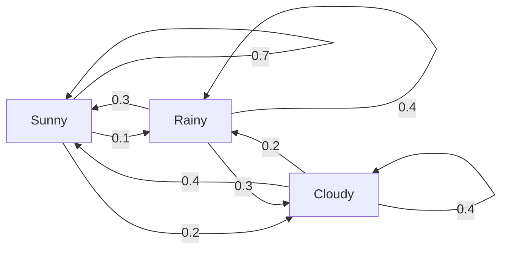
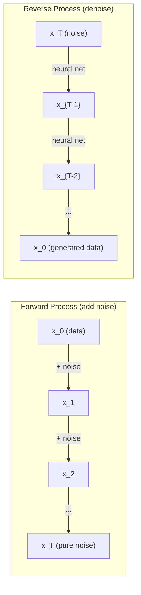

# स्टोकास्टिक प्रक्रियाएँ

> संरचना के साथ यादृच्छिकता, यादृच्छिक चलने, मार्कोव श्रृंखलाओं और विसारण मॉडल के पीछे गणित।

**Type:** Learn
**Language:**पायथन
**Prerequisites:** Phase 1, Lessons 06-07 (probability, Bayes)
**Time:** ~75 minutes

## सीखने के लक्ष्य

- 1D और 2D यादृच्छिक चलने का अनुकरण करें और विस्थापन के स्केलिंग की जांच करें
- एक मार्कोव श्रृंखला सिम्युलेटर का निर्माण और अपने स्वयं के संरचना के माध्यम से इसकी स्थिर वितरण की गणना
- लक्ष्य वितरण से नमूना लेने के लिए मेट्रोपोलिस-हस्टिंग्स एमसीएमसी और लैंग्विन गतिशीलता को लागू करना
- आगे फैलाव प्रक्रिया को ब्राउनियन गति से जोड़ें और समझाएं कि कैसे रिवर्स प्रक्रिया डेटा उत्पन्न करती है

## समस्या

कई एआई सिस्टम में यादृच्छिकता शामिल होती है जो समय के साथ विकसित होती है. स्थैतिक यादृच्छिकता नहीं - संरचित, अनुक्रमिक यादृच्छिकता जहां प्रत्येक कदम पहले के बाद के पर निर्भर करता है।

भाषा मॉडल एक समय में एक टोकन उत्पन्न करते हैं। प्रत्येक टोकन पिछले संदर्भ पर निर्भर करता है। मॉडल एक संभावना वितरण, इसके नमूने आउटपुट करता है, और आगे बढ़ता है। यह एक स्टोकास्टिक प्रक्रिया है।

विसारण मॉडल एक छवि में शोर को चरण-दर-चरण जोड़ते हैं जब तक कि यह शुद्ध स्थैतिक नहीं हो जाता। फिर वे प्रक्रिया को उलट देते हैं, एक नई छवि आने तक चरण-दर-चरण निरुत्साहित करते हैं। आगे की प्रक्रिया एक मार्कोव श्रृंखला है। उल्टा प्रक्रिया एक सीखी गई मार्कोव श्रृंखला है जो पीछे की ओर चलती है।

एक संयोग की दुनिया में एक यादृच्छिक नीति का पालन करता है। पूरी बात एक मार्कोव निर्णय प्रक्रिया है।

MCMC नमूनाकरण - Bayesian inference की रीढ़ की हड्डी - एक Markov श्रृंखला का निर्माण जिसका स्थिर वितरण है पिछली आप नमूना करना चाहते हैं से.

ये सभी चार बुनियादी विचारों पर आधारित हैंः
1. यादृच्छिक चलने -- सबसे सरल स्टोकैस्टिक प्रक्रिया
2. मार्कोव श्रृंखलाएं -- एक संक्रमण मैट्रिक्स के साथ संरचित यादृच्छिकता
3. लैंग्विन गतिशीलता - शोर के साथ ग्रेडिएंट गिरावट
4. मेट्रोपोलिस-हस्टिंग्स - किसी भी वितरण से नमूना लेना

## अवधारणा

### यादृच्छिक पैदल यात्रा

प्रत्येक चरण में एक निष्पक्ष सिक्का फ्लिप करें. सिरः दाएं (+1) आगे बढ़ें। पूंछः बाएं (-1) आगे बढ़ें।

n चरणों के बाद, आपकी स्थिति n यादृच्छिक +/-1 मानों का योग है। अपेक्षित स्थिति 0 है (चलाव निष्पक्ष है) । लेकिन मूल से अपेक्षित दूरी वर्ग ((n) के रूप में बढ़ जाती है।

यह विपरीत है. चलने के लिए उचित है - किसी भी दिशा में कोई बहाव नहीं है. लेकिन समय के साथ, यह शुरू से आगे और आगे भटकता है. n चरणों के बाद मानक विचलन sqrt(n है।

```
Step 0:  Position = 0
Step 1:  Position = +1 or -1
Step 2:  Position = +2, 0, or -2
...
Step 100: Expected distance from origin ~ 10 (sqrt(100))
Step 10000: Expected distance from origin ~ 100 (sqrt(10000))
```

**In 2D**, पैदल चलता है ऊपर, नीचे, बाएं, या दाएं के साथ समान संभावना है। समान वर्ग n) पैमाने मूल से दूरी पर लागू होता है। पथ एक फ्रैक्टल की तरह पैटर्न को ट्रैक करता है।

**Why sqrt(n)?**प्रत्येक चरण समान संभावना के साथ +1 या -1 है। n चरणों के बाद, स्थिति S_n = X_1 + X_2 + ... + X_n जहां प्रत्येक X_i +/-1 है। प्रत्येक चरण का भिन्नता 1 है, और चरण स्वतंत्र हैं, इसलिए Var(S_n) = n। मानक विचलन = sqrt(n। केंद्रीय सीमा प्रमेय द्वारा, S_n / sqrt(n) एक मानक सामान्य वितरण के लिए अभिसरण करता है।

यह स्क्वायररॉट स्केल ML में हर जगह दिखाई देता है। SGD शोर पैमाने 1/sqrt(बैच_साइज) । स्क्वायररॉट स्केल को स्क्वायररॉट के रूप में एम्बेड करना। स्क्वायररॉट स्वतंत्र यादृच्छिक जोड़ों का हस्ताक्षर है।

**Connection to Brownian motion.**चरण आकार 1/sqrt(n) और n चरण प्रति इकाई समय के साथ यादृच्छिक पैदल चलें। जैसे ही n अंतहीन हो जाता है, पैदल ब्रोवनीयन गति B(t) - एक निरंतर समय प्रक्रिया में परिवर्तित होता है जहां B(t) को सामान्य रूप से औसत 0 और भिन्नता t के साथ वितरित किया जाता है।

ब्राउनियन आंदोलन विसारण का गणितीय आधार है. यह द्रव में कणों के यादृच्छिक हिलाव, शेयर की कीमतों के उतार-चढ़ाव और - महत्वपूर्ण रूप से - विसारण मॉडल में शोर प्रक्रिया का मॉडल बनाता है.

**Gambler's ruin.**एक यादृच्छिक पैदल यात्री 0 और N पर अवशोषित बाधाओं के साथ स्थिति k से शुरू होता है। 0 से पहले N तक पहुंचने की संभावना क्या है? निष्पक्ष पैदल यात्रा के लिएः P(reach N) = k/N। यह आश्चर्यजनक रूप से सरल और सुरुचिपूर्ण है। यह मार्टिंगाल्स के सिद्धांत से जुड़ा हुआ है - निष्पक्ष यादृच्छिक पैदल यात्रा एक मार्टिंगाल है (अन्तिम भविष्य का अनुमानित मूल्य = वर्तमान मूल्य) ।

### मार्कोव चेन

मार्कोव श्रृंखला एक ऐसी प्रणाली है जो निश्चित संभावनाओं के अनुसार राज्यों के बीच संक्रमण करती है। मुख्य गुणः अगला राज्य केवल वर्तमान राज्य पर निर्भर करता है, इतिहास पर नहीं।

```
P(X_{t+1} = j | X_t = i, X_{t-1} = ...) = P(X_{t+1} = j | X_t = i)
```

यह मार्कोव गुण है. इसका मतलब है कि आप एक संक्रमण मैट्रिक्स P के साथ पूरे गतिशीलता का वर्णन कर सकते हैंः

```
P[i][j] = probability of going from state i to state j
```

P की प्रत्येक पंक्ति 1 के योग है (आप कहीं जाना होगा).

**Example -- Weather:**

```
States: Sunny (0), Rainy (1), Cloudy (2)

P = [[0.7, 0.1, 0.2],    (if sunny: 70% sunny, 10% rainy, 20% cloudy)
     [0.3, 0.4, 0.3],    (if rainy: 30% sunny, 40% rainy, 30% cloudy)
     [0.4, 0.2, 0.4]]    (if cloudy: 40% sunny, 20% rainy, 40% cloudy)
```

किसी भी स्थिति में शुरू करें। कई संक्रमणों के बाद, राज्यों का वितरण स्थिर वितरण pi के लिए अभिसरण करता है, जहां pi * P = pi। यह स्वयं मूल्य 1 के साथ P का बाएं स्ववेक्टर है।

मौसम श्रृंखला के लिए, स्थिर वितरण [0.55, 0.18, 0.27] है -- लंबे समय में, यह समय का 55% धूप है, चाहे प्रारंभिक स्थिति क्या हो।



**Computing the stationary distribution.**दो दृष्टिकोण हैंः

1. **Power method**: किसी भी प्रारंभिक वितरण को पी द्वारा बार-बार गुणा करें। पर्याप्त पुनरावृत्ति के बाद, यह अभिसरण करता है।
2. **Eigenvalue method**: स्वयं के मूल्य के साथ P के बाएं स्ववेक्टर को खोजें 1. यह स्वयं के मूल्य के साथ P^T का स्ववेक्टर है 1.

दोनों दृष्टिकोणों के लिए, अभिसरण की शर्तों को पूरा करने के लिए श्रृंखला की आवश्यकता होती है।

**Convergence conditions.**एक मार्कोव श्रृंखला एक अद्वितीय स्थिर वितरण के लिए अभिसरण यदि यह हैः
- **Irreducible**: हर राज्य अन्य सभी राज्यों से पहुंच योग्य है
- **Aperiodic**: श्रृंखला एक निश्चित अवधि के साथ चक्र नहीं करती है

एमएल में जो चेन मिलती है, उनमें से अधिकांश दोनों ही शर्तों को पूरा करती है।

**Absorbing states.**एक राज्य अवशोषित है यदि आप इसे दर्ज करने के बाद, आप कभी नहीं छोड़ते हैं (पी[i][i] = 1) अवशोषित मार्कोव श्रृंखला टर्मिनल राज्यों के साथ मॉडल प्रक्रियाओं - एक खेल जो समाप्त होता है, एक ग्राहक जो झुकता है, एक टोकन अनुक्रम जो पाठ के अंत टोकन को हिट करता है।

**Mixing time.**स्थिरता से कुल भिन्नता दूरी तक चरणों की संख्या कुछ सीमा से नीचे गिरती है। तेजी से मिश्रण = कुछ चरणों की आवश्यकता होती है। पी का स्पेक्ट्रल अंतर (1 - दूसरा सबसे बड़ा स्व-मूल्य) मिश्रण समय को नियंत्रित करता है। बड़ा अंतर = तेजी से मिश्रण।

### भाषा मॉडल से संबंध

भाषा मॉडल में टोकन उत्पादन लगभग एक मार्कोव प्रक्रिया है। वर्तमान संदर्भ को देखते हुए, मॉडल अगले टोकन पर एक वितरण आउटपुट करता है। तापमान तीक्ष्णता को नियंत्रित करता हैः

```
P(token_i) = exp(logit_i / temperature) / sum(exp(logit_j / temperature))
```

- तापमान = 1.0: मानक वितरण
- तापमान < 1.0: तेज (अधिक निर्धारक)
- तापमान > 1.0: सपाट (अधिक यादृच्छिक)
- तापमान -> 0: argmax (लाभिड)

शीर्ष-के नमूनाकरण उच्चतम संभावना टोकन के लिए छोटा करता है। शीर्ष-पी (नक्लस) नमूनाकरण टोकन के सबसे छोटे सेट के लिए छोटा करता है जिनकी संचयी संभावना p से अधिक है। दोनों मार्कोव संक्रमण संभावनाओं को संशोधित करते हैं।

### ब्राउनियन मोशन

आकस्मिक चाल की निरंतर समय सीमा। स्थिति B(t) में तीन गुण हैंः
1. B(0) = 0
2. B(t) - B(s) को सामान्यतः औसत 0 और भिन्नता t -s (t > s के लिए) के साथ वितरित किया जाता है
3. गैर-परचम अंतराल पर वृद्धि स्वतंत्र है

ब्राउनियन आंदोलन निरंतर है लेकिन कहीं भी भेद नहीं किया जा सकता है - यह हर पैमाने पर हिलाता है. पथ के विमान में फ्रैक्टल आयाम 2 है.

एक अलग अनुकरण में, आप अनुमानित Brownian गति सेः

```
B(t + dt) = B(t) + sqrt(dt) * z,    where z ~ N(0, 1)
```

sqrt(dt) स्केलिंग महत्वपूर्ण है। यह यादृच्छिक चलने पर लागू केंद्रीय सीमा प्रमेय से आता है।

### लैंग्विन डायनामिक्स

ग्रेडिएंट अवतरण एक फ़ंक्शन का न्यूनतम स्थान पाता है। लैंग्विन गतिशीलता में संभावना वितरण exp(-U(x) /T के समान है, जहां U एक ऊर्जा फ़ंक्शन है और T तापमान है।

```
x_{t+1} = x_t - dt * gradient(U(x_t)) + sqrt(2 * T * dt) * z_t
```

कण पर दो बल कार्य करते हैंः
1. **Gradient force**(-dt * ग्रेडिएंट(U)): कम ऊर्जा की ओर धक्का देता है (जैसे ग्रेडिएंट गिरावट)
2. **Random force**(sqrt(2*T*dt) * z): यादृच्छिक दिशाओं में धक्का (खोज)

तापमान T = 0 पर यह शुद्ध ग्रेडिएंट गिरावट है। उच्च तापमान पर यह लगभग एक यादृच्छिक पैदल है। सही तापमान पर, कण ऊर्जा परिदृश्य की खोज करता है और कम ऊर्जा वाले क्षेत्रों में अधिक समय बिताता है।

**Connection to diffusion models.**विसारण मॉडल की आगे की प्रक्रिया हैः

```
x_t = sqrt(alpha_t) * x_{t-1} + sqrt(1 - alpha_t) * noise
```

यह एक मार्कोव श्रृंखला है जो धीरे-धीरे डेटा शोर के साथ मिश्रण. पर्याप्त चरणों के बाद, x_T शुद्ध गौशियन शोर है.

रिवर्स प्रक्रिया - शोर से वापस डेटा तक जाना - एक मार्कोव श्रृंखला भी है, लेकिन इसके संक्रमण की संभावनाएं न्यूरल नेटवर्क द्वारा सीखी जाती हैं। नेटवर्क हर कदम पर जो शोर जोड़ा गया है, उसकी भविष्यवाणी करना सीखता है, फिर उसे घटाता है।



### MCMC: मार्कोव चेन मोंटे कार्लो

कभी कभी आप एक वितरण p ((x) से नमूना लेने की जरूरत है कि आप मूल्यांकन कर सकते हैं (एक स्थिर तक) लेकिन सीधे से नमूना नहीं कर सकते. Bayesian पोस्टियर क्लासिक उदाहरण हैं - आप संभावना पहले से गुणा पता है, लेकिन सामान्यीकरण स्थिर मुश्किल है.

**Metropolis-Hastings**एक मार्कोव श्रृंखला का निर्माण करता है जिसका स्थिर वितरण p(x है):

1. कुछ स्थिति से शुरू करें x
2. प्रस्तावित प्रस्ताव वितरण से एक नई स्थिति x'
3. गणना स्वीकार्यता अनुपातः a(x') * Q(x यह है कि) / (p(x) * Q(x' यह है कि))
4. संभावना min ((1, a) के साथ x' स्वीकार करें अन्यथा x पर बने रहें।
5. दोहराएँ।

यदि Q सममित है, उदाहरण के लिए, Q(x' (तैसेx) = Q(x (तैसेx') = N(x, सिग्मा^2)), अनुपात सरल हो जाता है a = p(x') / p(x। आपको केवल संभावनाओं के अनुपात की आवश्यकता है - सामान्यीकरण निरंतर रद्द करता है।

इस श्रृंखला को हल्के परिस्थितियों में p ((x) के लिए अभिसरण की गारंटी है। लेकिन अभिसरण धीमा हो सकता है यदि प्रस्ताव बहुत छोटा है (क्योंकि चलने) या बहुत बड़ा है (उच्च अस्वीकृति) । प्रस्ताव को समायोजित करना MCMC की कला है।

**Why it works.**स्वीकृति अनुपात विस्तृत संतुलन सुनिश्चित करता हैः x पर होने की संभावना और x ' पर जाने की संभावना x ' पर होने और x ' पर जाने की संभावना के बराबर है। विस्तृत संतुलन का मतलब है कि p(x) श्रृंखला का स्थिर वितरण है। इसलिए पर्याप्त चरणों के बाद, नमूने p(x से आते हैं।

**Practical considerations:**
- **Burn-in**श्रृंखला को अपने प्रारंभिक बिंदु से स्थिर वितरण तक पहुंचने के लिए समय की आवश्यकता होती है।
- **Thinning**: ऑटोकोरेलेशन को कम करने के लिए प्रत्येक k-th नमूना रखें।
- **Multiple chains**यदि वे एक ही वितरण में अभिसरण करते हैं, तो आप अभिसरण के प्रमाण प्राप्त करते हैं।
- **Acceptance rate**: डी आयामों में गौसी प्रस्तावों के लिए, इष्टतम स्वीकृति दर लगभग 23% है (रॉबर्ट्स और रोसेंटल, 2001) ।

### एआई में स्टोकास्टिक प्रक्रियाएं

| Process | AI Application |
|---------|---------------|
| Random walk | Exploration in RL, Node2Vec embeddings |
| Markov chain | Text generation, MCMC sampling |
| Brownian motion | Diffusion models (forward process) |
| Langevin dynamics | Score-based generative models, SGLD |
| Markov decision process | Reinforcement learning |
| Metropolis-Hastings | Bayesian inference, posterior sampling |

```figure
random-walk-diffusion
```

## इसे बनाओ

### चरण 1: यादृच्छिक चलने सिम्युलेटर

```python
import numpy as np

def random_walk_1d(n_steps, seed=None):
    rng = np.random.RandomState(seed)
    steps = rng.choice([-1, 1], size=n_steps)
    positions = np.concatenate([[0], np.cumsum(steps)])
    return positions


def random_walk_2d(n_steps, seed=None):
    rng = np.random.RandomState(seed)
    directions = rng.choice(4, size=n_steps)
    dx = np.zeros(n_steps)
    dy = np.zeros(n_steps)
    dx[directions == 0] = 1   # right
    dx[directions == 1] = -1  # left
    dy[directions == 2] = 1   # up
    dy[directions == 3] = -1  # down
    x = np.concatenate([[0], np.cumsum(dx)])
    y = np.concatenate([[0], np.cumsum(dy)])
    return x, y
```

1D walk संचयी योग को संग्रहीत करता है. प्रत्येक चरण +1 या -1 है। n चरणों के बाद, स्थिति योग है। भिन्नता n के साथ रैखिक रूप से बढ़ती है, इसलिए मानक विचलन वर्ग (squart) n के रूप में बढ़ता है।

### चरण 2: मार्कोव श्रृंखला

```python
class MarkovChain:
    def __init__(self, transition_matrix, state_names=None):
        self.P = np.array(transition_matrix, dtype=float)
        self.n_states = len(self.P)
        self.state_names = state_names or [str(i) for i in range(self.n_states)]

    def step(self, current_state, rng=None):
        if rng is None:
            rng = np.random.RandomState()
        probs = self.P[current_state]
        return rng.choice(self.n_states, p=probs)

    def simulate(self, start_state, n_steps, seed=None):
        rng = np.random.RandomState(seed)
        states = [start_state]
        current = start_state
        for _ in range(n_steps):
            current = self.step(current, rng)
            states.append(current)
        return states

    def stationary_distribution(self):
        eigenvalues, eigenvectors = np.linalg.eig(self.P.T)
        idx = np.argmin(np.abs(eigenvalues - 1.0))
        stationary = np.real(eigenvectors[:, idx])
        stationary = stationary / stationary.sum()
        return np.abs(stationary)
```

स्थैतिक वितरण P का बाएं स्ववेक्टर है जिसका स्वमूल्य 1 है। इसे P^T के स्ववेक्टरों की गणना करके पाया जाता है (बाएं स्ववेक्टरों को दाएं स्ववेक्टरों में बदलकर ट्रांसपोस करना) ।

### चरण 3: लैंग्विन गतिशीलता

```python
def langevin_dynamics(grad_U, x0, dt, temperature, n_steps, seed=None):
    rng = np.random.RandomState(seed)
    x = np.array(x0, dtype=float)
    trajectory = [x.copy()]
    for _ in range(n_steps):
        noise = rng.randn(*x.shape)
        x = x - dt * grad_U(x) + np.sqrt(2 * temperature * dt) * noise
        trajectory.append(x.copy())
    return np.array(trajectory)
```

ग्रेडिएंट कम ऊर्जा की ओर एक्स को धक्का देता है। शोर इसे अटकने से रोकता है। संतुलन में, नमूनों का वितरण exp ((-U ((x) / तापमान के समानुपातिक है।

### चरण 4: मेट्रोपोलिस-हस्टिंग्स

```python
def metropolis_hastings(target_log_prob, proposal_std, x0, n_samples, seed=None):
    rng = np.random.RandomState(seed)
    x = np.array(x0, dtype=float)
    samples = [x.copy()]
    accepted = 0
    for _ in range(n_samples - 1):
        x_proposed = x + rng.randn(*x.shape) * proposal_std
        log_ratio = target_log_prob(x_proposed) - target_log_prob(x)
        if np.log(rng.rand()) < log_ratio:
            x = x_proposed
            accepted += 1
        samples.append(x.copy())
    acceptance_rate = accepted / (n_samples - 1)
    return np.array(samples), acceptance_rate
```

एल्गोरिथम एक नया बिंदु प्रस्तावित करता है, जांच करता है कि क्या इसकी उच्च संभावना है (या अनुपात के अनुपात में संभावना के साथ स्वीकार करता है), और दोहराता है। अच्छी मिश्रण के लिए स्वीकृति दर लगभग 23-50% होनी चाहिए।

## इसका प्रयोग करें

व्यवहार में, आप इन एल्गोरिदम के लिए स्थापित पुस्तकालयों का उपयोग करते हैं, लेकिन मैकेनिक्स को समझना डिबगिंग और ट्यूनिंग के लिए महत्वपूर्ण है।

```python
import numpy as np

rng = np.random.RandomState(42)
walk = np.cumsum(rng.choice([-1, 1], size=10000))
print(f"Final position: {walk[-1]}")
print(f"Expected distance: {np.sqrt(10000):.1f}")
print(f"Actual distance: {abs(walk[-1])}")
```

### संक्रमण मैट्रिक्स के लिए नम्पी

```python
import numpy as np

P = np.array([[0.7, 0.1, 0.2],
              [0.3, 0.4, 0.3],
              [0.4, 0.2, 0.4]])

distribution = np.array([1.0, 0.0, 0.0])
for _ in range(100):
    distribution = distribution @ P

print(f"Stationary distribution: {np.round(distribution, 4)}")
```

प्रारंभिक वितरण को पी द्वारा बार-बार गुणा करें। पर्याप्त पुनरावृत्ति के बाद, यह स्थिर वितरण में परिवर्तित हो जाता है, चाहे आप कहां से शुरू करें। यह प्रमुख बाएं स्ववेक्टर खोजने के लिए शक्ति विधि है।

### वास्तविक ढांचे से संबंध

- **PyTorch diffusion:**`DDPMScheduler`गले लगाते हुए चेहरे पर`diffusers`आगे और पीछे मार्कोव श्रृंखलाओं को लागू करता है
- **NumPyro / PyMC:**बेयिसियन इन्फेरेंस के लिए MCMC (NUTS नमूना, जो मेट्रोपोलिस-हस्टिंग्स पर सुधार करता है) का उपयोग करें
- **Gymnasium (RL):**पर्यावरण चरण समारोह एक मार्कोव निर्णय प्रक्रिया को परिभाषित करता है

### मार्कोव श्रृंखला अभिसरण की जांच

```python
import numpy as np

P = np.array([[0.9, 0.1], [0.3, 0.7]])

eigenvalues = np.linalg.eigvals(P)
spectral_gap = 1 - sorted(np.abs(eigenvalues))[-2]
print(f"Eigenvalues: {eigenvalues}")
print(f"Spectral gap: {spectral_gap:.4f}")
print(f"Approximate mixing time: {1/spectral_gap:.1f} steps")
```

स्पेक्ट्रल गैप आपको बताता है कि श्रृंखला कितनी जल्दी अपनी प्रारंभिक स्थिति भूल जाती है. 0.2 का अंतर लगभग 5 कदम है मिश्रण करने के लिए. 0.01 का अंतर लगभग 100 कदम है. हमेशा लंबे सिमुलेशन चलाने से पहले यह जांचें - एक धीमी मिश्रण श्रृंखला कचरे की गणना.

## इसे भेजें

इस पाठ से उत्पन्न होता हैः
- `outputs/prompt-stochastic-process-advisor.md`-- एक संकेत जो यह पहचानने में मदद करता है कि किसी दिए गए समस्या के लिए स्टोकास्टिक प्रक्रिया ढांचे का क्या उपयोग किया जाता है

## संबंध

| Concept | Where it shows up |
|---------|------------------|
| Random walk | Node2Vec graph embeddings, exploration in RL |
| Markov chain | Token generation in LLMs, MCMC sampling |
| Brownian motion | Forward diffusion process in DDPM, SDE-based models |
| Langevin dynamics | Score-based generative models, stochastic gradient Langevin dynamics (SGLD) |
| Stationary distribution | MCMC convergence target, PageRank |
| Metropolis-Hastings | Bayesian posterior sampling, simulated annealing |
| Temperature | LLM sampling, Boltzmann exploration in RL, simulated annealing |
| Mixing time | Convergence speed of MCMC, spectral gap analysis |
| Absorbing state | End-of-sequence token, terminal states in RL |
| Detailed balance | Correctness guarantee for MCMC samplers |

विसारण मॉडल विशेष ध्यान देने योग्य हैं। डीडीपीएम (Ho et al., 2020) एक आगे मार्कोव श्रृंखला को परिभाषित करता हैः

```
q(x_t | x_{t-1}) = N(x_t; sqrt(1-beta_t) * x_{t-1}, beta_t * I)
```

जहां beta_t एक शोर अनुसूची है। T चरणों के बाद, x_T लगभग N(0, I है। रिवर्स प्रक्रिया को एक तंत्रिका नेटवर्क द्वारा पैरामीटर किया जाता है जो शोर की भविष्यवाणी करता हैः

```
p_theta(x_{t-1} | x_t) = N(x_{t-1}; mu_theta(x_t, t), sigma_t^2 * I)
```

प्रत्येक पीढ़ी के चरण एक सीखे हुए मार्कोव श्रृंखला में एक कदम है। मार्कोव श्रृंखला को समझने का मतलब यह समझना है कि कैसे और क्यों विसारण मॉडल डेटा उत्पन्न करते हैं।

SGLD (स्टोकास्टिक ग्रेडिएंट लैंग्विन डायनामिक्स) लैंग्विन शोर के साथ मिनी-बैच ग्रेडिएंट गिरावट को जोड़ता है। पूर्ण ग्रेडिएंट की गणना करने के बजाय, आप एक स्टोकास्टिक अनुमान का उपयोग करते हैं और कैलिब्रेटेड शोर जोड़ते हैं। जैसे-जैसे सीखने की दर घटती जाती है, SGLD अनुकूलन से नमूना लेने में बदलाव करता है -- आपको लगभग बेयिसियन पछाड़े के नमूने मुफ्त में मिलते हैं। यह एक तंत्रिका नेटवर्क से अनिश्चितता अनुमान प्राप्त करने का सबसे सरल तरीका है।

इन सभी कनेक्शनों में मुख्य अंतर्दृष्टिः स्टोकास्टिक प्रक्रियाएं केवल सैद्धांतिक उपकरण नहीं हैं। ये आधुनिक एआई प्रणालियों के भीतर गणनात्मक तंत्र हैं। जब आप LLM के तापमान को समायोजित करते हैं, आप एक Markov श्रृंखला समायोजित कर रहे हैं। जब आप एक विसारण मॉडल को प्रशिक्षित करते हैं, तो आप एक ब्राउनियन गति-जैसी प्रक्रिया को उलटना सीख रहे हैं। जब आप बेयसियन निष्कर्ष चलाते हैं, आप एक श्रृंखला का निर्माण कर रहे हैं जो पीछे की ओर परिवर्तित होता है.

## व्यायाम

1. **Simulate 1000 random walks of 10000 steps.**अंतिम स्थानों के वितरण का ग्राफ करें। यह औसत 0 और मानक विचलन sqrt ((10000) = 100 के साथ लगभग गौशियन है।

2. **Build a text generator using a Markov chain.**एक छोटे से कोरपस पर प्रशिक्षणः प्रत्येक शब्द के लिए, अगले शब्द के लिए संक्रमणों की गणना करें। संक्रमण मैट्रिक्स का निर्माण करें। श्रृंखला से नमूना करके नए वाक्य उत्पन्न करें।

3. **Implement simulated annealing**Metropolis-Hastings का उपयोग करें। उच्च तापमान पर शुरू करें (लगभग सब कुछ स्वीकार करें) और धीरे-धीरे ठंडा करें (केवल सुधार स्वीकार करें) । इसका उपयोग कई स्थानीय न्यूनतम के साथ एक फ़ंक्शन का न्यूनतम खोजने के लिए करें।

4. **Compare Langevin dynamics at different temperatures.**एक डबल-कुंडल संभावित U(x) = (x^2 - 1)^2 से नमूना। कम तापमान पर, नमूने एक कुंडल में क्लस्टर करते हैं। उच्च तापमान पर, वे दोनों में फैलते हैं। महत्वपूर्ण तापमान का पता लगाएं जहां श्रृंखला कुंडों के बीच मिश्रण करती है।

5. **Implement the forward diffusion process.**1D सिग्नल (जैसे, एक सिनेस वेव) से शुरू करें। रैखिक शोर कार्यक्रम के साथ 100 चरणों से अधिक शोर को धीरे-धीरे जोड़ें। दिखाएं कि कैसे सिग्नल शुद्ध शोर में गिरावट लाता है। फिर एक सरल डीनोइज़र लागू करें जो प्रक्रिया को उलट देता है (यहां तक कि एक साफ़ भी जो अनुमानित शोर को घटाता है) ।

## प्रमुख शर्तें

| Term | What people say | What it actually means |
|------|----------------|----------------------|
| Random walk | "Coin-flip movement" | A process where position changes by random increments at each step |
| Markov property | "Memoryless" | The future depends only on the present state, not on the history |
| Transition matrix | "The probability table" | P[i][j] = probability of moving from state i to state j |
| Stationary distribution | "The long-run average" | The distribution pi where pi*P = pi -- the chain's equilibrium |
| Brownian motion | "Random jiggling" | The continuous-time limit of a random walk, B(t) ~ N(0, t) |
| Langevin dynamics | "Gradient descent with noise" | Update rule that combines deterministic gradient and random perturbation |
| MCMC | "Walking toward the target" | Constructing a Markov chain whose stationary distribution is the one you want |
| Metropolis-Hastings | "Propose and accept/reject" | MCMC algorithm that uses acceptance ratios to ensure convergence |
| Temperature | "The randomness knob" | Parameter controlling the tradeoff between exploration and exploitation |
| Diffusion process | "Noise in, noise out" | Forward: gradually add noise. Reverse: gradually remove it. Generates data. |

## आगे पढ़ना

- **Ho, Jain, Abbeel (2020)**-- "विभाजन संभावना मॉडल का खंडन करना। " डीडीपीएम पेपर जो विभाजन मॉडल क्रांति शुरू किया। आगे और पीछे मार्कोव श्रृंखलाओं का स्पष्ट व्युत्पन्न।
- **Song & Ermon (2019)**-- "डेटा वितरण के ग्रेडिएंट्स का अनुमान लगाकर जनरेटिव मॉडलिंग।" नमूना लेने के लिए लैंग्विन गतिशीलता का उपयोग करके स्कोर आधारित दृष्टिकोण।
- **Roberts & Rosenthal (2004)**-- "सामान्य राज्य अंतरिक्ष मार्कोव चेन और MCMC एल्गोरिदम। " MCMC काम करता है जब और क्यों के पीछे सिद्धांत.
- **Norris (1997)**-- "मार्कोव चेन". मानक पाठ्यपुस्तक. अभिसरण, स्थिर वितरण, और हिट समय को कवर करता है.
- **Welling & Teh (2011)**-- "स्टोकैस्टिक ग्रेडिएंट लैंग्विन डायनामिक्स के माध्यम से बेयिसियन लर्निंग". स्केलेबल बेयिसियन inference के लिए SGD और लैंग्विन डायनामिक्स को जोड़ता है।
