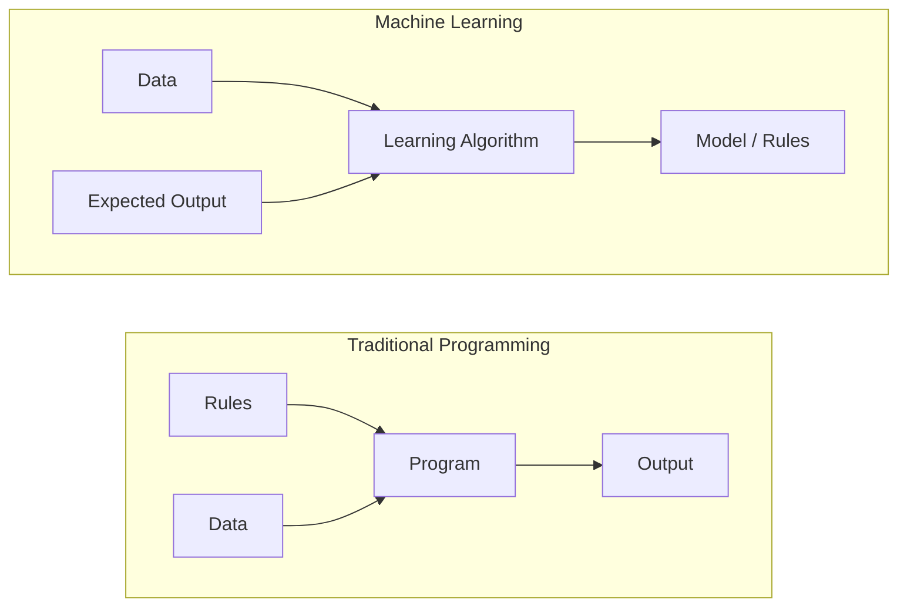
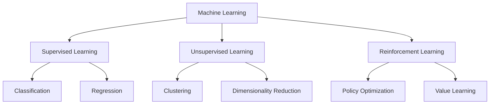
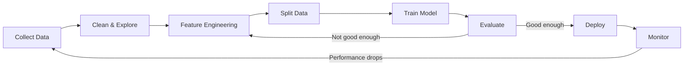
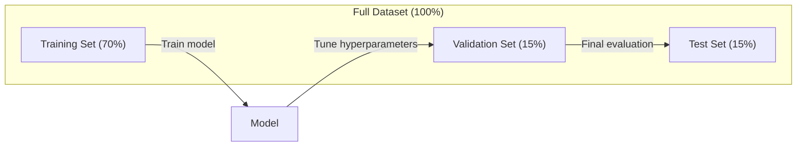
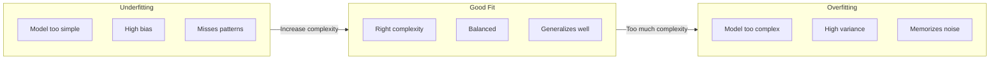
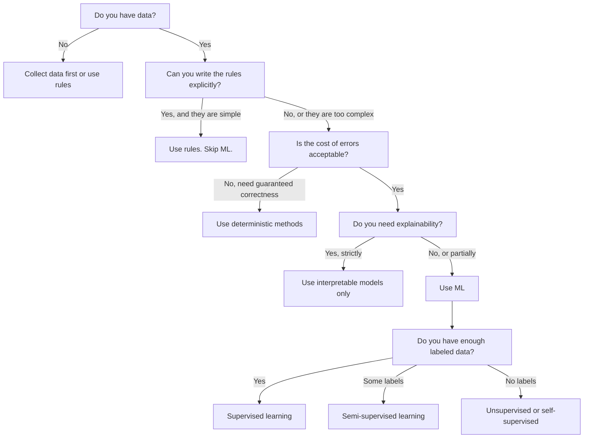

# मशीन लर्निंग क्या है

> मशीन लर्निंग कंप्यूटर को डेटा में पैटर्न खोजने के लिए सिखा रहा है, हाथ से नियम लिखने के बजाय।

**Type:** Learn
**Languages:** Python
**Prerequisites:** Phase 1 (Math Foundations)
**Time:** ~45 minutes

## सीखने के लक्ष्य

- पर्यवेक्षित, अनियंत्रित और सुदृढीकरण सीखने के बीच अंतर समझाएं और पहचानें कि किसी दिए गए समस्या के लिए किस प्रकार लागू होता है
- शून्य से निकटतम सेंट्रोइड वर्गीकरण को लागू करें और इसे यादृच्छिक आधार रेखा के साथ मूल्यांकन करें
- वर्गीकरण और प्रतिगमन कार्यों के बीच अंतर करें और प्रत्येक के लिए उपयुक्त हानि फ़ंक्शन का चयन करें
- यह आकलन करें कि क्या एक दी गई व्यावसायिक समस्या एमएल के लिए उपयुक्त है या निर्धारक नियमों से बेहतर हल किया गया है

## समस्या

आप एक स्पैम फ़िल्टर बनाना चाहते हैं. पारंपरिक दृष्टिकोणः बैठो और सैकड़ों नियम लिखो. "यदि ईमेल में 'फ्री मनी' है, तो इसे स्पैम चिह्नित करें. यदि इसमें 3 से अधिक चिह्न हैं, तो इसे स्पैम चिह्नित करें। " आप नियम लिखते हुए हफ्तों बिताते हैं। फिर स्पैमर्स अपना वाक्यांश बदलते हैं। आपके नियम टूट जाते हैं। आप अधिक नियम लिखते हैं। चक्र कभी समाप्त नहीं होता है।

मशीन लर्निंग इसको उलट देता है। नियमों को लिखने के बजाय, आप कंप्यूटर को हजारों लेबल वाले ईमेल ("स्पैम" या "स्पैम नहीं") देते हैं और उसे अपने दम पर नियमों का पता लगाने देते हैं। कंप्यूटर आपको कभी नहीं सोचा होगा कि पैटर्न ढूंढता है। जब स्पैमर रणनीति बदलते हैं, तो आप कोड को फिर से लिखने के बजाय नए डेटा पर फिर से प्रशिक्षित करते हैं।

"प्रोग्रामिंग नियम" से "डेटा से सीखना" में यह बदलाव मशीन लर्निंग का मूल है। प्रत्येक सिफारिश इंजन, आवाज सहायक, स्व-चालक कार और भाषा मॉडल इस तरह काम करता है।

## अवधारणा

### नियमों से नहीं, आंकड़ों से सीखें

पारंपरिक प्रोग्रामिंग और मशीन लर्निंग समस्याओं को विपरीत दिशा में हल करते हैं।



पारंपरिक प्रोग्रामिंगः आप नियम लिखते हैं। प्रोग्राम उन्हें आउटपुट उत्पन्न करने के लिए डेटा पर लागू करता है।

मशीन लर्निंगः आप डेटा और अपेक्षित आउटपुट प्रदान करते हैं। एल्गोरिथम नियमों की खोज करता है।

प्रशिक्षण से निकलने वाला "मॉडल" नियम है, जो संख्याओं (वजन, मापदंडों) के रूप में एन्कोड किया जाता है। यह उन उदाहरणों से सामान्यीकरण करता है जिन्हें उसने देखा है ताकि वह कभी नहीं देखे गए डेटा पर भविष्यवाणियां कर सके।

### मशीन लर्निंग के तीन प्रकार



**Supervised Learning**: आप इनपुट-आउटपुट जोड़े हैं. मॉडल इनपुट को आउटपुट में मैप करना सीखता है.
- "ये दस हजार तस्वीरें हैं, जिनमें बिल्ली या कुत्ता के नाम हैं। उन्हें अलग करना सीखिए।"
- "ये घर की विशेषताएं और कीमतें हैं। कीमत का अनुमान लगाना सीखिए।"

**Unsupervised Learning**आप केवल इनपुट है. कोई लेबल नहीं. मॉडल अपने आप संरचना पाता है.
- "यहां 10,000 ग्राहक खरीद इतिहास है. प्राकृतिक समूहों को खोजें।"
- "यहाँ 1,000 आयामी डेटा बिंदु हैं. संरचना बनाए रखते हुए 2 आयामों तक कम करें। "

**Reinforcement Learning**: एक एजेंट एक वातावरण में कार्य करता है और पुरस्कार या दंड प्राप्त करता है। वह कुल पुरस्कार को अधिकतम करने के लिए एक रणनीति (नीति) सीखता है।
- "इस खेल को खेलो। जीत के लिए +1 और हार के लिए -1। एक रणनीति का पता लगाओ। "
- "इस रोबोट हाथ को नियंत्रित करें। वस्तु को लेने के लिए +1। हर बर्बाद सेकंड के लिए -0.01। "

आप अभ्यास में जो कुछ भी बनाएंगे, उसमें से अधिकांश में पर्यवेक्षित सीखने का उपयोग किया जाता है। पूर्व-प्रसंस्करण और अन्वेषण के लिए अनियंत्रित सीखने आम है। भाषा मॉडल के लिए खेल एआई, रोबोटिक्स और आरएलएचएफ को मजबूत करने वाले सीखने की शक्ति।

### तीनों के परे

उपरोक्त तीन श्रेणियां साफ हैं, लेकिन वास्तविक दुनिया में एमएल अक्सर रेखाओं को धुंधला करता है।

**Semi-supervised learning**लेबल वाले डेटा का एक छोटा सेट और लेबल रहित डेटा का एक बड़ा सेट है। आपके पास 100 लेबल वाले चिकित्सा चित्र और 100,000 लेबल रहित चित्र हो सकते हैं। तकनीक में शामिल हैंः

- **Label propagation:**एक ग्राफ बनाएं जो समान डेटा बिंदुओं को जोड़ता है। लेबल लेबल वाले नोड्स से लेबल रहित पड़ोसियों तक ग्राफ के माध्यम से फैलता है।
- **Pseudo-labeling:**लेबल किए गए डेटा पर एक मॉडल को प्रशिक्षित करें, इसका उपयोग लेबल किए बिना डेटा के लिए लेबल की भविष्यवाणी करने के लिए करें, फिर सब कुछ पर फिर से प्रशिक्षित करें। मॉडल अपने स्वयं के प्रशिक्षण सेट को बूटस्ट्रेप करता है।
- **Consistency regularization:**मॉडल को इनपुट के लिए एक ही भविष्यवाणी और उस इनपुट के थोड़ा परेशान संस्करण देना चाहिए। यह लेबल के बिना भी काम करता है।

**Self-supervised learning**डेटा की संरचना से अपना भविष्यवाणी कार्य बनाता है।

- **Masked language modeling (BERT):**एक वाक्य में 15% शब्दों को छिपाएं, मॉडल को याद रखने के लिए प्रशिक्षित करें। "लेबल" मूल पाठ से आते हैं।
- **Contrastive learning (SimCLR):**एक छवि लें, दो वर्धित संस्करण बनाएं। मॉडल को पहचानने के लिए प्रशिक्षित करें कि वे एक ही छवि से आए हैं जबकि उन्हें अन्य छवियों के वर्धित संस्करणों से अलग करें।
- **Next-token prediction (GPT):**अगले शब्द की भविष्यवाणी करें, पहले के सभी शब्दों को देखते हुए। प्रत्येक पाठ दस्तावेज़ एक प्रशिक्षण उदाहरण बन जाता है।

ये तीनों बड़ी श्रेणियों से अलग नहीं हैं। ये रणनीतियाँ हैं जो पर्यवेक्षित और अनियंत्रित विचारों को जोड़ती हैं। आत्म-नियंत्रित सीखने की तकनीकी रूप से पर्यवेक्षण किया जाता है (मॉडल कुछ भविष्यवाणी करता है), लेकिन लेबल स्वचालित रूप से उत्पन्न होते हैं, न कि मनुष्यों द्वारा।

### वर्गीकरण बनाम प्रतिगमन

ये दो मुख्य पर्यवेक्षित सीखने के कार्य हैं।

| Aspect | Classification | Regression |
|--------|---------------|------------|
| Output | Discrete categories | Continuous numbers |
| Example | "Is this email spam?" | "What will the house price be?" |
| Output space | {cat, dog, bird} | Any real number |
| Loss function | Cross-entropy, accuracy | Mean squared error, MAE |
| Decision | Boundaries between classes | A curve that fits the data |

वर्गीकरण का उत्तर है "कौन सी श्रेणी"?

कुछ समस्याओं को किसी भी तरह से ढांचा लगाया जा सकता है। यह अनुमान लगाना कि एक शेयर बढ़ता है या गिरता है वर्गीकरण है। सटीक मूल्य की भविष्यवाणी करना regression है।

### एमएल कार्यप्रवाह

मशीन लर्निंग के हर प्रोजेक्ट में एल्गोरिथ्म की परवाह किए बिना एक ही पाइपलाइन होती है।



**Collect Data**: कच्चे डेटा एकत्र करें। अधिक डेटा लगभग हमेशा बेहतर होता है, लेकिन गुणवत्ता मात्रा से अधिक मायने रखती है।

**Clean & Explore**: गायब मानों को संभालें, डुप्लिकेट हटाएं, वितरण को दृश्यमान करें, विसंगतियों को स्पॉट करें। इस चरण में अक्सर परियोजना के कुल समय का 60-80% समय लगता है।

**Feature Engineering**: कच्चे डेटा को सुविधाओं में बदल दें जो मॉडल उपयोग कर सकता है। दिनांक को सप्ताह के दिन में बदल दें। संख्यात्मक स्तंभों को सामान्य बनाएं। श्रेणीगत चर को एन्कोड करें। अच्छी सुविधाएं फैंसी एल्गोरिदम से अधिक मायने रखती हैं।

**Split Data**: प्रशिक्षण, सत्यापन और परीक्षण सेट में विभाजित करें। मॉडल प्रशिक्षण डेटा पर प्रशिक्षित करता है, आप सत्यापन डेटा पर हाइपरपैरामीटर समायोजित करते हैं, और आप परीक्षण डेटा पर अंतिम प्रदर्शन की रिपोर्ट करते हैं।

**Train Model**: एक एल्गोरिथ्म में प्रशिक्षण डेटा फ़ीड करें। एल्गोरिथ्म नुकसान समारोह को कम करने के लिए आंतरिक मापदंडों को समायोजित करता है।

**Evaluate**: सत्यापन/परीक्षण डेटा पर प्रदर्शन मापें। यदि प्रदर्शन स्वीकार्य नहीं है, तो वापस जाएं और विभिन्न सुविधाओं, एल्गोरिदम या हाइपरपरपैरामीटर का परीक्षण करें।

**Deploy**: मॉडल को उत्पादन में लाएं जहां यह नए डेटा पर भविष्यवाणियां करता है।

**Monitor**: समय के साथ प्रदर्शन का ट्रैक करें। डेटा वितरण बदलते हैं (डेटा ड्रिफ्ट), और मॉडल गिरावट। जब प्रदर्शन गिरता है, तो फिर से प्रशिक्षित करें।

### प्रशिक्षण, सत्यापन और परीक्षाएं

यह सबसे महत्वपूर्ण अवधारणा है जो शुरुआती गलत हो जाते हैं। आपको अपने मॉडल का मूल्यांकन प्रशिक्षण के दौरान कभी नहीं देखे गए डेटा पर करना होगा। अन्यथा आप सीखने के बजाय याद रखने का माप कर रहे हैं।



| Split | Purpose | When used | Typical size |
|-------|---------|-----------|-------------|
| Training | Model learns from this data | During training | 60-80% |
| Validation | Tune hyperparameters, compare models | After each training run | 10-20% |
| Test | Final unbiased performance estimate | Once, at the very end | 10-20% |

परीक्षण सेट पवित्र है. आप इसे एक बार ही देखते हैं। यदि आप परीक्षण प्रदर्शन के आधार पर अपने मॉडल को समायोजित करते रहते हैं, तो आप परीक्षण सेट पर प्रभावी ढंग से प्रशिक्षण कर रहे हैं और आपके रिपोर्ट किए गए संख्याएं अर्थहीन हैं।

छोटे डेटासेट के लिए, k-fold क्रॉस-वैलिडेशन का उपयोग करेंः डेटा को k भागों में विभाजित करें, k-1 भागों पर प्रशिक्षित करें, शेष भाग पर वैलिडेट करें, घूमें, और औसत परिणाम।

### अति-अनुकूलन बनाम अति-अनुकूलन



**Underfitting**: मॉडल डेटा में पैटर्न को कैप्चर करने के लिए बहुत सरल है। एक सीधी रेखा एक घुमावदार संबंध फिट करने की कोशिश कर रही है। प्रशिक्षण त्रुटि उच्च है। परीक्षण त्रुटि उच्च है।

**Overfitting**: मॉडल बहुत जटिल है और प्रशिक्षण डेटा को याद करता है, जिसमें इसकी शोर भी शामिल है। एक घुमावदार वक्र जो प्रत्येक प्रशिक्षण बिंदु से गुजरता है लेकिन नए डेटा पर विफल रहता है। प्रशिक्षण त्रुटि कम है। परीक्षण त्रुटि उच्च है।

**Good fit**: मॉडल शोर को याद किए बिना वास्तविक पैटर्न को कैप्चर करता है। प्रशिक्षण त्रुटि और परीक्षण त्रुटि दोनों काफी कम हैं।

अति-फिटिंग के संकेतः
- प्रशिक्षण सटीकता सत्यापन सटीकता से बहुत अधिक है
- प्रशिक्षण डेटा पर मॉडल अच्छा प्रदर्शन करता है लेकिन नए डेटा पर खराब
- अधिक प्रशिक्षण डेटा जोड़ने से प्रदर्शन में सुधार होता है (मॉडल याद करने वाला था, सीखने वाला नहीं)

ओवरफिटिंग के लिए फिक्सः
- अधिक प्रशिक्षण डेटा प्राप्त करें
- मॉडल जटिलता को कम करना (कम पैरामीटर, सरल वास्तुकला)
- नियमन (बड़े वजन के लिए दंड जोड़ें)
- ड्रॉपअप (प्रशिक्षण के दौरान यादृच्छिक रूप से न्यूरॉन्स को शून्य)
- प्रारंभिक रोक (जब सत्यापन त्रुटि बढ़ना शुरू हो जाती है तो प्रशिक्षण रोकना)

अनावश्यक फिटिंग के लिए फिक्सः
- अधिक जटिल मॉडल का उपयोग करें
- अतिरिक्त सुविधाएँ जोड़ें
- नियमितता को कम करें
- ट्रेन अधिक समय तक

### भेदभाव के बीच व्यापार

यह अति-फिटिंग और अंडरफिटिंग के पीछे का गणितीय ढांचा है।

**Bias**: मॉडल में गलत धारणाओं से त्रुटि। एक रैखिक मॉडल में उच्च पूर्वाग्रह होता है जब वास्तविक संबंध गैर रैखिक होता है। उच्च पूर्वाग्रह अनुचितता का कारण बनता है।

**Variance**: प्रशिक्षण डेटा में संवेदनशीलता से लेकर छोटे उतार-चढ़ाव तक की त्रुटि। उच्च भिन्नता वाले मॉडल विभिन्न डेटा उपसमूहों पर प्रशिक्षित होने पर बहुत अलग भविष्यवाणियां देते हैं। उच्च भिन्नता से ओवरफिटिंग होती है।

| Model complexity | Bias | Variance | Result |
|-----------------|------|----------|--------|
| Too low (linear model for curved data) | High | Low | Underfitting |
| Just right | Medium | Medium | Good generalization |
| Too high (degree-20 polynomial for 10 points) | Low | High | Overfitting |

कुल त्रुटि = पूर्वाग्रह^2 + भिन्नता + अपरिवर्तनीय शोर

आप अपरिवर्तनीय शोर को कम नहीं कर सकते (यह स्वयं डेटा में यादृच्छिकता है) आप उस मीठा बिंदु को ढूंढना चाहते हैं जहां पूर्वाग्रह^2 + भिन्नता को न्यूनतम किया जाता है।

### कोई मुफ्त दोपहर का भोजन सिद्धांत नहीं

कोई भी एल्गोरिथ्म नहीं है जो हर समस्या के लिए सबसे अच्छा काम करता है। एक एल्गोरिथ्म जो किसी एक वर्ग की समस्याओं पर अच्छा प्रदर्शन करता है, वह दूसरे पर खराब प्रदर्शन करेगा। यही कारण है कि डेटा वैज्ञानिक कई एल्गोरिदम का परीक्षण करते हैं और परिणामों की तुलना करते हैं।

व्यवहार में, विकल्प इस पर निर्भर करता हैः
- आपके पास कितने डेटा हैं
- कितने विशेषताएं हैं
- संबंध रैखिक या गैर रैखिक है या नहीं
- क्या आपको व्याख्या की आवश्यकता है
- आप कितना कम्प्यूटिंग कर सकते हैं

### मशीन लर्निंग का उपयोग कब नहीं करना चाहिए

एमएल शक्तिशाली है लेकिन हमेशा सही उपकरण नहीं होता है। मॉडल की तलाश करने से पहले पूछें कि क्या आपको वास्तव में इसकी आवश्यकता है।

**Do not use ML when:**

- **Rules are simple and well-defined.**कर गणना, क्रमबद्ध एल्गोरिदम, इकाई रूपांतरण. यदि आप तर्क को कुछ if-statements में लिख सकते हैं, तो एक मॉडल किसी लाभ के लिए जटिलता जोड़ता है।
- **You have no data or very little data.**एमएल को सीखने के लिए उदाहरण चाहिए। 10 डेटा पॉइंट्स के साथ, आप कुछ भी सार्थक नहीं प्रशिक्षित कर सकते। पहले डेटा एकत्र करें।
- **The cost of being wrong is catastrophic and you need guaranteed correctness.**मेडिकल डोजिंग कैलकुलेशन, न्यूक्लियर रिएक्टर कंट्रोल, क्रिप्टोग्राफिक वेरिफिकेशन. एमएल मॉडल संभावनावादी हैं. वे कभी-कभी गलत होंगे। यदि "कभी-कभी गलत" अस्वीकार्य है, तो निर्धारात्मक तरीकों का उपयोग करें।
- **A lookup table or heuristic solves the problem.**यदि एक सरल सीमा या तालिका 99% मामलों को कवर करती है, तो एमएल जोड़ने से रखरखाव लागत में कोई सार्थक सुधार नहीं होता है।
- **You cannot explain the decision and explainability is required.**नियामक उद्योग (ऋण, बीमा, आपराधिक न्याय) कभी-कभी प्रत्येक निर्णय को पूरी तरह से समझा जा सकता है की आवश्यकता होती है। कुछ एमएल मॉडल व्याख्या योग्य हैं (रेखीय regression, छोटे निर्णय पेड़) । अधिकांश नहीं हैं।
- **The problem changes faster than you can retrain.**यदि नियम रोज बदलते हैं और फिर से प्रशिक्षण एक सप्ताह लेता है, तो मॉडल हमेशा पुराना होता है।

इस निर्णय प्रवाह सारणी का उपयोग करें:



```figure
f3-learning-boundary
```

## इसे बनाओ

कोड में `code/ml_intro.py`यह सबसे सरल संभव एमएल एल्गोरिथ्म, शून्य से निकटतम सेंट्रोइड वर्गीकरण को लागू करता है। यह मूल विचार को प्रदर्शित करता हैः डेटा से सीखें, फिर नए डेटा पर भविष्यवाणी करें।

### चरण 1: स्क्रैच से निकटतम सेंट्रॉइड वर्गीकरणकर्ता

निकटतम केंद्रस्थ वर्गीकरणकर्ता प्रशिक्षण डेटा में प्रत्येक वर्ग के केंद्र (औसत) की गणना करता है। भविष्यवाणी करने के लिए, यह प्रत्येक नए बिंदु को उस वर्ग को सौंपता है जिसका केंद्र सबसे करीब है।

```python
class NearestCentroid:
    def fit(self, X, y):
        self.classes = np.unique(y)
        self.centroids = np.array([
            X[y == c].mean(axis=0) for c in self.classes
        ])

    def predict(self, X):
        distances = np.array([
            np.sqrt(((X - c) ** 2).sum(axis=1))
            for c in self.centroids
        ])
        return self.classes[distances.argmin(axis=0)]
```

यह पूरी एल्गोरिथ्म है। फिट दो साधनों की गणना करता है। भविष्यवाणी दूरी की गणना करती है। कोई ग्रेडिएंट गिरावट, कोई पुनरावृत्ति, कोई हाइपरपरपैरामीटर नहीं।

### चरण 2: संश्लेषण संबंधी डेटा को प्रशिक्षित करें

हम दो वर्गों के साथ एक 2D वर्गीकरण डेटासेट उत्पन्न करते हैं जो थोड़ा ओवरलैप करते हैं। सेंट्रॉइड वर्गीकरण वर्ग केंद्रों के बीच एक रैखिक निर्णय सीमा खींचता है।

```python
rng = np.random.RandomState(42)
X_class0 = rng.randn(100, 2) + np.array([1.0, 1.0])
X_class1 = rng.randn(100, 2) + np.array([-1.0, -1.0])
X = np.vstack([X_class0, X_class1])
y = np.array([0] * 100 + [1] * 100)
```

### चरण 3: मूल रेखा से तुलना करें

प्रत्येक एमएल मॉडल की तुलना एक तुच्छ आधार रेखा के साथ की जानी चाहिए। यहां, आधार रेखा एक यादृच्छिक वर्ग की भविष्यवाणी करती है। यदि आपका एमएल मॉडल यादृच्छिक अनुमानों को नहीं हराता है, तो कुछ गलत है।

```python
baseline_preds = rng.choice([0, 1], size=len(y_test))
baseline_acc = np.mean(baseline_preds == y_test)
```

इस स्वच्छ डेटासेट पर सेंट्रोइड वर्गीकरणकर्ता को लगभग 90%+ सटीकता प्राप्त करनी चाहिए। यादृच्छिक आधार रेखा लगभग 50% है।

### यह क्यों मायने रखता है

निकटतम सेंट्रॉइड वर्गीकरण सरल है। इसमें कोई हाइपरपैरामीटर, कोई पुनरावृत्ति, कोई ग्रेडिएंट गिरावट नहीं है। फिर भी यह मौलिक एमएल पैटर्न को कैप्चर करता हैः

1. **Learn**प्रशिक्षण डेटा से एक प्रतिनिधित्व (सेंट्रोइड)
2. **Predict**उस प्रतिनिधित्व का उपयोग करके नए डेटा पर (नज़दीकी दूरी)
3. **Evaluate**मूल रेखा के मुकाबले (क्योंकि आकस्मिक अनुमान)

लॉजिस्टिक रेग्रिशन से लेकर ट्रांसफार्मर तक हर एमएल एल्गोरिदम इसी तीन चरणों के पैटर्न का पालन करता है। प्रतिनिधित्व अधिक जटिल हो जाता है, लेकिन वर्कफ़्लो समान रहता है।

### चरण 4: सेंट्रोइड वर्गीकरणकर्ता क्या नहीं कर सकता

निकटतम सेंट्रॉइड वर्गीकरण प्रत्येक वर्ग को एक एकल ब्लाब बनाता है। यह रैखिक निर्णय सीमाएं बनाता है। यह विफल रहता है जबः

- कक्षाओं में कई क्लस्टर होते हैं (जैसे, अंक "1" को कई अलग-अलग तरीकों से लिखा जा सकता है)
- निर्णय सीमा गैर रैखिक है (जैसे, एक वर्ग दूसरे के चारों ओर लपेटता है)
- विशेषताओं के बहुत अलग पैमाने होते हैं (अंतर सबसे बड़े पैमाने पर विशेषता द्वारा हावी होता है)

इन सीमाओं से आप सीखेंगे कि हर अन्य एल्गोरिथ्म को प्रेरित करता है। K-अन्यतम पड़ोसी कई क्लस्टरों को संभालते हैं। निर्णय के पेड़ गैर-रैखिक सीमाओं को संभालते हैं। फीचर स्केलिंग पैमाने की समस्या को ठीक करता है। प्रत्येक पाठ पिछले एक की सीमाओं पर आधारित है।

## इसका प्रयोग करें

sklearn प्रदान करता है `NearestCentroid`और सिंथेटिक डेटा जनरेटरः

```python
from sklearn.neighbors import NearestCentroid
from sklearn.datasets import make_classification
from sklearn.model_selection import train_test_split

X, y = make_classification(
    n_samples=500, n_features=2, n_redundant=0,
    n_clusters_per_class=1, random_state=42
)
X_train, X_test, y_train, y_test = train_test_split(X, y, test_size=0.3)

clf = NearestCentroid()
clf.fit(X_train, y_train)
print(f"Accuracy: {clf.score(X_test, y_test):.3f}")
```

## इसे भेजें

यह सबक हमें फल देता है`outputs/prompt-ml-problem-framer.md`-- एक संकेत जो अस्पष्ट व्यावसायिक समस्याओं को ठोस एमएल कार्यों में बदल देता है। समस्या का वर्णन ("हम चर्न को कम करना चाहते हैं" या "अगली तिमाही के लिए मांग की भविष्यवाणी करें") दें और यह सीखने के प्रकार की पहचान करता है, भविष्यवाणी लक्ष्य को परिभाषित करता है, उम्मीदवार विशेषताओं की सूची देता है, एक सफलता मीट्रिक चुनता है, एक आधार रेखा स्थापित करता है, और डेटा लीक या वर्ग असंतुलन जैसे जाल को चिह्नित करता है। इसे किसी भी एमएल परियोजना की शुरुआत में इस्तेमाल करें गलत चीज बनाने से बचने के लिए।

## प्रमुख शर्तें

| Term | What people say | What it actually means |
|------|----------------|----------------------|
| Model | "The AI" | A mathematical function with learnable parameters that maps inputs to outputs |
| Training | "Teaching the AI" | Running an optimization algorithm to adjust model parameters so predictions match known outputs |
| Feature | "An input column" | A measurable property of the data that the model uses to make predictions |
| Label | "The answer" | The known output for a training example, used to compute the error signal |
| Hyperparameter | "A setting you tweak" | A parameter set before training that controls the learning process (learning rate, number of layers) |
| Loss function | "How wrong the model is" | A function that measures the gap between predicted and actual outputs, which training tries to minimize |
| Overfitting | "It memorized the test" | The model learned training-specific noise instead of general patterns, so it fails on new data |
| Underfitting | "It didn't learn anything" | The model is too simple to capture the real patterns in the data |
| Generalization | "It works on new data" | The model's ability to make accurate predictions on data it was not trained on |
| Cross-validation | "Testing on different chunks" | Repeatedly splitting data into train/test folds and averaging results, giving a more robust performance estimate |
| Regularization | "Keeping weights small" | Adding a penalty term to the loss function that discourages overly complex models |
| Data drift | "The world changed" | The statistical distribution of incoming data shifts over time, degrading model performance |

## व्यायाम

1. किसी भी डेटासेट (जैसे, आईरिस, टाइटैनिक) को लें। इसे 70/15/15 को ट्रेन/मान्यीकरण/परीक्षण में विभाजित करें। यह समझाएं कि आपको परीक्षण सेट पर हाइपरपरपैरामीटर क्यों नहीं समायोजित करना चाहिए।
2. वास्तविक दुनिया की तीन समस्याओं का नाम लिखिए। प्रत्येक के लिए, पहचानें कि क्या यह वर्गीकरण, प्रतिगमन या समूहबद्धता है, और क्या यह पर्यवेक्षित है या अनियंत्रित।
3. एक मॉडल को 99% सटीकता प्रशिक्षण डेटा पर प्राप्त होती है लेकिन 60% परीक्षण डेटा पर। समस्या का निदान करें और तीन चीजों की सूची बनाएं जिन्हें आप इसे ठीक करने की कोशिश करेंगे।

## आगे पढ़ना

- [An Introduction to Statistical Learning](https://www.statlearning.com/)- व्यावहारिक उदाहरणों के साथ सभी क्लासिकल एमएल विधियों को कवर करने वाली निःशुल्क पाठ्यपुस्तक
- [Google's Machine Learning Crash Course](https://developers.google.com/machine-learning/crash-course)- एमएल अवधारणाओं का संक्षिप्त दृश्य परिचय
- [Scikit-learn User Guide](https://scikit-learn.org/stable/user_guide.html)- पायथन में एमएल को लागू करने के लिए व्यावहारिक संदर्भ
