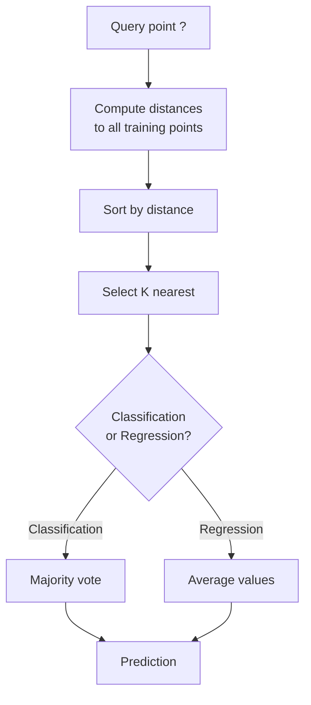
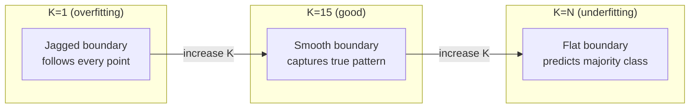
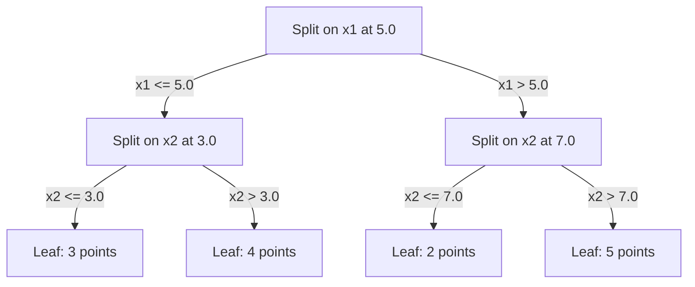

# K- निकटतम पड़ोसी और दूरी

> सब कुछ स्टोर करें, अपने पड़ोसियों को देखकर भविष्यवाणी करें, सबसे सरल एल्गोरिथ्म जो वास्तव में काम करता है।

**Type:** Build
**Language:**पायथन
**Prerequisites:** Phase 1 (Lesson 14 Norms and Distances)
**Time:** ~90 minutes

## सीखने के लक्ष्य

- कॉन्फ़िगरेबल K और दूरी-वजनित मतदान के साथ KNN वर्गीकरण और शून्य से प्रतिगमन को लागू करना
- L1, L2, cosine और Minkowski दूरी मीट्रिक की तुलना करें और किसी दिए गए डेटा प्रकार के लिए उपयुक्त एक चुनें
- आयामता के शाप को समझाएं और दिखाएं कि उच्च आयामी स्थानों में KNN क्यों गिराता है
- निकटतम पड़ोसी की खोज और विश्लेषण के लिए कुशल केडी-वृक्ष का निर्माण जब यह क्रूर बल से अधिक प्रदर्शन करता है

## समस्या

आपके पास एक डेटा सेट है. एक नया डेटा बिंदु आता है. आपको इसे वर्गीकृत करने या इसके मूल्य की भविष्यवाणी करने की आवश्यकता है। डेटा से मापदंडों को सीखने के बजाय (जैसे रैखिक प्रतिगमन या एसवीएम), आप बस नए बिंदु के सबसे करीब के प्रशिक्षण बिंदुओं को ढूंढते हैं और उन्हें वोट करने देते हैं।

यह K- निकटतम पड़ोसी है. कोई प्रशिक्षण चरण नहीं है. कोई मापदंड सीखने के लिए नहीं है. कोई नुकसान समारोह को कम करने के लिए. आप भविष्यवाणी समय पर पूरे प्रशिक्षण सेट को स्टोर और दूरी की गणना करते हैं.

यह काम करने के लिए बहुत सरल लगता है। लेकिन KNN कई समस्याओं के लिए आश्चर्यजनक रूप से प्रतिस्पर्धी है, खासकर छोटे से मध्यम डेटा सेट के साथ, और इसे समझने से गहराई से बुनियादी अवधारणाएं प्रकट होती हैंः दूरी मीट्रिक का चयन (चरण 1 पाठ 14 से जुड़ने), आयामता का अभिशाप, और आलसी और उत्सुक सीखने के बीच अंतर।

KNN आधुनिक AI में भी हर जगह दिखाई देता है, बस अलग-अलग नामों के तहत। वेक्टर डेटाबेस KNN एम्बेडमेंट पर खोज करते हैं। पुनर्प्राप्ती-वृद्धि पीढ़ी (RAG) K के निकटतम दस्तावेज़ टुकड़े पाता है। सिफारिश प्रणाली समान उपयोगकर्ताओं या आइटम पाती है। एल्गोरिथ्म एक ही है। पैमाने और डेटा संरचनाएं अलग हैं।

## अवधारणा

### KNN कैसे काम करता है

लेबल किए गए बिंदुओं के डेटासेट और एक नया क्वेरी बिंदु को देखते हुएः

1. डेटासेट में प्रत्येक बिंदु के लिए क्वेरी से दूरी की गणना करें
2. दूरी के अनुसार क्रमबद्ध
3. K के निकटतम बिंदुओं को लें
4. वर्गीकरण के लिएः K पड़ोसियों के बीच बहुमत मतदान
5. प्रतिगमन के लिएः K पड़ोसियों के मूल्यों का औसत (या वजन औसत)



यह पूरी एल्गोरिथ्म है कोई फिट नहीं, कोई ग्रेडिएंट गिरावट नहीं, कोई युग नहीं।

### K चुनना

K एकल हाइपरमैटर है। यह पूर्वाग्रह-वियरिएंस ट्रेडऑफ को नियंत्रित करता हैः

| K | Behavior |
|---|----------|
| K = 1 | Decision boundary follows every point. Zero training error. High variance. Overfits |
| Small K (3-5) | Sensitive to local structure. Can capture complex boundaries |
| Large K | Smoother boundaries. More robust to noise. May underfit |
| K = N | Predicts the majority class for every point. Maximum bias |

एक सामान्य प्रारंभिक बिंदु N बिंदुओं के डेटासेट के लिए K = sqrt(N है। बाइनरी वर्गीकरण के लिए बाइनरी वर्गीकरण के लिए क्यारी का उपयोग करें।



### दूरी की माप

दूरी फ़ंक्शन परिभाषित करता है कि "नज़दीक" का क्या अर्थ है। विभिन्न मीट्रिक अलग-अलग पड़ोसी, अलग-अलग भविष्यवाणियां उत्पन्न करते हैं।

**L2 (Euclidean)**यह डिफ़ॉल्ट है। सीधी रेखा की दूरी।

```
d(a, b) = sqrt(sum((a_i - b_i)^2))
```

फीचर स्केल के प्रति संवेदनशील। KNN के साथ L2 का उपयोग करने से पहले हमेशा फीचर्स को मानकीकृत करें।

**L1 (Manhattan)**यह L2 की तुलना में अप्रासंगिकता के लिए अधिक मजबूत है क्योंकि यह अंतरों को वर्ग नहीं करता है।

```
d(a, b) = sum(|a_i - b_i|)
```

**Cosine distance**पाठ और डेटा एम्बेडिंग के लिए आवश्यक।

```
d(a, b) = 1 - (a . b) / (||a|| * ||b||)
```

**Minkowski**पैरामीटर p के साथ L1 और L2 को सामान्य करता है।

```
d(a, b) = (sum(|a_i - b_i|^p))^(1/p)

p=1: Manhattan
p=2: Euclidean
p->inf: Chebyshev (max absolute difference)
```

कौन सा मीट्रिक उपयोग करना है, डेटा पर निर्भर करता हैः

| Data type | Best metric | Why |
|-----------|------------|-----|
| Numeric features, similar scale | L2 (Euclidean) | Default, works for spatial data |
| Numeric features, outliers | L1 (Manhattan) | Robust, does not amplify large differences |
| Text embeddings | Cosine | Magnitude is noise, direction is meaning |
| High-dimensional sparse | Cosine or L1 | L2 suffers from curse of dimensionality |
| Mixed types | Custom distance | Combine metrics per feature type |

### भारित KNN

मानक KNN सभी K पड़ोसियों को समान वजन देता है, लेकिन 0.1 की दूरी पर एक पड़ोसी को 5.0 की दूरी पर एक से अधिक महत्व होना चाहिए।

**Distance-weighted KNN**प्रत्येक पड़ोसी को दूरी से विपरीत रूप से वजन करता हैः

```
weight_i = 1 / (distance_i + epsilon)

For classification: weighted vote
For regression:     weighted average = sum(w_i * y_i) / sum(w_i)
```

ईप्सिलन शून्य से विभाजन को रोकता है जब एक क्वेरी बिंदु प्रशिक्षण बिंदु से बिल्कुल मेल खाता है।

वजनदार KNN K के विकल्प के प्रति कम संवेदनशील है क्योंकि दूर के पड़ोसियों का योगदान बहुत कम होता है।

### आयामता का शाप

KNN प्रदर्शन उच्च आयामों में गिरावट। यह एक अस्पष्ट चिंता नहीं है। यह एक गणितीय तथ्य है।

**Problem 1: distances converge.**आयामता बढ़ने के साथ अधिकतम दूरी का अनुपात न्यूनतम दूरी के करीब आता है। सभी बिंदु क्वेरी से समान रूप से "दूरी" हो जाते हैं।

```
In d dimensions, for random uniform points:

d=2:    max_dist / min_dist = varies widely
d=100:  max_dist / min_dist ~ 1.01
d=1000: max_dist / min_dist ~ 1.001

When all distances are nearly equal, "nearest" is meaningless.
```

**Problem 2: volume explodes.**डेटा के एक निश्चित अंश के भीतर के पड़ोसियों को कैप्चर करने के लिए, आपको सुविधाओं के क्षेत्र के एक बहुत बड़े हिस्से को कवर करने के लिए अपनी खोज त्रिज्या का विस्तार करना होगा। उच्च आयामों में "गोरे" में अधिकांश स्थान शामिल हैं।

**Problem 3: corners dominate.**d आयामों में एक इकाई हाइपर क्यूब में, अधिकांश मात्रा को केंद्र के बजाय कोनों के पास केंद्रित किया जाता है। क्यूब में दर्ज एक गोला में मात्रा का एक गायब अंश होता है जैसे-जैसे d बढ़ता है।

व्यावहारिक परिणामः KNN लगभग 20-50 सुविधाओं तक अच्छी तरह से काम करता है। इसके अलावा, आपको KNN लागू करने से पहले आयामता में कमी (PCA, UMAP, t-SNE) की आवश्यकता है, या आपको पेड़-आधारित खोज संरचनाओं का उपयोग करने की आवश्यकता है जो डेटा की अंतर्निहित निचली आयामता का लाभ उठाते हैं।

### KD-वृक्ष: निकटतम पड़ोसी की त्वरित खोज

क्रूर-फोर्स KNN क्वेरी से प्रत्येक प्रशिक्षण बिंदु तक की दूरी की गणना करता है। यह प्रति क्वेरी O(n * d) है। बड़े डेटा सेट के लिए, यह बहुत धीमा है।

एक KD-tree रिकर्सिव रूप से स्पेस को फीचर अक्षों के साथ विभाजित करता है। प्रत्येक स्तर पर, यह मध्य मान पर एक आयाम के साथ विभाजित होता है।



निकटतम पड़ोसी को खोजने के लिए, पेड़ से उस पत्ती तक पार करें जिसमें प्रश्न है, फिर पीछे की ओर और पड़ोसी विभाजन की जांच करें केवल यदि वे निकटतम बिंदुओं को शामिल कर सकते हैं।

औसत क्वेरी समयः कम आयामों के लिए O(log n) । लेकिन KD-tree उच्च आयामों (d > 20) में O(n) तक गिरावट आती है क्योंकि बैकट्रैकिंग कम और कम शाखाओं को समाप्त करता है।

### गेंद के पेड़ः मध्यम आयामों के लिए बेहतर

गेंद के पेड़ अक्ष-अनुसूचित बक्से के बजाय गुंजाइश हाइपरस्फेर में डेटा विभाजन करते हैं। प्रत्येक नोड एक गेंद (केंद्र + त्रिज्या) को परिभाषित करता है जिसमें उस उपवृक्ष में सभी बिंदु होते हैं।

KD-वृक्षों के मुकाबले लाभः
- मध्यम आयामों (~50 तक) में बेहतर काम करें
- गैर-अक्ष-अनुसूचित संरचना के लिए हैंडल
- अधिक घनी सीमाओं का मतलब है कि खोज के दौरान अधिक शाखाओं को काट दिया जाता है

KD-tree और ball-tree दोनों ही सटीक एल्गोरिदम हैं। वास्तव में बड़े पैमाने पर खोज (मिलियंस अंक, सैकड़ों आयाम) के लिए, निकटतम पड़ोसी तरीकों (HNSW, IVF, उत्पाद क्वांटिज़ेशन) का उपयोग किया जाता है। ये चरण 1 पाठ 14 में शामिल हैं।

### आलसी सीखने बनाम उत्सुक सीखने

KNN एक आलसी छात्र हैः यह प्रशिक्षण के समय काम नहीं करता है और सभी भविष्यवाणी के समय काम करते हैं। अधिकांश अन्य एल्गोरिदम (रेखीय प्रतिगमन, एसवीएम, तंत्रिका नेटवर्क) उत्सुक शिक्षार्थी हैंः वे एक कॉम्पैक्ट मॉडल बनाने के लिए प्रशिक्षण के समय भारी गणना करते हैं, फिर भविष्यवाणी तेज होती है।

| Aspect | Lazy (KNN) | Eager (SVM, neural net) |
|--------|------------|------------------------|
| Training time | O(1) just store data | O(n * epochs) |
| Prediction time | O(n * d) per query | O(d) or O(parameters) |
| Memory at prediction | Store entire training set | Store model parameters only |
| Adapts to new data | Add points instantly | Retrain the model |
| Decision boundary | Implicit, computed on the fly | Explicit, fixed after training |

आलसी सीखना आदर्श है जबः
- डेटा सेट में अक्सर बदलाव होता है (बिंदुओं को बिना पुनर्व्यवस्था के जोड़ें/हटाएँ)
- आपको बहुत कम सवालों के लिए भविष्यवाणियों की आवश्यकता है
- आप शून्य प्रशिक्षण समय चाहते हैं
- डेटा सेट पर्याप्त छोटे है कि क्रूर बल खोज तेजी से है

### प्रतिगमन के लिए KNN

बहुमत के मतदान के बजाय, प्रतिगमन के लिए KNN K पड़ोसियों के लक्ष्य मानों का औसत बनाता है।

```
prediction = (1/K) * sum(y_i for i in K nearest neighbors)

Or with distance weighting:
prediction = sum(w_i * y_i) / sum(w_i)
where w_i = 1 / distance_i
```

KNN रेग्रेसशन टुकड़ा-साधक (या टुकड़ा-साधक वजन के साथ) भविष्यवाणियां उत्पन्न करता है। यह प्रशिक्षण डेटा की सीमा से परे एक्सट्रापोलेट नहीं कर सकता है। यदि प्रशिक्षण लक्ष्य सभी 0 से 100 के बीच हैं, तो KNN 200 की भविष्यवाणी कभी नहीं करेगा।

```figure
knn-smoothness
```

## इसे बनाओ

### चरण 1: दूरी फ़ंक्शन

L1, L2, cosine और Minkowski दूरी लागू करें. ये सीधे चरण 1 पाठ 14 से जुड़ते हैं।

```python
import math

def l2_distance(a, b):
    return math.sqrt(sum((ai - bi) ** 2 for ai, bi in zip(a, b)))

def l1_distance(a, b):
    return sum(abs(ai - bi) for ai, bi in zip(a, b))

def cosine_distance(a, b):
    dot_val = sum(ai * bi for ai, bi in zip(a, b))
    norm_a = math.sqrt(sum(ai ** 2 for ai in a))
    norm_b = math.sqrt(sum(bi ** 2 for bi in b))
    if norm_a == 0 or norm_b == 0:
        return 1.0
    return 1.0 - dot_val / (norm_a * norm_b)

def minkowski_distance(a, b, p=2):
    if p == float('inf'):
        return max(abs(ai - bi) for ai, bi in zip(a, b))
    return sum(abs(ai - bi) ** p for ai, bi in zip(a, b)) ** (1 / p)
```

### चरण 2: KNN वर्गीकरण और रेग्रेसर

कॉन्फ़िगरेबल K, दूरी मीट्रिक और वैकल्पिक दूरी वजन के साथ पूर्ण KNN का निर्माण करें।

```python
class KNN:
    def __init__(self, k=5, distance_fn=l2_distance, weighted=False,
                 task="classification"):
        self.k = k
        self.distance_fn = distance_fn
        self.weighted = weighted
        self.task = task
        self.X_train = None
        self.y_train = None

    def fit(self, X, y):
        self.X_train = X
        self.y_train = y

    def predict(self, X):
        return [self._predict_one(x) for x in X]
```

### चरण 3: कुशल खोज के लिए KD-tree

एक KD-tree को खरोंच से बनाएं जो प्रत्येक आयाम के मध्यवर्ती पर पुनरावर्ती रूप से विभाजित हो।

```python
class KDTree:
    def __init__(self, X, indices=None, depth=0):
        # Recursively partition the data
        self.axis = depth % len(X[0])
        # Split on median of the current axis
        ...

    def query(self, point, k=1):
        # Traverse to leaf, then backtrack
        ...
```

देखो`code/knn.py`सभी सहायक विधियों और डेमो के साथ पूर्ण कार्यान्वयन के लिए।

### चरण 4: फीचर स्केलिंग

KNN को फीचर स्केलिंग की आवश्यकता होती है क्योंकि दूरी फीचर परिमाणों के प्रति संवेदनशील होती है। 0 से 1000 तक की एक विशेषता 0 से 1 तक की एक विशेषता पर हावी होगी।

```python
def standardize(X):
    n = len(X)
    d = len(X[0])
    means = [sum(X[i][j] for i in range(n)) / n for j in range(d)]
    stds = [
        max(1e-10, (sum((X[i][j] - means[j]) ** 2 for i in range(n)) / n) ** 0.5)
        for j in range(d)
    ]
    return [[((X[i][j] - means[j]) / stds[j]) for j in range(d)] for i in range(n)], means, stds
```

## इसका प्रयोग करें

स्किट-लर्न के साथः

```python
from sklearn.neighbors import KNeighborsClassifier
from sklearn.preprocessing import StandardScaler
from sklearn.pipeline import Pipeline

clf = Pipeline([
    ("scaler", StandardScaler()),
    ("knn", KNeighborsClassifier(n_neighbors=5, metric="euclidean")),
])
clf.fit(X_train, y_train)
print(f"Accuracy: {clf.score(X_test, y_test):.4f}")
```

Scikit-learn स्वचालित रूप से KD-tree या बॉल ट्री का उपयोग करता है जब डेटासेट पर्याप्त बड़ा है और आयाम पर्याप्त कम है। उच्च आयामी डेटा के लिए, यह कच्चे बल पर वापस गिरता है। आप इसे नियंत्रण के साथ कर सकते हैं `algorithm`पैरामीटर।

बड़े पैमाने पर निकटतम पड़ोसी खोज (मिलियंस वेक्टर) के लिए, FAISS, Annoy, या वेक्टर डेटाबेस का उपयोग करेंः

```python
import faiss

index = faiss.IndexFlatL2(dimension)
index.add(embeddings)
distances, indices = index.search(query_vectors, k=5)
```

## व्यायाम

1. 3 वर्गों के साथ 2D डेटासेट पर KNN वर्गीकरण लागू करें। K=1, K=5, K=15, और K=N के लिए निर्णय सीमा का पता लगाएं। ओवरफिटिंग से अंडरफिटिंग में संक्रमण का निरीक्षण करें।

2. 2, 5, 10, 50, 100, और 500 आयामों में 1000 यादृच्छिक बिंदु उत्पन्न करें। प्रत्येक आयाम के लिए, अधिकतम जोड़ी दूरी के अनुपात को न्यूनतम जोड़ी दूरी के अनुपात की गणना करें। आयाम के शाप को दृश्यमान बनाने के लिए अनुपात बनाम आयाम का ग्राफ करें।

3. पाठ वर्गीकरण समस्या पर KNN के लिए L1, L2 और कॉसिन दूरी की तुलना करें (TF-IDF वेक्टर का उपयोग करें) किस मीट्रिक को सबसे अच्छी सटीकता मिलती है? कॉसिन पाठ के लिए क्यों जीतने का प्रवृत्ति रखता है?

4. 2D, 10D, और 50D में 1k, 10k, और 100k बिंदुओं के डेटा सेट के लिए एक KD-tree को लागू करें और क्वेरी समय बनाम क्रूर बल को मापें। किस आयाम पर KD-tree क्रूर बल से तेज होना बंद कर देता है?

5. y = sin(x) + शोर के लिए एक भारित KNN रेग्रेसर बनाएं। इसे K=3, 10, 30 के लिए गैर-वेट किए गए KNN के साथ तुलना करें। दिखाएं कि वजन अधिक चिकनी भविष्यवाणियां उत्पन्न करता है, खासकर बड़े K के लिए।

## प्रमुख शर्तें

| Term | What it actually means |
|------|----------------------|
| K-nearest neighbors | Non-parametric algorithm that predicts by finding the K closest training points to a query |
| Lazy learning | No computation at training time. All work happens at prediction time. KNN is the canonical example |
| Eager learning | Heavy computation at training time to build a compact model. Most ML algorithms are eager |
| Curse of dimensionality | In high dimensions, distances converge and neighborhoods expand to cover most of the space, making KNN ineffective |
| KD-tree | Binary tree that recursively partitions space along feature axes. O(log n) queries in low dimensions |
| Ball tree | Tree of nested hyperspheres. Works better than KD-trees in moderate dimensions (up to ~50) |
| Weighted KNN | Neighbors weighted inversely by distance. Closer neighbors have more influence on the prediction |
| Feature scaling | Normalizing features to comparable ranges. Required for distance-based methods like KNN |
| Majority vote | Classification by counting which class is most common among K neighbors |
| Brute force search | Computing distance to every training point. O(n*d) per query. Exact but slow for large n |
| Approximate nearest neighbor | Algorithms (HNSW, LSH, IVF) that find approximately nearest points much faster than exact search |
| Voronoi diagram | The partition of space where each region contains all points closer to one training point than any other. K=1 KNN produces Voronoi boundaries |

## आगे पढ़ना

- [Cover & Hart: Nearest Neighbor Pattern Classification (1967)](https://ieeexplore.ieee.org/document/1053964)- मूल KNN पेपर यह साबित करता है कि इसमें त्रुटि दर अधिकतम बेयज़ इष्टतम से दोगुनी है
- [Friedman, Bentley, Finkel: An Algorithm for Finding Best Matches in Logarithmic Expected Time (1977)](https://dl.acm.org/doi/10.1145/355744.355745)- मूल केडी-ट्री पेपर
- [Beyer et al.: When Is "Nearest Neighbor" Meaningful? (1999)](https://link.springer.com/chapter/10.1007/3-540-49257-7_15)- निकटतम पड़ोसी के लिए आयामीता के शाप का औपचारिक विश्लेषण
- [scikit-learn Nearest Neighbors documentation](https://scikit-learn.org/stable/modules/neighbors.html)- एल्गोरिथ्म चयन के साथ व्यावहारिक मार्गदर्शिका
- [FAISS: A Library for Efficient Similarity Search](https://github.com/facebookresearch/faiss)- मेटा की पुस्तकालय के लिए अरब पैमाने पर अनुमानित निकटतम पड़ोसी खोज
