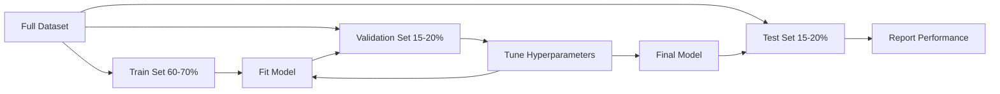

# मॉडल मूल्यांकन

> एक मॉडल उतना ही अच्छा है जितना आप इसे मापते हैं।

**Type:** Build
**Languages:** Python
**Prerequisites:** Phase 1 (Probability & Distributions, Statistics for ML), Phase 2 Lessons 1-8
**Time:** ~90 minutes

## सीखने के लक्ष्य

- K-fold और stratified K-fold क्रॉस-वैलिडेशन को खरोंच से लागू करें और समझाएं कि असंतुलित डेटा के लिए stratification क्यों मायने रखता है
- सटीकता, रिकॉल, F1, AUC-ROC और रेग्रिशन मीट्रिक (MSE, RMSE, MAE, R-क्वायर) को खरोंच से गणना करें
- यह निर्धारित करने के लिए सीखने की वक्रों की व्याख्या करें कि क्या एक मॉडल उच्च पूर्वाग्रह या उच्च भिन्नता से पीड़ित है
- डेटा लीक, गलत मीट्रिक चयन और परीक्षण सेट की दूषितता सहित सामान्य मूल्यांकन त्रुटियों की पहचान करना

## समस्या

आपने एक मॉडल को प्रशिक्षित किया है, यह आपके डेटा पर 95% सटीकता प्राप्त करता है।

शायद. शायद नहीं. यदि आपके 95% डेटा एक वर्ग से संबंधित हैं, तो एक मॉडल जो हमेशा उस वर्ग की भविष्यवाणी करता है 95% सटीकता प्राप्त करता है जबकि पूरी तरह से बेकार है। यदि आप उसी डेटा पर मूल्यांकन करते हैं जिस पर आपने प्रशिक्षण दिया, तो 95% संख्या का कोई मतलब नहीं है क्योंकि मॉडल ने सिर्फ उत्तरों को याद किया। यदि आपके डेटासेट में समय घटक है और आप भागने से पहले यादृच्छिक रूप से मिलाया, तो आपका मॉडल भविष्य के डेटा का उपयोग अतीत की भविष्यवाणी करने के लिए कर सकता है।

मॉडल मूल्यांकन वह जगह है जहां अधिकांश एमएल परियोजनाएं गलत होती हैं। गलत मीट्रिक एक खराब मॉडल को अच्छा दिखाती है। गलत विभाजन मॉडल को धोखा देती है। गलत तुलना आपको सबसे खराब मॉडल चुनने के लिए प्रेरित करती है। सही मूल्यांकन प्राप्त करना वैकल्पिक नहीं है। यह एक मॉडल के बीच अंतर है जो उत्पादन में काम करता है और एक जो वास्तविक डेटा को देखने के क्षण में विफल रहता है।

## अवधारणा

### ट्रेन, सत्यापन, परीक्षण



तीन विभाजन, तीन उद्देश्योंः

- **Training set**इस प्रकार, मॉडल इन आंकड़ों से सीखता है। यह प्रशिक्षण के दौरान इन उदाहरणों को देखता है।
- **Validation set**इस मॉडल को कभी भी इस डेटा पर प्रशिक्षित नहीं किया जाता है, लेकिन आपके निर्णय इसके द्वारा प्रभावित होते हैं।
- **Test set**यदि आप परीक्षण प्रदर्शन को देखते हैं और फिर अपने मॉडल को बदलने के लिए वापस जाते हैं, तो यह अब एक परीक्षण सेट नहीं है। यह एक दूसरा सत्यापन सेट बन गया है।

परीक्षण सेट आपकी गारंटी है कि रिपोर्ट किए गए प्रदर्शन को दर्शाता है कि मॉडल वास्तव में अदृश्य डेटा पर कैसे प्रदर्शन करेगा।

### K-Fold क्रॉस-वैलिडेशन

छोटे डेटासेट के साथ, एक एकल ट्रेन/मान्यीकरण विभाजन कचरा डेटा और शोर अनुमान देता है। K-fold क्रॉस-मान्यीकरण प्रशिक्षण और सत्यापन दोनों के लिए सभी डेटा का उपयोग करता हैः

```mermaid
flowchart TB
    subgraph Fold1["Fold 1"]
        direction LR
        V1["Val"] --- T1a["Train"] --- T1b["Train"] --- T1c["Train"] --- T1d["Train"]
    end
    subgraph Fold2["Fold 2"]
        direction LR
        T2a["Train"] --- V2["Val"] --- T2b["Train"] --- T2c["Train"] --- T2d["Train"]
    end
    subgraph Fold3["Fold 3"]
        direction LR
        T3a["Train"] --- T3b["Train"] --- V3["Val"] --- T3c["Train"] --- T3d["Train"]
    end
    subgraph Fold4["Fold 4"]
        direction LR
        T4a["Train"] --- T4b["Train"] --- T4c["Train"] --- V4["Val"] --- T4d["Train"]
    end
    subgraph Fold5["Fold 5"]
        direction LR
        T5a["Train"] --- T5b["Train"] --- T5c["Train"] --- T5d["Train"] --- V5["Val"]
    end
    Fold1 --> R["Average scores"]
    Fold2 --> R
    Fold3 --> R
    Fold4 --> R
    Fold5 --> R
```



1. समान आकार के K फोल्ड में डेटा विभाजित करें
2. प्रत्येक तह के लिए, K-1 तह पर ट्रेन करें और शेष तह पर सत्यापित करें
3. K सत्यापन स्कोर का औसत

K=5 या K=10 मानक विकल्प हैं। प्रत्येक डेटा बिंदु को सत्यापन के लिए ठीक एक बार उपयोग किया जाता है। औसत स्कोर किसी भी एकल विभाजन की तुलना में अधिक स्थिर अनुमान है।

**Stratified K-fold**यदि आपका डेटासेट 70% वर्ग ए और 30% वर्ग बी है, तो प्रत्येक गुना में लगभग समान अनुपात होगा। यह असंतुलित डेटासेट के लिए महत्वपूर्ण है जहां एक यादृच्छिक विभाजन सभी अल्पसंख्यक नमूनों को एक गुना में डाल सकता है।

### वर्गीकरण मेट्रिक्स

**Confusion matrix**द्विआधारी वर्गीकरण के लिएः

|  | Predicted Positive | Predicted Negative |
|--|---|---|
| Actually Positive | True Positive (TP) | False Negative (FN) |
| Actually Negative | False Positive (FP) | True Negative (TN) |

इस मैट्रिक्स से, अन्य सभी माप निम्नलिखित हैंः

- **Accuracy**= (TP + TN) / (TP + TN + FP + FN) सही भविष्यवाणियों का अंश। कक्षाओं में असंतुलन होने पर भ्रामक।
- **Precision**= टीपी / (टीपी + एफपी) । सभी भविष्यवाणी की गई चीजों में से कितने वास्तव में सकारात्मक थे? जब झूठे सकारात्मक महंगे होते हैं (जैसे, स्पैम फ़िल्टर वास्तविक ईमेल को स्पैम के रूप में चिह्नित करता है) का उपयोग करें।
- **Recall**(संवेदनशीलता) = टीपी / (टीपी + एफएन) सभी वास्तविक सकारात्मकताओं में से, हमने कितने पकड़े? जब झूठे नकारात्मक लागत वाले होते हैं (जैसे, कैंसर स्क्रीनिंग में ट्यूमर गायब होता है) उपयोग करें।
- **F1 score**= 2 * सटीकता * याद / (सटीकता + याद) सटीकता और याद का सामंजस्यपूर्ण औसत। दोनों को संतुलित करता है जब स्पष्ट रूप से कोई भी प्रभुत्व नहीं रखता है।
- **AUC-ROC**: रिसीवर ऑपरेटिंग कैरेक्टेरिस्टिक वक्र के तहत क्षेत्र। विभिन्न वर्गीकरण सीमाओं पर सच्ची सकारात्मक दर बनाम झूठी सकारात्मक दर का पता लगाता है। AUC = 0.5 का अर्थ है यादृच्छिक अनुमान, AUC = 1.0 का अर्थ है सही अलगाव। सीमा-स्वतंत्रः यह मापता है कि मॉडल नकारात्मक से ऊपर सकारात्मक को कितनी अच्छी तरह से रैंक करता है, चाहे आप किस कटऑफ का चयन करें।

### प्रतिगमन माप

- **MSE**(मीडियन स्क्वायर त्रुटि) = mean((y_true - y_pred) ^ 2). बड़े त्रुटियों को quadratically दंडित करता है। असाधारण के प्रति संवेदनशील।
- **RMSE**(रूट मीड स्क्वायर त्रुटि) = sqrt(MSE) लक्ष्य चर के समान इकाइयां। एमएसई की तुलना में व्याख्या करना आसान है।
- **MAE**(मध्यम पूर्ण त्रुटि) = औसत y_true - y_pred ) सभी त्रुटियों को रैखिक रूप से व्यवहार करता है। एमएसई की तुलना में अधिक मजबूत से असाधारण।
- **R-squared**= 1 - SS_res / SS_tot, जहां SS_res = योगफल((y_true - y_pred) ^2) और SS_tot = योगफल(((y_true - y_mean) ^2) । मॉडल द्वारा समझाए गए भिन्नता का अंश। R^2 = 1.0 एकदम सही है। R^2 = 0.0 का अर्थ है कि मॉडल हमेशा औसत की भविष्यवाणी करने से बेहतर नहीं है। R^2 नकारात्मक हो सकता है यदि मॉडल औसत से बदतर है।

### सीखने की वक्रता

प्रशिक्षण सेट के आकार के आधार पर प्रशिक्षण और सत्यापन स्कोरः

- **High bias (underfitting)**एक और डेटा जोड़ने से मदद नहीं मिलेगी। आपको एक अधिक जटिल मॉडल की आवश्यकता है।
- **High variance (overfitting)**प्रशिक्षण स्कोर उच्च है लेकिन सत्यापन स्कोर बहुत कम है। इन दोनों के बीच अंतर बड़ा है। अधिक डेटा जोड़ने से मदद मिलेगी।

### सत्यापन वक्र

हाइपरपरमैटर के कार्य के रूप में प्लॉट प्रशिक्षण और सत्यापन स्कोरः

- कम जटिलता परः दोनों स्कोर कम हैं (अयोग्य)
- सही जटिलता परः दोनों स्कोर उच्च और निकट एक दूसरे के साथ हैं
- उच्च जटिलता परः प्रशिक्षण स्कोर उच्च रहता है लेकिन सत्यापन स्कोर गिरता है (ओवरफिटिंग)

इष्टतम हाइपरपरमैटर मान उस स्थान पर होता है जहां सत्यापन स्कोर चरम होता है।

### आकलन में आम गलतियाँ

**Data leakage**उदाहरण: विभाजन से पहले पूरे डेटासेट पर स्केलर को फिट करना, जिसमें समय श्रृंखला भविष्यवाणी में भविष्य के डेटा शामिल हैं, लक्ष्य से प्राप्त सुविधा का उपयोग करना। हमेशा पहले विभाजन, फिर प्रीप्रोसेस।

**Class imbalance**99% लेनदेन वैध हैं, 1% धोखाधड़ी है। एक मॉडल जो हमेशा "वैध" की भविष्यवाणी करता है 99% सटीकता प्राप्त करता है। इसके बजाय सटीकता, रिकॉल, F1, या AUC-ROC का उपयोग करें।

**Wrong metric**: जब आपको याद दिलाना चाहिए (चिकित्सा निदान) को अनुकूलित करना चाहिए, तो सटीकता को अनुकूलित करना, या जब आपके डेटा में भारी असाधारण हैं तो RMSE को अनुकूलित करना (इसके बजाय MAE का उपयोग करें) ।

**Not using stratified splits**: असंतुलित आंकड़ों के साथ, एक यादृच्छिक विभाजन सत्यापन तह में बहुत कम अल्पसंख्यक नमूने डाल सकता है, जिससे अस्थिर अनुमान दिए जाते हैं।

**Testing too often**: जब भी आप परीक्षण प्रदर्शन को देखते हैं और समायोजित करते हैं, तो आप परीक्षण सेट के लिए ओवरफिट करते हैं।

```figure
precision-recall-threshold
```

## इसे बनाओ

### चरण 1: ट्रेन/मान्यीकरण/परीक्षण विभाजन

```python
import random
import math


def train_val_test_split(X, y, train_ratio=0.6, val_ratio=0.2, seed=42):
    random.seed(seed)
    n = len(X)
    indices = list(range(n))
    random.shuffle(indices)

    train_end = int(n * train_ratio)
    val_end = int(n * (train_ratio + val_ratio))

    train_idx = indices[:train_end]
    val_idx = indices[train_end:val_end]
    test_idx = indices[val_end:]

    X_train = [X[i] for i in train_idx]
    y_train = [y[i] for i in train_idx]
    X_val = [X[i] for i in val_idx]
    y_val = [y[i] for i in val_idx]
    X_test = [X[i] for i in test_idx]
    y_test = [y[i] for i in test_idx]

    return X_train, y_train, X_val, y_val, X_test, y_test
```

### चरण 2: K-fold और stratified K-fold क्रॉस-वैलिडेशन

```python
def kfold_split(n, k=5, seed=42):
    random.seed(seed)
    indices = list(range(n))
    random.shuffle(indices)

    fold_size = n // k
    folds = []

    for i in range(k):
        start = i * fold_size
        end = start + fold_size if i < k - 1 else n
        val_idx = indices[start:end]
        train_idx = indices[:start] + indices[end:]
        folds.append((train_idx, val_idx))

    return folds


def stratified_kfold_split(y, k=5, seed=42):
    random.seed(seed)

    class_indices = {}
    for i, label in enumerate(y):
        class_indices.setdefault(label, []).append(i)

    for label in class_indices:
        random.shuffle(class_indices[label])

    folds = [{"train": [], "val": []} for _ in range(k)]

    for label, indices in class_indices.items():
        fold_size = len(indices) // k
        for i in range(k):
            start = i * fold_size
            end = start + fold_size if i < k - 1 else len(indices)
            val_part = indices[start:end]
            train_part = indices[:start] + indices[end:]
            folds[i]["val"].extend(val_part)
            folds[i]["train"].extend(train_part)

    return [(f["train"], f["val"]) for f in folds]


def cross_validate(X, y, model_fn, k=5, metric_fn=None, stratified=False):
    n = len(X)

    if stratified:
        folds = stratified_kfold_split(y, k)
    else:
        folds = kfold_split(n, k)

    scores = []
    for train_idx, val_idx in folds:
        X_train = [X[i] for i in train_idx]
        y_train = [y[i] for i in train_idx]
        X_val = [X[i] for i in val_idx]
        y_val = [y[i] for i in val_idx]

        model = model_fn()
        model.fit(X_train, y_train)
        predictions = [model.predict(x) for x in X_val]

        if metric_fn:
            score = metric_fn(y_val, predictions)
        else:
            score = sum(1 for yt, yp in zip(y_val, predictions) if yt == yp) / len(y_val)
        scores.append(score)

    return scores
```

### चरण 3: भ्रम मैट्रिक्स और वर्गीकरण मेट्रिक्स

```python
def confusion_matrix(y_true, y_pred):
    tp = sum(1 for yt, yp in zip(y_true, y_pred) if yt == 1 and yp == 1)
    tn = sum(1 for yt, yp in zip(y_true, y_pred) if yt == 0 and yp == 0)
    fp = sum(1 for yt, yp in zip(y_true, y_pred) if yt == 0 and yp == 1)
    fn = sum(1 for yt, yp in zip(y_true, y_pred) if yt == 1 and yp == 0)
    return tp, tn, fp, fn


def accuracy(y_true, y_pred):
    tp, tn, fp, fn = confusion_matrix(y_true, y_pred)
    total = tp + tn + fp + fn
    return (tp + tn) / total if total > 0 else 0.0


def precision(y_true, y_pred):
    tp, tn, fp, fn = confusion_matrix(y_true, y_pred)
    return tp / (tp + fp) if (tp + fp) > 0 else 0.0


def recall(y_true, y_pred):
    tp, tn, fp, fn = confusion_matrix(y_true, y_pred)
    return tp / (tp + fn) if (tp + fn) > 0 else 0.0


def f1_score(y_true, y_pred):
    p = precision(y_true, y_pred)
    r = recall(y_true, y_pred)
    return 2 * p * r / (p + r) if (p + r) > 0 else 0.0


def roc_curve(y_true, y_scores):
    thresholds = sorted(set(y_scores), reverse=True)
    tpr_list = []
    fpr_list = []

    total_positives = sum(y_true)
    total_negatives = len(y_true) - total_positives

    for threshold in thresholds:
        y_pred = [1 if s >= threshold else 0 for s in y_scores]
        tp = sum(1 for yt, yp in zip(y_true, y_pred) if yt == 1 and yp == 1)
        fp = sum(1 for yt, yp in zip(y_true, y_pred) if yt == 0 and yp == 1)

        tpr = tp / total_positives if total_positives > 0 else 0.0
        fpr = fp / total_negatives if total_negatives > 0 else 0.0

        tpr_list.append(tpr)
        fpr_list.append(fpr)

    return fpr_list, tpr_list, thresholds


def auc_roc(y_true, y_scores):
    fpr_list, tpr_list, _ = roc_curve(y_true, y_scores)

    pairs = sorted(zip(fpr_list, tpr_list))
    fpr_sorted = [p[0] for p in pairs]
    tpr_sorted = [p[1] for p in pairs]

    area = 0.0
    for i in range(1, len(fpr_sorted)):
        width = fpr_sorted[i] - fpr_sorted[i - 1]
        height = (tpr_sorted[i] + tpr_sorted[i - 1]) / 2
        area += width * height

    return area
```

### चरण 4: प्रतिगमन माप

```python
def mse(y_true, y_pred):
    n = len(y_true)
    return sum((yt - yp) ** 2 for yt, yp in zip(y_true, y_pred)) / n


def rmse(y_true, y_pred):
    return math.sqrt(mse(y_true, y_pred))


def mae(y_true, y_pred):
    n = len(y_true)
    return sum(abs(yt - yp) for yt, yp in zip(y_true, y_pred)) / n


def r_squared(y_true, y_pred):
    mean_y = sum(y_true) / len(y_true)
    ss_res = sum((yt - yp) ** 2 for yt, yp in zip(y_true, y_pred))
    ss_tot = sum((yt - mean_y) ** 2 for yt in y_true)
    if ss_tot == 0:
        return 0.0
    return 1.0 - ss_res / ss_tot
```

### चरण 5: सीखने की वक्रता

```python
def learning_curve(X, y, model_fn, metric_fn, train_sizes=None, val_ratio=0.2, seed=42):
    random.seed(seed)
    n = len(X)
    indices = list(range(n))
    random.shuffle(indices)

    val_size = int(n * val_ratio)
    val_idx = indices[:val_size]
    pool_idx = indices[val_size:]

    X_val = [X[i] for i in val_idx]
    y_val = [y[i] for i in val_idx]

    if train_sizes is None:
        train_sizes = [int(len(pool_idx) * r) for r in [0.1, 0.2, 0.4, 0.6, 0.8, 1.0]]

    train_scores = []
    val_scores = []

    for size in train_sizes:
        subset = pool_idx[:size]
        X_train = [X[i] for i in subset]
        y_train = [y[i] for i in subset]

        model = model_fn()
        model.fit(X_train, y_train)

        train_pred = [model.predict(x) for x in X_train]
        val_pred = [model.predict(x) for x in X_val]

        train_scores.append(metric_fn(y_train, train_pred))
        val_scores.append(metric_fn(y_val, val_pred))

    return train_sizes, train_scores, val_scores
```

### चरण 6: परीक्षण के लिए एक सरल वर्गीकरण, प्लस पूर्ण डेमो

```python
class SimpleLogistic:
    def __init__(self, lr=0.1, epochs=100):
        self.lr = lr
        self.epochs = epochs
        self.weights = None
        self.bias = 0.0

    def sigmoid(self, z):
        z = max(-500, min(500, z))
        return 1.0 / (1.0 + math.exp(-z))

    def fit(self, X, y):
        n_features = len(X[0])
        self.weights = [0.0] * n_features
        self.bias = 0.0

        for _ in range(self.epochs):
            for xi, yi in zip(X, y):
                z = sum(w * x for w, x in zip(self.weights, xi)) + self.bias
                pred = self.sigmoid(z)
                error = yi - pred
                for j in range(n_features):
                    self.weights[j] += self.lr * error * xi[j]
                self.bias += self.lr * error

    def predict_proba(self, x):
        z = sum(w * xi for w, xi in zip(self.weights, x)) + self.bias
        return self.sigmoid(z)

    def predict(self, x):
        return 1 if self.predict_proba(x) >= 0.5 else 0


class SimpleLinearRegression:
    def __init__(self, lr=0.001, epochs=200):
        self.lr = lr
        self.epochs = epochs
        self.weights = None
        self.bias = 0.0

    def fit(self, X, y):
        n_features = len(X[0])
        self.weights = [0.0] * n_features
        self.bias = 0.0
        n = len(X)

        for _ in range(self.epochs):
            for xi, yi in zip(X, y):
                pred = sum(w * x for w, x in zip(self.weights, xi)) + self.bias
                error = yi - pred
                for j in range(n_features):
                    self.weights[j] += self.lr * error * xi[j] / n
                self.bias += self.lr * error / n

    def predict(self, x):
        return sum(w * xi for w, xi in zip(self.weights, x)) + self.bias


def standardize(values):
    n = len(values)
    mean = sum(values) / n
    var = sum((v - mean) ** 2 for v in values) / n
    std = math.sqrt(var) if var > 0 else 1.0
    return [(v - mean) / std for v in values], mean, std


def make_classification_data(n=300, seed=42):
    random.seed(seed)
    X = []
    y = []
    for _ in range(n):
        x1 = random.gauss(0, 1)
        x2 = random.gauss(0, 1)
        label = 1 if (x1 + x2 + random.gauss(0, 0.5)) > 0 else 0
        X.append([x1, x2])
        y.append(label)
    return X, y


def make_regression_data(n=200, seed=42):
    random.seed(seed)
    X = []
    y = []
    for _ in range(n):
        x1 = random.uniform(0, 10)
        x2 = random.uniform(0, 5)
        target = 3 * x1 + 2 * x2 + random.gauss(0, 2)
        X.append([x1, x2])
        y.append(target)
    return X, y


def make_imbalanced_data(n=300, minority_ratio=0.05, seed=42):
    random.seed(seed)
    X = []
    y = []
    for _ in range(n):
        if random.random() < minority_ratio:
            x1 = random.gauss(3, 0.5)
            x2 = random.gauss(3, 0.5)
            label = 1
        else:
            x1 = random.gauss(0, 1)
            x2 = random.gauss(0, 1)
            label = 0
        X.append([x1, x2])
        y.append(label)
    return X, y


if __name__ == "__main__":
    X_clf, y_clf = make_classification_data(300)

    print("=== Train/Validation/Test Split ===")
    X_train, y_train, X_val, y_val, X_test, y_test = train_val_test_split(X_clf, y_clf)
    print(f"  Train: {len(X_train)}, Val: {len(X_val)}, Test: {len(X_test)}")
    print(f"  Train class distribution: {sum(y_train)}/{len(y_train)} positive")
    print(f"  Val class distribution: {sum(y_val)}/{len(y_val)} positive")

    model = SimpleLogistic(lr=0.1, epochs=200)
    model.fit(X_train, y_train)

    print("\n=== Classification Metrics ===")
    y_pred = [model.predict(x) for x in X_test]
    tp, tn, fp, fn = confusion_matrix(y_test, y_pred)
    print(f"  Confusion matrix: TP={tp}, TN={tn}, FP={fp}, FN={fn}")
    print(f"  Accuracy:  {accuracy(y_test, y_pred):.4f}")
    print(f"  Precision: {precision(y_test, y_pred):.4f}")
    print(f"  Recall:    {recall(y_test, y_pred):.4f}")
    print(f"  F1 Score:  {f1_score(y_test, y_pred):.4f}")

    y_scores = [model.predict_proba(x) for x in X_test]
    auc = auc_roc(y_test, y_scores)
    print(f"  AUC-ROC:   {auc:.4f}")

    print("\n=== K-Fold Cross-Validation (K=5) ===")
    cv_scores = cross_validate(
        X_clf, y_clf,
        model_fn=lambda: SimpleLogistic(lr=0.1, epochs=200),
        k=5,
        metric_fn=accuracy,
    )
    mean_cv = sum(cv_scores) / len(cv_scores)
    std_cv = math.sqrt(sum((s - mean_cv) ** 2 for s in cv_scores) / len(cv_scores))
    print(f"  Fold scores: {[round(s, 4) for s in cv_scores]}")
    print(f"  Mean: {mean_cv:.4f} (+/- {std_cv:.4f})")

    print("\n=== Stratified K-Fold Cross-Validation (K=5) ===")
    strat_scores = cross_validate(
        X_clf, y_clf,
        model_fn=lambda: SimpleLogistic(lr=0.1, epochs=200),
        k=5,
        metric_fn=accuracy,
        stratified=True,
    )
    strat_mean = sum(strat_scores) / len(strat_scores)
    strat_std = math.sqrt(sum((s - strat_mean) ** 2 for s in strat_scores) / len(strat_scores))
    print(f"  Fold scores: {[round(s, 4) for s in strat_scores]}")
    print(f"  Mean: {strat_mean:.4f} (+/- {strat_std:.4f})")

    print("\n=== Imbalanced Data: Why Accuracy Lies ===")
    X_imb, y_imb = make_imbalanced_data(300, minority_ratio=0.05)
    positives = sum(y_imb)
    print(f"  Class distribution: {positives} positive, {len(y_imb) - positives} negative ({positives/len(y_imb)*100:.1f}% positive)")

    always_negative = [0] * len(y_imb)
    print(f"  Always-negative baseline:")
    print(f"    Accuracy:  {accuracy(y_imb, always_negative):.4f}")
    print(f"    Precision: {precision(y_imb, always_negative):.4f}")
    print(f"    Recall:    {recall(y_imb, always_negative):.4f}")
    print(f"    F1 Score:  {f1_score(y_imb, always_negative):.4f}")

    X_tr_i, y_tr_i, X_v_i, y_v_i, X_te_i, y_te_i = train_val_test_split(X_imb, y_imb)
    model_imb = SimpleLogistic(lr=0.5, epochs=500)
    model_imb.fit(X_tr_i, y_tr_i)
    y_pred_imb = [model_imb.predict(x) for x in X_te_i]
    print(f"\n  Trained model on imbalanced data:")
    print(f"    Accuracy:  {accuracy(y_te_i, y_pred_imb):.4f}")
    print(f"    Precision: {precision(y_te_i, y_pred_imb):.4f}")
    print(f"    Recall:    {recall(y_te_i, y_pred_imb):.4f}")
    print(f"    F1 Score:  {f1_score(y_te_i, y_pred_imb):.4f}")

    print("\n=== Regression Metrics ===")
    X_reg, y_reg = make_regression_data(200)

    col0 = [x[0] for x in X_reg]
    col1 = [x[1] for x in X_reg]
    col0_s, m0, s0 = standardize(col0)
    col1_s, m1, s1 = standardize(col1)
    X_reg_scaled = [[col0_s[i], col1_s[i]] for i in range(len(X_reg))]

    X_tr_r, y_tr_r, X_v_r, y_v_r, X_te_r, y_te_r = train_val_test_split(X_reg_scaled, y_reg)
    reg_model = SimpleLinearRegression(lr=0.01, epochs=500)
    reg_model.fit(X_tr_r, y_tr_r)
    y_pred_r = [reg_model.predict(x) for x in X_te_r]

    print(f"  MSE:       {mse(y_te_r, y_pred_r):.4f}")
    print(f"  RMSE:      {rmse(y_te_r, y_pred_r):.4f}")
    print(f"  MAE:       {mae(y_te_r, y_pred_r):.4f}")
    print(f"  R-squared: {r_squared(y_te_r, y_pred_r):.4f}")

    mean_baseline = [sum(y_tr_r) / len(y_tr_r)] * len(y_te_r)
    print(f"\n  Mean baseline:")
    print(f"    MSE:       {mse(y_te_r, mean_baseline):.4f}")
    print(f"    R-squared: {r_squared(y_te_r, mean_baseline):.4f}")

    print("\n=== Learning Curve ===")
    sizes, train_sc, val_sc = learning_curve(
        X_clf, y_clf,
        model_fn=lambda: SimpleLogistic(lr=0.1, epochs=200),
        metric_fn=accuracy,
    )
    print(f"  {'Size':>6} {'Train':>8} {'Val':>8}")
    for s, tr, va in zip(sizes, train_sc, val_sc):
        print(f"  {s:>6} {tr:>8.4f} {va:>8.4f}")

    print("\n=== Statistical Model Comparison ===")
    model_a_scores = cross_validate(
        X_clf, y_clf,
        model_fn=lambda: SimpleLogistic(lr=0.1, epochs=100),
        k=5, metric_fn=accuracy,
    )
    model_b_scores = cross_validate(
        X_clf, y_clf,
        model_fn=lambda: SimpleLogistic(lr=0.1, epochs=500),
        k=5, metric_fn=accuracy,
    )
    diffs = [a - b for a, b in zip(model_a_scores, model_b_scores)]
    mean_diff = sum(diffs) / len(diffs)
    std_diff = math.sqrt(sum((d - mean_diff) ** 2 for d in diffs) / len(diffs))
    t_stat = mean_diff / (std_diff / math.sqrt(len(diffs))) if std_diff > 0 else 0.0
    print(f"  Model A (100 epochs) mean: {sum(model_a_scores)/len(model_a_scores):.4f}")
    print(f"  Model B (500 epochs) mean: {sum(model_b_scores)/len(model_b_scores):.4f}")
    print(f"  Mean difference: {mean_diff:.4f}")
    print(f"  Paired t-statistic: {t_stat:.4f}")
    print(f"  (|t| > 2.78 for significance at p<0.05 with df=4)")
```

## इसका प्रयोग करें

scikit-learn के साथ, मूल्यांकन कार्यप्रवाह में निर्मित हैः

```python
from sklearn.model_selection import cross_val_score, StratifiedKFold, learning_curve
from sklearn.metrics import (
    accuracy_score, precision_score, recall_score, f1_score,
    roc_auc_score, confusion_matrix, mean_squared_error, r2_score,
)
from sklearn.linear_model import LogisticRegression

model = LogisticRegression()
scores = cross_val_score(model, X, y, cv=StratifiedKFold(5), scoring="f1")
```

स्क्रैच संस्करणों में क्रॉस-वैलिडेशन क्या करता है (कोई जादू नहीं, केवल फॉर-लुप्स और इंडेक्स ट्रैकिंग), प्रत्येक मीट्रिक की गणना कैसे की जाती है (केवल टीपी / एफपी / टीएन / एफएन की गणना) और क्यों स्तरीकरण महत्वपूर्ण है (प्रत्येक तह में वर्ग अनुपात को बनाए रखना) । पुस्तकालय संस्करण समानांतर, अधिक स्कोरिंग विकल्प और पाइपलाइन के साथ एकीकरण जोड़ते हैं।

## इसे भेजें

इस पाठ से उत्पन्न होता हैः
- `outputs/skill-evaluation.md`- वर्गीकरण और प्रतिगमन मॉडल के लिए मूल्यांकन रणनीति को कवर करने वाली एक कौशल

## व्यायाम

1. सटीकता-पुनर्प्राप्त वक्रों को लागू करेंः विभिन्न सीमाओं पर ग्राफ सटीकता बनाम पुनर्प्राप्त। औसत सटीकता (पीआर वक्र के नीचे क्षेत्र) की गणना करें। असंतुलित डेटासेट पर पीआर वक्र की तुलना करें और समझाएं कि प्रत्येक कब अधिक जानकारीपूर्ण है।
2. एक घोंसले गए क्रॉस-वैलिडेशन लूप बनाएंः बाहरी लूप मॉडल प्रदर्शन का मूल्यांकन करता है, आंतरिक लूप हाइपरपरपैरामीटर को समायोजित करता है। इसका उपयोग मूल्यांकन में वैलिडेशन डेटा लीक किए बिना दो मॉडल की तुलना करने के लिए करें।
3. मॉडल तुलना के लिए एक परमुटੇਸ਼ਨ टेस्ट लागू करेंः लेबल को मिलाएं, रीट्रेन करें और प्रदर्शन मापें। शून्य वितरण बनाने के लिए 100 बार दोहराएं। इस वितरण के खिलाफ देखे गए मॉडल प्रदर्शन के लिए p-मूल्य की गणना करें।

## प्रमुख शर्तें

| Term | What people say | What it actually means |
|------|----------------|----------------------|
| Overfitting | "Memorizing the training data" | The model captures noise in the training data, performing well on training but poorly on unseen data |
| Cross-validation | "Testing on different subsets" | Systematically rotating which portion of data is used for validation, averaging results across all rotations |
| Precision | "How many predicted positives are correct" | TP / (TP + FP): the fraction of positive predictions that are actually positive |
| Recall | "How many actual positives we found" | TP / (TP + FN): the fraction of actual positives that were correctly identified |
| AUC-ROC | "How well the model separates classes" | The area under the curve of true positive rate vs false positive rate across all thresholds, from 0.5 (random) to 1.0 (perfect) |
| R-squared | "How much variance is explained" | 1 - (sum of squared residuals / total sum of squares): the fraction of target variance captured by the model |
| Data leakage | "The model cheated" | Using information during training that would not be available at prediction time, leading to optimistic evaluation |
| Learning curve | "How performance changes with more data" | A plot of training and validation scores vs training set size, revealing underfitting or overfitting |
| Stratified split | "Keeping class ratios balanced" | Splitting data so each subset has the same proportion of each class as the full dataset |

## आगे पढ़ना

- [scikit-learn Model Selection Guide](https://scikit-learn.org/stable/model_selection.html)- क्रॉस-वैलिडेशन, मेट्रिक्स और हाइपरपरमैटर ट्यूनिंग पर व्यापक संदर्भ
- [Beyond Accuracy: Precision and Recall (Google ML Crash Course)](https://developers.google.com/machine-learning/crash-course/classification/precision-and-recall)- परस्पर उदाहरणों के साथ स्पष्ट स्पष्टीकरण
- [A Survey of Cross-Validation Procedures (Arlot & Celisse, 2010)](https://projecteuclid.org/journals/statistics-surveys/volume-4/issue-none/A-survey-of-cross-validation-procedures-for-model-selection/10.1214/09-SS054.full)- विभिन्न सीवी रणनीतियों का कब और क्यों काम होता है, इसका सख्त इलाज
