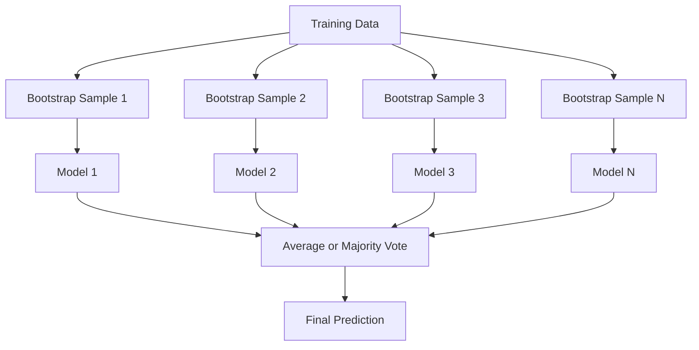
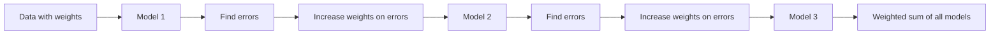
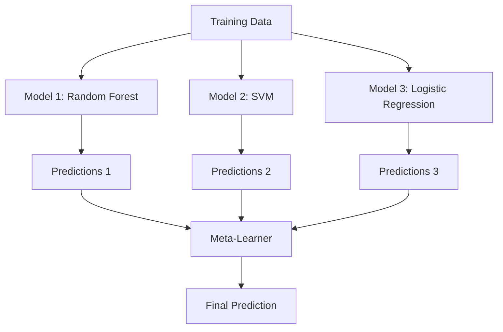

# विधिओं को एक साथ रखना

> कमजोर शिक्षार्थियों का एक समूह, सही ढंग से संयुक्त होकर, एक मजबूत शिक्षार्थी बन जाता है। यह कोई दृष्टान्त नहीं है। यह एक प्रमेय है।

**Type:** Build
**Language:**पायथन
**Prerequisites:** Phase 2, Lesson 10 (Bias-Variance Tradeoff)
**Time:** ~120 minutes

## सीखने के लक्ष्य

- AdaBoost और ग्रेडिएंट बूस्टिंग को खरोंच से लागू करें और समझाएं कि कैसे बूस्टिंग क्रमशः पूर्वाग्रह को कम करता है
- एक बैगिंग एंसेंबल बनाएं और दिखाएं कि कैसे औसत विकोरेटेड मॉडल बढ़ते पक्षपात के बिना भिन्नता को कम करता है
- प्रत्येक विधि के लक्ष्य के अनुसार पैकिंग, बूस्टिंग और स्टैकिंग की तुलना करें
- समूह विविधता का मूल्यांकन करें और समझाएं कि अधिक स्वतंत्र कमजोर शिक्षार्थियों के साथ बहुमत की मतदान सटीकता में सुधार क्यों होता है

## समस्या

एक निर्णय वृक्ष को प्रशिक्षित करना और व्याख्या करना आसान है, लेकिन यह अधिक है। एक एकल रैखिक मॉडल जटिल सीमाओं पर फिट बैठता है। आप सही मॉडल वास्तुकला को डिजाइन करने में दिन बिता सकते हैं। या आप कई अधूरे मॉडल को जोड़ सकते हैं और उनमें से किसी से भी बेहतर कुछ प्राप्त कर सकते हैं।

इकट्ठा करने के तरीके ठीक यही करते हैं। वे तालिकागत डेटा पर कैगल प्रतियोगिताओं को जीतने के लिए सबसे विश्वसनीय तकनीक हैं, वे अधिकांश उत्पादन एमएल सिस्टम को संचालित करते हैं, और वे कार्रवाई में पूर्वाग्रह-भिन्नता व्यापार को दर्शाते हैं। बैगिंग भिन्नता को कम करता है। बढ़ावा देने से पूर्वाग्रह कम होता है। स्टैकिंग सीखता है कि किस मॉडल पर भरोसा करना है।

## अवधारणा

### क्यों समूह काम करते हैं

मान लीजिए आपके पास N स्वतंत्र वर्गीकरणकर्ता हैं, जिनमें से प्रत्येक की सटीकता p > 0.5 है। बहुमत की सटीकता हैः

```
P(majority correct) = sum over k > N/2 of C(N,k) * p^k * (1-p)^(N-k)
```

21 वर्गीकरणकर्ताओं के लिए प्रत्येक 60% सटीकता के साथ, बहुमत वोट सटीकता लगभग 74% है। 101 वर्गीकरणकर्ताओं के साथ, यह 84% तक बढ़ जाता है। मॉडल विभिन्न गलतियों को करते समय त्रुटियों को रद्द कर देता है।

मुख्य आवश्यकता यह है **diversity**यदि सभी मॉडल एक ही त्रुटि करते हैं, तो उन्हें जोड़ने से कुछ भी नहीं होता है।

- विभिन्न प्रशिक्षण उप-समुहियाँ (बैगिंग)
- विभिन्न विशेषता उपसमूह (संदिग्ध वन)
- अनुक्रमिक त्रुटि सुधार (बढ़ाना)
- विभिन्न मॉडल परिवार (स्टैपिंग)

### बैगिंग (बूटस्ट्रैप एग्रीगेटिंग)

बैगिंग प्रशिक्षण डेटा के एक अलग बूटस्ट्रैप नमूना पर प्रत्येक मॉडल को प्रशिक्षित करके विविधता पैदा करता है।



एक बूटस्ट्रैप नमूना मूल डेटा से प्रतिस्थापन के साथ खींचा जाता है, मूल के समान आकार। प्रत्येक बूटस्ट्रैप में लगभग 63.2% अद्वितीय नमूने दिखाई देते हैं। शेष 36.8% (बग के बाहर नमूने) एक मुफ्त सत्यापन सेट प्रदान करते हैं।

बैगिंग भिन्नता को बहुत बढ़ाए बिना कम करता है। प्रत्येक व्यक्तिगत पेड़ अपने बूटस्ट्रैप नमूने में ओवरफिट करता है, लेकिन ओवरफिटिंग प्रत्येक पेड़ के लिए अलग है, इसलिए औसत शोर को रद्द करता है।

**Random Forests**एक अतिरिक्त मोड़ के साथ बैगिंग कर रहे हैंः प्रत्येक विभाजन पर, केवल सुविधाओं के एक यादृच्छिक उपसमूह पर विचार किया जाता है। यह पेड़ों के बीच और भी अधिक विविधता पैदा करता है। उम्मीदवार सुविधाओं की विशिष्ट संख्या है `sqrt(n_features)`वर्गीकरण के लिए और`n_features / 3`प्रतिगमन के लिए।

### बढ़ाना (अनुक्रमिक त्रुटि सुधार)

प्रत्येक नए मॉडल में उन उदाहरणों पर ध्यान केंद्रित किया जाता है जो पिछले मॉडल गलत थे।



प्रत्येक नए मॉडल में अब तक के समूह की व्यवस्थित त्रुटियों को सुधार दिया जाता है। अंतिम भविष्यवाणी सभी मॉडल का एक भारित योग है, जहां बेहतर मॉडल अधिक वजन प्राप्त करते हैं।

समझौताः यदि आप बहुत सारे राउंड चलाते हैं तो बढ़ाव ओवरफिट हो सकता है, क्योंकि यह कठिन उदाहरणों को फिट करता रहता है, जिनमें से कुछ शोर हो सकता है।

### एडबोस्ट

AdaBoost (अनुकूली बूस्टिंग) पहला व्यावहारिक बूस्टिंग एल्गोरिथ्म था। यह किसी भी आधार सीखने वाले, आमतौर पर निर्णय स्टंप (गहनता-1 पेड़) के साथ काम करता है।

एल्गोरिथ्मः

```
1. Initialize sample weights: w_i = 1/N for all i

2. For t = 1 to T:
   a. Train weak learner h_t on weighted data
   b. Compute weighted error:
      err_t = sum(w_i * I(h_t(x_i) != y_i)) / sum(w_i)
   c. Compute model weight:
      alpha_t = 0.5 * ln((1 - err_t) / err_t)
   d. Update sample weights:
      w_i = w_i * exp(-alpha_t * y_i * h_t(x_i))
   e. Normalize weights to sum to 1

3. Final prediction: H(x) = sign(sum(alpha_t * h_t(x)))
```

कम त्रुटि वाले मॉडल उच्च अल्फा प्राप्त करते हैं। गलत वर्गीकृत नमूनों को अधिक वजन मिलता है इसलिए अगला मॉडल उन पर केंद्रित होता है।

### धीरे-धीरे बढ़ना

ग्रेडिएंट बूस्टिंग एक संवैधानिक हानि फ़ंक्शन के लिए बूस्टिंग को सामान्य बनाता है। यह नमूने को फिर से वजन करने के बजाय, वर्तमान समूह के अवशिष्ट (हानि का नकारात्मक ग्रेडिएंट) के लिए प्रत्येक नए मॉडल को फिट करता है।

```
1. Initialize: F_0(x) = argmin_c sum(L(y_i, c))

2. For t = 1 to T:
   a. Compute pseudo-residuals:
      r_i = -dL(y_i, F_{t-1}(x_i)) / dF_{t-1}(x_i)
   b. Fit a tree h_t to the residuals r_i
   c. Find optimal step size:
      gamma_t = argmin_gamma sum(L(y_i, F_{t-1}(x_i) + gamma * h_t(x_i)))
   d. Update:
      F_t(x) = F_{t-1}(x) + learning_rate * gamma_t * h_t(x)

3. Final prediction: F_T(x)
```

वर्ग त्रुटि हानि के लिए, छद्म-अवशिष्ट केवल वास्तविक अवशिष्ट हैंः `r_i = y_i - F_{t-1}(x_i)`प्रत्येक पेड़ सचमुच पिछले समूह की गलतियों में फिट बैठता है।

सीखने की दर (संकुचन) नियंत्रित करती है कि प्रत्येक पेड़ कितना योगदान देता है। छोटे सीखने की दरों के लिए अधिक पेड़ों की आवश्यकता होती है लेकिन बेहतर सामान्यीकरण होता है। विशिष्ट मानः 0.01 से 0.3.

### XGBoost: यह तालिका डेटा पर क्यों हावी है

XGBoost (eXtreme Gradient Boosting) इंजीनियरिंग अनुकूलन के साथ ग्रेडिएंट बूस्टिंग है जो इसे तेज़, सटीक और ओवरफिटिंग के प्रतिरोधी बनाता हैः

- **Regularized objective:**पत्ती के वजन पर L1 और L2 दंड से प्रत्येक पेड़ को बहुत आत्मविश्वास होने से रोकता है
- **Second-order approximation:**हानि के पहले और दूसरे व्युत्पन्न दोनों का उपयोग करता है, जिससे बेहतर विभाजन निर्णय मिलता है
- **Sparsity-aware splits:**प्रत्येक विभाजन पर यादृच्छिक डेटा के लिए सबसे अच्छा दिशा सीखकर यादृच्छिक मानों को मूल रूप से संभालता है
- **Column subsampling:**जैसे कि आकस्मिक वन, विविधता के लिए प्रत्येक विभाजन में नमूने विशेषताएं
- **Weighted quantile sketch:**वितरित डेटा पर निरंतर सुविधाओं के लिए कुशलता से विभाजन बिंदुओं का पता लगाता है
- **Cache-aware block structure:**CPU कैश लाइनों के लिए अनुकूलित मेमोरी लेआउट

तालिकागत डेटा के लिए, XGBoost (और इसके उत्तराधिकारी LightGBM) ने लगातार तंत्रिका नेटवर्क से बेहतर प्रदर्शन किया है। यह जल्द ही नहीं बदल रहा है। यदि आपके डेटा पंक्तियों और स्तंभों वाली तालिका में फिट होते हैं, तो ग्रेडिएंट बूस्टिंग से शुरू करें।

### स्टैपिंग (मेटा-लर्निंग)

स्टैकिंग मेटा-लर्नर के लिए विशेषता के रूप में कई आधार मॉडल की भविष्यवाणियों का उपयोग करता है।



मेटा-लर्निंगर सीखता है कि किस आधार मॉडल पर किस इनपुट पर भरोसा करना है। यदि कुछ क्षेत्रों में यादृच्छिक वन बेहतर है और अन्य क्षेत्रों में एसवीएम, मेटा-लर्निंगर तदनुसार मार्ग बनाना सीख जाएगा।

डेटा लीक से बचने के लिए, प्रशिक्षण सेट पर क्रॉस-वैलिडेशन के माध्यम से आधार मॉडल भविष्यवाणियां उत्पन्न की जानी चाहिए। आप कभी भी आधार मॉडल को प्रशिक्षित नहीं करते हैं और एक ही डेटा पर मेटा-विशेषताओं का उत्पादन नहीं करते हैं।

### मतदान

सबसे सरल समूह. बस सीधे भविष्यवाणियों को जोड़ें.

- **Hard voting:**वर्ग लेबल पर बहुमत वोट.
- **Soft voting:**औसत अनुमानित संभावनाएं, उच्चतम औसत संभावना के साथ वर्ग चुनें. आमतौर पर बेहतर क्योंकि यह विश्वास जानकारी का उपयोग करता है.

```figure
f3-ensemble-average
```

## इसे बनाओ

### चरण 1: निर्णय स्टंप (आधारार्थी)

कोड में `code/ensembles.py`हम एक निर्णय स्टंप के साथ शुरू करते हैंः एक एकल विभाजन के साथ एक पेड़।

```python
class DecisionStump:
    def __init__(self):
        self.feature_idx = None
        self.threshold = None
        self.polarity = 1
        self.alpha = None

    def fit(self, X, y, weights):
        n_samples, n_features = X.shape
        best_error = float("inf")

        for f in range(n_features):
            thresholds = np.unique(X[:, f])
            for thresh in thresholds:
                for polarity in [1, -1]:
                    pred = np.ones(n_samples)
                    pred[polarity * X[:, f] < polarity * thresh] = -1
                    error = np.sum(weights[pred != y])
                    if error < best_error:
                        best_error = error
                        self.feature_idx = f
                        self.threshold = thresh
                        self.polarity = polarity

    def predict(self, X):
        n = X.shape[0]
        pred = np.ones(n)
        idx = self.polarity * X[:, self.feature_idx] < self.polarity * self.threshold
        pred[idx] = -1
        return pred
```

### चरण 2: स्क्रैच से AdaBoost

```python
class AdaBoostScratch:
    def __init__(self, n_estimators=50):
        self.n_estimators = n_estimators
        self.stumps = []
        self.alphas = []

    def fit(self, X, y):
        n = X.shape[0]
        weights = np.full(n, 1 / n)

        for _ in range(self.n_estimators):
            stump = DecisionStump()
            stump.fit(X, y, weights)
            pred = stump.predict(X)

            err = np.sum(weights[pred != y])
            err = np.clip(err, 1e-10, 1 - 1e-10)

            alpha = 0.5 * np.log((1 - err) / err)
            weights *= np.exp(-alpha * y * pred)
            weights /= weights.sum()

            stump.alpha = alpha
            self.stumps.append(stump)
            self.alphas.append(alpha)

    def predict(self, X):
        total = sum(a * s.predict(X) for a, s in zip(self.alphas, self.stumps))
        return np.sign(total)
```

### चरण 3: स्क्रैच से ग्रेडिएंट बढ़ाना

```python
class GradientBoostingScratch:
    def __init__(self, n_estimators=100, learning_rate=0.1, max_depth=3):
        self.n_estimators = n_estimators
        self.lr = learning_rate
        self.max_depth = max_depth
        self.trees = []
        self.initial_pred = None

    def fit(self, X, y):
        self.initial_pred = np.mean(y)
        current_pred = np.full(len(y), self.initial_pred)

        for _ in range(self.n_estimators):
            residuals = y - current_pred
            tree = SimpleRegressionTree(max_depth=self.max_depth)
            tree.fit(X, residuals)
            update = tree.predict(X)
            current_pred += self.lr * update
            self.trees.append(tree)

    def predict(self, X):
        pred = np.full(X.shape[0], self.initial_pred)
        for tree in self.trees:
            pred += self.lr * tree.predict(X)
        return pred
```

### चरण 4: स्क्लेयरन के साथ तुलना करें

कोड यह सत्यापित करता है कि हमारे खरोंच से कार्यान्वयन स्क्लेर्न की सटीकता के समान उत्पादन करते हैं `AdaBoostClassifier`और `GradientBoostingClassifier`, और सभी तरीकों की तुलना एक साथ करता है।

## इसका प्रयोग करें

### हर विधि का उपयोग कब करें

| Method | Reduces | Best for | Watch out for |
|--------|---------|----------|---------------|
| Bagging / Random Forest | Variance | Noisy data, many features | Does not help with bias |
| AdaBoost | Bias | Clean data, simple base learners | Sensitive to outliers and noise |
| Gradient Boosting | Bias | Tabular data, competitions | Slow to train, easy to overfit without tuning |
| XGBoost / LightGBM | Both | Production tabular ML | Many hyperparameters |
| Stacking | Both | Getting last 1-2% accuracy | Complex, risk of overfitting meta-learner |
| Voting | Variance | Quick combination of diverse models | Only helps if models are diverse |

### तालिकागत डेटा के लिए उत्पादन स्टैक

अधिकांश तालिका भविष्यवाणी समस्याओं के लिए, यह क्रम में कोशिश करने के लिए हैः

1. **LightGBM or XGBoost**डिफ़ॉल्ट पैरामीटर के साथ
2. n_estimators, learning_rate, max_depth, min_child_weight को ट्यूनिंग करें
3. यदि आप अंतिम 0.5% की जरूरत है, 3-5 विविध मॉडल के साथ एक स्टैकिंग समूह का निर्माण
4. पूरे समय क्रॉस-वैलिडेशन का प्रयोग करें

तालिकागत डेटा पर तंत्रिका नेटवर्क लगातार शोध प्रयासों के बावजूद लगभग हमेशा ग्रेडिएंट बूस्टिंग से भी खराब होते हैं। टेबनेट, नोड और इसी तरह की वास्तुकलाएं कभी-कभी मेल खाती हैं लेकिन शायद ही कभी अच्छी तरह से ट्यून किए गए एक्सजीबीओस्ट से बेहतर होती हैं।

## इसे भेजें

यह सबक हमें फल देता है`outputs/prompt-ensemble-selector.md`- एक प्रॉम्प्ट जो आपको किसी दिए गए डेटासेट के लिए सही एंसेंबल विधि चुनने में मदद करता है। अपने डेटा (आकार, सुविधा प्रकार, शोर स्तर, वर्ग संतुलन) और समस्या का वर्णन करें जिसे आप हल कर रहे हैं। प्रॉम्प्ट निर्णय चेकलिस्ट के माध्यम से चलता है, एक विधि की सिफारिश करता है, हाइपरपैरामीटर शुरू करने का सुझाव देता है, और उस विधि के लिए आम त्रुटियों के बारे में चेतावनी देता है। यह भी उत्पन्न करता है `outputs/skill-ensemble-builder.md`चयन के पूर्ण मार्गदर्शिका के साथ।

## व्यायाम

1. प्रत्येक राउंड के बाद प्रशिक्षण सटीकता को ट्रैक करने के लिए एडाबूस्ट कार्यान्वयन को संशोधित करें। प्लॉट सटीकता बनाम अनुमानकों की संख्या। यह कब अभिसरण करता है?

2. रेग्रिशन ट्री में यादृच्छिक सुविधा जोड़कर शून्य से एक यादृच्छिक वन को लागू करें।`max_features=sqrt(n_features)`एक ही पेड़ के साथ भिन्नता में कमी की तुलना करें।

3. ग्रेडिएंट बढ़ाने के कार्यान्वयन में, प्रारंभिक रोक जोड़ेंः प्रत्येक दौर के बाद सत्यापन हानि का ट्रैक करें और जब यह लगातार 10 राउंड तक सुधार नहीं हुआ है तो रोकें। वास्तव में कितने पेड़ों की आवश्यकता है?

4. तीन आधार मॉडल (लॉजिस्टिक रेग्रिशन, निर्णय पेड़, k- निकटतम पड़ोसी) और एक लॉजिस्टिक रेग्रिशन मेटा-लर्नर के साथ एक स्टैकिंग एंसेंबली बनाएं। मेटा-विशेषताओं को उत्पन्न करने के लिए 5-गुना क्रॉस-वैलिडेशन का उपयोग करें। प्रत्येक आधार मॉडल की तुलना अकेले करें।

5. XGBoost को एक ही डेटासेट पर डिफ़ॉल्ट पैरामीटर के साथ चलाएं। इसकी सटीकता को अपने खरोंच से ग्रेडिएंट बढ़ाने के साथ तुलना करें। समय दोनों। गति अंतर कितना बड़ा है?

## प्रमुख शर्तें

| Term | What people say | What it actually means |
|------|----------------|----------------------|
| Bagging | "Train on random subsets" | Bootstrap aggregating: train models on bootstrap samples, average predictions to reduce variance |
| Boosting | "Focus on hard examples" | Train models sequentially, each correcting errors of the ensemble so far, to reduce bias |
| AdaBoost | "Reweight the data" | Boosting via sample weight updates; misclassified points get higher weight for the next learner |
| Gradient boosting | "Fit the residuals" | Boosting via fitting each new model to the negative gradient of the loss function |
| XGBoost | "The Kaggle weapon" | Gradient boosting with regularization, second-order optimization, and systems-level speed tricks |
| Stacking | "Models on top of models" | Use predictions of base models as input features for a meta-learner |
| Random forest | "Many randomized trees" | Bagging with decision trees, adding random feature subsampling at each split for diversity |
| Ensemble diversity | "Make different mistakes" | Models must be uncorrelated in their errors for the ensemble to improve over individuals |
| Out-of-bag error | "Free validation" | Samples not in a bootstrap draw (~36.8%) serve as a validation set without needing a holdout |

## आगे पढ़ना

- [Schapire & Freund: Boosting: Foundations and Algorithms](https://mitpress.mit.edu/9780262526036/)-- AdaBoost के रचनाकारों की पुस्तक
- [Friedman: Greedy Function Approximation: A Gradient Boosting Machine (2001)](https://statweb.stanford.edu/~jhf/ftp/trebst.pdf)-- मूल ग्रेडिएंट बूस्टिंग पेपर
- [Chen & Guestrin: XGBoost (2016)](https://arxiv.org/abs/1603.02754)-- XGBoost पेपर
- [Wolpert: Stacked Generalization (1992)](https://www.sciencedirect.com/science/article/abs/pii/S0893608005800231)-- मूल स्टैकिंग पेपर
- [scikit-learn Ensemble Methods](https://scikit-learn.org/stable/modules/ensemble.html)-- व्यावहारिक संदर्भ
